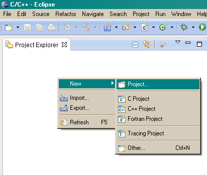
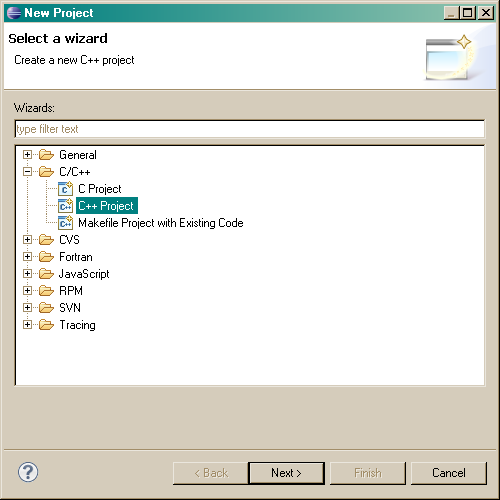
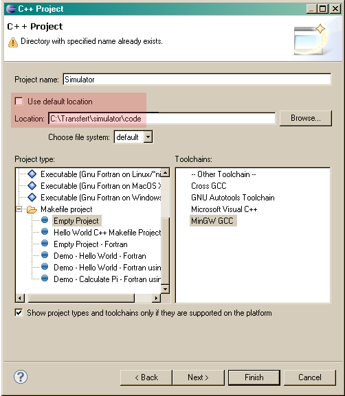
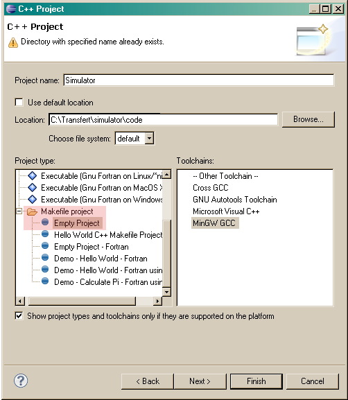
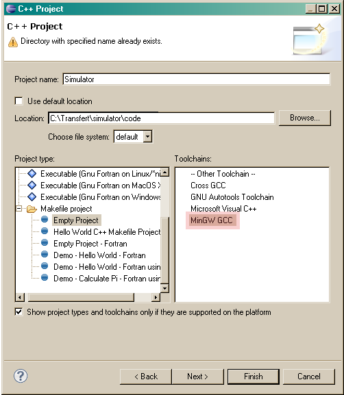
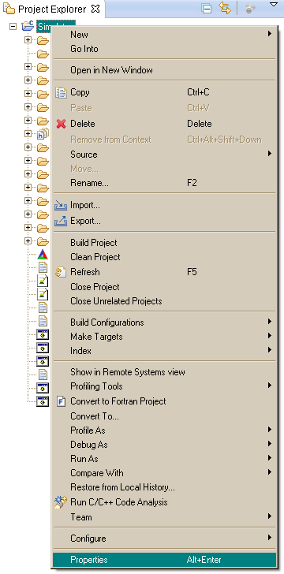
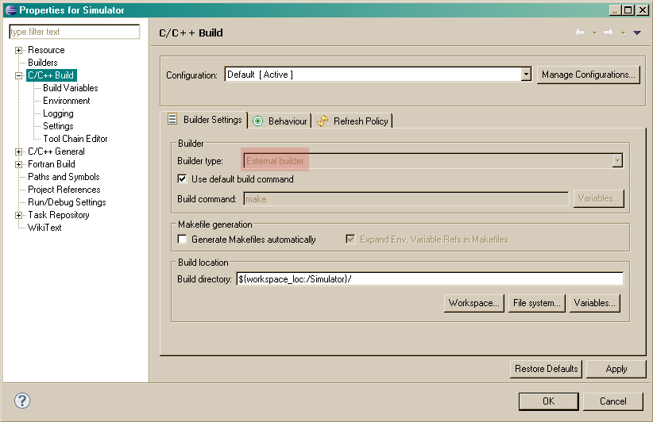
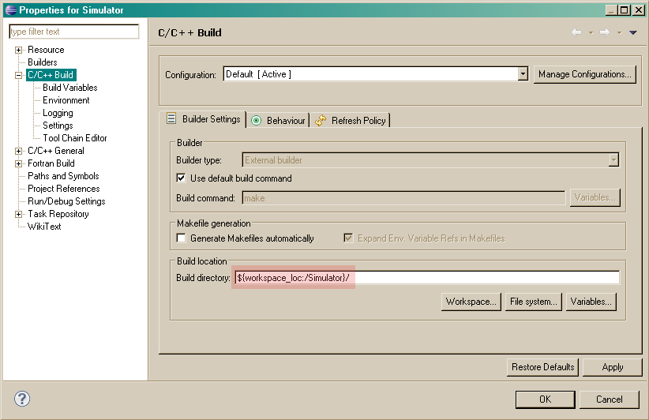
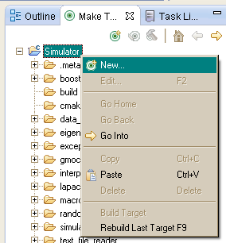
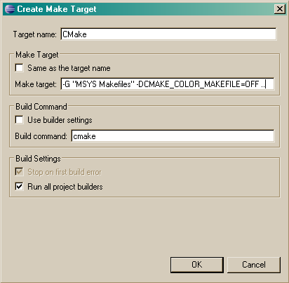

% Documentation développeur du simulateur X-Dyn
% Charles-Edouard CADY, SIREHNA (DCNS Research)

Le but de ce document est de donner une vue globale de l'architecture
logicielle du simulateur X-DYN, en insistant sur les justifications
techniques du design.

Il s'agit moins d'une description systématique et exhaustive de tous les
fichiers du code que d'une présentation fonctionnelle structurée des concepts
et principes qui ont régi les développements.

# Récupération du code et compilation

Deux possibilité sont offertes au développeur :

- Soit recréer l'environnement de développement
- Soit utiliser une machine virtuel configurée avec Vagrant et travailler sur une configuration Linux standard

## En recréant tout l'environnement de développement

Il faut se référer au fichier `bootstrap.sh` qui décrit la liste des dépendances de X-DYN.
La solution avec Vagrant présentée ci-dessous est cependant à préférer.

## En utilisant Vagrant

Pour installer les outils nécessaires pour compiler X-Dyn à l'aide de Vagrant, il faut :

- Une connexion internet
- [Vagrant](https://www.vagrantup.com/downloads.html).
- [Virtual Box](https://www.virtualbox.org/) dans une version supportée par Vagrant + modification du BIOS pour autoriser la machine virtuelle.
- La bibliothèque de connaissances antérieures de SIREHNA (Sirehna Scientific Computing ou SSC), en version deb (dont le MD5 est 80c050abcfd8310daf56ea2db991ba91)
- [Git](https://git-scm.com/downloads) + paramétrage des clés SSH

On commence par cloner le dépôt (nécessite les droits d'accès au répertoire `xdyn` et au répertoire `ThirdParty` qui est géré comme un module git) :

- Sur le réseau SIREHNA :
  `git clone --recursive git@gitlab.sirehna.com:root/xdyn.git --config core.autocrlf=input`
- Sur le serveur de l'IRT Jules Verne :
  `git clone git@gitlab2.irt-jules-verne.fr:cecady/x-dyn.git --config core.autocrlf=input`
  
L'option --recursive permet de récupérer les dépendances (submodules).  
L'option --config core.autocrlf input permet de forcer les caractères de fin de ligne et d'éviter des problèmes avec le répertoire partagé entre windows et linux, tout en protégeant le dépôt d'une erreur dans les retours chariots.
Le développeur sous windows devra prendre la précaution d'utiliser les caractères de fin de ligne linux lors de la création de nouveaux fichiers. 

On copie le fichier `ssc.deb` dans le répertoire `xdyn` ainsi créé.
On ouvre une invite de commande dans ce répertoire (idéalement, en utilisant git BASH fourni avec l'installation de Git).

On s'assure d'avoir une connection internet fonctionnelle (compter environ 1h).
On s'assure que VirtualBox est déjà lancé.
On s'assure que la mémoire allouée à la machine virtuelle ne dépasse pas un quart de la mémoire physique
(vb.memory dans le fichier `Vagrantfile`).  
On tape `vagrant up`.

La machine virtuelle Vagrant va être créée à partir d'une image de base (base box) qui va être configurée.
Cette opération est longue (environ trois quarts d'heure). Une fois la machine virtuelle créée, une compilation est lancée et tous les tests sont exécutés.

Troubleshooting : certaines étapes de l'installation sont longues (notamment l'installation de police Latex), mais il arrive aussi que la machine virtuelle se mette en pause si elle manque de mémoire vive.
Cela peut se vérifier dans l'interfrace de Virtual Box.  

A la racine du dépôt X-Dyn se trouvent trois scripts shell :

- `vagrant_cmake.sh` qui lance CMake sur la machine virtuelle afin de préparer le build,
- `vagrant_ninja.sh` qui effectue la compilation et la génération de la documentation en utilisant le système de build Ninja,
- `vagrant_run_all_tests.sh` qui lance tous les tests. On peut en sélectionner un sous-ensemble en utilisant le flag `--gtest_filter='*LONG*'` par exemple. Se référer à [la documentation de Google Test](https://github.com/google/googletest/blob/master/googletest/docs/AdvancedGuide.md#running-a-subset-of-the-tests).

L'idée, en utilisant Vagrant, est que l'on utilise son éditeur local (de la machine hôte) mais le compilateur et les bibliothèques de la machine virtuelle. Le répertoire contenant le dépôt de x-dyn est automatiquement partagé avec la machine virtuelle créée par Vagrant.

# Cartographie des modules

Le code a été réparti en répertoires que l'on appelera ici
`module`. L'inclusion de code dans un module dépend de deux critères :

- Ce que fait le code en question (chaque module doit être fonctionnellement
  cohérent)
- Les dépendances dudit code (il faut minimiser les dépendances entre les
  modules)

La cohérence fonctionnelle facilite l'appréhension du code et contribue à
réduire les risques de conflit en cas de développements concomittants. La
minimisation des dépendances est nécessaire pour ordonnancer la compilation
(éviter les cycles, savoir quel fichier compiler en premier) et permet de
limiter les impacts des modifications éventuelles apportées à un module.

Voici la description des modules de X-DYN :

| Module                     | Description                                                                     |
|----------------------------|---------------------------------------------------------------------------------|
| `core`                     | Cœur de calcul décrivant le comportement de l'outil au cours de la simulation   |
| `environment_models`       | Modèles de houle                                                                |
| `exceptions`               | Gestion des erreurs                                                             |
| `executables`              | Programmes principaux (sim, gz)                                                 |
| `external_data_structures` | Structures de données image des fichiers YAML. Toutes les structures de         |
|                            | données de ce module ont un nom commençant par Yaml pour signifier qu'elles     |
|                            | sont l'image d'une partie du fichier YAML d'entrée.                             |
| `external_file_formats`    | Lecture des fichiers externes (hdb, stl)                                        |
| `force_models`             | Modèles d'effort                                                                |
| `gz_curves`                | Calcul des GZ et GM                                                             |
| `hdb_interpolators`        | Calcul des efforts de radiation (convolution)                                   |
| `interface_hdf5`           | Ecriture des fichiers HDF5                                                      |
| `mesh`                     | Calculs sur les maillages (intersection navire/surface libre, itération sur les |
|                            | facettes)                                                                       |
| `observers_and_api`        | Définition des sorties en cours de simulation (CSV, HDF5, websocket...)         |
| `parser_extensions`        | Lecture des fichiers de commande et des spectres de houle                       |
| `slamming`                 | Calcul des efforts de slamming                                                  |
| `test_data_generator`      | Génération des données de test (notamment utilisées pour générer les tutoriels) |
| `yaml_parser`              | Interprétation des parties génériques du YAML (non spécifiques à un modèle)     |
|                            | par exemple la définition des corps et des sorties.                             |

Chaque module contient nécessairement :

- Un fichier `CMakeLists.txt` qui indique comment le module doit être compilé,
  quelles sont ses dépendances, etc.
- Un répertoire `inc` qui contient les fichiers d'en-tête (interface, API)

Les sous-répertoires suivants sont généralement présents, mais pas
systématiquement :
- `unit_tests` (qui contient à son tour un fichier `CMakeLists.txt`, un
  répertoire `inc` et un répertoire `src`) stocke les tests unitaires (une
  classe de test par classe, en principe). Le module `test_data_generator` ne
  contient pas de tests unitaires.

# Déroulement d'une simulation

Le schéma ci-dessous représente la liste des tâches que le simulateur va
réaliser entre le moment où l'utilisateur entre la ligne de commande
et la fin des calculs :

* **Récupération des arguments** : le programme lit les arguments fournis par
  l'utilisateur sur la ligne de commande.
* **Ouverture des fichiers** : le contenu des fichiers de commande et du (ou des)
  fichiers YAML est lu (sans être interprêté, à ce stade).
* **Création du système à simuler** : le contenu des fichiers est interprêté et
  l'on crée les structures de données internes utilisées pour la simulation.
* **Création des observateurs** : les observateurs permettent de réaliser des
  actions en cours de simulation (sauvegarde des états, tracés...).
* **Simulation** : la simulation proprement dite utilise le solveur et les
  structures de données construites précédemment.

## Récupération des arguments

Le module concerné est `executables`. Les fichiers concernés sont :

- `simulator.cpp` : le fichier principal contenant `main`
- `utilities_for_InputData.cpp` : lit la ligne de commande en utilisant
  boost::program_options
- `simulator_run.cpp` : fonction de haut niveau qui appelle la lecture de la
  ligne de commande, l'ouverture des fichiers, la création du système et des
  observateurs et la simulation.

## Création du système à simuler

La création du système à simuler est faite en deux étapes par la fonction
`get_system` dans le fichier `simulator_api.cpp` du module `observers_and_api`
:

- `get_system` appelle le parseur YAML principal (classe `SimulatorYamlParser`)
- création du système (classe `SimulatorBuilder`) par truchement de la fonction
  `get_builder`.

### Parseur YAML principal
La classe `SimulatorYamlParser` a pour responsabilité de construire une
structure arborescente de type `YamlSimulatorInput` qui est l'image de
l'ensemble du fichier YAML d'entrée.

Le parseur principal ne se préoccupe pas du YAML spécifique des modèles
d'effort et des modèles de houle : celui-ci est conservé en tant que chaîne de
caractère et parsé ultérieurement par chaque module. L'idée sous-jacente est
que les modèles d'effort sont une partie du code amenée à évoluer
(potentiellement de manière indépendante pour répondre aux besoins internes
spécifiques de chacun des partenaires) tandis que la description des corps
évoluer.

En conséquence, le YAML est parsé en deux temps :

1. parties communes
2. modèles d'effort et d'environnement

Cette architecture permet de regrouper l'ensemble des traitements afférents à
un modèle particulier dans une seule et même classe.  Ainsi, lorsque l'on
intervient par exemple sur le modèle de Wageningen, on utilise la classe
`WageningenControlledForceModel` du module `force_models` qui contient, outre
le modèle d'effort spécifique des hélices Wageningen, une méthode statique
`parse`. Cela évite de devoir intervenir sur deux modules distincts lorsque l'on
souhaite faire évoluer le modèle.

### Construction du système

La classe `SimulatorBuilder` s'occupe de la construction du système à simuler.
Cette classe ne connaît aucun des modèles d'effort et d'environnement et ne
sait pas les construire à partir du YAML : cette responsabilité échoit aux
parseurs spécifiques à chaque modèle.
Pour que la classe `SimulatorBuilder` ait connaissance de ces parseurs
spécifiques, elle doit être configurée et c'est le rôle de la fonction
`get_builder`, définie dans le fichier `simulator_api.cpp` du module
`observers_and_api`. On y trouve des instructions du type :

~~~~~~~~~~~~~~~~~~~~~~~~~~~~~~~~~~~~~~~~~~ {.cpp}
SimulatorBuilder builder(yaml, t0, command_listener);
builder.can_parse<DefaultSurfaceElevation>()
       .can_parse<BretschneiderSpectrum>()
       .can_parse<JonswapSpectrum>();
~~~~~~~~~~~~~~~~~~~~~~~~~~~~~~~~~~~~~~~~~~

`can_parse` est un template de méthode, défini dans le fichier
`SimulatorBuilder.cpp` du module `core`. Sa responsabilité est d'ajouter un
parseur à la liste des parseurs de `SimulatorBuilder`.

Une fois que le `SimulatorBuilder` contient les parseurs, on appelle la méthode
`SimulatorBuilder::build`. Cette méthode construit successivement
l'environnement (notamment le modèle de houle), les efforts non-contrôlés, les
efforts contrôlés et les corps à simuler.

#### Construction de l'environnement

La méthode `SimulatorBuilder::get_environment` construit l'environnement. Elle
commence par stocker des constantes lues directement depuis le YAML, puis elle
construit le modèle de houle et l'objet `Kinematics` qui va servir à faire les
changements de repère.

La méthode de construction du modèle de houle est la suivante
(`SimulatorBuilder::get_wave`) :

- On a récupéré du fichier YAML une liste de modèle (c'est-à-dire un nom et une
  chaîne de caractères contenant le YAML de configuration de ce modèle).
- Pour chaque modèle, on appelle la méthode `try_to_parse` de chaque parseur de
  vague (inséré par `can_parse` décrit précédemment). Cette méthode retourne un
  `boost::optional<SurfaceElevationPtr>` qui contient soit un modèle de houle
  si le parseur a réussi à interpréter la chaîne de caractères, soit rien dans
  le cas contraire.
- Si la boucle se termine sans qu'aucun parseur n'ait réussi à interprêter la
  chaîne YAML, une erreur est renvoyée.

Ce schéma de construction est utilisé pour tous les autres modèles (efforts
non-commandés et commandés).

#### Construction des efforts

Les efforts contrôlés et non-contrôlés sont construits en utilisant le même
mécanisme donc nous ne parlerons ici que du cas des efforts non-contrôlés,
construits par la méthode `SimulatorBuilder::get_forces` :

- Pour chaque corps défini dans le fichier YAML, on appelle la méthode
  `SimulatorBuilder::forces_from` en lui fournissant le modèle d'environnement
  construit précédemment (parce que le constructeur de chaque modèle d'effort a
  besoin de l'environnement puisqu'il est possédé par chaque modèle).
- La méthode `SimulatorBuilder::forces_from` boucle sur tous les modèles
  d'effort (c'est-à-dire, à ce stade, un nom et une chaîne de caractère
  contenant le YAML de configuration) et appelle la méthode
  `SimulatorBuilder::add`.
- Cette dernière boucle sur tous les parseurs d'effort non-commandés, à la
  manière de `SimulatorBuilder::get_wave`, en appelant `try_to_parse` sur
  chacun. Le résultat est un `boost::optional<ForcePtr>` qui contient soit un
  modèle d'effort, soit rien, suivant que le parseur a réussi à interprêter la
  chaîne de caractères.

#### Construction des corps à simuler

Les corps à simuler sont construits dans la méthode `SimulatorBuilder::build`,
simplement en invoquant le constructeur de la classe `Sim`, en lui fournissant
les objets construits précédemment (efforts commandés et non-commandés,
environnement et commandes).

## Création des observateurs

Le rôle des observateurs est, étant donné l'état du système, d'effectuer des
actions telles que la sérialisation en différents formats. Le design de ces
observateurs a été assujetti aux contraintes suivantes :

- pouvoir utiliser plusieurs sérialisations en parallèle, éventuellement en
  sérialisant des choses différentes dans chacune et les traiter de façon
  homogène,
- n'avoir à intervenir qu'à un seul endroit du code pour rendre une variable
  interne "sérialisable" (par exemple, lorsque l'on a rendu "GM" disponible à
  partir du modèle `GMForceModel`),
- n'avoir à intervenir qu'à un seul endroit lorsque l'on rajoute un type de
  sérialisation.

L'API des observateurs est décrite dans une classe abstraite (`Observer`) définie dans
le module `core`. Toutes les méthodes virtuelles pures de cette classe sont
protégées (`protected`) afin de garantir le fonctionnement de l'API : les
classes dérivées ne peuvent pas changer l'ordre dans lequel sont appelées ces
méthodes.

Deux éléments de design sont essentiels dans la classe `Observer` :

1. L'initialisation est séparée de la sérialisation. L'initialisation a lieu
   avant la première sérialisation et sert, par exemple, à écrire la première
   ligne (les titres de colonne) d'un fichier CSV ou à initialiser la structure
   d'un fichier HDF5. La sérialisation proprement dite a lieu à chaque pas de
   temps.
2. Les fonctions virtuelles de la classe `Observer` n'effectuent pas
   directement ni la sérialisation ni l'initialisation : elles renvoient des
   fonctions qui effectueront ces tâches pour une valeur donnée. Ainsi, lorsque
   l'on appelle la méthode `Observer::write`, on ne fait qu'ajouter une
   fonction d'initialisation et une fonction de sérialisation à un dictionnaire
   : aucune valeur n'est écrite immédiatement.

En pratique, le fonctionnement est le suivant :

- L'utilisateur défini les sérialisations qu'il souhaite voir réaliser dans la
  section `output` du fichier YAML.
- Juste après la création du système à simuler, dans la fonction
  `run_simulation` du fichier `simulator_run.cpp` du module `executables`, on
  crée les observateurs au moyen de la fonction `get_observers` du même module.
- Cette fonction parse la section `output` du fichier YAML et retourne une
  liste de structures de données externes `YamlOutput`.
- Une fois le parsing achevé, on ajoute à cette liste les éventuels
  observateurs demandés sur la ligne de commande (qui sont spécifiés avec le flag `-o`)
- La dernière étape de la fonction `get_observers` est la construction de la
  liste des observateurs au moyen du constructeur de la classe
  `ListOfObservers`. Ce constructeur appelle les constructeurs de chaque type
  d'observateur avec en paramètre la liste des variables à sérialiser.

La classe `ListOfObservers` est un observateur (au sens de
`ssc::solver::quicksolve`) mais ne dérive pas de `Observer`. Cela signifie
qu'elle doit simplement disposer d'une méthode `observer`, prenant un système à
simuler et le temps courant. Cette méthode se contente d'appeler la méthode
`observe` de chaque observateur contenu dans `ListOfObservers`.

La méthode `Observer::observe` commence par rendre le temps disponible en
appelant la méthode `write`. Ensuite, l'observateur demande au système de lui
donner toutes les valeurs sérialisables grâce à la méthode `Sim::output`. Cette
dernière appelle la méthode `feed` de chaque modèle d'effort et de chaque
corps. Le rôle des méthodes `feed` consiste à fournir à l'observateur toutes
les valeurs qui peuvent être sérialisées. Dans le cas des modèles d'effort, ce
sont bien sûr Fx, Fy, Fz, K, M, N, mais éventuellement aussi d'autres
observations spécifiques renseignées dans `extra_observations`. La méthode
`Observer::write` prend une adresse (utilisée surtout pour la sérialisation en
HDF5) et une valeur.

Il est important de noter qu'à ce stade aucune valeur n'a été effectivement
écrite par l'observateur : il contient simplement des valeurs que l'on peut
sérialiser. La sérialisation effective est commandée par les deux dernières
lignes d'`Observer::observer` : `initialize_everything_if_necessary` et
`serialize_everything`. La première n'est appelée qu'une fois avant le premier
pas de temps (par exemple, pour écrire la ligne de titre d'un fichier CSV) et
la seconde est appelée systématiquement. Elle boucle sur la liste des choses à
sérialiser (qui ont été définies au moment de la construction de l'observateur)
et cherche pour chacune une fonction réalisant cette sérialisation dans le
dictionnaire de fonction rempli par les appels à la fonction `write` de chaque
observateur effectué par chacun des modèles. Si elle trouve une telle fonction,
elle l'appelle (et la sérialisation s'effectue), sinon elle lance une exception
(et la simulation s'arrête).

Les observateurs implémentés sont les suivants :

- CSV (Comma-Separated Values)
- HDF5
- TSV (tab-separated values)
- std::map (utilisé uniquement pour les tests unitaires internes)
- JSON
- Websocket (pour l'interface HTML)

## Simulation

## Appel du solveur

La simulation proprement dite utilise `ssc::solver`, une fine couche
d'interface autour de `boost::odeint`. La commande exécutant la simulation
s'appelle `quicksolve` et figure dans le fichier `simulator_run.cpp` du module
`executables` :

~~~~~~~~~~~~~~ {.cpp}
ssc::solver::quicksolve<Stepper>(system, tstart, tend, dt, observer);
~~~~~~~~~~~~~~

Voici une brève description des paramètres (le fonctionnement détaillé du
solveur figure dans la documentation utilisateur).

+-----------+---------------------------------------------------------------------------------------+
| Paramètre | Description                                                                           |
+===========+=======================================================================================+
| `Stepper` | Type du solveur à utiliser. Il s'agit de `typedef`s vers les types de solveur de      |
|           | `odeint`. Par exemple, `ssc::solver::EulerStepper` est un alias pour                  |
|           | `::boost::numeric::odeint::euler<std::vector<double> >`.                              |
+-----------+---------------------------------------------------------------------------------------+
| `system`  | N'importe quel objet possédant une méthode                                            |
|           | `void operator()(const std::vector<double>& x, std::vector<double>& dxdt, double t)`  |
|           | Dans le cas du simulateur "Bassin Numérique", un objet de la classe `Sim`             |
+-----------+---------------------------------------------------------------------------------------+
| `tstart`  | `double` représentant la date du premier pas de temps                                 |
+-----------+---------------------------------------------------------------------------------------+
| `tend`    | `double` représentant la date du dernier pas de temps calculé                         |
+-----------+---------------------------------------------------------------------------------------+
| `dt`      | `double` représentant l'incrément en temps. Dans le cas d'un solveur à pas adaptatif, |
|           | longueur initiale du pas de temps.                                                    |
+-----------+---------------------------------------------------------------------------------------+

La responsabilité du solveur est double :

- appeler l'observateur à la fin de chaque pas de temps en lui fournissant le
  système et l'instant courant,
- calculer la valeur des états du système à chaque pas de temps en passant d'un
  instant au suivant en utilisant le `Stepper`.

Le fonctionnement des observateurs a déjà été décrit ci-dessus. Pour calculer
les états du système, le `Stepper` a uniquement besoin des dérivées des états.
C'est la responsabilité de la classe `Sim` de les lui fournir.

## Fonctionnement de la classe `Sim`

La classe `Sim` a deux responsabilités : d'une part, elle calcule la dérivée des
états du système simulé pour le stepper, et d'autre part elle offre des vues sur
ce système aux observateurs (états, vagues, forces).

### Calcul de la dérivée des états du système

Ce calcul est piloté par la méthode `Sim::operator()` qui est appelée par le
Stepper. Cette méthode réalise quatre actions :

1. Mise à jour des corps (dans un sens décrit ci-après)
2. Calcul de la somme des efforts appliqués à chaque corps
3. Calcul des dérivées des états
4. Normalisation des quaternions

#### Mise à jour des corps

`Sim::operator()` appelle la méthode `update` de chaque corps. Cette méthode :

- Met à jour les transformations de NED vers BODY
- Enregistre la nouvelle valeur des états fournie par `Sim`
- Met à jour l'intersection du maillage du solide avec la surface libre (le cas
  échéant)
- Calcule la projection de l'axe z du repère BODY dans le repère maillage (pour
  les calculs de houle)

La classe `Body` est une classe abstraite
(`update_intersection_with_free_surface` est virtuelle pure) dont dérivent deux
sous-classes : `BodyWithSurfaceForces` et `BodyWithoutSurfacesForces`. La mise à
jour de l'intersection du maillage et de la surface libre n'est faite que dans
la classe `BodyWithSurfaceForces` et est déléguée à l'objet `MeshIntersector`.

Le rôle de la classe `MeshIntersector`, définie dans le module `mesh`, est de
pouvoir itérer sur les facettes immergées ou sur les facettes émergées du
maillage. Cette fonctionalité est utilisée par les efforts de surface
(`ExactHydrostaticForceModel`, `FastHydrostaticForceModel`, `GMForceModel` et
`HydrostaticForceModel`) pour intégrer les efforts sur la coque (réalisé par la
méthode `SurfaceForceModel::operator()` définie dans le module `core`).

`MeshIntersector` est une classe dont les performances sont critiques pour la
rapidité globale de la simulation. Pour atteindre des temps de calculs acceptables,
un tribut a été payé à l'optimisation par un code d'assez bas niveau. Il s'agit
donc du code le plus difficile à appréhender du simulateur, en particulier la
méthode `MeshIntersector::split_partially_immersed_facet_and_classify`.

#### Calcul de la somme des efforts appliqués à chaque corps

Le bilan des forces est réalisé par la classe `Sim` (méthode
`Sim::sum_of_forces`) et comprend les étapes suivantes :

- Calcul des efforts centripète et de Coriolis (réalisé dans le SSC,
  c'est-à-dire la bibliothèque de connaissances antérieures de SIREHNA)
- Mise à jour des modèles d'effort avec les nouveaux états (appel de la méthode
  `update` de chaque modèle d'effort qui effectue le calcul du modèle d'effort)
- Le cas échéant, changement de repère pour exprimer tous les efforts dans le
  repère de résolution du principe fondamental de la dynamique
- Incrémentation de la somme des efforts
- Calcul de la projection de la somme des efforts dans le repère NED

Ce calcul n'a pas été intégré à la classe `Body` pour limiter sa responsabilité
à la gestion des états et du maillage du corps. _Stricto sensu_, il sort même du
périmètre de la classe `Sim` et il serait justifié de créer une nouvelle classe
pour le réaliser.

#### Calcul de la dérivée des états

Ce calcul est dévolu à la classe `Body` (méthode
`Body::calculate_state_derivatives`). La seule particularité de ce calcul est la
dernière étape : le forçage des états. Comme l'algorithme d'intégration temporel
utilisé dans le simulateur ne fait pas de résolution sous contrainte, on ne peut
pas forcer tous les états et l'on ne fait que forcer les dérivées. Ce forçage
est de la responsabilité de la classe `BlockedDOF` définie dans le module
`core`.

Le forçage est réalisé en deux temps :

1. Forçage des états (réalisé par `BlockedDOF::force_states` appelée par la
   méthode `Body::update_body_states`)
2. Forçage des dérivées (réalisé par `BlockedDOF::force_states` appelée par la
   méthode `Body::calculate_state_derivatives`)

### Préparation des observations

Hormis le calcul de la dérivée des états, la classe `Sim` doit aussi préparer
les données pour les observateurs. Cette tâche est réalisée par la méthode
`Sim::output`. Cette méthode a pour but de fournir à chaque observateur les
valeurs de toutes les variables exportées par le système. Elle fait ainsi passer
l'observateur considéré par tous les modèles d'effort (commandés et
non-commandé) et tous les corps simulés (pour récupérer les états). En outre,
elle se charge de calculer la différence entre la somme des efforts calculés et
les efforts qu'il faut réellement appliquer pour maintenir les forçages.

# Architecture de l'interface graphique

L'interface graphique est réalisée en HTML5 (Javascript + HTML + CSS). Voici les
raisons de ce choix :

- Utiliser un langage différent de celui du simulateur force à découpler
  clairement l'interface graphique du cœur de calcul
- Le simulateur n'a pas besoin d'être installé sur la machine d'un utilisateur
  pour pouvoir y être utilisé : il n'a besoin que d'un navigateur internet
- Le développement d'interfaces graphiques en HTML5 ne nécessite que peu
  d'outils, pas même un compilateur puisque celui-ci est déjà dans le
  navigateur, ce qui rend le développement très rapide
- Si l'on souhaite sous-traiter l'interface graphique, il existe plus de
  développeurs Javascript que dans tout autre langage de programmation

Afin de faire communiquer le cœur de calcul et l'interface graphique
(Javascript), on utilise des Wesockets. Ce sont des sockets TCP classiques mais
ils sont compris par le navigateur. L'intérêt principal de cette technologie est
qu'elle permet d'envoyer des données de façon asynchrone du serveur au client et
non pas simplement de répondre à des requêtes du client.

Le fonctionnement de l'interface graphique s'articule autour de trois éléments :

- Le simulateur, par le truchement du `WebSocketObserver`
- Le code HTML5
- Un serveur Python (`tornado`) qui s'occupe d'appeler le simulateur avec les
  paramètres fournis à l'interface graphique et de créer le websocket

## L'observateur websocket

La classe `WebSocketObserver` est définie dans le module `observers_and_api`.
Elle se connecte à un websocket existant (elle ne crée pas de websocket) et
envoie les données sous format YAML. Voici un exemple de trame émise :

~~~~~~~~~~~~~ {.yaml}
{
'x(Anthineas)': 23.4,
'y(Anthineas)': 121.4,
'z(Anthineas)': 0.4,
'u(Anthineas)': 0.4,
'v(Anthineas)': 0.7,
'w(Anthineas)': 0.1,
'p(Anthineas)': 0.07,
'q(Anthineas)': 0.4,
'r(Anthineas)': 0.121,
'qr(Anthineas)': 1,
'qi(Anthineas)': 0,
'qj(Anthineas)': 0,
'qk(Anthineas)': 1
}
~~~~~~~~~~~~~

Pour des raisons de place, les données de houle sont transmises sous forme
binaire au format 'base 91' qui permet de n'utiliser que des caractères ascii
valides.

## Structure du code HTML5

Le code HTML5 comprend :

- Un fichier HTML (`websocket_test.html`) qui contient les conteneurs pour les
  différents éléments de la page
- Des fichiers CSS (le framework Bootstrap de Twitter est utilisé pour le rendu
  des widgets)
- Des fichiers Javascript. Le fichier `websocket.js` contient tous les aspects de communication avec le
  simulateur et le fichier `realtime_plot.js` les fonctions de tracé 

## Fonctionnement du serveur Python

Le serveur a été écrit en Python en utilisant la bibliothèque `tornado` car
c'était le langage qui minimisait la quantité de code à écrire et les opérations
de mise en place.

# Compilation du simulateur

La machine virtuelle Linux livrée est déjà préconfigurée pour la compilation du
simulateur. Voici cependant les instructions pour compiler depuis une machine
vierge.

La première étape est de décompresser le fichier `tgz` contenant le code source.
On obtient ainsi un dossier que nous nommerons `XDYN_ROOT` par la suite.

## Récupération des dépendances

## En ligne de commande

- A partir du dossier `XDYN_ROOT/code`, créer un répertoire `build`
- Se placer dans `XDYN_ROOT/code/build`
- Sous Windows (MinGW), exécuter `cmake -G "MSYS Makefiles" ..`
- Sous Linux, `cmake ..` On peut aussi choisir d'utiliser Ninja (plus rapide que
  Make) en spécifiant `-G Ninja`
- Lancer `make`

On peut ensuite lancer les tests unitaires :

`./run_all_tests`

La documentation est construite par :

`make doc`

On peut créer un programme d'installation en faisant :

`make package`

## A partir d'Eclipse

1. Créer un nouveau projet
    
2. Selectionner 'C++ Project'
    
3. Ne pas utiliser l'emplacement par défaut
    
4. Choisir "Empty Project"
    
5. Sous Windows, choisir 'MinGW GCC toolchain'
    
6. Choisir le répertoire de build
    
    
    
7. Créer les cibles
    
    

# Intégration continue

Le code source d'X-DYN est versionné sous [GIT](http://www.git-scm.com). Le
serveur d'intégration continue ([Jenkins](http://www.jenkins-ci.org)) a les
responsabilité suivantes :

* Récupérer le code source depuis le dépôt Git
* Compiler le code
* Générer la documentation utilisateur et la documentation développeur
* Lancer les tests unitaires
* Calculer des métriques sur le code (couverture des tests, nombre de tests, etc.)
* Détecter les problèmes mémoire (en utilisant valgrind)
* Créer un programme d'installation
* Rendre ce programme d'installation disponible

Les branches Git sont utilisées comme suit :

* Chaque nouvelle fonctionnalité est développée dans une branche spécifique qui
  a vocation à ne contenir qu'un nombre restreint de commits (quelques dizaines
  au maximum) et à n'être utilisée qu'une dizaine de jours au plus. Ces
  "branches fonctionnelles" ou "feature branch" sont préfixées de `dev/`, par
  exemple `dev/feature1`.
* Le serveur d'intégration contient un processus `XDYN_DEV` qui surveille tout
  changement dans n'importe quelle branche `dev/*` et réalise pour chacune
  l'ensemble des étapes précédemment décrites
* En cas de succès, le responsable du dépôt effectue une revue de code sur la
  branche fonctionnelle, puis, le cas échéant, attend le retour du serveur
  d'intégration continue suite à ses modifications
* Le responsable du dépôt migre la branche dans `ready/` (par exemple
  `ready/feature1`)
* Le serveur d'intégration contient un processus nommé `XDYN_INTEGRATION` qui
  surveille tout changement dans n'importe quelle branche `ready/*` et réalise,
  le cas échéant, un merge de la branche en question dans une branch
  d'intégration puis l'ensemble des opérations de build
* En cas de succès, la branche `integration` est mergée dans la branche
  `master`
* Le serveur d'intégration continue contient un processur nommé
  `XDYN_PRODUCTION` qui, à son tour, build la branche `master`

L'intérêt de ce processus est d'isoler les erreurs dans les feature branches.
Ainsi, les développeurs ne sont pas impactés par les erreurs commises sur les
branches sur lesquelles ils ne travaillent pas. Au cours du développement, les
développeurs doivent régulièrement faire un rebase sur `master` (sur laquelle
personne ne commit mis à part Jenkins) afin de s'assurer d'avoir la dernière
version à jour.

# Tutoriels

## Ajout d'un modèle d'effort non-commandé

- Créer les fichiers source (hpp et cpp) dans les répertoires `inc` et `src`
  (respectivement) du répertoire `force_models`
- Créer également (pas indispensable, mais fortement recommandé) les fichiers
  de test unitaires dans le sous-répertoire `unit_tests`.
- Ajouter ces fichiers dans les `CMakeLists.txt` (un dans le répertoire
 `force_models` et un dans le répertoire `force_models/unit_tests`). Cette
 opération est suffisante pour à la fois demander la compilation des tests et
 aussi les inclure à la batterie de tests de X-DYN.

Il faut ensuite décider du type d'effort :

- Modèle d'effort surfacique agissant sur la partie immergée (par exemple
  hydrostatique) : dérivé de `ImmersedForceModel`
- Modèle d'effort surfacique agissant sur la partie émergée (par exemple
  le vent) : dérivé de `EmergedForceModel`
- Modèle d'effort non-surfacique : dérivé de `ForceModel`

La documentation du modèle d'effort doit être mise dans le fichier Markdown
`XDYN_ROOT/doc_user/modeles_efforts.md`.

Ensuite, il y a deux cas de figure : soit le modèle a besoin de paramètres
(auquel cas il faut définir un parseur), soit il n'en a pas besoin.

### Définition d'une classe d'effort ne nécessitant pas de parseur
Le cas le plus simple est évidemment lorsqu'on n'a pas besoin de parseur. Un
exemple de tel modèle est `GravityForceModel`.

On crée une classe `GravityForceModel` dans le module `force_models` et on la
fait dériver de `ForceModel`. Elle doit fournir les éléments suivnats :

- une variable statique `model_name` qui doit correspondre au nom du modèle
  tel qu'il sera renseigné dans le fichier YAML
- un constructeur prenant le nom du corps et l'environnement en paramètres (ce
  constructeur est appelé par la méthode statique `ForceModel::build_parser`)
- la fonction de calcul du torseur d'effort.
- Eventuellement, si la fonction utilise l'historique des états, une
  implémentation de `get_Tmax` pour que le simulateur sache quelle durée garder
  en mémoire.
- Eventuellement une méthode `extra_observations` dans le cas où le modèle
  exporte des valeurs en plus du torseur d'effort (exporté d'office).

La classe `ForceModel` ne fournit aucun service ni aucun membre à ses classes
dérivées, pas même l'environnement. Dans le cadre de `GravityForceModel`, la
valeur de `g` doit être lue dans l'environnement reçu par le constructeur.

Pour l'implémentation du modèle, la classe dispose du temps courant et d'un
objet `BodyStates` contenant :

- Les treize états du corps
- Le maillage (le cas échéant)
- Les matrices d'inertie
- Des fonctions de conversion des quaternions en angles étant donnée une certaine convention
- Un objet `MeshIntersector` pour accéder aux facettes immergées et/ou émergées
- Les coordonnées de quelques points particuliers (point de résolution des
  équations de la dynamique, centre du repère maillage, point de calcul
  hydrodynamique)

### Définition d'une classe d'effort nécessitant un parseur
Un exemple de cas avec parseur est `GMForceModel`.

Le constructeur requis a un prototype légèrement différent puisqu'il doit
prendre les données YAML en premier paramètre. Il est à noter que le nom de
cette structure de données (`Yaml`) est imposé et qu'elle doit être définie
dans le namespace de la classe.
En plus des éléments définis pour le cas sans parseur, il faut définir une
méthode statique `parse` dont le prototype est nécessairement :

~~~~~~~~~~~ {.cpp}
static Yaml parse(const std::string& yaml);
~~~~~~~~~~~

`Yaml` faisant ici bien sûr référence à la structure de données définie dans le
namespace de la classe.

### Intégration dans X-DYN
Que le modèle d'effort nécessite ou non un parseur, l'intégration dans X-DYN se
fait de façon identique. Il faut ajouter une ligne à la fonction `get_builder`
définie dans le fichier `simulator_api.cpp` dans le module `observers_and_api`
:

~~~~~~~~ {.cpp}
builder.can_parse<GravityForceModel>()
       .can_parse<GMForceModel>()
~~~~~~~~

## Ajout d'un modèle d'effort commandé

La procédure est sensiblement identique à la précédente. Il y a cependant deux
différences :

- Les efforts doivent dériver de `ControllableForceModel`
- Il faut définir les commandes.

### Définition de la classe
Un exemple simple un modèle d'effort commandé est `SimpleHeadingKeepingController`.
La différence par rapport aux modèles précédents est dans la méthode calculant
le torseur d'efforts : ce calcul est réalisé dans

~~~~~~~~ {.cpp}
ssc::kinematics::Vector6d get_force(const BodyStates& states, const double t, std::map<std::string,double> commands) const
~~~~~~~~

### Définition des commandes

Le modèle d'effort doit déclarer ses commandes au constructeur de
`ControllableForceModel` : 

~~~~~~~~ {.cpp}
SimpleHeadingKeepingController::SimpleHeadingKeepingController(const Yaml& input, const
std::string& body_name_, const EnvironmentAndFrames& env_) :
        ControllableForceModel(input.name, {"psi_co"},
        YamlPosition(YamlCoordinates(),YamlAngle(), body_name_), body_name_,
        env_)
~~~~~~~~

Bien que le nom du modèle soit spécifié dans le nom de la commande renseigné
dans le fichier YAML de commande, la méthode `get_force` reçoit un dictionnaire
contenant automatiquement les commandes nécesaires, sans le nom du modèle.

### Intégration dans X-DYN
L'intégration se fait de la même façon que pour les modèles d'effort
non-commandés.

## Ajout d'une sérialisation

Les sérialisations sont définies dans le module `observers_and_api`.
Considérons l'exemple de la sérialisation en CSV définie dans la classe
`CsvObserver`.

### Implémentation de l'observateur

`CsvObserver` étant un observateur, elle dérive de `Observer` et doit donc
implémenter les méthodes virtuelles suivantes :

~~~~~~ {.cpp}
void flush_after_initialization();
void flush_after_write();
void flush_value_during_write();
std::function<void()> get_serializer(const double val, const DataAddressing& address);
std::function<void()> get_initializer(const double val, const DataAddressing& address);
~~~~~~

Dans la déclaration de la classe, pour éviter les phénomènes de masquage par la
classe `Observer`, il faut bien spécifier les directives suivantes avant la
déclaration de `get_serializer` et `get_initializer` :

~~~~~~ {.cpp}
using Observer::get_serializer;
using Observer::get_initializer;
~~~~~~

L'initialisation est ici comprise comme une étape ayant lieu avant la première
sérialisation. Dans ce cas précis, il s'agit de l'écriture des noms de colonne
du fichier CSV. Cette étape est spécifiée dans `get_initializer` :

~~~~~~ {.cpp}
std::function<void()> CsvObserver::get_initializer(const double, const
DataAddressing& address)
{
    return [this,address](){std::string title =
    address.name;boost::replace_all(title, ",", " ");os << title;};
}
~~~~~~

`flush_after_initialization` est une étape réalisée juste après
l'initialisation. Ici, il s'agit d'un retour à la ligne.
~~~~~~ {.cpp}
void CsvObserver::flush_after_initialization()
{
    os << std::endl;
}
~~~~~~

`flush_value_during_write` est appelée juste après la sérialisation d'une
valeur si ce n'est pas la dernière. Ici, c'est une virgule qui est insérée :
~~~~~~ {.cpp}
void CsvObserver::flush_value_during_write()
{
    os << ',';
}
~~~~~~

`flush_after_write` est appelée lorsque la dernière valeur vient d'être
sérialisée. Ici, un retour à la ligne est inséré :

~~~~~~ {.cpp}
void CsvObserver::flush_after_write()
{
    os << std::endl;
}
~~~~~~

L'écriture des valeurs est spécifiée dans la méthode `get_serializer` :

~~~~~~ {.cpp}
std::function<void()> CsvObserver::get_serializer(const double val, const DataAddressing&)
{
    return [this,val](){os << val;};
}
~~~~~~

### Rendre l'observateur utilisable dans X-DYN

Il suffit de rajouter une ligne au constructeur de la classe `ListOfObservers`
défini dans le fichier `ListOfObservers.cpp` du même module `observers_and_api`
:

~~~~~~ {.cpp}
if (output.format == "csv")  observers.push_back(ObserverPtr(newCsvObserver(output.filename,output.data)));
~~~~~~

`output.format` correspond à la clef `format` de la section `output` du fichier
YAML. Pour pouvoir utiliser la nouvelle sérialisation avec le flag `-o` de la
ligne de commande, il faut également spécifier la correspondance entre
l'extension du fichier de sortie et le format de sérialisation. Cette
correspondance est réalisée dans les fonctions `build_YamlOutput_from_filename`
et `get_format` définies dans le fichier `parse_output.cpp` du module `yaml_parser` :

Dans `build_YamlOutput_from_filename` :

~~~~~~ {.cpp}
if (output.format == "csv")  observers.push_back(ObserverPtr(new CsvObserver(output.filename,output.data)));
~~~~~~

Dans `get_format` :

~~~~~~ {.cpp}
if (filename.substr(n-4,4)==".csv")  return "csv";
~~~~~~

Cette étape pourrait certainement être simplifiée en intégrant la
correspondance extension/type de sérialisation dans l'observateur ajouté. Cette
amélioration pourrait être réalisée lors de développements futurs.

## Ajout d'un modèle de houle

Les modèles de houle sont définis dans le module `environment_models` et
s'articulent autour des types suivants :

- `WaveSpectralDensity` représente la densité spectrale de puissance (par
  exemple, JONSWAP réifié par la classe `JonswapSpectrum`)
- `WaveDirectionalSpreading` représente l'étalement directionnel (par exemple,
  l'étalement $\psi\mapsto\cos^{2s}(\psi-\psi_0)$ réifié par la classe
  `Cos2sDirectionalSpreading`)
- `DiscreteDirectionalWaveSpectrum` est le résultat de la fonction `discretize`
  et représente une discrétisation particulière d'un spectre et d'un étalement
  continus. Aucune classe ne dérive de celle-ci : dans la mesure où le spectre
  et l'étalement sont définis et dérivent des deux classes précédentes, la
  discrétisation fonctionnera dessus.
- `WaveModel` réalise les calculs du modèle de houle (élévation, vitesse
  orbitale, évaluation de RAO et calcul de la pression dynamique) à partir d'un spectre
  directionnel discrétisé (`DiscreteDirectionalWaveSpectrum`). Un exemple de
  tel model est `Airy` où la hauteur de houle est une somme de sinusoïdes.

L'extension des modèles de houle peut donc se faire de trois manières :

- Ajout d'une densité spectrale de puissance (en dérivant de
  `WaveSpectralDensity`
- Ajout d'un étalement directionnel (en dérivant de `WaveDirectionalSpreading`)
- Ajout d'un modèle de houle (en dérivant de `WaveModel`)

Parser les modèles de houle est plus complexe que pour les modèles d'effort :
en effet, si les modèles d'effort ne dépendent que d'eux-mêmes, les modèles de
houle dépendent des étalement directionnels et des densité spectrales de
puissance. Pour des raisons de temps, les modèles de houle n'ont pas encore été
mis sous le même formalisme que les modèles d'effort : ainsi, il faut
intervenir sur cinq modules pour ajouter un modèle de houle :

- `environment_models` pour la définition du modèle proprement dit
- `external_data_structures` pour l'ajout d'une structure de donnée contenant
  les paramètres du modèle lus depuis le fichier YAML
- `parser_extensions` pour l'interface du parseur
- `yaml_parser` pour le parsing effectif
- `observers_and_api` pour l'ajout à X-DYN (dans `simulator_api.cpp`)

Cette situation défavorable rend l'ajout de modèle de houle peu aisé et
constitue une piste d'amélioration possible pour des développements futurs.

### Ajout d'une densité spectrale de puissance

Considérons l'exemple du spectre de JONSWAP.

#### Implémentation du modèle
Dans les répertoires `inc` et `src` du module `environment_models` on crée
respectivement les fichiers `JonswapSpectrum.hpp` et
`JonswapSpectrum.cpp`. On ajoute ce dernier au `CMakeLists.txt`.

Il est fortement recommandé (mais pas strictement indispensable) d'ajouter une
classe de test `JonswapSpectrumTest` dans le sous-répertoire
`unit_tests` (ne pas oublier de l'ajouter au `CMakeLists.txt` pour qu'elle soit
compilée et incluse dans la batterie de tests).

`JonswapSpectrum` doit dériver de `WaveSpectralDensity` et doit donc fournir
une implémentation des deux méthodes virtuelles pures suivantes :

~~~~~~~~ {.cpp}
double operator()(const double omega) const;
WaveSpectralDensity* clone() const;
~~~~~~~~

L'implémentations de `operator()` dépend du modèle que l'on souhaite. La
méthode `clone` sera, quant à elle, systématiquement :

~~~~~~~~ {.cpp}
WaveSpectralDensity* JonswapSpectrum::clone() const
{
    return new JonswapSpectrum(*this);
}
~~~~~~~~

#### Parseur

On commence par définir la structure de données qui va contenir les données
lues depuis le fichier YAML. On l'appelle par exemple `YamlJonswap` et on la
stocke dans `YamlWaveModelInput.hpp` dans le module `external_data_structures`.

Ensuite, dans le module `parser_extensions`, on spécialise le template de
classe `SpectrumBuilder` défini dans `builders.hpp` de la façon suivante :

~~~~~~~~ {.cpp}
template <>
class SpectrumBuilder<JonswapSpectrum> : public SpectrumBuilderInterface
{
    public:
        SpectrumBuilder();
        boost::optional<TR1(shared_ptr)<WaveSpectralDensity> > try_to_parse(const std::string& model, const std::string& yaml) const;
};
~~~~~~~~

dont l'implémentation peut être la suivante :

~~~~~~~~ {.cpp}
boost::optional<TR1(shared_ptr)<WaveSpectralDensity> > SpectrumBuilder<JonswapSpectrum>::try_to_parse(const std::string& model, const std::string& yaml) const
{
    boost::optional<TR1(shared_ptr)<WaveSpectralDensity> > ret;
    if (model == "jonswap")
    {
        const YamlJonswap data = parse_jonswap(yaml);
        ret.reset(TR1(shared_ptr)<WaveSpectralDensity>(new JonswapSpectrum(data.Hs, data.Tp, data.gamma)));
    }
    return ret;
}
~~~~~~~~

Le parsing effectif est fait par la fonction `parse_jonswap` définie dans le
fichier `environment_parsers.cpp` du module `yaml_parser`. Son implémentation
peut être, par exemple :

~~~~~~~~ {.cpp}
YamlJonswap parse_jonswap(const std::string& yaml)
{
    YamlJonswap ret;
    try
    {
        std::stringstream stream(yaml);
        YAML::Parser parser(stream);
        YAML::Node node;
        parser.GetNextDocument(node);
        ssc::yaml_parser::parse_uv(node["Hs"], ret.Hs);
        ssc::yaml_parser::parse_uv(node["Tp"], ret.Tp);
        node["gamma"] >> ret.gamma;
    }
    catch(std::exception& e)
    {
        std::stringstream ss;
        ss << "Error parsing JONSWAP wave spectrum parameters ('wave' section in the YAML file): " << e.what();
        THROW(__PRETTY_FUNCTION__, InvalidInputException, ss.str());
    }
    return ret;
}
~~~~~~~~

#### Prise en compte dans X-DYN

Pour que X-DYN sache utiliser le modèle ainsi défini, il faut ajouter une ligne
à la fonction `get_builder` définie dans le fichier `simulator_api.cpp` dans le
module `observers_and_api` :

~~~~~~~~ {.cpp}
builder.can_parse<DefaultSurfaceElevation>()
       .can_parse<BretschneiderSpectrum>()
       .can_parse<JonswapSpectrum>()
~~~~~~~~

La ligne ajoutée est la dernière :

~~~~~~~~ {.cpp}
       .can_parse<JonswapSpectrum>()
~~~~~~~~

### Ajout d'un étalement directionnel

Prenons par exemple l'étalement $\psi\mapsto\cos^{2s}(\psi-\psi_0)$.

#### Implémentation du modèle
Dans les répertoires `inc` et `src` du module `environment_models` on crée
respectivement les fichiers `Cos2sDirectionalSpreading.hpp` et
`Cos2sDirectionalSpreading.cpp`. On ajoute ce dernier au `CMakeLists.txt`.

Il est fortement recommandé (mais pas strictement indispensable) d'ajouter une
classe de test `Cos2sDirectionalSpreadingTest` dans le sous-répertoire
`unit_tests` (ne pas oublier de l'ajouter au `CMakeLists.txt` pour qu'elle soit
compilée et incluse dans la batterie de tests).

`Cos2sDirectionalSpreading` doit dériver de `WaveDirectionalSpreading` et doit
donc fournir une implémentation pour les deux méthodes suivantes :

~~~~~~~~ {.cpp}
double operator()(const double psi) const;
WaveDirectionalSpreading* clone() const;
~~~~~~~~

L'implémentations de `operator()` dépend du modèle que l'on souhaite. La
méthode `clone` sera, quant à elle, systématiquement :

~~~~~~~~ {.cpp}
WaveDirectionalSpreading* Cos2sDirectionalSpreading::clone() const
{
    return new Cos2sDirectionalSpreading(*this);
}
~~~~~~~~

Cette méthode est nécessaire pour des raisons techniques liées au langage pour
permettre le  stockage de spectres directionnels différents dans une même liste.

Le modèle peut alors être testé unitairement.

#### Parseur

On commence par définir la structure de données qui va contenir les données
lues depuis le fichier YAML. On l'appelle par exemple `YamlCos2s` et on la
stocke dans `YamlWaveModelInput.hpp` dans le module `external_data_structures`.

Ensuite, dans le module `parser_extensions`, on spécialise le template de
classe `DirectionalSpreadingBuilder` défini dans `builders.hpp` de la façon suivante :

~~~~~~~~ {.cpp}
template <>
class DirectionalSpreadingBuilder<Cos2sDirectionalSpreading> : public DirectionalSpreadingBuilderInterface
{
    public:
        DirectionalSpreadingBuilder() :
        DirectionalSpreadingBuilderInterface(){}
        boost::optional<TR1(shared_ptr)<WaveDirectionalSpreading> > try_to_parse(const std::string& model, const std::string& yaml) const;
};
~~~~~~~~

dont l'implémentation peut être la suivante :

~~~~~~~~ {.cpp}
boost::optional<TR1(shared_ptr)<WaveDirectionalSpreading> > DirectionalSpreadingBuilder<Cos2sDirectionalSpreading>::try_to_parse(const std::string& model, const std::string& yaml) const
{
    boost::optional<TR1(shared_ptr)<WaveDirectionalSpreading> > ret;
    if (model == "cos2s")
    {
        const YamlCos2s data = parse_cos2s(yaml);
        ret.reset(TR1(shared_ptr)<WaveDirectionalSpreading>(new Cos2sDirectionalSpreading(data.psi0, data.s)));
    }
    return ret;
}
~~~~~~~~

Le parsing effectif est fait par la fonction `parse_cos2s` définie dans le
fichier `environment_parsers.cpp` du module `yaml_parser`. Son implémentation
peut être, par exemple :

~~~~~~~~ {.cpp}
YamlCos2s parse_cos2s(const std::string& yaml)
{
    YamlCos2s ret;
    try
    {
        std::stringstream stream(yaml);
        YAML::Parser parser(stream);
        YAML::Node node;
        parser.GetNextDocument(node);
        ssc::yaml_parser::parse_uv(node["waves propagating to"], ret.psi0);
        node["s"] >> ret.s;
    }
    catch(std::exception& e)
    {
        std::stringstream ss;
        ss << "Error parsing cos2s directional spreading parameters ('wave' section in the YAML file): " << e.what();
        THROW(__PRETTY_FUNCTION__, InvalidInputException, ss.str());
    }
    return ret;
}
~~~~~~~~

#### Prise en compte dans X-DYN

Pour que X-DYN sache utiliser le modèle ainsi défini, il faut ajouter une ligne
à la fonction `get_builder` définie dans le fichier `simulator_api.cpp` dans le
module `observers_and_api` :

~~~~~~~~ {.cpp}
builder.can_parse<DefaultSurfaceElevation>()
       .can_parse<BretschneiderSpectrum>()
       .can_parse<JonswapSpectrum>()
       .can_parse<PiersonMoskowitzSpectrum>()
       .can_parse<DiracSpectralDensity>()
       .can_parse<DiracDirectionalSpreading>()
       .can_parse<Cos2sDirectionalSpreading>()
~~~~~~~~

La ligne ajoutée est la dernière :

~~~~~~~~ {.cpp}
       .can_parse<Cos2sDirectionalSpreading>()
~~~~~~~~

### Ajout d'un modèle de houle

Pour ajouter un modèle de houle, on ajoute une classe que l'on fait dériver de
`WaveModel`. Cette classe doit fournir une implémentation pour les quatre méthodes
virtuelles pures suivantes :

- `evaluate_rao` utilisé pour le calcul des amortissements de radiation
- `elevation` utilisé par les modèles hydrostatiques
- `orbital_velocity` utilisé par le modèle de safran `RudderForceModel`
- `dynamic_pressure` utilisé pour le calcul des efforts de Froude-Krylov

Pour implémenter ces méthodes virtuelles, la classe qu'on ajoute dispose d'une
structure de type `DiscreteDirectionalWaveSpectrum` héritée de `WaveModel`.
Celle-ci lui fournit :

- Les valeurs discrétisées de la pulsation $\omega$
- Les valeurs discrétisées de $\psi$
- La densité spectrale de puissance pour chaque $\omega$
- L'étalement directionnel pour chaque $\psi$
- Le nombre d'onde correspondant à chaque pulsation
- Des phases aléatoires (une par couple $(\omega,\psi)$)

Il faut ensuite, comme précédemment, ajouter le modèle dans `get_builder` :

~~~~~~~~ {.cpp}
       .can_parse<Airy>()
~~~~~~~~

# Perspectives de développement

Pour une poursuite du travail sur ce simulateur, les fonctionalités suivantes
pourraient être considérées :

## Modèles supplémentaires

- Hollenbach résistance à l'avancement
- Modèle de houle régulière non-linéaire
- Vent (spectre de Harris)
- Variation des conditions environnementales suivant un scénario
- Faciliter la maintenance des modèles de houle en calquant le fonctionnement
  de leurs parseurs sur celui des modèles d'effort
- Faciliter la maintenance des observateurs en leur ajoutant la responsabilité
  de reconnaître le format de sortie à partir de l'extension de fichier.

## Aspects multi-corps

- Liaisons cinématiques (permet de simuler le déplacement d'objets amarés au
  navire)
- Détection des collisions
- Intégration d'un système algébro-différentiel (permet de forcer proprement les
  états)

## Amélioration des performances

- Des gains de performance peuvent sans doute être obtenus sur les calculs
  d'intersection de maillage. Par exemple, on pourrait utiliser la librarie LGPL
  "GNU Triangulated Surface Library" ou CGAL. L'idée serait alors de créer un
  maillage de la surface libre et de calculer son intersection avec le maillage
  de la coque, plutôt que de calculer les hauteurs de houle en chaque point du
  maillage.
- L'évaluation des modèles de houle peut être accélérée en la parallélisant (par
  exemple, sur un GPU)
- La vitesse d'exécution des modèles de manoeuvrabilité peut être améliorée :
  actuellement, ils sont interprêtés, mais il est possible de les compiler
  dynamiquement pour atteindre les performances d'un code natif.
