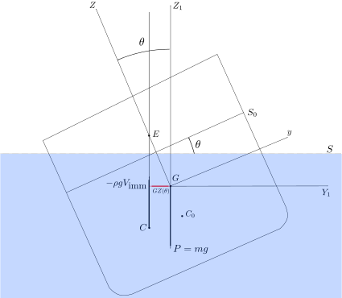
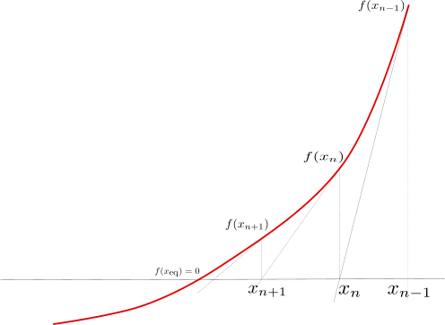
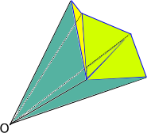

# Courbes de stabilité

## Stabilité en roulis

On s'intéresse ici à la stabilité du navire en roulis qui constitue une condition
de base pour la sécurité du navire, et fait l'objet de réglementations strictes.

On considère un navire partiellement immergé en eau calme (la surface libre
étant donc plane et horizontale) dont le volume immergé $`\Omega`$ est délimité
par une surface appelée "carène" (ou surface mouillée) et notée $`\mathcal{C}`$.
On appelle "flottaison" et l'on note $`S`$
l'intersection du volume du navire avec le plan de la surface libre.
On a donc $`\partial\Omega = \mathcal{C}\cup S`$.
On note $`G`$ le centre de gravité du navire et $`C`$ le centre de $`\Omega`$ (appelé
"centre de carène").

Les axes $`Y`$ et $`Z`$ du [repère "body"](#reperes-et-conventions) sont notés
respectivement $`y`$ et $`z`$. La situation peut être représentée par la figure
suivante :



La distance algébrique $`GZ=y_C-y_G`$ est le bras de levier du couple de rappel
hydrostatique. Celui-ci doit être suffisant pour redresser le navire. Une
condition nécessaire et suffisante pour que le couple de rappel
hydrostatique soit un couple de redressement est que le point métacentrique $`E`$
soit situé au-dessus du centre de gravité $`G`$. Le point $`E`$ est à
l'intersection de la droite $`Cz`$ et de la droite $`C_0 z`$.

### Algorithme de calcul de $`GZ`$

Pour calculer $`GZ(\phi)`$, il faut connaître la position du centre de carène
pour une position d'équilibre à un angle de gîte $`\phi`$. On commence donc
par calculer la position d'équilibre pour une gîte donnée, puis on calcule le
centre de carène et $`GZ`$ est ensuite donné par $`GZ(\phi)=y_C(\phi)-y_G`$.

#### Calcul de la position d'équilibre à une gîte donnée

Soit $`X=(z,\phi,\theta)`$ l'état du système. On suppose le navire soumis aux
seuls efforts de
la gravité et de l'hydrostatique. On note $`f`$ la fonction qui à $`X`$
associe la somme des efforts appliqués au système :


```math
f(X) = F_{\textrm{hs}}(X) + m\cdot \mathbf{g}
```

où $`m`$ désigne la masse du système et $`\mathbf{g}`$ est le vecteur
accélération de la pesanteur.

Lorsque le système est à l'équilibre, on a :

```math
f(X_{\textrm{eq}})=0
```

Pour résoudre cette équation, on peut par exemple utiliser la méthode de
Newton-Raphson :



```math
X_{n+1} = X_n - f'(X_n)^{-1}f(X_n)
```

On note
```math
K(X) = \frac{\partial f}{\partial X}(X)
```

```math
X_{n+1} = X_n - K^{-1}(X_n)f(X_n)
```

La matrice $`K(X_n)`$ est estimée numériquement en linéarisant $`f`$ autour de
$`X_n`$. Soit $`\Delta X`$ un petit déplacement autour de $`X_n`$ et
$`\Delta F = (\Delta F_z, \Delta M_{\phi}, \Delta M_{\theta})`$ la
variation d'effort correspondante.

```math
K(X_n) \Delta X = \Delta F
```

Pour $`1\leq i\leq 3, \sum_{j=1}^3 k_{ij} \Delta x_j = \Delta F_i`$.

Si le petit déplacement que l'on considère s'effectue exclusivement suivant
l'axe $`j`$, on trouve :

$`k_{ij}\Delta x_j = \Delta F_i`$ donc


```math
k_{ij} = \frac{\Delta F_i}{\Delta x_j}
```

En pratique, pour évaluer les termes de la matrice $`K(X_n)`$, on considère
séparément trois petits déplacements autour de $`X_n`$ (un par axe) et l'on
utilise la formule précédente pour évaluer les termes $`k_{ij}`$ trois par trois.

Une simplification possible est de considérer que la matrice $`K`$ varie peu et
donc de ne l'évaluer qu'une seule fois (plutôt qu'à chaque étape de
l'algorithme de Newton-Raphson).

#### Calcul du centre de carène $`C`$

La carène est discrétisée par des polygones. Pour calculer son centre de volume,
on transforme ces polygones en triangles et, pour chaque triangle, on calcule
le volume (algébrique) du tétraèdre de base ce triangle et de sommet l'origine.



En effectuant la somme de ces volumes élémentaires on retrouve le volume
délimité par le maillage. Le centre de carène est calculé de la façon suivante.

Soit $`P_1,P_2,P_3`$ les trois sommets d'un des triangles. Le volume élémentaire
$`dV`$ associé à ce triangle est le déterminant des vecteurs $`P_1,P_2,P_3`$ :

```math
dV=\textrm{det}(P_1,P_2,P_3)
```

Les coordonnées du centre (par rapport à l'origine choisie pour les tétraèdres) sont données par :

```math
x_C = \frac{1}{\sum_{\textrm{facet}}dV}\sum_{\textrm{facet}}\frac{x(P_1)+x(P_2)+x(P_3)}{4}dV
```

```math
y_C = \frac{1}{\sum_{\textrm{facet}}dV}\sum_{\textrm{facet}}\frac{y(P_1)+y(P_2)+y(P_3)}{4}dV
```

```math
z_C = \frac{1}{\sum_{\textrm{facet}}dV}\sum_{\textrm{facet}}\frac{z(P_1)+z(P_2)+z(P_3)}{4}dV
```

#### Autre méthode de calcul

Une méthode plus simple car ne nécessitant pas le calcul explicite du centre de
carène est de projeter le vecteur $`GB`$ sur le vecteur $`y`$ du plan vertical
attaché au corps :

```math
GZ = y\cdot GB
```

or

$`y = \frac{x_{\textrm{body}}^{\textrm{(ned)}} \times
z_{\textrm{ned}}^{\textrm{(ned)}}}{\left\|x_{\textrm{body}}^{\textrm{(ned)}} \times
z_{\textrm{ned}}^{\textrm{(ned)}}\right\|}`$


où $`x_{\textrm{body}}^{\textrm{(ned)}}`$ désigne les coordonnées du vecteur $`x`$ du
repère body, exprimées dans le repère NED et $`z_{\textrm{ned}}^{\textrm{(ned)}}`$ les
coordonnées du vecteur $`z`$ du [repère NED](#rep%C3%A8re-de-r%C3%A9f%C3%A9rence-ned) exprimées dans le [repère NED](#rep%C3%A8re-de-r%C3%A9f%C3%A9rence-ned).

Il se trouve qu'il n'est pas nécessaire de connaître la coordonnée $`z`$ du
vecteur GB. En effet,

$`\exists \lambda_0\in\mathbf{R} : GB = \frac{M\times
F}{\left\|F\right\|} + \lambda_0 F`$

où $`M`$ est le moment en $`G`$ de l'effort hydrostatique et $`F`$ la résultante de
l'effort hydrostatique.

On pose

```math
GB_{\lambda} = \frac{M\times F}{\left\|F\right\|} + \lambda F
```

Dans le [repère NED](#rep%C3%A8re-de-r%C3%A9f%C3%A9rence-ned), on a :

```math
F = \left[\begin{array}{c}0\\0\\f_z\end{array}\right]
```

```math
M = \left[\begin{array}{c}m_x\\m_y\\m_z\end{array}\right]
```

donc

```math
GB_{\lambda} = \left[\begin{array}{c}mf_x\\mf_y\\mf_z+\lambda F\end{array}\right]
```

où l'on a noté


```math
M\times F = \left[\begin{array}{c}mf_x\\mf_y\\mf_z\end{array}\right]
```

$`GZ_{\lambda} = y\cdot GB_{\lambda} =
\left[\begin{array}{c}x\\y\\z\end{array}\right]\times
\left[\begin{array}{c}0\\0\\1\end{array}\right]\cdot
\left[\begin{array}{c}mf_x\\mf_y\\mf_z+\lambda F\end{array}\right]`$

d'où

$`\forall \lambda\in\mathbf{R}, GZ_{\lambda} = \frac{x m_x}{f_z} + \frac{y
m_y}{f_z}`$

soit, avec les conventions de rotation usuelles :

```math
GZ = \frac{\cos(\psi)\cdot\cos(\theta)\cdot m_x +
\sin(\psi)\cdot\cos(\theta)\cdot m_y}{f_z\left\|x_{\textrm{body}}^{\textrm{(ned)}}\right\|}
```

## Outil de calcul de $`GZ`$

L'installation d'xdyn contient, outre l'exécutable `xdyn`, un autre exécutable appelé `gz`, permettant de calculer
des courbes de stabilité statique, aussi communément appelée courbe en "GZ", en fonction de la gîte $`\phi`$.

Cet outil prend en entrée des paramètres de ligne de commande et un fichier
YAML au même format que celui pour le simulateur. Contrairement au
simulateur, l'outil `gz` n'utilise ni les conditions initiales, ni les sorties,
ni les efforts extérieurs spécifiés dans le fichier YAML.

```python echo=False, results='verbatim', name='gz-command-line-arguments'
from subprocess import check_output
import re
r=re.compile(r"Righting.*USAGE:", re.DOTALL)
print(re.sub(r,"", check_output(['gz']).decode('utf-8')))
```

Exemple :

```python echo=False, results='verbatim', name='gz-example'
from subprocess import check_output
cmd = ['gz', 'tuto_execution/test_ship_in_waves.yml', '-s', 'tuto_execution/test_ship.stl', '--dphi',  '10', '--phi_max', '40']
print(' '.join(cmd))
print(check_output(cmd).decode('utf-8'))
```

## Références
- *Hydrodynamique des Structures Offshore*, 2002, Bernard Molin, Editions TECHNIP, ISBN 2-7108-0815-3, page 398
- *Seakeeping: Ship Behaviour in Rough Weather*, 1989, A. R. J. M. Lloyd, Ellis Horwood Series in Marine Technology, ISBN 0-7458-0230-3, page 191
- *Dynamique du Navire*, 1986, Pierre Devauchelle, Bibliothèque de L'Institut Français d'Aide à la Formation Professionnelle Maritime, ISBN 2-225-80669-1, page 168
- *Hydrodynamique navale : théorie et modèles*, 2009, Alain Bovis, Presses de l'ENSTA, page 79
- *Stabilité des bateaux - examen d'un dossier*, CETMEF, décembre 2012, page 11
