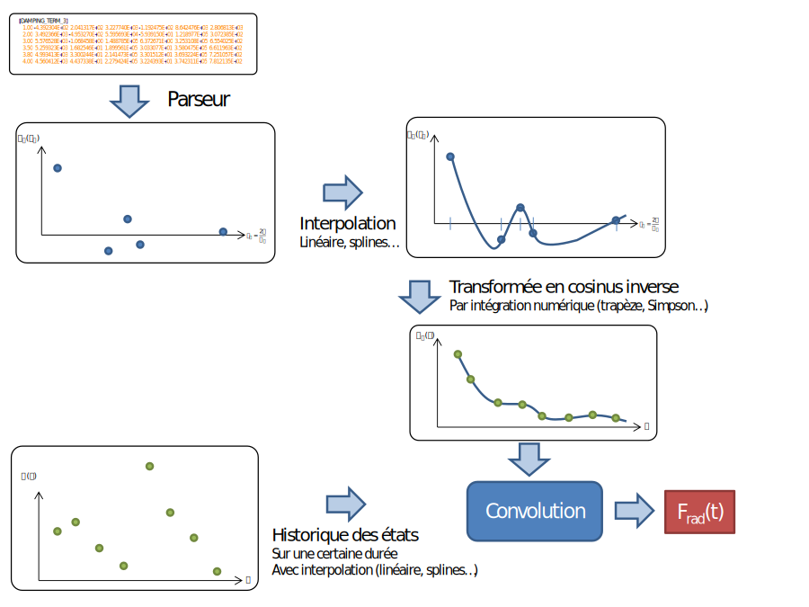
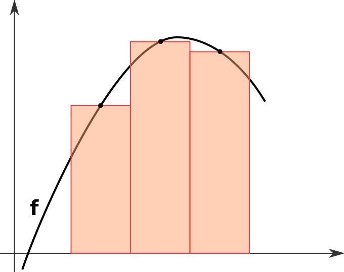
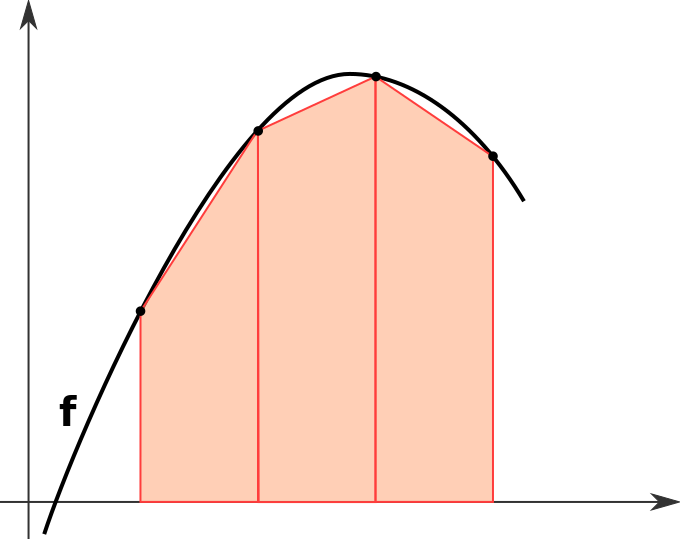
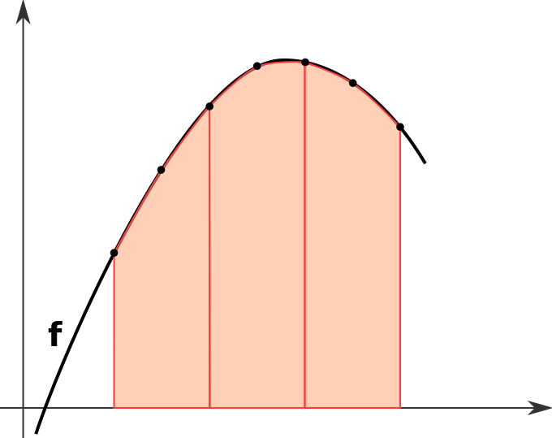

# Modélisation des efforts de diffraction et de radiation

Cette section propose une décomposition des efforts hydrodynamiques suivant un schéma classiquement utilisé pour la résolution des problèmes de tenue à la mer. Les efforts hydrodynamiques sont alors supposés constitués de la somme  des :
- efforts d'excitation résultant des pressions appliquées sur la coque, supposée fixe, par la houle incidente (efforts de Froude-Krylov) et la houle modifiée par le présence du corps (supposé fixe), ou diffraction.
    - la formulation temporelle considérée ici permet en outre d'aller plus loin dans la modélisation des efforts de Froude-Kryolv, en intégrant les pressions de houle incidente sur la géométrie exacte du corps en mouvement par rapport à la surface libre déformée (houle incidente seulement).
- efforts liés aux mouvements du navire en eau initialement calme (sans houle), et à la génération de vagues associée (radiation). Ces efforts sont aux même constitués
    -  de composantes en phase avec l'accélération du corps, et assimilables à des termes inertiels. Ces termes sont d'un ordre de grandeur proche des termes d'inertie mécanique, et doivent être associés à ceux-ci (dans le membre de gauche de l'équation des mouvements à résoudre) afin d'éviter les instabilités numériques qui apparaissent si on les considère comme des efforts extérieurs.
    - de composantes en phase avec les vitesses du corps, correspondant à des termes d'amortissement. Ces termes peuvent être exprimés dans le domaine temporel à partir de formulations impulsionnelles, faisant appel à des informations issues d'un calcul fréquentiel.
- ces termes d'amortissement sont uniquement d'origine potentielle, et ne sont pas suffisant pour représenter la physique des amortissements pour certaines degrés de liberté, correspondant notamment aux résonances mécaniques. Il est alors nécessaire d'ajouter un amortissement d'orignie visqueuse, qui peut être calcul de différentes manières.


## Potentiel d'interaction entre la houle et l'obstacle

On suppose l'eau non visqueuse, incompressible, homogène et isotrope et l'on
considère un écoulement irrotationnel.
Supposer l'écoulement irrotationnel implique (d'après le lemme
de Poincaré) que la vitesse dérive d'un potentiel que l'on appelle
$`\Phi_T:(x,y,z,t)\mapsto\Phi_T(x,y,z,t)`$. Par définition, la vitesse en tout
point de l'écoulement est donc donnée par :


```math
V(x,y,z,t) = \textrm{grad}{\Phi_T(x,y,z,t)}
```


Le potentiel de la houle incidente est connu si l'on se place dans le cadre de
la théorie linéaire de Stokes. On désignera par $`\Phi_I`$ ce potentiel. On a en
effet :

$`\Phi_I(y,z,t) = \frac{g H}{2 \omega}
\frac{\cosh(k(z-h))}{\cosh(kh)}\cos(ky-\omega t)`$

avec : $`\omega^2 = g\cdot k\cdot \tanh(kh)`$

où $`k`$ désigne le nombre d'onde, $`\omega`$ la pulsation de la houle, $`h`$ la
profondeur d'eau, $`H`$ la double amplitude (ou creux) et $`g`$ l'accélération de
la pesanteur.

On pose :


```math
\Phi_P := \Phi_T-\Phi_I
```


que l'on nomme "potentiel d'interaction entre la houle et l'obstacle". C'est ce
potentiel qui nous intéresse ici puisque c'est la seule indéterminée.

On contraint $`\Phi_P`$ à être une fonction harmonique du temps de pulsation
$`\omega`$ :


```math
\Phi_P(x,y,z,t) = \Re{\Psi_P e^{-i\omega t}}
```


## Conditions satisfaites par le potentiel d'interaction entre la houle et l'obstacle

Le potentiel inconnu $`\Phi_P`$ doit satisfaire les conditions suivantes :

1. Le fluide étant incompressible et l'écoulement irrotationnel, $`\Phi_P`$
   vérifie l'équation de Laplace $`\Delta \Phi_P = 0`$.
2. Si l'on suppose l'obstacle immobile, la condition de surface libre s'écrit :
   $`\left[g\cdot\frac{\partial \Psi_P}{\partial z} + \omega^2
   \Psi_P\right](x,y,0,t) = 0`$
3. Le potentiel étant indéterminé si l'on n'impose pas une condition sur le sens
   de propagation de l'énergie, on imposera la condition de radiation de
   Sommerfeld (phénomène divergent ; l'énergie s'éloigne de l'obstacle) :
   $`\sqrt{r}\lvert{\partial \Psi_P}{\partial r} - i \lvert k\rvert\Psi_P\rvert
   \rightarrow 0`$ quand $`r=\sqrt{x^2 + y^2}\rightarrow \infty`$ (condition de
   radiation à l'infini). Cette condition exprime que, au loin, les ondes de
   diffraction-radiation ont pour nombre d'onde $`k`$, se propagent dans la
   direction radiale et leur amplitude décroît comme $`1/\sqrt{r}`$.
4. Le fond étant imperméable, la composante suivant $`z`$ de la vitesse y est
   nulle : $`V_z(x,y,h,t) = \frac{\partial \Phi_P}{\partial z}(x,y,h,t) = 0`$ et
   par là même : $`\frac{\partial \Psi_P}{\partial z}(x,y,h) = 0`$.
5. L'obstacle étant imperméable, $`(\textrm{grad} \Psi_P) \cdot n = \frac{\partial
   \Psi_P}{\partial n} = -(\textrm{grad} \Psi_I) \cdot n + V_o \cdot n`$
   où $`V_o`$ est la vitesse normale de l'obstacle en
   un point $`P`$ et $`n`$ est la normale extérieure à l'obstacle.

## Résolution

Si l'on suppose l'obstacle fixe, la condition (5) s'écrit :

```math
 \frac{\partial \Psi_P}{\partial n} = - \frac{\partial \Psi_I}{\partial n}
```

Cette condition traduit la réflexion (ou diffraction) de la houle incidente sur
l'obstacle fixe. Un potentiel $`\Psi_{\textrm{PD}}`$ vérifiant les conditions (1) à
(4) et la condition de diffraction est appelé potentiel de diffraction.

Si l'on ne considère qu'on mouvement oscillatoire élémentaire de l'obstacle
suivant son $`j`$-ème degré de liberté, la condition (5) s'écrit : $`\frac{\partial \Psi_P}{\partial n} = n_j`$. Un potentiel $`\Psi_{PR_j}`$
vérifiant les conditions (1) à (4) et cette condition-ci est appelé $`j`$-ème
potentiel élémentaire de radiation et correspond au mouvement engendré par ce
mouvement oscillatoire élémentaire de l'obstacle.

En définitive, la solution complète $`\Phi_D`$ du problème de
diffraction-radiation obtenue par superposition de la solution "obstacle
fixe" et des solutions oscillatoires élémentaires peut s'écrire :

```math
\Phi_D = \Re\left[\Psi_{\textrm{PD}}e^{-i\omega t} + \sum_{j=1}^6
f_j\Psi_{\textrm{PR}_j} e^{-i\omega t}\right]
```

en adoptant les notations suivantes :

- $`V=\left[f_1,f_2,f_3\right]`$ est la vitesse de translation du corps
- $`\Omega=\left[f_4,f_5,f_6\right]`$ est sa vitesse de rotation

## Expression des efforts hydrodynamiques

On pose $`\Phi_{\textrm{PR}} =  \Re\left[\sum_{j=1}^6 f_j \Psi_{PR_j} e^{-i\omega
t}\right]`$

Les efforts hydrodynamiques s'écrivent :


```math
F_{\textrm{hd}} = \rho \frac{d}{dt} \int_{C}\Phi_T dS
```


```math
= \rho \frac{d}{dt} \int_{C}\Phi_I+\Phi_{\textrm{PD}}+\Phi_{\textrm{PR}} dS
```


On appelle $`F_{\textrm{FK}}=\rho \frac{d}{dt} \int_{C}\Phi_I dS`$ "efforts de
Froude-Krylov" et $`F_D = \rho \frac{d}{dt} \int_{C}\Phi_{\textrm{PD}} dS`$ "efforts de
diffraction". Ensemble ils constituent les efforts d'excitation de la houle
$`F_E`$. Les efforts $`\rho \frac{d}{dt} \int_{C}\Phi_{\textrm{PR}} dS`$ sont nommés
"efforts de radiation" et sont désignés par $`F_R`$. On a donc :


```math
F_{\textrm{hd}} = F_E + F_R
```


## Calcul des efforts de radiation

On a, pour l'axe $`k`$ :


```math
 F_{\textrm{R}_k} = \rho \frac{\partial}{\partial t} \int_C \Phi_{\textrm{PR}}n_k dS
```


```math
= \rho \frac{\partial}{\partial t} \Re \int_C \sum_j \Psi_{\textrm{PR}_j} f_je^{-i\omega t} n_k dS
```


```math
= \rho \Re \int_C \sum_j -i\omega  \Psi_{\textrm{PR}_j} f_j e^{-i\omega t} n_k dS
```


On décompose $`\Psi_{\textrm{PR}_j}`$ en sa partie réelle et sa partie imaginaire :
$`\Psi_{\textrm{PR}_j} = \Psi_j^R + i \Psi_j^I`$

On a alors :

```math
F_{\textrm{R}_k} = \rho \Re \int_C \sum_j \Re(-i\omega \Psi_j^R + \omega \Psi_j^I)
f_j e^{-i\omega t} n_k dS
 = \rho \Re \int_C \sum_j -i\omega f_j e^{-i\omega t} \Psi_j^R + \sum_j \omega
f_j e^{-i\omega t} \Psi_j^I n_k dS
```

On remarque que


```math
-i\omega f_j e^{-i\omega t} \Psi_j^R = \frac{\partial}{\partial t}(f_je^{-i\omega t})
```


 donc


```math
 F_{\textrm{R}_k} = \rho \Re \int_C \sum_j \omega f_j e^{-i\omega t} \Psi_j^I + \sum_j \frac{\partial}{\partial t} f_j e^{-i\omega t}\Psi_j^R n_k dS
= \rho\omega \sum_j\Re (f_j e^{-i\omega t})\int_C \Psi_j^I
n_k dS + \rho \sum_j \frac{d}{dt}\Re(f_j
e^{-i\omega t})\int_C\Psi_j^R n_k dS
```

On pose $`U_j=\Re(f_j e^{-i\omega t})`$

$`F_{\textrm{R}_k} = \rho\omega \sum_j U_j\int_C\Psi_j^I n_k dS + \rho \sum_j
\frac{dU_j}{dt}\int_C \Psi_j^R n_k dS`$

Or d'après la condition (5) écrite pour les potentiels élémentaires de
radiation,


```math
n_k = \frac{\partial \Psi_k^R}{\partial n}
```


On a donc :

```math
F_{\textrm{R}_k} = \rho\omega \sum_j U_j\int_C\Psi_j^I  \frac{\partial
\Psi_k^R}{\partial n} dS + \rho \sum_j
\frac{dU_j}{dt}\int_C \Psi_j^R  \frac{\partial \Psi_k^R}{\partial n} dS
```

On pose :


```math
{M_A}_{jk}(\omega) = -\rho \int_C \Psi_j^R \frac{\partial \Psi_k^R}{\partial n} dS \textrm{ (en kg)}
```


```math
{B_r}_{jk}(\omega) = -\rho \omega \int_C \Psi_j^I \frac{\partial \Psi_k^R}{\partial n} dS \textrm{ (en kg/s)}
```


On appelle $`M_A`$ matrice des masses ajoutées (qui vient de ce que le solide
déplace le fluide) et $`B_r`$ matrice des
amortissements dus à la radiation (termes d'amortissement non-visqueux dû à la
dispersion d'énergie par les vagues générées par le solide).

On a alors :

$`F_{\textrm{R}_k} = -\left(\sum_j U_j {B_r}_{jk}(\omega) + \sum_j \frac{dU_j}{dt}
{M_A}_{jk}(\omega)\right)`$

En prenant $`U=d\eta/dt`$, on obtient une formulation vectorielle des efforts dans
le domaine fréquentiel :

$`F_{\textrm{R}}(t) = -\left(M_A(\omega)\frac{d^2\eta(t)}{dt^2} + B_r(\omega)
\frac{d\eta(t)}{dt}\right)`$

## Propriétés

On peut montrer en utilisant la deuxième identité de Green, que les matrices
$`M_A`$ et $`B_r`$ obtenues précédemment sont symétriques et que la matrices $`M_A`$
est définie positive : on peut donc considérer $`M_A`$ comme une matrice d'inertie
que l'on appelle "inertie ajoutée". On peut aussi retrouver l'expression de $`M_A`$
de l'évaluation de l'énergie cinétique du fluide :

$`2Ec = \rho\int_{\omega} (\nabla \Phi)^2 dV = \rho \int_{\partial \Omega} \Phi
\frac{\partial \Phi}{\partial n} dS = \rho f_k f_l \int_{\partial \Omega}\Phi_k
\frac{\partial \Phi_l}{\partial n} dS = \rho {M_A}_{kl} f_k f_l`$


## Écriture en temporel

Lorsque l'on écrit le bilan des efforts appliqués au solide, on a :


```math
(M+M_A(\omega)) \ddot{X} + B_r(\omega) \dot{X} = F_{\textrm{autres}}
```


Bien que cette équation ressemble à une équation différentielle, il n'en est
rien car elle ne décrit que les mouvements en régime établi sinusoïdal : cette
équation n'est qu'une représentation de la réponse fréquentielle du navire.

Cette constatation a été faite en 1962 par W. E. Cummins, alors employé par le
David Taylor Model Basin de l'armée américaine (*The Impulse Response & Ship
Motions*, Report 1661, October 1962).

Dans ce document, Cummins entreprend d'expliciter les efforts hydrodynamiques
dans le domaine temporel. Pour ce faire, il fait l'hypothèse que les mouvements
du navire sont un système linéaire à temps invariant et que, par conséquent, on
peut déduire la réponse du navire à n'importe quelle excitation de sa réponse
impulsionnelle. Il considère le potentiel de vitesse $`\Theta_j(t)`$ de
l'écoulement lors d'une réponse impulsionnelle suivant l'axe $`j`$ et le
décompose en deux composantes :

- d'une part, $`\psi_j(t)`$ le potentiel de vitesse (normalisé par la
  vitesse $`v_j`$) de l'écoulement durant une excitation impulsionnelle
  (Dirac) d'amplitude $`v_j`$ sur l'axe $`j`$,
- d'autre part, $`\phi_{j}(t)`$ le potentiel de vitesse (normalisé par le
  déplacement $`{\Delta_x}_j`$) de l'écoulement à la suite du Dirac sur l'axe $`j`$.

On a donc, pour une excitation impulsionnelle de l'axe $`j`$ :


```math
\Theta = v_j\Psi_j + \phi_j(t)\Delta x_j
```


Le potentiel de vitesse dû à un mouvement arbitraire suivant l'axe $`j`$ s'écrit
alors :


```math
\Theta = \dot{x}\Psi_j + \int_{-\infty}^t \phi_j(t-\tau)\dot{x_j}(\tau)d\tau
```


Les efforts agissant sur la carène suivant l'axe $`k`$ du fait d'une excitation
de l'axe $`j`$ peuvent s'exprimer en fonction de la pression dynamique de
l'écoulement :


```math
F_{jk} = -\int_S p_j n_k dS
```


Or par définition, $`p = \frac{\partial \Theta}{\partial t}`$

En dérivant sous le signe intégral on obtient :

$`\frac{\partial \Theta}{\partial t} = \ddot{x_j}\Psi_j + \int_{-\infty}^t
\frac{\partial \phi_j(t-\tau)}{\partial t}\dot{x_j}(\tau)d\tau`$

Il en découle :

$`-F_{jk} = \rho\int_C\ddot{x_j}\psi_j n_k dS +
\rho\int_{-\infty}^t\int_C\frac{\partial \phi_j(t-\tau)}{\partial
t}n_k dS \dot{x_j}(\tau)d\tau`$

On pose :


```math
A_{jk} = \rho\int_C\psi_j n_k dS \textrm{ (masses ajoutées)}
```


```math
K_{jk}(t) = \rho\int_C\frac{\partial\phi_j(t)}{\partial t}n_k dS \textrm{ (fonctions de retard)}
```


On a alors :

$`-F_{jk} = \ddot{x_j}A_{jk} + \int_{-\infty}^t K(t-\tau)\dot{x_j}(\tau)
d\tau`$

## Relation entre les formulations temporelle et fréquentielle

La formulation fréquentielle s'écrit :


```math
 -F_R = M_A(\omega)\frac{d^2X}{dt^2} + B_r(\omega)\frac{dX}{dt}
```


La formulation temporelle est :

$`-F_R = A\frac{d^2X}{dt^2} + \int_{-\infty}^t
K(t-\tau)\frac{dX}{dt}(\tau)d\tau`$

Les codes potentiels fournissent les matrices
$`M_A(\omega)`$ et $`B_r(\omega)`$ à n'importe quelle fréquence, mais qu'en est-il
des matrices $`A`$ et $`K`$ utilisées par la formulation temporelle ?

Deux ans après Cummins, en 1964, Ogilvie propose une méthode pour déterminer
les matrices $`A`$ et $`K`$ en fonction des matrices $`M_A`$ et $`B_r`$.
Pour ce faire, il considère que le mouvement du solide est oscillant de pulsation
$`\omega`$ :

$`X(t) = \cos(\omega t)`$

En substituant dans la formulation fréquentielle, on obtient :

$`F_R = \omega^2 M_A(\omega) \cos(\omega t) + \omega B_r(\omega) \sin(\omega
t)`$

En ce qui concerne la formulation temporelle, on a :

$`F_R = \omega^2 A \cos(\omega t) + \omega \int_{-\infty}^t K(t-\tau)
\sin(\omega\tau)d\tau`$

En effectuant le changement de variable $`\tau\leftarrow t-\tau`$ on a :

$`F_R = \omega^2 A \cos(\omega t) + \omega \int_0^{+\infty} K(\tau)
\sin(\omega(t-\tau))d\tau`$

En développant $`\sin(\omega(t-\tau)`$ on obtient :

$`F_R = \omega^2\left[A - \frac{1}{\omega}\int_0^{\infty}
K(\tau)\sin(\omega\tau)d\tau\right]\cos(\omega t) +
\omega\int_0^{+\infty}K(\tau)\cos(\omega\tau)d\tau \sin(\omega t)`$

Les relations suivantes doivent donc être valables pour tout $`\omega`$ :

$`M_A(\omega) = A-\frac{1}{\omega}\int_0^{+\infty}K(\tau)\sin(\omega\tau)
d\tau`$

```math
B_r(\omega)=\int_0^{+\infty}K(\tau)\cos(\omega\tau)d\tau
```


En faisant tendre $`\omega`$ vers l'infini, on a :


```math
A = M_A(\infty) = \lim_{\omega\rightarrow\infty}M_A(\omega)
```


$`K`$ est obtenu en prenant la transformée de Fourier inverse de $`B_r`$ :


```math
K(t) = \frac{2}{\pi}\int_0^{+\infty} B_r(\omega)\cos(\omega\tau)d\tau
```


## Calcul numérique des amortissements de radiation

En pratique, on utilise en entrée du simulateur les [fichiers HDB](#fichiers-hdb)
(convention d'écriture de base hydrodynamique issue originellement de Diodore),
qui contiennent les matrices d'amortissement de radiation à
différentes pulsations. Ces fichiers sont utilisés dans une table
d'interpolation (soit une interpolation linéaire par morceaux, soit des splines)
puis on évalue l'intégrale suivante pour différentes valeurs de $`\tau`$ :

```math
K_{i,j}(\tau) = \frac{2}{\pi}\int_{\omega_{\textrm{min}}}^{\omega_{\textrm{max}}}B_{i,j}(\omega)\cdot\cos(\omega\tau)d\omega
```

Cette intégrale est calculée à l'aide d'un schéma d'intégration numérique
(méthode des rectangles, des trapèzes, règle de Simpson ou Gauss-Kronrod).



On calcule ensuite les efforts d'amortissement de radiation en prenant en
compte l'historique sur une période $`T`$ :


```math
F_{\textrm{rad}}(t)\sim\int_0^{T}\dot{X}(t-\tau)K_r(\tau)d\tau
```


Il est important de noter que ces efforts sont exprimés dans le [repère de
calcul hydrodynamique](#rep%C3%A8re-de-calcul-hydrodynamique) : un changement
de repère est nécessaire pour les exprimer dans le repère "body".

### Paramétrage

Pour utiliser ce modèle, on écrit `model: radiation damping`.
Les matrices d'amortissement de radiation sont lues depuis un [fichier
HDB](#fichiers-hdb)
(format Diodore). Ce fichier contient les matrices $`B_r`$ pour différentes
périodes. Comme l'indique la [documentation](#impl%C3%A9mentation), les étapes
suivantes sont réalisées :

- Lecture du [fichier HDB](#fichiers-hdb) : son chemin est renseigné dans la clef `hdb`.
- Interpolation des matrices de fonction d'amortissement : on utilise des
  splines dites "naturelles", c'est-à-dire
  dont la dérivée seconde est nulle aux extrémités ou, ce qui revient au même,
  qui se prolongent par des droites aux extrémités du domaine.
- Calcul des fonctions retard par intégration numérique : on choisit
  l'algorithme d'intégration en renseignant la clef `type of quadrature for cos
  tranform`. Les types d'intégration
  connus sont : [`rectangle`](#m%C3%A9thode-des-rectangles), [`trapezoidal`](#m%C3%A9thode-des-trap%C3%A8zes),
  [`simpson`](#r%C3%A8gle-de-simpson),
  [`gauss-kronrod`](#quadrature-de-gauss-kronrod), [`clenshaw-curtis`](),
  [`filon`]() et [`burcher`](). Les bornes d'intégration sont spécifiées par
  `omega min` et `omega max`. Si ces bornes ne sont pas incluses dans
  l'intervalle
  $`\left[\frac{2\pi}{\omega_{\textrm{max}}},\frac{2\pi}{\omega_{\textrm{min}}}\right]`$,
  un message d'avertissement s'affiche (car dans ce cas l'intégration se poursuit
  hors du domaine de définition des fonctions de retard qui sont alors
  extrapolées).
- Interpolation des fonctions de retard lors de la convolution : comme pour les
  fonctions d'amortissement, on utilise des splines naturelles.
  Le nombre de points de discrétisation à partir duquel
  est réalisée cette interpolation (le nombre de valeurs de $`\tau`$ pour
  lesquelles on calcule l'intégrale
  $`K_{i,j}(\tau)=\frac{2}{\pi}\int_{\omega_{\textrm{min}}}^{\omega_{\textrm{max}}}B_{i,j}(\omega)\cdot\cos(\omega\tau)d\tau`$)
  est donné par `nb of points for retardation function discretization`.
- Interpolation des états : lors du calcul de l'intégrale de convolution, les
  états sont interpolés linéairement entre deux instants.
- Calcul de la convolution : l'algorithme d'intégration est spécifié par `type
  of quadrature for convolution`, qui peut prendre les mêmes valeurs que `type of
  quadrature for cos transform`.
- Verbosité : le calcul des efforts d'amortissement de radiation comprenant de
  nombreuses étapes et étant extrêmement sensible aux bornes d'intégration et aux
  types d'algorithmes utilisés, nous proposons l'affichage de résultats,
  nommément les amortissements interpolés sur une grille plus fine que celle
  fournie en entrée (afin de contrôler les erreurs dues à la discrétisation) et les
  fonctions de retard (afin de valider les bornes d'intégration et l'algorithme
  utilisés). Pour activer la verbosité, on met la clef `output Br and K` à
  `true`. Sinon on la met à `false`.

~~~~~~~~~~~~~~~~~~~~~~~~~~~~~~~~~~~~~~~~~~ {.yaml}
- model: radiation damping
  hdb: test_ship.hdb
  type of quadrature for cos transform: simpson
  type of quadrature for convolution: clenshaw-curtis
  nb of points for retardation function discretization: 50
  omega min: {value: 0, unit: rad/s}
  omega max: {value: 30, unit: rad/s}
  tau min: {value: 0.2094395, unit: s}
  tau max: {value: 10, unit: s}
  output Br and K: true
~~~~~~~~~~~~~~~~~~~~~~~~~~~~~~~~~~~~~~~~~~

### Méthode des rectangles

C'est la méthode la plus simple qui consiste à interpoler la fonction
$`f`$ à intégrer par une fonction constante (polynôme de degré 0).

Si $`x_i`$ est le point d'interpolation, la formule est la suivante :

```math
I(f) = (b-a) f(x_i)
```


Le choix de $`x_i`$ influence l'erreur $`E(f) = I - I(f)`$
:
- Si $`x_i = a`$ ou $`x_i = b`$, l'erreur est donnée
  par $`E(f) = \frac{(b-a)^2}{2} f'(\eta), \quad \eta \in
  [a,b]`$ C'est la ''méthode du rectangle'' qui est d'ordre
  0.
- Si $`\xi = (a+b)/2`$, l'erreur est donnée par $`E(f) =
  \frac{(b-a)^3}{24} f''(\eta), \quad \eta \in [a,b]`$. Il s'agit
  de la méthode du point médian qui est d'ordre 1.

Ainsi, le choix du point milieu améliore l'ordre de la méthode : celle du
rectangle est exacte (c'est-à-dire $`E(f) = 0`$) pour les fonctions
constantes alors que celle du point milieu est exacte pour les polynômes de
degré 1. Ceci s'explique par le fait que l'écart d'intégration de la méthode du
point milieu donne lieu à deux erreurs d'évaluation, de valeurs absolues
environ égales et de signes opposés.

[Source :
Wikipedia](http://fr.wikipedia.org/wiki/Calcul_num%C3%A9rique_d%27une_int%C3%A9grale#Formules_du_rectangle_et_du_point_milieu)



[Source :
Wikipedia](http://commons.wikimedia.org/wiki/File:Int%C3%A9gration_num_rectangles.svg?uselang=fr)


### Méthode des trapèzes

En interpolant $`f`$ par un polynôme de degré 1, les deux points
d'interpolation $`(a, f(a))`$ et $`(b, f(b))`$ suffisent
à tracer un segment dont l'intégrale correspond à l'aire d'un trapèze,
justifiant le nom de méthode des trapèzes qui est d'ordre 1 :
:$`I(f) = (b-a) \frac{f(a) + f(b)}{2}`$

L'erreur est donnée par:
$`E(f) = - \frac{(b-a)^3}{12} f''(\eta), \quad \eta \in [a,b]`$

Conformément aux expressions de l'erreur, la méthode des trapèzes est souvent
moins performante que celle du point milieu.

[Source :
Wikipedia](http://fr.wikipedia.org/wiki/Calcul_num%C3%A9rique_d%27une_int%C3%A9grale#Formule_du_trap.C3.A8ze)


[Source :
Wikipedia](http://commons.wikimedia.org/wiki/File:Int%C3%A9gration_num_trap%C3%A8zes.svg)

### Règle de Simpson

En interpolant $`f`$ par un polynôme de degré 2 (3 degrés de liberté),
3 points (ou conditions) sont nécessaires pour le caractériser : les valeurs
aux extrémités $`a`$, $`b`$, et celle choisie en leur milieu
$`x_{1/2} = (a + b) / 2`$. La méthode de Simpson est basée sur un
polynôme de degré 2 (intégrale d'une parabole), tout en restant exacte pour des
polynômes de degré 3 ; elle est donc d'ordre 3 :
:$`I(f) = \frac{(b-a)}{6} [ f(a) + 4 f(x_{1/2}) + f(b) ]`$

L'erreur globale est donnée par
:$`E(f) = - \frac{(b-a)^5}{2880} f^{(4)}(\eta), \quad \eta \in [a,b]`$

Remarque : comme la méthode du point médian qui caractérise un polynôme de
degré 0 et qui reste exacte pour tout polynôme de degré 1, la méthode de
Simpson caractérise un polynôme de degré 2 et reste exacte pour tout polynôme
de degré 3. Il s'agit d'une sorte d'"anomalie" où se produisent des
compensations bénéfiques à l'ordre de la méthode.

[Source :
Wikipedia](http://fr.wikipedia.org/wiki/Calcul_num%C3%A9rique_d%27une_int%C3%A9grale#Formule_de_Simpson)


[Source :
Wikipedia](http://commons.wikimedia.org/wiki/File:Int%C3%A9gration_num_Simpson.svg)

### Quadrature de Gauss-Kronrod

La formule de quadrature de Gauss-Kronrod est une extension de la quadrature de
Gauss. Lorsque l'on calcule une quadrature de Gauss sur un intervalle et que
l'on divise cet intervalle en deux partie, on ne peut réutiliser aucun des
points (sauf le point médian dans le cas d'un nombre de points impairs).
La formule de Gauss-Kronrod, créée dans les années 60 par Alexander Kronrod,
permet de transformer un schéma d'ordre $`n`$ en schéma d'ordre $`3n+1`$ en
ajoutant aux $`n`$ points de la quadrature de Gauss $`n+1`$ zéros des polylônmes de
Stieltjes-Wigert. Les polynômes de Stieltjes-Wigert sont des polynômes
orthogonaux pour la fonction de poids :

```math
w(x)=\pi^{-1/2}\cdot k\cdot x^{k^2\log(x)},x\in\mathbf{R}_+^*, k>0
```

On pose

```math
q_k=e^{-\frac{1}{2k^2}}
```

Les polynômes de Stieltjes-Wigert s'écrivent alors :


```math
p_0(x)=q^{1/4}
```

et
$`p_{n,k}(x) = \frac{(-1)^n q_k^{\frac{n}{2} +
\frac{1}{4}}}{\sqrt{(q_k;q_k)_n}}\sum_{\nu=0}^n\left[\begin{array}{c}n\\\nu\end{array}\right]q_k^{\nu^2}(-\sqrt{q_k}x)^\nu`$

où

```math
k\in[1,n]
```

```math
\left[\begin{array}{c}n\\\nu\end{array}\right]=\prod_{i=0}^{\nu-1}\frac{1-q^{n-i}}{1-q^{i+1}}
```

avec $`q`$ le symbole de Pochhammer

$`(q;a)_n=\left\{\begin{array}{c}
          \prod_{j=0}^{n-1}(1-qa^j),n>0\\
          1,n=0\\
          \prod_{j=0}^{|n|}(1-qa^j),n<0\\
          \prod_{j=0}^{\infty}(1-qa^j),n=\infty
          \end{array}\right.`$

(coefficient $`q`$-binomial)

Afin d'accélérer davantage la convergence, on utilise l'intégration de
Gauss-Kronrod de manière répétée (puisque cette méthode offre l'avantage de
pouvoir réutiliser les points de calcul de l'itération précédente) et l'on
applique l'$`\varepsilon`$-algorithme de Wynn.

Les formules de Gauss-Kronrod sont implémentées dans des bibliothèques
numériques standard telles que celles de Netlib (QUADPACK, en particulier la
routine DQAGS).

- [Weisstein, Eric W. "Stieltjes-Wigert Polynomial." From
MathWorld--A Wolfram Web
Resource.](http://mathworld.wolfram.com/Stieltjes-WigertPolynomial.html)
- Szegö, G., **Orthogonal Polynomials**, 4th ed. Providence, RI: Amer. Math. Soc.,
p. 33, 1975.
- R. Piessens, E. deDoncker–Kapenga, C. Uberhuber, D. Kahaner (1983) **Quadpack: a
Subroutine Package for Automatic Integration**; Springer Verlag.

## Calcul des matrices de masse ajoutée

Dans le simulateur, la matrice de masses ajoutées est soit lue directement
depuis le fichier YAML, soit extraite et interpolée linéairement à partir d'un
[fichier HDB](#fichiers-hdb). Pour le calcul des efforts d'amortissement de
radiation, on a besoin de la masse ajoutée à fréquence infinie. Afin de garantir
la symmétrie et le caractère positif et défini de la matrice (les coefficients
ont tendance à osciller fortement au voisinage de $`T=0`$), on n'extrapole pas les
données du [fichiers HDB](#fichiers-hdb) en zéro : on utilise directement les
valeurs lues dans le fichier HDB pour la période la plus faible. On suppose que
les mailles utilisées pour le calcul des masses ajoutées (résolution du
potentiel) sont suffisamment fines pour que le résultat ait un sens.

## Références

- *Practical Source Code for Ship Motions Time Domain Numerical Analysis and
  Its Mobile Device Application*, 2011, Zayar Thein, Department of Shipping and
  Marine Technology, CHALMERS UNIVERSITY OF TECHNOLOGY, Göteborg, Sweden,
  page 18.
