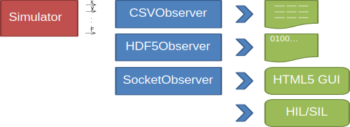
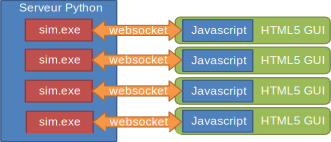

# Ligne de commande

## Liste des arguments

~~~~~~~~~~~~~~~~~~~~ {.bash}
APPEL: sim <yaml file> [-h] [-y ARG] [-s ARG] [dt ARG] [--tstart ARG]
[--tend ARG] [-w ARG]
Options:
  -h [ --help ]              Afficher le message d'aide (en anglais)
  -y [ --yml ] arg           Nom du (ou des) fichier(s) YAML (le flag est facultatif)
  -s [ --solver ] arg (=rk4) Nom du solveur : euler,rk4,rkck for Euler,
                             Runge-Kutta 4 et Runge-Kutta-Cash-Karp
                             respectivement.
  --dt arg                   Pas de temps initial (pour les solveurs à pas
                             variable) ou pas de temps fixe (pour les solveurs
                             à pas fixe)
  --tstart arg (=0)          Date correspondant au début de la simulation
                             (en secondes)
  --tend arg                 Dernier instant calculé
  -w [ --waves ] arg         Nom du fichier YAML de sortie pour la houle (le
                             cas échéant). Cf. section 'output' du fichier YAML
                             d'entrée
  -d [ --debug ]             Option utilisée par l'équipe de support pour aider
                             au diagnostique d'erreur. Permet de voir l'endroit
                             exact du code où une erreur a eu lieu (ne capture
                             pas les exceptions, par exemple pour utiliser un debugger).
~~~~~~~~~~~~~~~~~~~~

Les résultats sont écrits (au format CSV) vers la sortie standard. On peut les
rediriger vers un fichier en utilisant le caractère `>` (sous MS-DOS, MinGW et
Linux) comme décrit dans la section ci-dessous.

Le paramètre `-w` ne sera pas décrit ici mais dans [le fichier de description
des modèles](#waves).
Le paramètre `-c` ne sera pas décrit ici mais dans [le fichier de description
des modèles](#efforts-commandés).

## Exemples

### Simulation avec un solveur Runge-Kutta d'ordre 4 en commençant à t=0

~~~~~~~~~~~~~~~~~~~~ {.bash}
./sim tutorial_01_falling_ball.yml --dt 0.1 --tend 1
~~~~~~~~~~~~~~~~~~~~

Par défaut, les sorties se font sur la sortie standard (le terminal). Ceci
permet de chaîner les traitements (pipe UNIX), par exemple :

~~~~~~~~~~~~~~~~~~~~ {.bash}
./sim tutorial_01_falling_ball.yml --dt 0.1 --tend 1 | python plot.py test 0 3
~~~~~~~~~~~~~~~~~~~~

La commande précédente lance la simulation et génère un tracé (format SVG) à
l'aide du script python de post-traitement livré avec le simulateur.

On peut bien sûr choisir de rediriger les sorties vers un fichier :

~~~~~~~~~~~~~~~~~~~~ {.bash}
./sim tutorial_01_falling_ball.yml --dt 0.1 --tend 1 > out.csv
~~~~~~~~~~~~~~~~~~~~

### Simulation avec un solveur Euler en commençant à t=1

~~~~~~~~~~~~~~~~~~~~ {.bash}
./sim tutorial_01_falling_ball.yml -s euler --dt 0.1 --tstart 1 --tend 1.2
~~~~~~~~~~~~~~~~~~~~

# Documentations des données d'entrées du simulateur

Les données d'entrées du simulateur se basent sur un format
de fichiers [YAML](http://www.yaml.org/) qui fonctionne par clef-valeur.

Ce format présente l'avantage d'être facilement lisible et éditable. Des
parsers YAML existent pour de nombreux langages de programmation.

## Vue d'ensemble

### Liste des sections

Le fichier YAML comprend quatre sections de haut niveau :

- La section `rotations convention` définit la convention d'angles utilisée,
- `environmental constants` donne les valeurs de la gravité et la densité de l'eau,
- Les modèles environnementaux figurent dans `environment models`
- `bodies` décrit les corps simulés.

### Remarques sur les unités

On retrouve fréquemment dans le fichier YAML des lignes du type :

~~~~~~~~~~~~~~ {.yaml}
clef: {value: 65456, unit: km}
~~~~~~~~~~~~~~

Les unités ne sont pas vérifiées par le système : le parser se contente de
convertir toutes les entrées en unité du système international. Ainsi, on
aurait tout aussi bien pu écrire :

~~~~~~~~~~~~~~ {.yaml}
clef: {value: 65456, unit: kW}
~~~~~~~~~~~~~~

et obtenir exactement le même résultat.

### Exemple complet

~~~~~~~~~~~~~~ {.yaml}
rotations convention: [psi,theta',phi'']

environmental constants:
    g: {value: 9.81, unit: m/s^2}
    rho: {value: 1025, unit: kg/m^3}
environment models:
  - model: waves
    discretization:
       n: 10
       omega min: {value: 0.1, unit: rad/s}
       omega max: {value: 6, unit: rad/s}
       energy fraction: 0.999
    spectra:
      - model: airy
        depth: {value: 100, unit: m}
        seed of the random data generator: 0
        directional spreading:
           type: dirac
           waves propagating to: {value: 90, unit: deg}
        spectral density:
           type: jonswap
           Hs: {value: 5, unit: m}
           Tp: {value: 15, unit: m}
           gamma: 1.2
      - model: airy
        depth: {value: 100, unit: m}
        seed of the random data generator: 10
        directional spreading:
           type: cos2s
           s: 2
           waves propagating to: {value: 90, unit: deg}
        spectral density:
           type: dirac
           omega0: {value: 0.05, unit: rad/s}
           Hs: {value: 15, unit: m}
    output:
        frame of reference: NED
        mesh:
            xmin: {value: 1, unit: m}
            xmax: {value: 5, unit: m}
            nx: 2
            ymin: {value: 1, unit: m}
            ymax: {value: 2, unit: m}
            ny: 2
# Fixed frame: NED
bodies: # All bodies have NED as parent frame
  - name: Anthineas
    mesh: anthineas.stl
    position of body frame relative to mesh:
        frame: mesh
        x: {value: 9.355, unit: m}
        y: {value: 0, unit: m}
        z: {value: -3.21, unit: m}
        phi: {value: 0, unit: rad}
        theta: {value: 0, unit: rad}
        psi: {value: 0, unit: rad}
    initial position of body frame relative to NED:
        frame: NED
        x: {value: 0, unit: m}
        y: {value: 0, unit: m}
        z: {value: -5, unit: m}
        phi: {value: 0, unit: deg}
        theta: {value: -.0058, unit: rad}
        psi: {value: 0, unit: deg}
    initial velocity of body frame relative to NED:
        frame: body 1
        u: {value: 0, unit: m/s}
        v: {value: 0, unit: m/s}
        w: {value: 0, unit: m/s}
        p: {value: 0, unit: rad/s}
        q: {value: 0, unit: rad/s}
        r: {value: 0, unit: rad/s}
    dynamics:
        centre of inertia:
            frame: body 1
            x: {value: 0.258, unit: m}
            y: {value: 0, unit: m}
            z: {value: 0.432, unit: m}
        mass: {value: 253.31, unit: tonne} # Caution: 'ton' is the british ton which is 907.185 kg
        rigid body inertia matrix at the center of buoyancy projected in the body frame:
            frame: body 1
            row 1: [253310,0,0,0,0,0]
            row 2: [0,253310,0,0,0,0]
            row 3: [0,0,253310,0,0,0]
            row 4: [0,0,0,1.522e6,0,0]
            row 5: [0,0,0,0,8.279e6,0]
            row 6: [0,0,0,0,0,7.676e6]
        added mass matrix at the center of buoyancy projected in the body frame:
            frame: body 1
            row 1: [3.519e4,0,0,0,0,0]
            row 2: [0,3.023e5,0,0,0,0]
            row 3: [0,0,1.980e5,0,0,0]
            row 4: [0,0,0,3.189e5,0,0]
            row 5: [0,0,0,0,8.866e6,0]
            row 6: [0,0,0,0,0,6.676e6]
    external forces:
      - model: gravity
      - model: non-linear hydrostatic (fast)
~~~~~~~~~~~~~~

## Sorties

La spécification des sorties se fait au moyen de la section `output`, à la
racine du fichier YAML, dont voici un exemple :

~~~~~~~~~~~~~~~~~~~~~~~~~~~~~~~~~~~~~~~~~~ {.yaml}
output:
   - format: csv
     filename: test.csv
     data: [t, x(ball), 'Fx(gravity,ball)']
~~~~~~~~~~~~~~~~~~~~~~~~~~~~~~~~~~~~~~~~~~

- `format` : `csv` pour un fichier texte dont les colonnes sont séparées par
  une virgule ou `hdf5` pour le format des fichiers .mat de Matlab (HDF5)
- `filename` : nom du fichier de sortie
- `data` : liste des colonnes à écrire. Le temps est noté `t`, et les états
  sont `x(body)`, `y(body)` `z(body)`, `u(body)`, `v(body)`, `w(body)`,
  `p(body)`, `q(body)`, `r(body)`, `qr(body)`, `qi(body)`, `qj(body)`,
  `qk(body)`. `body` doit être remplacé par le nom du corps (`ball` dans
  l'exemple ci-dessus). Les sorties d'effort sont `Fx(modèle,corps,repère)`,
  `Fy(modèle,corps,repère)`, `Fz(modèle,corps,repère)`, `Mx(modèle,corps,repère)`, `My(modèle,corps,repère)`,
  `Mz(modèle,corps,repère)` où `modèle` est le nom du modèle d'effort (renseigné dans la
  clef `modèle` de chaque modèle d'effort), `corps` est le nom du corps sur
  lequel agit l'effort et `repère` est le repère d'expression (qui ne peut être
  que `NED` ou le nom du corps). Les sorties de houle sont notées
  `waves` et leur contenu est décrit dans la section [Modèle de
  houle/Sorties](#sorties-1). La somme des efforts appliqués à un corps est
  accessible par `Fx(sum of forces,corps,repère)` (resp. Fy, Fz, Mx, My, Mz).

# Tracés en cours de simulation

Afin de suivre l'évolution du système au cours de la simulation, une interface
HTML5 a été créée. Celle-ci est accessible en double-cliquant sur `sim_gui`
dans le répertoire `bin` du simulateur (par exemple,
`C:\Program Files\SimulateurIrtJv\bin`) puis en ouvrant un navigateur Internet
(type Firefox) à l'adresse `http://localhost:666`.

On peut effectuer des sorties vers un ou plusieurs fichiers en parallèle de
cette visualisation :

Une fois le serveur lancé, d'autres machines peuvent s'y connecter :

# Interface MatLab

`X-Dyn` peut être appelé depuis le logiciel `MatLab`.
Cela présente l'avantage de disposer d'un environnement graphique pour afficher
les résultats de simulation.

Voici les fonctions de base pour travailler avec `X-Dyn`.

- `xdyn_run` exécute `X-Dyn` depuis `MatLab`.
- `xdyn_loadResultsFromHdf5File.m` permet de charger les résultats d'une
  simulation dans `MatLab`.
- `xdyn_postProcess.m` lance l'ensemble des post-traitements disponibles.
- `xdyn_plotStates.m` permet de tracer les états, à partir de résultats de
  simulations. Cela comprend les positions et les vitesses de chaque corps.
- `xdyn_plotPositions.m` permet de tracer les positions et les orientations
   de chaque corps.
- `xdyn_plotVelocities.m` permet de tracer les vitesses de translation et de
   rotation de chaque corps dans le repère de chaque repère.
- `xdyn_animate3d.m` permet de lancer une animation 3d d'une simulation avec
  les objets simulés et le champ de vagues lorsque celui-ci est exporté.

Enfin, le fichier `xdyn_demos.m` permet de lancer les différents tutoriels.

