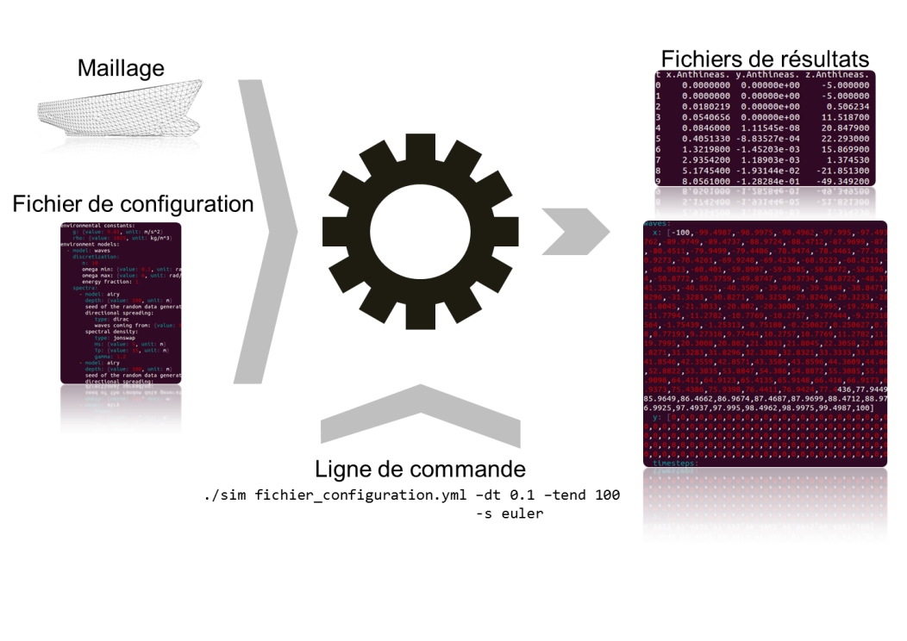

# Description

Le présent programme est un simulateur de comportement mécanique de corps solides indéformables dans un
environnement fluide. Son objet principal est la résolution des équations de mouvements du ou des corps considérés, dans le domaine temporel. 
Ces équations de mouvement sont construites sur la base d'efforts extérieurs calculés par des modèles spécifiques inclus dans le logiciel, ou 
pouvant y être ajoutés. Chaque modèle est associé à un jeu de données spécifique. 

Sur le principe, le simulateur permet de traiter n'importe quel problème de mouvement de corps solide. Les premiers modèles d'efforts implémentés 
et fournis concernent essentiellement le comportement de navires sur houle. 

Concernant le mode de fonctionnement du logiciel, il s'agit d'un outil en ligne de commande, c'est-à-dire
qu'on le lance depuis un terminal (ou une invite de commande MS DOS).

Le simulateur a été construit pour permettre une utilisation modulaire en ligne
de commande. Pour ce faire, les différents domaines à configurer sont séparés :
la description du problème physique est faite dans un ou plusieurs fichiers
d'entrée et la description de la simulation (pas de temps, solveur...) est
faite en ligne de commande. De cette manière, on peut facilement lancer des
simulations du même problème avec des solveurs différents et sur des durées
différentes, sans toucher au(x) fichier(s) de configuration du problème.

Le fichier de description du problème peut être séparé en autant de fichiers
que l'on veut, ce qui permet par exemple de versionner la configuration de
l'environnement physique séparément de celle du ou des solides.

En sortie, le simulateur génère un fichier de résultat au format CSV contenant
tous les états du ou des solides. Il peut également générer un fichier YAML
contenant des hauteurs de houle sur un maillage. La figure suivante résume les
entrées et sorties du simulateur :

Parallèlement à la présente documentation utilisateur, il existe également une
documentation d'implémentation décrivant l'architecture logicielle et
détaillant les API pour faciliter la maintenance du code (correctifs et
ajouts de fonctionnalités).

