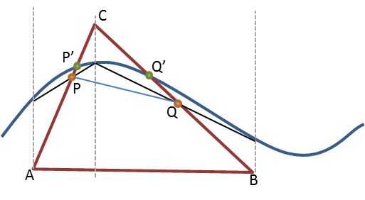
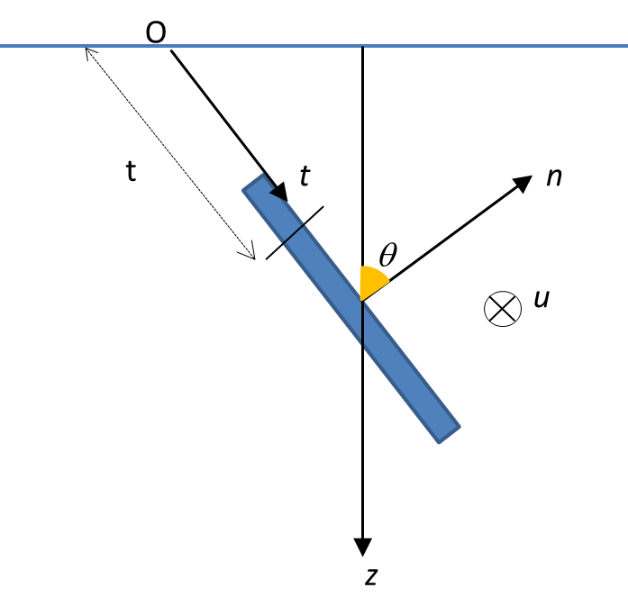
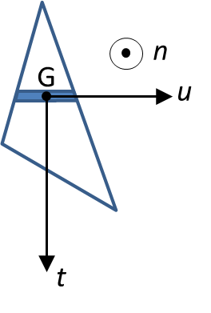
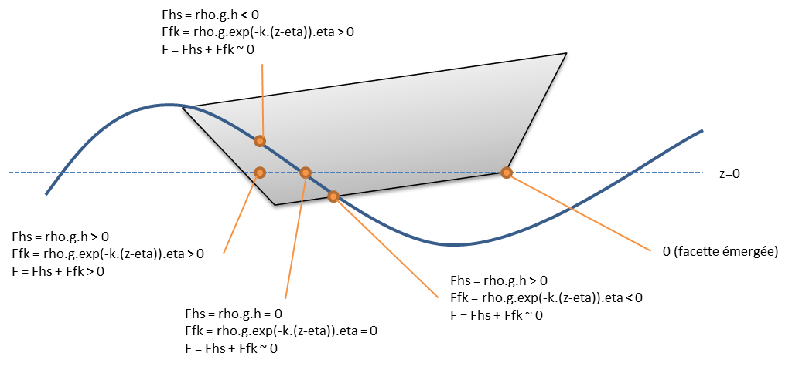
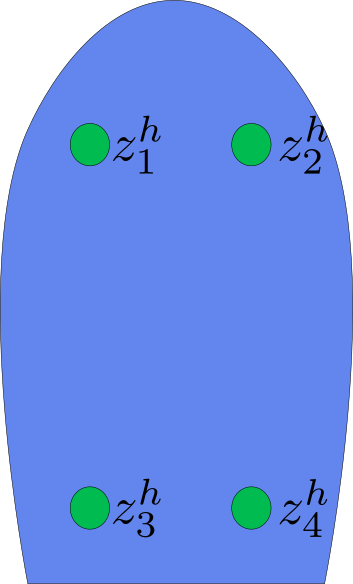
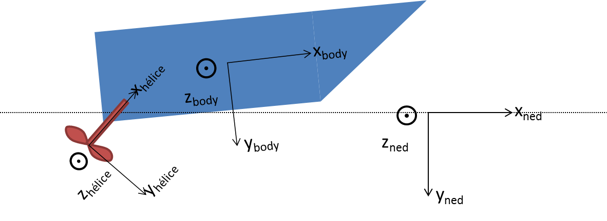
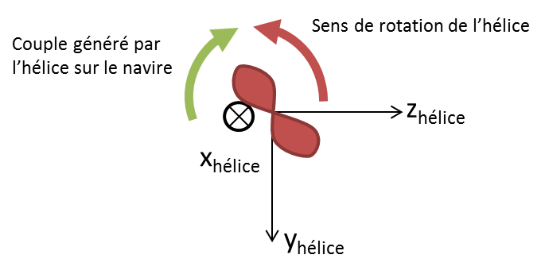
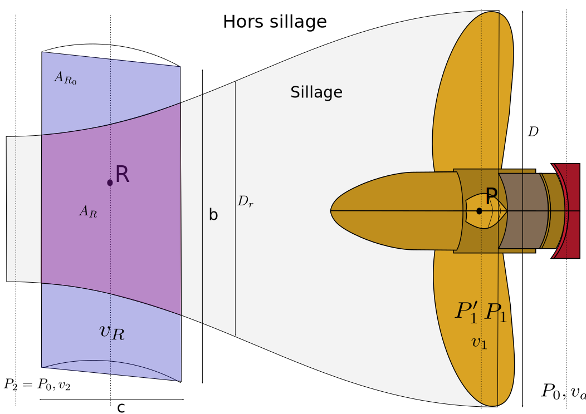
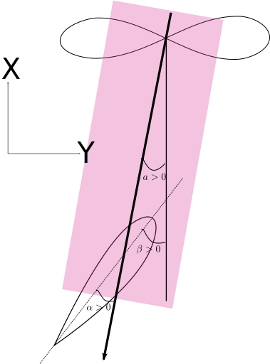

# Modèles d'efforts non-commandés

Les efforts extérieurs (non commandés) sont donnés dans la section
`external forces` sous forme de liste de modèles ayant ou non des paramètres.
La seule clef commune à tous les modèles d'effort est `model` : chaque modèle
possède sinon sa propre paramétrisation (éventuellement aucune paramétrisation).
Voici un exemple de section `external forces` :

~~~~~~~~~~~~~~~~~~~~~~~~~~~~~~~~~~~~~~~~~~ {.yaml}
external forces:
  - model: gravity
  - model: non-linear hydrostatic (fast)
~~~~~~~~~~~~~~~~~~~~~~~~~~~~~~~~~~~~~~~~~~


## Efforts de gravité

### Description

Le poids est donné dans le repère NED par :

$`F_P = m \cdot g \mathbf{u_z}`$

où $`m`$ désigne la masse du navire (en kg), $`g`$ l'accélération de la pesanteur
(en m/s^2) et $`\mathbf{u_z}`$ le vecteur unitaire vertical, exprimé dans le
repère dans lequel on veut projeter la force.

### Paramétrage

Pour soumettre un solide à la gravité, on écrit :

~~~~~~~~~~~~~~~~~~~~~~~~~~~~~~~~~~~~~~~~~~ {.yaml}
- model: gravity
~~~~~~~~~~~~~~~~~~~~~~~~~~~~~~~~~~~~~~~~~~

La valeur de $`g`$ utilisée est celle définie dans la section [`environmental
constants`](#constantes-environnementales) et pour la masse on prend le coeffient $`M_{3,3}`$ (le terme en Z, donc) de la [matrice d'inertie](#matrice-dinertie).

Un exemple de simulation de solide soumis uniquement à la gravité (chute libre)
est disponible dans les [tutoriels](#tutoriel-1-balle-en-chute-libre).

### Références
- *Physics v. 1*, 2001, D. Halliday, R. Resnick and K. S. Krane, John Wiley and Sons, ISBN 0-471-32057-9
- *Physique théorique*, Lev Landau et Evgueni Lifchits, éd. MIR, Moscou


## Efforts hydrostatiques non-linéaires

### Description

Les efforts hydrostatiques non-linéaires sont dus à la pression statique
(c'est-à-dire indépendante de la vitesse du fluide) s'exerçant sur la carène.
L'hypothèse principale est ici la staticité, c'est-à-dire qu'on considère la
carène au repos et une surface libre plane. Si cette dernière hypothèse n'est
pas vérifiée, il faut ajouter un terme correctif, qui correspond aux efforts
d'excitation de Froude-Krylov. En d'autres termes, pour le modèle
hydrostatique, il faut effectuer le calcul en supposant la surface libre au
repos. La prise en compte de la pression due à la houle est faite par le modèle
de Froude-Krylov.
La force $`\textbf{F}_{\textrm{HS}}`$ exercée par l'eau sur la carène doit être
calculée comme l'intégrale de la pression hydrostatique $`p_{\textrm{HS}}`$ sur
la surface immergée totale :


```math
\textbf{F}_{\textrm{HS}} = \int_{S}p_{\textrm{HS}}(z)\cdot \textbf{n} dS
```


Le paramétrage des efforts hydrostatiques non-linéaires dans le simulateur est
décrit [ici](#).

Un exemple d'utilisation est présenté dans les
[tutoriels](#tutoriel-2-oscillations-en-immersion).

### Calcul de la résultante des efforts hydrostatiques intégrés sur la coque

Pour évaluer numériquement cette intégrale, il faut discrétiser la carène au
moyen d'un maillage surfacique. La définition de ce maillage est faite
[ici](#utilisation-dun-maillage).

Les facettes du maillage peuvent alors être réparties en trois catégories :

- les facettes totalement émergées : leur contribution est nulle
- les facettes totalement immergées : leur contribution est $\rho\cdot g\cdot
  dS z_G \textbf{n}$ où $`z_G`$ désigne la projection du centroïde de la facette
  sur l'axe $`z`$  (en m), $`\textbf{n}`$ est le vecteur normal unitaire à la surface
  (orienté vers l'extérieur, c'est-à-dire vers le fluide) et $`dS`$ est la surface
  de la facette (en m^2)
- les facettes partiellement immergées : il faut les séparer en une partie
  immergée et une partie émergée.

On ne choisit pas, pour $`z_G`$, la hauteur d'eau au-dessus du centroïde : le faire
reviendrait à inclure une partie des efforts d'excitations de Froude-Krylov,
qui agissent comme une correction si la surface libre n'est pas plane.

Lorsque l'on sépare les facettes partiellement immergées en une sous-facette émergée
et une sous-facette immergée, la situation est la suivante :



La surface libre est représentée en bleu. Les vrais points d'intersection sont
P' et Q', mais comme le calcul de la fonction $`\eta`$ représentant l'élévation
de la surface libre est coûteux, on calcule les points P et Q, barycentres
respectifs des segments [AC] et [BC], affectés des coefficients correspondant à
la hauteur d'eau au-dessus d'eux. Cela revient à approcher la surface libre
par un plan orthogonal à la facette et passant par P et Q. Cette approximation
est d'autant plus juste que les mailles sont petites par rapport à la longueur
d'onde puisque pour une surface libre modélisée à l'ordre 1 par une houle
monochromatique et monodirectionnelle, on a :


```math
\eta = \sin(\omega\cdot t - k\cdot x + \phi) = -k\cdot x + o(x)
```


donc l'erreur que l'on commet peut s'écrire sous la forme :


```math
\epsilon(k,L) \sim 1-\cos\left(k\cdot\frac{L}{2}\right) \sim \frac{k^2\cdot L^2}{8}
```


où $`k`$ désigne le nombre d'onde et $`L`$ la dimension caractéristique de la
maille.

### Calcul du moment hydrostatique

Pour le calcul du moment, il faut connaître le point d'application de chaque
force élémentaire qui se situe en général en-dessous du centroïde de la facette
(sauf si la pression est uniforme, auquel cas ces deux points sont
confondus).
On peut soit calculer exactement ce point d'application (on obtient alors le
modèle **`non-linear hydrostatic (exact)`**), soit faire l'approximation que le
point d'application est confondu avec le centroïde (donnant ainsi le
modèle **`non-linear hydrostatic (fast)`**).

Pour calculer le point d'application, on définit les notations suivantes :





On désigne par $`t_R`$ et $`u_R`$ les coordonnées du point d'application des
efforts dans le plan ($`t,u`$) et $`t_G`$ et $`u_G`$ les coordonnées du centroïde
de la facette dans ce même repère. Le repère ($`t, u`$) est centré au centroïde
de la facette.

Les efforts hydrostatiques s'écrivent :

```math
\textbf{F}_{\textrm{HS}} = \int_{P\in S} \rho\cdot g\cdot z(P) \textbf{dS}(P)
```


avec $`z(P)=t\cdot\sin\theta`$

d'où


```math
\textbf{F}_{\textrm{HS}} = \rho\cdot g\cdot \sin\theta \textbf{n} \int_S t dS
```


Or $`\int_S t dS = \int\int t dt du = \int du\int t dt = U\cdot\frac{T^2}{2} =
UT\cdot\frac{T}{2} = S\cdot t_G`$

d'où

```math
\textbf{F}_{\textrm{HS}} = \rho\cdot g\cdot t_G \cdot S \textbf{n}
```

$`t_R`$ doit vérifier :

```math
\int_S t dF = F\cdot t_R
```

soit

```math
t_R = \frac{\int_S t^2 dS}{t_G S}
```

Or $`\int_S t^2 dS = I_t(G) + S\cdot t_G^2`$ donc

où $`I_t(G)`$ est le second moment d'inertie de la surface par rapport à l'axe
parallèle à $`t`$ et passant par $`G`$.

On a donc :

```math
t_R = t_G + \frac{I_t(G)}{t_G\cdot S}
```

De même, on trouve :

```math
u_R = u_G + \frac{I_u(G)}{t_G\cdot S}
```

or $`u_G=0`$ par définition du repère $`(t,u)`$, donc

```math
u_R = \frac{I_u(G)}{t_G\cdot S}
```

En pratique, on constate lors de simulations que les deux modèles sont assez
proches sur l'axe $`z`$ puisque l'amplitude de la force est identique dans les
deux cas. Les différences se situent plutôt au niveau des moments et sont
d'autant plus notables que les mailles sont grandes par rapport au solide (à la
limite, quand la surface des facettes tend vers zéro, les deux modèles
coïncident). La différence la plus flagrante est obtenue lorsque l'on simule
les oscillations en roulis (c'est-à-dire autour de $`x`$) d'un cube maillé par
six triangles rectangles : on obtient pour le modèle `fast` des déplacements
parasites suivant $`y`$ qui n'apparaissent pas avec le modèle `exact`.

Néanmoins, le modèle `exact` impliquant le calcul des matrices d'inertie de
chaque maille (en particulier des mailles générées dynamiquement en calculant
l'intersection de la carène et de la surface libre), il est très coûteux en
temps de calcul (on peut constater un ordre de grandeur par rapport au modèle
`fast`).

### Nouveau modèle hydrostatique

Ce modèle utilise une approche différente : au lieu d'intégrer les efforts sur
toutes les facettes, on calcule le volume immergé du maillage complet et son
centroïde et l'on écrit :

```math
F_{\textrm{hs}} = \rho\cdot V\cdot \mathbf{g}
```


Ce modèle a l'avantage de forcer la résultante à être suivant $`z`$.

Ce modèle remplacera à terme les modèles `non-linear hydrostatic (fast)` et
`non-linear hydrostatic (exact)` parce qu'il est à la fois plus précis que
`non-linear hydrostatic (exact)` et aussi rapide que `non-linear hydrostatic
(fast)`.

### Paramétrage

Pour utiliser le modèle rapide, on écrit :

~~~~~~~~~~~~~~~~~~~~~~~~~~~~~~~~~~~~~~~~~~ {.yaml}
- model: non-linear hydrostatic (fast)
~~~~~~~~~~~~~~~~~~~~~~~~~~~~~~~~~~~~~~~~~~

pour le modèle précis :

~~~~~~~~~~~~~~~~~~~~~~~~~~~~~~~~~~~~~~~~~~ {.yaml}
- model: non-linear hydrostatic (exact)
~~~~~~~~~~~~~~~~~~~~~~~~~~~~~~~~~~~~~~~~~~

et pour le nouveau modèle :

~~~~~~~~~~~~~~~~~~~~~~~~~~~~~~~~~~~~~~~~~~ {.yaml}
- model: hydrostatic
~~~~~~~~~~~~~~~~~~~~~~~~~~~~~~~~~~~~~~~~~~

Le nouveau modèle peut également sortir la position (Bx, By, Bz) du centre de
carène (immergé). Il suffit, dans la liste `data` de la section `output`, de
rajouter `Bx` et/ou `By` et/ou `Bz`.

Un exemple de simulation de solide soumis aux efforts hydrostatiques
(oscillations en immersion) est disponible dans les
[tutoriels](#tutoriel-2-oscillations-en-immersion).


### Références

Introduction à la mécanique des fluides - CVG 2516, Statique des Fluides, Ioan
NISTOR

## Efforts de Froude-Krylov

### Description

Les efforts de Froude-Krylov constituent une partie des efforts d'excitation
dus à la houle. Ils correspondent aux efforts générés par le champ de pression
de la houle, en supposant que le navire ne perturbe pas l'écoulement. Ils sont
calculés en intégrant la pression dynamique (champ de pression de la houle
incidente) sur la carène. En pratique, ils peuvent être négligés dès que le
corps est à plus d'une-demi longueur d'onde de profondeur :

$`\mathbf{F}_{\textrm{FK}}(t)=\int_{P=(x,y,z)\in S}
p_{\textrm{dyn}}(x,y,z,t)dS(P)`$

L'expression de la pression dynamique dépend du modèle de houle utilisé et est
décrite [ici](#modèles-de-houle-1) (pour la houle d'Airy).

La pression totale dans le fluide, en un point donné, est la somme de la
pression hydrostatique et de la pression dynamique. Lorsque l'on utilise
conjointement le modèle hydrostatique et le modèle de Froude-Krylov, on est
dans la situation suivante :



### Paramétrage

Pour utiliser ce modèle, on insère la ligne suivante dans la section `external forces` :

~~~~~~~~~~~~~~~~~~~~~~~~~~~~~~~~~~~~~~~~~~ {.yaml}
- model: non-linear Froude-Krylov
~~~~~~~~~~~~~~~~~~~~~~~~~~~~~~~~~~~~~~~~~~


### Références

- *Environmental Conditions and Environmental Loads*, April 2014, DNV-RP-C205, Det Norske Veritas AS, page 47
- *Hydrodynamique des Structures Offshore*, 2002, Bernard Molin, Editions TECHNIP, ISBN 2-7108-0815-3, page 185
- *Sea Loads on Ships And Offshore Structures*, 1990, O. M. Faltinsen, Cambridge Ocean Technology Series, ISBN 0-521-37285-2, pages 16, 39, 59
- *Seakeeping: Ship Behaviour in Rough Weather*, 1989, A. R. J. M. Lloyd, Ellis Horwood Series in Marine Technology, ISBN 0-7458-0230-3, page 67-68
- *Offshore Hydromechanics*, 2001, J.M.J. Journée and W.W. Massie, Delft University of Technology, sections 6-20 and 7-11

## Efforts de diffraction

### Description

Les efforts de diffraction sont dus à la modification du champs de pression du
fait de la présence du navire. Ils sont interpolés à partir de tables
hydrodynamiques. Comme les efforts de radiation et les efforts de masse ajoutée,
ces tables sont calculées en résolvant un problème de condition aux limites pour
le potentiel de vitesse : on utilise donc des codes basés sur des méthodes
potentielles, tels qu'Aqua+.

Les tables contiennent les fonctions de transfert des efforts (Response
Amplitudes Operators ou RAO) et sont paramétrées en pulsation, incidence et
vitesse d'avance. Il s'agit de RAO d'efforts du premier ordre). Les efforts de
diffraction sont dus à la diffraction de la houle par le corps fixe, tandis que
les amortissements de radiation proviennent de la dissipation de l'énergie du
corps lors de son mouvement, par la création de vagues. Cette différence se
traduit uniquement par une différence de conditions aux limites dans la
modélisation potentielle.

### Calcul numérique

Les RAO d'efforts sont lues à partir d'un [fichier
HDB](#fichiers-hdb). Cette table donne, une
fois interpolée, deux fonctions RAO par axe $`k`$

```math
(u,\omega,\beta)\mapsto {RAO^{k}}_{\textrm{module}}(u,\omega,\beta)
```

```math
(u,\omega,\beta)\mapsto {RAO^{k}}_{\textrm{phase}}(u,\omega,\beta)
```

* $`u`$ désigne la composante longitudinale de vitesse d'avance (basse fréquence) projetée dans le repère body (une limitation actuelle d'xdyn est que l'on utilise pour ces calculs non pas la vitesse basse fréquence mais la vitesse instantanée),
* $`\omega`$ désigne la pulsation de la houle (et non la pulsation de rencontre, puisque dans la formule ci-dessous on fait intervenir $`\mathbf{k}\cdot \mathbf{x}`$),
* $`\beta`$ est l'angle d'incidence entre l'axe $`X`$ du navire et la direction de propagation de la houle

Pour calculer les efforts et les moments, pour une houle de direction de propagation $`\psi`$, on
somme les RAO comme pour le calcul de l'élévation de la surface libre en suivant la convention AQUA+ :

$`F_k(x_H,y_H,t,u) = -\sum_{i=1}^{nfreq}\sum_{j=1}^{ndir}
{RAO^{k}}_{\textrm{module}}(u,\omega_i,\psi-\psi_j)\cdot a_{i,j}
\cdot\sin(k\cdot(x_H\cdot \cos(\psi_j) + y_H\cdot \sin(\psi_j))-\omega_i\cdot
t-{RAO^{k}}_{\textrm{phase}}(u,\omega_i,\psi-\psi_j)+\phi_{ij})`$

- $`x_H`$ et $`y_H`$ désignent les coordonnées du [point de calcul des efforts
  hydrodynamiques](#rep%C3%A8re-de-calcul-hydrodynamique),
- $`t`$ est l'instant courant.
- $`a_{i,j}`$ est l'amplitude de la houle, soit
```math
a_{i,j}^2=A(\omega_i,\gamma_j)^2 = 2 S(\omega_i)d\omega D(\gamma_j) d\gamma
```
 pour une houle irrégulière
- $`\omega_i`$ et $`\psi_j`$ correspondent à la discrétisation du spectre de houle.
  Il est à noter que $`\omega_i`$ ne correspond par à la pulsation de rencontre du
  navire avec la houle puisque celle-ci est calculée par AQUA+. Le terme
  $`\mathbf{k}\cdot\mathbf{x}`$ permet de prendre en compte la vitesse d'avance.
- $`\phi_{ij}`$ est une phase aléatoire (voir le [modèle de la houle
  d'Airy](#houle-dairy)).
- $`u`$ est la projection de la vitesse du navire par rapport au repère terrestre
  NED sur l'axe $`X`$ du repère body.
- Le terme $`\psi-\psi_j`$ correspond au calcul de l'angle d'incidence de la
  houle, en respectant la convention d'Aqua+, c'est-à-dire entre 0 et $`\pi`$ pour
  une houle se propageant vers babord et $`\pi`$ et $`2 \pi`$ pour une houle se
  propageant vers tribord (0 pour une houle se propageant de l'arrière vers
  l'avant, i.e. houle de l'arrière, et $`\pi`$ pour une houle se propageant de
  l'avant vers l'arrière, i.e. houle de face).

Les RAO lues depuis le fichier n'étant pas modifiées, l'expression précédente
donne un torseur d'effort exprimé dans un repère Z vers le haut et au point de
calcul de la RAO : pour l'exprimer dans le repère Z vers le bas d'xdyn, on
effectue le changement de repère suivant :

```math
\tau_{\textrm{HDB}} =
\left[
\begin{array}{c}
F_X\\
F_Y\\
F_Z\\
M_X\\
M_Y\\
M_Z\\
\end{array}
\right]
```

```math
\tau_{\textrm{xdyn}} =
\left[
\begin{array}{c}
F_X\\
-F_Y\\
-F_Z\\
M_X\\
-M_Y\\
-M_Z\\
\end{array}
\right]
```

Le torseur calculé est ensuite déplacé par xdyn du point de calcul des
[fichiers HDB](#fichiers-hdb) au point de résolution du bilan des efforts.

### Paramétrage

Pour utiliser ce modèle, on écrit `model: diffraction`. Le seul paramètre de ce
modèle est le chemin vers le [fichier HDB](#fichiers-hdb) contenant les RAO d'effort du premier
ordre.

~~~~~~~~~~~~~~~~~~~~~~~~~~~~~~~~~~~~~~~~~~ {.yaml}
- model: diffraction
  hdb: test_ship.hdb
  calculation point in body frame:
      x: {value: 0.696, unit: m}
      y: {value: 0, unit: m}
      z: {value: 1.418, unit: m}
  mirror for 180 to 360: true
~~~~~~~~~~~~~~~~~~~~~~~~~~~~~~~~~~~~~~~~~~

La section correspondante dans le [fichier HDB](#fichiers-hdb) est
`DIFFRACTION_FORCES_AND_MOMENTS`. Il est à noter que le point de calcul ne
figurant pas dans les [fichiers
HDB](#fichiers-hdb), il doit être renseigné dans le fichier YAML
(`calculation point in body frame`) mais qu'aucune vérification ne peut être
faite.

Le point de calcul des efforts de diffraction n'est pas nécessairement le centre
de gravité, ni même le point de résolution de l'équation de Newton. En revanche,
il s'agit nécessairement d'un point fixe dans le repère du solide.

Le paramètre `mirror for 180 to 360` sert à pouvoir ne spécifier que la partie
de la RAO entre $`0^{\circ}`$ et $`180^{\circ}`$, quitte à la symétriser par rapport
à l'axe (Ox) pour obtenir les points entre $`180^{\circ}`$ et $`360^{\circ}`$. En
pratique, cela signifie que l'on prend $`RAO(T_p,\beta)=RAO(Tp,2\pi-\beta)`$ si
$`\beta>\pi`$ et que `mirror for 180 to 360` vaut `true`.

### Références

- *Notice d'utilisation AQUA+ 1.1/MF/N1*, septembre 1993, G. Delhommeau,
  ECN/LMF/DHN, pages 4 à 6.
- [*NEMOH Theory - General Notations and Conventions*](https://lheea.ec-nantes.fr/logiciels-et-brevets/nemoh-general-notations-and-conventions-192970.kjsp?RH=1489593406974), page 2
- [*19th WEGMT School - Numerical Simulation of Hydrodynamics: Ships and Offshore Structures - Offshore structures - Seakeeping codes AQUADYN and AQUAPLUS, Gérard DELHOMMEAU *](https://lheea.ec-nantes.fr/logiciels-et-brevets/nemoh-general-equations-192973.kjsp?RH=1489593406974), page 10


## Résistance à l'avancement

### Hypothèses

On suppose la propulsion rectiligne, d'intensité et de direction constantes et
située dans le plan ($`x`$, $`y`$) du repère NED.

On suppose également qu'il n'y a pas de houle (eau initialement calme), que
l'assiette et l'enfoncement du navire sont constants et que sa gite est nulle.
Dans le cas contraire, il faudrait interpoler la résistance suivant X en
fonction de la vitesse, mais aussi l'effort vertical et le moment de tangage,
mais ce modèle ne le permet pas.

On suppose enfin que la résistance à l'avancement est colinéaire à la
projection sur le plan horizontal de la force propulsive.

Étant données ces hypothèses, on parle de __résistance de remorquage__ à une
vitesse donnée et on note $`R_T`$ la force nécessaire pour remorquer le navire
à cette vitesse en eau calme.

### Modélisation

Le paradoxe d'Alembert est que lorsque l'on remorque un objet immergé dans un
fluide supposé parfait et en milieu infini, sa résistance est nulle.
Expérimentalement, bien sûr, on ne constate pas ce phénomène. Cela implique que
:

- l'eau n'est pas un fluide parfait : elle possède une viscosité qui freine
  l'objet par frottement et par production de structures turbulentes,
- et/ou la surface libre n'est pas à l'équilibre et s'oppose au mouvement du
  solide.

On décompose donc la résistance de remorquage en deux composantes :

- la résistance visqueuse, liée au frottement de l'eau sur la carène et aux
  pressions liées aux détachements ou structures turbulentes ;
- la résistance de vagues, due à la création d'un champs de vague par le
  navire.

En pratique, on effectue une interpolation de la courbe de résistance
à l'avancement en fonction de la vitesse du solide par rapport au repère NED
projetée sur l'axe X du [repère body](#rep%C3%A8re-navire-mobile-ou-body-ou-rep%C3%A8re-de-r%C3%A9solution) (que l'on note $`u`$).
La courbe de résistance à l'avancement est obtenue au préalable (et non calculée par xdyn) et renseignée dans le fichier YAML.

Si $`f:u\mapsto R=f(u)`$ désigne la fonction d'interpolation de la courbe de résistance à l'avancement,
le torseur des efforts, exprimé au [point de calcul hydrodynamique](#rep%C3%A8re-de-calcul-hydrodynamique),
est :

```math
\tau_{\textrm{res}} =\left[\begin{array}{c}X\\Y\\Z\\K\\M\\N\end{array}\right] =\left[\begin{array}{c}-f(u)\\0\\0\\0\\0\\0\end{array}\right]
```

### Paramétrage

Ce modèle est accessible par la clef [`resistance
curve`](#r%C3%A9sistance-%C3%A0-lavancement).

Les efforts de résistance à l'avancement sont renseignés en fonction de la
vitesse d'avance (axe longitudinal uniquement), c'est-à-dire la projection
suivant l'axe $`x`$ du [repère body](#rep%C3%A8re-navire-mobile-ou-body-ou-rep%C3%A8re-de-r%C3%A9solution) de la vitesse du navire par rapport au repère
NED. L'interpolation est faite en utilisant des splines cubiques.

~~~~~~~~~~~~~~~~~~~~~~~~~~~~~~~~~~~~~~~~~~ {.yaml}
- model: resistance curve
  speed: {unit: knot, values: [0,1,2,3,4,5,15,20]}
  resistance: {unit: MN, values: [0,1,4,9,16,25,225,400]}
~~~~~~~~~~~~~~~~~~~~~~~~~~~~~~~~~~~~~~~~~~

Cet effort est orienté suivant l'axe $`-x`$ du repère body.

### Références

- *Dynamique du Navire*, 1986, P. Devauchelle, Bibliothèque de L'Institut
Français d'Aide à la Formation Professionnelle Maritime, ISBN 2-225-80669-1,
pages 58, 81 et 97
- *Hydrodynamique navale : théorie et modèles*, 2009, A. Bovis, Presses de
l'ENSTA, page 205 et 337

## Efforts d'amortissement visqueux

### Description

Les mouvements d'un solide évoluant dans un fluide sont amortis du fait de
l'énergie que ce solide communique au fluide. Ces efforts dissipatifs
proviennent d'une part des vagues générées par les mouvements du fluide (et qui
correspondent aux [amortissements de
radiation](#calcul-des-efforts-de-radiation)),
et d'autre part des amortissements visqueux dus au cisaillement du fluide sur la
coque (apparition d'un sillage tourbillonnaire ou turbulent qui dissipe de
l'énergie, essentiellement sur l'axe roulis). Ce
sont ces derniers qui nous intéressent dans cette section.

Les amortissements non-visqueux (radiation) sont, du fait de la modélisation utilisée pour les obtenir, linéaires par
rapport à la vitesse. Les amortissements visqueux sont, eux, fréquemment modélisés par une loi quadratique de la vitesse. Le
modèle d'amortissement linéaire ne doit être utilisé que pour prendre en compte
les efforts dissipatifs de radiation, si ceux-ci ne sont pas déjà obtenus par le calcul fréquentiel (par le modèle d'amortissement de radiation qui utilise la base de donnée hydro du fichier HDB). Suivant les axes, certains termes prédominent par rapport aux autres.
Pour les mouvements de petites amplitudes, les efforts linéaires sont prépondérant. Pour les grands mouvements, c'est l'inverse.

Outre leur signification physique, les termes amortissements ont également une
incidence sur la simulation dans la mesure où ils ont tendance à stabiliser les
schémas d'intégration numériques explicites (type Runge-Kutta par exemple).

Lorsque l'on utilise conjointement les modèles d'amortissement en cavalement et
de résistance à l'avancement, il convient de prendre des précautions
supplémentaires afin de ne pas modéliser deux fois le même phénomène physique.
Il faut donc décomposer la vitesse longitudinale en une composante basse fréquence
(utilisée par le modèle de [résistance à
l'avancement](#r%C3%A9sistance-%C3%A0-lavancement))
et une composante haute fréquence (pour le modèle d'amortissement).
Cette décomposition n'est pas encore implémentée dans xdyn.

### Modélisation

Pour une description des notations adoptées ici on pourra se référer à [la
description du repère de calcul
hydrodynamique](#rep%C3%A8re-de-calcul-hydrodynamique).

La vitesse du courant (vitesse de l'eau par rapport au repère NED, projetée
dans le repère NED) est notée :

$`V_{\textrm{eau/sol}} =
\left[\begin{array}{c}U_{\textrm{courant}}\\V_{\textrm{courant}}\\0\end{array}\right]`$

On définit :

```math
\nu_{\textrm{local}} = {}^{\textrm{local}}T_{\textrm{body}} \nu_b -
{}^{\textrm{local}}T_{\textrm{NED}}V_{\textrm{eau/sol}}
```

```math
\omega_{\textrm{local}} = {}^{\textrm{local}}T_{\textrm{body}}\omega_{nb}^b
```

Si les efforts de radiation ne sont par si ceux-ci sont déjà obtenus par le calcul fréquentiel (par le modèle d'amortissement de radiation qui utilise la base de donnée hydro du fichier HDB), les
amortissements linéaires s'écrivent (dans le [repère de calcul
hydrodynamique](#rep%C3%A8re-de-calcul-hydrodynamique)) :

```math
F_{\textrm{al}}=-D_l\left[\begin{array}{c}\nu_{\textrm{local}}\\\omega_{\textrm{local}}\end{array}\right]_{\textrm{local}}
```

où $`D_l`$ est la matrice d'amortissement linéaire lue depuis [le fichier de
paramètres](#amortissement-linéaire).

Pour les amortissements quadratiques :

```math
F_{\textrm{aq}}=-D_q(\nu_{\textrm{local}})\left[\begin{array}{c}\nu_{\textrm{local}}\\\omega_{\textrm{local}}\end{array}\right]_{\textrm{local}}
```

où

$`D_q(\nu_{\textrm{local}}) = \left[
\begin{array}{cccccc}
d_{11}\cdot|u_{\textrm{local}}| & d_{12}\cdot |v_{\textrm{local}}| & d_{13}\cdot |w_{\textrm{local}}| & d_{14}\cdot |p_{\textrm{local}}| & d_{15}\cdot |q_{\textrm{local}}| & d_{16}\cdot |r_{\textrm{local}}|\\
d_{21}\cdot|u_{\textrm{local}}| & d_{22}\cdot |v_{\textrm{local}}| & d_{23}\cdot |w_{\textrm{local}}| & d_{24}\cdot |p_{\textrm{local}}| & d_{25}\cdot |q_{\textrm{local}}| & d_{26}\cdot |r_{\textrm{local}}|\\
d_{31}\cdot|u_{\textrm{local}}| & d_{32}\cdot |v_{\textrm{local}}| & d_{33}\cdot |w_{\textrm{local}}| & d_{34}\cdot |p_{\textrm{local}}| & d_{35}\cdot |q_{\textrm{local}}| & d_{36}\cdot |r_{\textrm{local}}|\\
d_{41}\cdot|u_{\textrm{local}}| & d_{42}\cdot |v_{\textrm{local}}| & d_{43}\cdot |w_{\textrm{local}}| & d_{44}\cdot |p_{\textrm{local}}| & d_{45}\cdot |q_{\textrm{local}}| & d_{46}\cdot |r_{\textrm{local}}|\\
d_{51}\cdot|u_{\textrm{local}}| & d_{52}\cdot |v_{\textrm{local}}| & d_{53}\cdot |w_{\textrm{local}}| & d_{54}\cdot |p_{\textrm{local}}| & d_{55}\cdot |q_{\textrm{local}}| & d_{56}\cdot |r_{\textrm{local}}|\\
d_{61}\cdot|u_{\textrm{local}}| & d_{62}\cdot |v_{\textrm{local}}| & d_{63}\cdot |w_{\textrm{local}}| & d_{64}\cdot |p_{\textrm{local}}| & d_{65}\cdot |q_{\textrm{local}}| & d_{66}\cdot |r_{\textrm{local}}|\\
\end{array}\right]`$

les $`(d_{ij})`$ étant les coefficients de la matrice d'amortissement
quadratique lue depuis [le fichier de
paramètres](#amortissement-quadratique).

### Paramétrage

La paramétrisation des efforts d'amortissement linéaires est faite par une
matrice renseignée de la façon suivante :

~~~~~~~~~~~~~~~~~~~~~~~~~~~~~~~~~~~~~~~~~~ {.yaml}
- model: linear damping
  damping matrix at the center of gravity projected in the body frame:
      row 1: [ 0, 0,     0,      0,      0, 0]
      row 2: [ 0, 0,     0,      0,      0, 0]
      row 3: [ 0, 0, 1.9e5,      0,      0, 0]
      row 4: [ 0, 0,     0, 1.74e4,      0, 0]
      row 5: [ 0, 0,     0,      0, 4.67e6, 0]
      row 6: [ 0, 0,     0,      0,      0, 0]
~~~~~~~~~~~~~~~~~~~~~~~~~~~~~~~~~~~~~~~~~~

Cette matrice est la matrice $`D_l`$ décrite dans [la
documentation](#efforts-damortissement-visqueux).

La paramétrisation des efforts d'amortissement quadratiques est faite par une
matrice renseignée de la façon suivante :

~~~~~~~~~~~~~~~~~~~~~~~~~~~~~~~~~~~~~~~~~~ {.yaml}
- model: quadratic damping
  damping matrix at the center of gravity projected in the body frame:
      row 1: [ 0, 0,     0,      0,      0, 0]
      row 2: [ 0, 0,     0,      0,      0, 0]
      row 3: [ 0, 0, 1.9e5,      0,      0, 0]
      row 4: [ 0, 0,     0, 1.74e4,      0, 0]
      row 5: [ 0, 0,     0,      0, 4.67e6, 0]
      row 6: [ 0, 0,     0,      0,      0, 0]
~~~~~~~~~~~~~~~~~~~~~~~~~~~~~~~~~~~~~~~~~~

Cette matrice est la matrice $`(d_{ij})`$ décrite dans [la
documentation](#efforts-damortissement-visqueux).


### Références

- *Hydrodynamique des Structures Offshore*, 2002, Bernard Molin, Editions TECHNIP, ISBN 2-7108-0815-3, page 276
- *Sea Loads on Ships And Offshore Structures*, 1990, O. M. Faltinsen, Cambridge Ocean Technology Series, ISBN 0-521-37285-2, page 223
- *Seakeeping: Ship Behaviour in Rough Weather*, 1989, A. R. J. M. Lloyd, Ellis Horwood Series in Marine Technology, ISBN 0-7458-0230-3, page 223
- *Marine Control Systems: Guidance, Navigation and Control of Ships, Rigs and Underwater Vehicles*, 2002, THor I. Fossen, Marine Cybernetics, ISBN 82-92356-00-2, page 71

## Efforts hydrostatiques linéaires

### Description

Le modèle d'efforts hydrostatiques linéaires est beaucoup plus rapide à
calculer que son homologue non-linéaire. Habituellement, les efforts
hydrostatiques linéaires sont juste calculés à partir d'une matrice
hydrostatique donnée en entrée (ou éventuellement calculée à partir de la
position du centre de gravité et des données géométriques). L'implémentation à
quatre points présentée ici est très spécifique.



On utilise les variables suivantes :


```math
\overline{z} = \frac{1}{4}\sum_{i=1}^4 z_i^h
```

$`\overline{\phi} = \frac{1}{2}\left(\frac{\textrm{atan}(z_2^h-z_1^h)}{d_{12}} +
\frac{\textrm{atan}(z_4^h-z_3^h)}{d_{43}}\right)`$
$`\overline{\theta} = \frac{1}{2}\left(\frac{\textrm{atan}(z_2^h-z_4^h)}{d_{24}} +
\frac{\textrm{atan}(z_1^h-z_3^h)}{d_{13}}\right)`$

où $`d_{ij} = \sqrt{(x^h_i-x^h_j)^2 + (y^h_i-y^h_j)}`$ est la distance entre deux
points de mesure.

Le torseur d'effort est donné dans le repère NED par :

$`F_{\textrm{hs}} = K_{3\times 3}
\left[\begin{array}{c}z-\overline{z}-z_{\textrm{eq}}\\\theta-\overline{\theta}-\theta_{\textrm{eq}}\\\psi-\overline{\psi}-\psi_{\textrm{eq}}\end{array}\right]`$

$`z_{\textrm{eq}}, \theta_{\textrm{eq}}, \psi_{\textrm{eq}}`$ sont les valeurs
d'équilibre renseignées dans le fichier de paramétrage.

### Paramétrage

~~~~~~~~~~~~~~~~~~~~~~~~~~~~~~~~~~~~~~~~~~ {.yaml}
- model: linear hydrostatics
  z eq: {value: 0, unit: m}
  theta eq: {value: 0, unit: deg}
  psi eq: {value: 0, unit: deg}
  K row 1: [1, 0 , 0]
  K row 2: [0, 1 , 0]
  K row 3: [0, 0 , 1]
  x1: {value: 10, unit: m}
  y1: {value: -10, unit: m}
  x2: {value: 10, unit: m}
  y2: {value: 10, unit: m}
  x3: {value: -10, unit: m}
  y3: {value: -10, unit: m}
  x4: {value: -10, unit: m}
  y4: {value: 10, unit: m}
~~~~~~~~~~~~~~~~~~~~~~~~~~~~~~~~~~~~~~~~~~

Les coordonnées $`(x_i,y_j)`$ sont données dans le repère body.
Les coefficients de la matrice $`K`$ sont donnés en unité SI.

## Effort constant

### Description

Ce modèle permet d'ajouter au bilan d'efforts un effort constant dans le repère
choisi.  Par exemple, on peut définir un effort constant dans le repère NED
pour simuler un effort de vent, ou encore définir un effort constant dans le
repère body pour approcher un effort de propulsion.

### Paramétrage

~~~~~~~~~~~~~~~~~~~~~~~~~~~~~~~~~~~~~~~~~~ {.yaml}
- model: constant force
  frame: TestShip
  x: {value: 0, unit: m}
  y: {value: 0, unit: m}
  z: {value: 0, unit: m}
  X: {value: 10, unit: kN}
  Y: {value: 20, unit: kN}
  Z: {value: 30, unit: kN}
  K: {value: 100, unit: kN*m}
  M: {value: 200, unit: kN*m}
  N: {value: 300, unit: kN*m}
~~~~~~~~~~~~~~~~~~~~~~~~~~~~~~~~~~~~~~~~~~

Les coordonnées du point d'application de l'effort sont notées `x`, `y` et `z`,
exprimées dans le repère désigné par `frame`. Les coordonnées `X`, `Y`, `Z`,
`K`, `M` et `N` du torseur d'effort sont également exprimées dans ce repère.

# Efforts commandés

## Description

Les efforts commandés correspondent, par exemple, aux efforts de propulsion, de safran et de
foil. Ils sont décrits dans la section `controlled forces`. Les seules clefs
YAML communes à tous les efforts commandés sont `name` (qui est un identifiant
choisi par l'utilisateur) et `model` (qui est une chaîne servant à identifier
le type de modèle utilisé).

Les commandes sont spécifiées en YAML, soit dans le même fichier que les
modèles d'effort, soit dans un fichier à part (plus modulaire).

Voici un exemple de section `efforts commandés`, qui correspond au modèle d'hélice décrit [ici](#h%C3%A9lices-wageningen-s%C3%A9rie-b) :

~~~~~~~~~~~~~~~~~~~~~~~~~~~~~~~~~~~~~~~~~~ {.yaml}
controlled forces:
  - name: port side propeller
    model: wageningen B-series
    position of propeller frame:
        frame: mesh(TestShip)
        x: {value: -4, unit: m}
        y: {value: -2, unit: m}
        z: {value: 2, unit: m}
        phi: {value: 0, unit: rad}
        theta: {value: -10, unit: deg}
        psi: {value: -1, unit: deg}
    wake coefficient w: 0.9
    relative rotative efficiency eta: 1
    thrust deduction factor t: 0.7
    rotation: clockwise
    number of blades: 3
    blade area ratio AE/A0: 0.5
    diameter: {value: 2, unit: m}
  - name: starboard propeller
    model: wageningen B-series
    position of propeller frame:
        frame: mesh(TestShip)
        x: {value: -4, unit: m}
        y: {value: 2, unit: m}
        z: {value: 2, unit: m}
        phi: {value: 0, unit: rad}
        theta: {value: -10, unit: deg}
        psi: {value: 1, unit: deg}
    wake coefficient w: 0.9
    relative rotative efficiency eta: 1
    thrust deduction factor t: 0.7
    rotation: anti-clockwise
    number of blades: 3
    blade area ratio AE/A0: 0.5
    diameter: {value: 2, unit: m}
~~~~~~~~~~~~~~~~~~~~~~~~~~~~~~~~~~~~~~~~~~

Les commandes sont définies dans la section `commands` décrite ci-après.

### Syntaxe des commandes

La section `commands` spécifie de manière statique les commandes reçues par
les modèles d'efforts commandés. Les paramètres pouvant être commandés dépendent de chaque modèle d'effort : tous les paramètres ne peuvent pas forcément être commandés. Les
commandes à chaque instant sont connues lors du lancement de la simulation.

~~~~~~~~~~~~~~~~~~~~~~~~~~~~~~~~~~~~~~~~~~ {.yaml}
commands:
  - name: port side propeller
    t: [1,3,10]
    rpm: {unit: rpm, values: [3000, 3000, 4000]}
    P/D: {unit: 1, values: [0.7,0.7,0.8]}
  - name: starboard propeller
    t: [1,3,10]
    rpm: {unit: rpm, values: [3000, 3000, 4000]}
    P/D: {unit: 1, values: [0.7,0.7,0.8]}
~~~~~~~~~~~~~~~~~~~~~~~~~~~~~~~~~~~~~~~~~~

Il s'agit ici d'un modèle d'hélice dont la description complète est [ici](#h%C3%A9lices-wageningen-s%C3%A9rie-b).

La valeur renseignée dans `name` doit correspondre à l'identifiant utilisé dans
la section `controlled forces`. Pour chaque effort contrôlé (identifié par
`name`), on donne une liste d'instants (en secondes) puis, pour chaque
commande, les valeurs à ces instants. Il doit donc y avoir, pour chaque
commande, autant de valeurs qu'il y a d'instants et il faut spécifier au moins
deux instants distincts. Entre deux instants, les valeurs des commandes sont
interpolées linéairement. On peut définir autant de clef qu'on le souhaite :
les clefs inutilisées sont simplement ignorées.

Au-delà de la dernière valeur de temps renseignée, la dernière valeur de chaque
commande est maintenue. Avant la première valeur de temps, on utilise la première
valeur de chaque commande. Ainsi, pour l'exemple présenté ci-dessus, pour toute
valeur de $`t\geq 10`$, alors rpm=4000. Pour $`t\leq 1`$, rpm=3000.

Les [commandes attendues](#syntaxe-des-commandes) pour ce modèle sont :

- La vitesse de rotation de l'hélice, toujours positive pour ce modèle, définie
par `rpm`.
- Le ratio "pas sur diamètre", défini par `P/D`.

Voici un exemple de section commande :

~~~~~~~~~~~~~~~~~~~~~~~~~~~~~~~~~~~~~~~~~~ {.yaml}
commands:
  - name: port side propeller
    t: [0,1,3,10]
    rpm: {unit: rpm, values: [2500, 3000, 3000, 4000]}
    P/D: {unit: 1, values: [0.7,0.7,0.7,0.7]}
~~~~~~~~~~~~~~~~~~~~~~~~~~~~~~~~~~~~~~~~~~


## Modèles de manœuvrabilité

### Description

Le but de ce modèle d'effort est de pouvoir écrire un modèle de manœuvrabilité
de façon assez générique, sans avoir à recompiler le code source. Des
expressions simples des états et du temps peuvent être calculées, par exemple:

~~~~~~~~~~~~~~~~~~~~~~~~~~~~~~~~~~~~~~~~~~ {.yaml}
- model: maneuvering
  name: test
  reference frame:
      frame: NED
      x: {value: 0.696, unit: m}
      y: {value: 0, unit: m}
      z: {value: 1.418, unit: m}
      phi: {value: 0, unit: deg}
      theta: {value: 0, unit: deg}
      psi: {value: 0, unit: deg}
  commands: [command1, b, a]
  X: 0.5*rho*Vs^2*L^2*X_
  Y: 0.5*rho*Vs^2*L^2*Y_
  Z: 0
  K: 0
  M: 0
  N: 0.5*rho*Vs^2*L^3*N_
  Vs: sqrt(u(t)^2+v(t)^2)
  L: 21.569
  X_: Xu*u_ + Xuu*u_^2 + Xuuu*u_^3 + Xvv*v_^2 + Xrr*r_^2 + Xvr*abs(v_)*abs(r_)
  Y_: Yv*v_ + Yvv*v_*abs(v_) + Yvvv*v_^3 + Yvrr*v_*r_^2 + Yr*r_ + Yrr*r_*abs(r_) + Yrrr*r_^3 + Yrvv*r_*v_^2
  N_: Nv*v_ + Nvv*v_*abs(v_) + Nvvv*v_^3 + Nvrr*v_*r_^2 + Nr*r_ + Nrr*r_*abs(r_) + Nrrr*r_^3 + Nrvv*r_*v_^2
  u_: u(t)/Vs
  v_: v(t)/Vs
  r_: r(t)/Vs*L
  Xu: 0
  Xuu: 0
  Xuuu: 0
  Xvv: -0.041
  Xrr: -0.01
  Xvr: -0.015
  Yv: -0.13
  Yvv: -0.18
  Yvvv: 0
  Yvrr: 0
  Yr: 0.015
  Yrr: 0.021
  Yrrr: 0
  Yrvv: 0
  Nv: -0.37
  Nvv: -0.12
  Nvvv: 0
  Nvrr: 0
  Nr: -0.1
  Nrr: 0.005
  Nrrr: 0
  Nrvv: 0
~~~~~~~~~~~~~~~~~~~~~~~~~~~~~~~~~~~~~~~~~~

- `reference frame`: Définit la transformation permettant de passer d'un repère
connu (dont le nom est donné par `frame`) au repère dans lequel sont exprimés
les efforts. Le torseur est automatiquement déplacé au
centre de gravité (point (0,0,0) du repère "body").
- `commands`: optionnel. Le modèle de manœuvrabilité peut accepter des commandes
externes. Il peut aussi utiliser les commandes de n'importe quel autre modèle
d'effort (mais il faut pour cela bien renseigner le nom complet de la commande,
soit par exemple `PropRudd(rpm)`)
- `X`, `Y`, `Z`, `K`, `M`, `N` : coordonnées du torseur d'effort (dans le repère
body), exprimé au point d'application défini ci-dessus.

Voici un exemple (très simplifié) de modèle de manoeuvrabilité qui utilise les
commandes d'un modèle d'hélice + safran qui illustre la syntaxe pour utiliser
dans un modèle de manoeuvrabilité les commandes d'un autre modèle :

~~~~{.yaml}
- name: SBPropRudd
  model: propeller+rudder
  position of propeller frame:
      frame: test
      x: {value: -53.155, unit: m}
      y: {value: 3.750, unit: m}
      z: {value: 6.573, unit: m}
      phi: {value: 0, unit: rad}
      theta: {value: 4., unit: deg}
      psi: {value: 0, unit: deg}
  wake coefficient w: 0.066
  relative rotative efficiency etaR: 0.99
  thrust deduction factor t: 0.18
  rotation: anti-clockwise
  number of blades: 4
  blade area ratio AE/A0: 0.809
  diameter: {value: 4.65, unit: m}
  rudder area: {value: 10.8, unit: m^2}
  rudder height: {value: 4.171, unit: m}
  effective aspect ratio factor: 1.7
  lift tuning coefficient: 1.
  drag tuning coefficient: 1.
  position of rudder in body frame:
      x: {value: -57.36, unit: m}
      y: {value: 4.40, unit: m}
      z: {value: 4.26, unit: m}
- model: maneuvering
  name: man
  reference frame:
      frame: fremm
      x: {value: 0, unit: m}
      y: {value: 0, unit: m}
      z: {value: 2.22, unit: m}
      phi: {value: 0, unit: deg}
      theta: {value: 0, unit: deg}
      psi: {value: 0, unit: deg}
  X: 0.5*SBPropRudd(rpm)^2
  Y: 0
  Z: 0
  K: 0
  M: 0
  N: 0
~~~~

Toutes les valeurs sont supposées en unité du système international. Le modèle
nécessite de spécifier X, Y, Z, K, M et N, les autres clefs pouvant être
quelconques. Des variables accessoires (telles
que `tau` dans l'exemple ci-dessus) peuvent être utilisées. Le modèle vérifie
automatiquement à l'exécution qu'il possède toutes les clefs nécessaires et
infère l'ordre d'évaluation, autrement dit, une expression n'est évaluée que
lorque toutes les expressions dont elle dépend l'ont été (quel que soit l'ordre
dans lequel elles ont été déclarées).

Les expressions `g`, `nu` et `rho` sont utilisables et leurs valeurs sont celles renseignées dans la section `environmental constants` du fichier YAML.

On peut évaluer ces valeurs retardées des états x,y,z,u,v,w,p,q,r en écrivant
`x(t-tau)` (par exemple) ou `tau` désigne une expression dont la valeur est
positive. `t` désigne implicitement l'instant courant. La longueur maximale de
l'historique est calculée juste après la lecture du fichier YAML d'entrée et
avant la simulation, en fonction des modèles d'effort utilisés, de la façon
suivante :

- Chaque modèle d'effort connaît la durée maximale d'historique dont il a besoin, en fonction de ses paramètres d'entrée
- La durée maximale de l'historique est prise comme le maximum des durées
d'historique nécessaire à chaque modèle d'effort
- La plupart des modèles d'effort (gravité, hydrostatique, résistance à l'avancement...) n'ont pas besoin d'historique et donc ont une durée nécessaire
de 0 seconde
- les seuls modèle d'effort nécessitant un historique sont les [amortissements de radiation](#calcul-num%C3%A9rique-des-amortissements-de-radiation) (la longueur nécessaire est donnée par la clef `tau max`) et, éventuellement, les [efforts de manoeuvrabilitié](#mod%C3%A8les-de-man%C5%93uvrabilit%C3%A9),  lorsque l'on utilise des variables retardées telles que `x(t-23)`. Dans ce cas, la durée maximale d'historique nécessaire est obtenue en analysant l'expression formelle : par exemple, `M: 1E6*(x(t-6) + command1*x(t-5) + 2*b*y(t-4) + z(t-3)/a)` nécessitera au moins 6 secondes d'historique pour `x`, 4 pour `y` et 3 pour `z`.


### Grammaire

De façon plus formelle, les modèles doivent obéir à la grammaire suivante
(format "Extended Backus-Naur Form" ou EBNF) :

~~~~~~~~~~~~~~~~~~~~~~~~~~~~~~~~~~~~~~~~~~ {.ebnf}
expr                = term  operator_and_term*
add_operators       = '+' | '-'
mul_operators       = '*' | '/'
operator_and_term   = add_operators term
operator_and_factor = mul_operators factor
term                = factor operator_and_factor*
factor              = base ( '^' exponent)*
base                = ('('  expr ')') | atom
exponent            = base
atom                = function_call | identifier | double
function_call       = identifier '(' expr ')'
identifier          = alpha (alphanum | '_')*
~~~~~~~~~~~~~~~~~~~~~~~~~~~~~~~~~~~~~~~~~~


## Hélices Wageningen série B

### Description

En 1937, l'ingénieur néerlandais L. Troost, alors employé du Maritime Research
Institue Netherlands (MARIN) basé à Wageningen (Pays-Bas), créa les hélices
Wageningen série B. Afin d'établir une base pour la conception d'hélices, il
publia en 1938 puis en 1940 une série de tests systématiques en eau libre de 120
hélices "série B", qui sont, à ce jour, les séries de test en eau libre les plus
connus, bien que MARIN et d'autres instituts de recherche en aient réalisés d'autres par
la suite.

En 1975, Oosterveld et Ossannen utilisèrent une régression statistique pour
établir le modèle polynomial des hélices Wageningen présenté ici.

Un [tutoriel](#tutoriel-6-propulsion) présente l'utilisation de
ce modèle dans le simulateur.

### Hypothèses du modèle en eau libre

On adopte les notations suivantes :

- $`T`$ est la poussée de l'hélice en eau libre (en N), c'est-à-dire la norme des
  efforts générés par l'hélice suivant son axe (sans tenir compte de la succion
  de la coque),
- $`Q`$ est le couple généré par l'hélice en eau libre autour de son axe. Il
  s'exprime en N.m,
- $`n`$ est le nombre de tours que l'hélice fait par seconde (en tr/s),
- $`D`$ est le diamètre de l'hélice (en m),
- $`rho`$ est la densité volumique de l'eau (en kg/m^3),
- $`V_a`$ est la vitesse de l'écoulement non perturbé en amont de l'hélice, pour la configuration en eau libre (en m/s).

Le modèle en eau libre est sujet aux hypothèses suivantes :

- on ne tient pas compte des interactions entre l'hélice et la coque
  (perturbation du fluide en amont de l'hélice),
- ni des intéreactions  entre l'hélice et la surface libre,
- on néglige les effets de la houle (notamment sa vitesse orbitale et le champs
  de pression qu'elle génère) et des courants océaniques,

L'intérêt de ce modèle est qu'il est paramétrique et permet de représenter les
performances de l'hélice sous forme adimensionnelle. On peut ainsi appliquer le
même modèle (à un coefficient d'échelle près) à des hélices homothétiques.
Une limitation supplémentaire du modèle polynomial en eau libre est que,
contrairement au modèle quatre quadrants, il n'est valable qu'en marche
avant (c'est-à-dire pour $`n`$ positif ou nul).

### Dérivation du modèle en eau libre

Le modèle en eau libre est un modèle basé sur des considérations physiques,
dont les coefficients peuvent aussi bien être obtenus expérimentalement, que
numériquement par résolution des équations de Navier-Stokes. Le postulat est,
qu'étant données les hypothèses ci-dessus, on peut s'attendre à ce que la
poussée de l'hélice dépende :

- du diamètre $`D`$ (en m) de celle-ci,
- de la vitesse $`V_a`$ d'avance du fluide (en m/s),
- de la vitesse de rotation $`n`$ de l'hélice (en tr/s),
- de la densité $`\rho`$ du fluide (en kg/m^3),
- de la viscosité dynamique $`\mu`$ du fluide (en kg/(m.s)),
- de la pression statique du fluide $`p_0-e`$ au niveau de l'hélice.

On aurait donc :

```math
T_0 \propto \rho^a\cdot D^b\cdot V_a^c \cdot n^d \cdot \mu^f\cdot(p_0-e)^g
```

En effectuant l'analyse dimensionnelle pour exprimer $`a`$, $`b`$ et $`d`$ en
fonction des autres coefficients, on trouve :

```math
T_0 \propto \rho^{1-f-g}\cdot D^{4-c-2f-g}\cdot V_a^c \cdot n^{2-c-f-2g} \cdot \mu^f\cdot(p_0-e)^g
```

Soit, en regroupant les termes de même puissance :

```math
T_0 \propto \rho\cdot n^2\cdot D^4\cdot \left(\frac{V_a}{n\cdot D}\right)^c \cdot\left(\frac{\mu}{\rho\cdot n\cdot D^2}\right)^f\cdot\left(\frac{p_0-e}{\rho\cdot n^2\cdot D^2}\right)^g
```

On définit le coefficient de poussée :

```math
K_T = \frac{T_0}{\rho\cdot n^2\cdot D^4}
```

Le coefficient d'avance $`J`$ est défini par :

```math
J=\frac{V_a}{n\cdot D}
```

Le nombre de Reynolds $`R_n`$ s'exprime ici :

```math
R_n = \frac{\rho \cdot n\cdot D^2}{\mu}
```

et le nombre de cavitation $`\sigma_0`$ est :

```math
\sigma_0=\frac{p_0-e}{\frac{1}{2}\rho\cdot n^2\cdot D^2}
```

donc il existe une fonction $`f`$ telle que

```math
K_T = f(J,R_n,\sigma_0)
```

De même, pour le couple $`Q`$, on définit le coefficient de couple $`K_Q`$ par :

```math
K_Q = \frac{Q_0}{\rho\cdot n^2\cdot D^5}
```

Le modèle en eau libre consiste à expliciter les fonctions $`K_T`$ et $`K_Q`$, dont
on peut ensuite dériver la poussée et le couple.

### Prise en compte des effets de la coque et du sillage

Lorsque l'écoulement au niveau de l'hélice a été perturbé par la coque, la
vitesse du fluide au niveau de l'hélice $`V_a`$ n'est pas égale (en valeur
absolue) à la vitesse du navire par rapport à l'eau $`V_s`$, autrement dit
$`V_a\neq V_s`$. La vitesse d'avance $`V_a`$ est, en général, très difficile à
connaître et l'on suppose qu'elle est proportionnelle à la vitesse du navire. On
définit donc un coefficient $`w`$ (pour "wake", soit "sillage" en anglais) tel
que :


```math
w=1-\frac{V_a}{V_s}
```


$`w`$ est constant en régime permanent, lorsque l'hélice opère dans les
conditions nominales. Des ordres de grandeurs de ce coefficient sont donnés par
exemple dans Carlton, pages 70, 72, 73 et 74.

En outre, l'hélice diminue la pression à l'arrière du navire, ce qui accroît sa [résistance à
l'avancement](#r%C3%A9sistance-%C3%A0-lavancement).

Pour prendre en compte ces phénomènes, on introduit le coefficient de succion $`t`$ tel que :

```math
t = 1 - \frac{R_v}{T_p}
```

où $`R_v`$ est la résistance de remorquage (en N) à une vitesse $`V_S`$, sans
hélice, et $`T_p`$ est la somme des poussées des hélices (également
en N) lorsque le navire va à la vitesse $`V_S`$ en utilisant l'hélice.

La poussée réelle $`T_b`$ est alors définie par :

```math
T_b = (1-t)\cdot T_0 = (1-t)\cdot \rho\cdot n^2\cdot D^4 \cdot K_T(J, R_n,\sigma_0)
```

et le couple réel est

```math
Q_b = \eta_R\cdot Q_0 = \eta_R\cdot \rho\cdot n^2\cdot D^5 \cdot K_Q(J, R_n,\sigma_0)
```

où $`\eta_R`$ est appelé **rendement d'adaptation**

```math
J = \frac{V_a}{n\cdot D} = \frac{(1-w)\cdot V_s}{n\cdot D}
```

### Expression des coefficients $`K_T`$ et $`K_Q`$

Afin de rendre les coefficients indépendants de la taille de l'hélice, on
définit la fraction de surface de l'hélice $`A_E/A_0`$, où $`A_E`$ désigne l'aire
des pales (en m^2) et $`A_0= \frac{\pi\cdot D^2}{4}`$ est l'aire du disque
circonscrit à l'hélice. Les séries sont valables pour $0.30\leq A_E/A_0\leq
1.05$.

On définit également le pas $`P`$ de l'hélice, un paramètre géométrique qui
traduit la distance théorique parcourue par l'hélice en une révolution. Cette
distance varie en fonction de la ligne de référence que l'on choisit. Les
séries B de Wageningen utilisent le pas **de face**, mais il existe d'autres
conventions. Les séries sont paramétrés en $`P/D`$ et l'on suppose que
$`0.5\leq P/D\leq 1.4`$.

On note $`2\leq Z\leq 7`$ le nombre de pales de l'hélice.

Les coefficients des polynômes pour $`K_T`$ et $`K_Q`$ sont notés $`C_i^T`$
et $`C_i^Q`$ respectivement, où $`i`$ est un entier tel que $`1 \leq i \leq 47`$.
$`s(i)`$, $`s'(i)`$, $`t(i)`$, $`t'(i)`$, $`u(i)`$, $`u'(i)`$, $`v(i)`$ et $`v'(i)`$ sont des
exposants entre 0 et 6.

$`K_T(J, P/D, A_E/A_0, Z, R_n=2\times 10^6) = \sum_{i=1}^47 C_k^T \cdot J^{s(i)}\cdot
(P/D)^{t(i)}\cdot (A_E/A_0)^{u(i)}\cdot Z^{v(i)}`$

$`K_Q(J, P/D, A_E/A_0, Z, R_n=2\times 10^6) = \sum_{i=1}^47 C_k^Q \cdot J^{s'(i)}\cdot
(P/D)^{t'(i)}\cdot (A_E/A_0)^{u'(i)}\cdot Z^{v'(i)}`$

Les coefficients $`C_k^T`$ et $`C_k^Q`$ sont définis pour un nombre de Reynolds
$`R_n=2\times 10^6`$, mais le modèle a été étendu pour des nombres de Reynolds
entre $`2\times 10^6`$ et $`2\times 10^9`$ en introduisant des termes $`\Delta K_T`$
et $`\Delta K_Q`$ supplémentaires :

$`K_T(J, P/D, A_E/A_0, Z, R_n) = K_T(J, P/D, A_E/A_0, Z, 2\times 10^6) + \Delta
K_T(J, P/D, A_E/A_0, Z, R_n)`$

$`K_Q(J, P/D, A_E/A_0, Z, R_n) = K_Q(J, P/D, A_E/A_0, Z, 2\times 10^6) + \Delta
K_Q(J, P/D, A_E/A_0, Z, R_n)`$

### Domaine de validité

Le modèle des séries B de Wageningen ne devrait être utilisé que lorsque les hypothèses
suivantes sont vérifiées :

- Le nombre de pales $`Z`$ doit être compris entre 2 (inclus) et 7 (inclus).
- Le ratio $`\frac{A_E}{A_0}`$ doit être situé dans l'intervalle
  $`\left[0.3,1.05\right]`$. La simulation ne se lancera pas sinon.
- Le pas de l'hélice $`P`$ doit vérifier $`P/D\in\left[0.5,1.4\right]`$
- Le coefficient d'avance $`J`$ est tel que $`0\leq J\leq 1.5`$

Les conditions sur $`Z`$ et $`\frac{A_E}{A_0}`$ touchant des grandeurs constantes
au cours de la simulation, elles sont vérifiées avant le lancement et la
simulation ne s'effectuera pas si ces conditions ne sont pas vérifiées.

Si le coefficient d'avance $`J`$ se situe hors de l'intervalle
$`\left[0,1.5\right]`$, un message d'avertissement est affiché et $`J`$ est saturé
pour être ramené dans l'intervalle : $`J \leftarrow \min(\max(J,0),1.5)`$

La condition sur le pas $`P`$ est vérifiée en cours de simulation et un message
d'avertissement est affiché sur la console. Par contre, le pas n'est pas
modifié.


### Expression des efforts

Les efforts générés par l'hélice sont calculés dans un repère spécifique
renseigné dans la section [`position of propeller frame`](#wageningen-b-series)
du fichier YAML. La poussée (c'est-à-dire l'effort généré par l'hélice sur
le navire) est faite dans le sens des $`x`$ positifs.



Le sens de rotation de l'hélice doit également être spécifié parce qu'il
détermine le signe du couple généré par l'hélice sur le navire. On définit ce
sens de rotation en se plaçant derrière à l'hélice, en regardant dans la direction
des $`x_{\textrm{hélice}}`$ positifs (donc vers l'avant du navire). Autrement dit,
l'axe de rotation de l'hélice est non pas $`x_{\textrm{hélice}}`$ mais
$`-x_{\textrm{hélice}}`$.
Lorsque l'hélice tourne dans le sens **horaire**, elle génère un couple dans le
sens trigonométrique, soit un couple de signe **négatif** lorsqu'il est exprimé
dans le repère de l'hélice :



Le torseur des efforts générés par l'hélice et subis par le navire
(apparaissant donc dans le membre de droite de l'équation fondamentale de la
dynamique), exprimé dans le repère de l'hélice, est donc :

```math
\tau_{\textrm{hélice}} = \left[\begin{array}{c}
X\\
Y\\
Z\\
K\\
M\\
N
\end{array}\right]_{\textrm{hélice}}
```

```math
= \left[\begin{array}{c}
           T_b\\
           0\\
           0\\
           \kappa Q_b\\
           0\\
           0
\end{array}\right]_{\textrm{hélice}}
```

```math
= \left[\begin{array}{c}
           (1-t)\cdot \rho\cdot n^2\cdot D^4 \cdot K_T(J, A_E/A_0, Z, P/D)\\
           0\\
           0\\
           \kappa \cdot \eta_R\cdot \rho\cdot n^2\cdot D^5 \cdot K_Q(J,
A_E/A_0, Z, P/D)\\
           0\\
           0\end{array}\right]_{\textrm{hélice}}
```

$`\kappa`$ vaut -1 si l'hélice tourne dans le sens horaire (en se plaçant
derrière l'hélice et en regardant vers l'avant du navire) et +1 si elle tourne
dans le sens trigonométrique.

Ce torseur est ensuite déplacé (changement de point d'application et changement
de coordonnées) dans le [repère body](#rep%C3%A8re-navire-mobile-ou-body-ou-rep%C3%A8re-de-r%C3%A9solution) afin d'être sommé avec les autres lors du
bilan des efforts.

### Paramétrage

Voici un exemple de configuration possible :

~~~~~~~~~~~~~~~~~~~~~~~~~~~~~~~~~~~~~~~~~~ {.yaml}
controlled forces:
  - name: port side propeller
    model: wageningen B-series
    position of propeller frame:
        frame: mesh(TestShip)
        x: {value: -4, unit: m}
        y: {value: -2, unit: m}
        z: {value: 2, unit: m}
        phi: {value: 0, unit: rad}
        theta: {value: -10, unit: deg}
        psi: {value: -1, unit: deg}
    wake coefficient w: 0.9
    relative rotative efficiency eta: 1
    thrust deduction factor t: 0.7
    rotation: clockwise
    number of blades: 3
    blade area ratio AE/A0: 0.5
    diameter: {value: 2, unit: m}
~~~~~~~~~~~~~~~~~~~~~~~~~~~~~~~~~~~~~~~~~~

- `name` : nom du composant. Défini par l'utilisateur. Doit correspondre à
celui renseigné dans le fichier de [commandes
attendues](#syntaxe-du-fichier-de-commande).
- `model` : nom du modèle. Doit être `wageningen B-series` pour utiliser ce
modèle.
- `position of propeller frame` : définition du [repère de
l'hélice](#expression-des-efforts).
- `frame` : repère dans lequel sont exprimés `x`,`y`,`z`,`phi`,`theta` et `psi`.
- `x`,`y`,`z` : projection de la position du centre de poussée de l'hélice par
  rapport au centre du repère attaché au maillage et projeté sur ce dernier.
- `phi`, `theta`, `psi` : définition de la rotation permettant de passer du
repère attaché au maillage au [repère attaché à
l'hélice](#expression-des-efforts), en suivant la
[convention d'angle choisie](#rotations).
- `wake coefficient` : [coefficient de
sillage](#prise-en-compte-des-effets-de-la-coque-et-du-sillage)
traduisant la perturbation de l'écoulement par la coque du navire. Entre 0 et 1.
- `relative rotative efficiency` : [rendement
d'adaptation](#prise-en-compte-des-effets-de-la-coque-et-du-sillage).
- `thrust deduction factor t` : [coefficient de
succion](#prise-en-compte-des-effets-de-la-coque-et-du-sillage).
- `rotation` définition du sens de rotation pour générer une poussée positive.
Utilisé pour calculer le signe du moment généré par l'hélice sur le navire. Les
valeurs possibles sont `clockwise` et `anti-clockwise`. Si on choisit
`clockwise`, l'hélice tournera dans le sens horaire (en se plaçant à l'arrière
du navire et en regardant vers la proue) et génèrera un moment négatif sur le
navire (dans le repère de l'hélice). Voir la [documentation](#expression-des-efforts).
- `number of blades` : nombre de pales de l'hélice.
- `blade area ratio AE/A0` : [fraction de
surface](#expression-des-coefficients-k_t-et-k_q) de l'hélice.
- `diameter` : diamètre de l'hélice.

### Références

- *Marine Propellers and Propulsion*, 2007, John Carlton, Butterworth-Heinermann, ISBN 978-07506-8150-6, page 89, 103
- *Seakeeping: Ship Behaviour in Rough Weather*, 1989, A. R. J. M. Lloyd, Ellis Horwood Series in Marine Technology, ISBN 0-7458-0230-3, page 404
- *KT, KQ and Efficiency Curves for the Wageningen B-series Propellers*, 1981, Bernitsas, Ray, Kinley, University of Michigan
- *Offshore Hydromechanics*, 2001, J.M.J. Journée and W.W. Massie, Delft University of Technology, sections 4-40
- *Thrust Estimation and Control of Marine Propellers in Four-Quadrant Operations*, 2008, Luca Pivano, NTNU, ISBN 978-82-471-6258-3, page 30, 31
- *The Wageningen Propeller Series*, 1992, Gert Kuiper, Marin publication 92-001


## Contrôleur de cap simplifié

### Description

Le but de ce contrôleur est de pouvoir réaliser des simulations sur houle (par
exemple pour calculer des RAO de mouvements en post-traitant les résultats
temporels d'xdyn) en limitant les variations de cap. Ce
contrôleur génère directement un moment au centre de gravité du corps.

### Expression des efforts

Le moment généré est $M_z = K_{\psi}\cdot (\psi_{\textrm{co}}-\psi) - K_r\cdot r =
\sigma_{zz}\ddot{\psi}$ où $`\sigma_{zz}`$ désigne le moment d'inertie total
(inertie propre et inertie ajoutée) autour de l'axe $`z`$.

Dans le domaine de Laplace, l'équation du contrôleur s'écrit :


```math
\sigma_{zz}p^2 + K_r p + K_{\psi} = 0
```


ou encore, sous forme canonique :


```math
p^2 + 2\zeta\omega_0 p + \omega_0^2 = 0
```


d'où


$`K_{\psi} = \sigma_{zz} \omega_0^2`$ et $`K_r= 2\zeta\omega_0\sigma_{zz}`$


On peut exprimer ces gains en fonction de l'amortissement $`\zeta`$ et du temps de
réponse $`T_p`$ donné par $`T_p=\frac{2\pi}{\omega_0}`$.


```math
K_{\psi} = \sigma_{zz}\left(\frac{2\pi}{T_p}\right)^2
```


```math
K_{r} = 2\zeta\sigma_{zz}\frac{2\pi}{T_p}
```


Le cap $`\psi_{\textrm{co}}`$ est donné dans le repère NED.
Si l'on suppose que $`r=0`$, pour $`\psi<\psi_{\textrm{co}}`$, le moment généré doit
être positif, donc $`K_{\psi}\cdot(\psi_{\textrm{co}}-\psi)>0`$. Par conséquent,
$`K_{\psi}>0`$.
De même, en prenant $`r<0`$ et $`\psi=\psi_{\textrm{co}}`$, le moment généré doit
être positif pour contrer la vitesse $`r`$, donc $`-K_r\cdot r>0`$, d'où $`K_r>0`$.

### Paramétrage

~~~~~~~~~~~~~~~~~~~~~~~~~~~~~~~~~~~~~~~~~~ {.yaml}
controlled forces:
  - name: controller
    model: simple heading controller
    ksi: 0.9
    Tp: {value: 4, unit: s}
~~~~~~~~~~~~~~~~~~~~~~~~~~~~~~~~~~~~~~~~~~

- `name` : nom du contrôleur (si l'on en utilise plusieurs)
- `model` : `simple heading controller` pour ce modèle
- `ksi`: coefficient d'amortissement de la loi de commande
- `Tp`: temps de réponse (système du second ordre).

Ce modèle n'a qu'une seule commande, le cap `psi_co` :

~~~~~~~~~~~~~~~~~~~~~~~~~~~~~~~~~~~~~~~~~~ {.yaml}
- name: controller
  t: [0,1,3,10]
  psi_co: {unit: deg, values: [25, 30, 40, 0]}
~~~~~~~~~~~~~~~~~~~~~~~~~~~~~~~~~~~~~~~~~~

## Contrôleur de position simplifié

### Description

Le but de ce contrôleur est de pouvoir réaliser des simulations sur houle (par
exemple pour calculer des RAO de mouvement en post-traitant les résultats
temporels d'xdyn) en limitant les variations de cap et de position. Ce
contrôleur génère directement un moment et un effort au centre de
gravité du corps.

### Expression des efforts

L'effort généré suivant l'axe X est $`F_x = K_{x}\cdot (x_{\textrm{co}}-x) -
K_u\cdot u = \sigma_{xx}\ddot{x}`$ où $`\sigma_{xx}`$ désigne le moment d'inertie
total (inertie propre et inertie ajoutée) autour de l'axe $`x`$.
L'effort généré suivant l'axe Y est $`F_y = K_{y}\cdot (y_{\textrm{co}}-y) -
K_v\cdot v = \sigma_{yy}\ddot{y}`$ où $`\sigma_{yy}`$ désigne le moment d'inertie
total (inertie propre et inertie ajoutée) autour de l'axe $`y`$.
Le moment généré est $`M_z = K_{\psi}\cdot (\psi_{\textrm{co}}-\psi)-K_r\cdot r =
\sigma_{zz}\ddot{\psi}`$ où $`\sigma_{zz}`$ désigne le moment d'inertie total
(inertie propre et inertie ajoutée) autour de l'axe $`z`$.

Dans le domaine de Laplace, les équations du contrôleur s'écrivent :

```math
\sigma_{xx}p^2 + K_u p + K_{x} = 0
```

```math
\sigma_{yy}p^2 + K_u p + K_{y} = 0
```

```math
\sigma_{zz}p^2 + K_r p + K_{\psi} = 0
```

ou encore, sous forme canonique :

```math
p^2 + 2\zeta_x\omega_x p + \omega_x^2 = 0
```

```math
p^2 + 2\zeta_y\omega_y p + \omega_y^2 = 0
```

```math
p^2 + 2\zeta_{psi}\omega_{\psi} p + \omega_{\psi}^2 = 0
```

d'où

$`K_{x} = \sigma_{xx} \omega_x^2`$ et $`K_u= 2\zeta_x\omega_x\sigma_{xx}`$

$`K_{y} = \sigma_{yy} \omega_y^2`$ et $`K_v= 2\zeta_y\omega_y\sigma_{yy}`$

$`K_{\psi} = \sigma_{zz} \omega_{\psi}^2`$ et $`K_r= 2\zeta\omega_{\psi}\sigma_{zz}`$

On peut exprimer ces gains en fonction de l'amortissement $`\zeta`$ et du temps de
réponse $`T`$ donné par $`T=\frac{2\pi}{\omega}`$.

```math
K_{x} = \sigma_{xx}\left(\frac{2\pi}{T_x}\right)^2
```

```math
K_{u} = 2\zeta\sigma_{xx}\frac{2\pi}{T_x}
```

```math
K_{y} = \sigma_{yy}\left(\frac{2\pi}{T_y}\right)^2
```

```math
K_{v} = 2\zeta\sigma_{yy}\frac{2\pi}{T_y}
```

```math
K_{\psi} = \sigma_{zz}\left(\frac{2\pi}{T_{\psi}}\right)^2
```

```math
K_{r} = 2\zeta\sigma_{zz}\frac{2\pi}{T_{\psi}}
```

Le cap $`\psi_{\textrm{co}}`$ est donné dans le repère NED.
Si l'on suppose que $`r=0`$, pour $`\psi<\psi_{\textrm{co}}`$, le moment généré doit
être positif, donc $`K_{\psi}\cdot(\psi_{\textrm{co}}-\psi)>0`$. Par conséquent,
$`K_{\psi}>0`$.
De même, en prenant $`r<0`$ et $`\psi=\psi_{\textrm{co}}`$, le moment généré doit
être positif pour contrer la vitesse $`r`$, donc $`-K_r\cdot r>0`$, d'où $`K_r>0`$.

### Paramétrage

~~~~~~~~~~~~~~~~~~~~~~~~~~~~~~~~~~~~~~~~~~ {.yaml}
controlled forces:
  - name: controller
    model: simple station-keeping controller
    ksi_x: 0.9
    T_x: {value: 2, unit: s}
    ksi_y: 0.85
    T_y: {value: 3, unit: s}
    ksi_psi: 0.8
    T_psi: {value: 4, unit: s}
~~~~~~~~~~~~~~~~~~~~~~~~~~~~~~~~~~~~~~~~~~

- `name` : nom du contrôleur (si l'on en utilise plusieurs)
- `model` : `simple heading controller` pour ce modèle
- `ksi_*`: coefficient d'amortissement de la loi de commande
- `T_*`: temps de réponse (système du second ordre).

Ce modèle a trois commandes, le cap `psi_co`, et la position `x_co`, `y_co`
(dans le repère NED) :

~~~~~~~~~~~~~~~~~~~~~~~~~~~~~~~~~~~~~~~~~~ {.yaml}
- name: controller
  t: [0,1,3,10]
  x_co: {unit: m, values: [25, 30, 40, 0]}
  y_co: {unit: m, values: [25, 30, 40, 0]}
  psi_co: {unit: deg, values: [25, 30, 40, 0]}
~~~~~~~~~~~~~~~~~~~~~~~~~~~~~~~~~~~~~~~~~~

## Hélice et safran

### Description

Ce modèle décrit l'ensemble constitué d'une hélice Wageningen et d'un safran.
Les deux sont utilisés ensemble car le modèle de safran utilise le sillage de
l'hélice pour calculer les efforts dus au safran (ce modèle fait donc
l'hypothèse que le safran est situé en aval de l'hélice)

### Expression des efforts

La figure suivante illustre l'ensemble modélisé :



Les efforts sont calculés au point P (de l'hélice) et transportés ensuite au
centre de gravité. Ils s'écrivent :

```math
F\textrm{tot}_P = F\textrm{safran}_P + F\textrm{hélice}_P
```

L'expression du torseur $`F\textrm{hélice}_P`$ est donnée dans le modèle "Hélices
Wageningen série B".

Les efforts dus au safran seront calculés au point R puis le torseur sera
déplacé au centre de gravité. Dans la suite, on notera simplement $`F\textrm{safran}`$ le
torseur au point R.

La modélisation choisie sépare les efforts dus au safran en deux parties :

- La part provenant de l'immersion dans le sillage de l'hélice
- La part simplement due à la vitesse du safran en eau libre


```math
F\textrm{safran} = F\textrm{safran}^{\textrm{sillage}} + F\textrm{safran}^{\textrm{hors sillage}}
```


Dans le repère lié au safran, celui-ci ne crée qu'une résultante suivant les axes X et Y (autrement dit, Fz=0 et Mx=My=Mz=0).

Les composantes $`F_x`$ et $`F_y`$ de cette résultantes s'expriment sous la forme :


```math
F_x = -\textrm{Lift}(V_s, C_l, \alpha, S)\cdot\sin(\alpha) - \textrm{Drag}(V_s, C_d, \alpha, S)\cdot\cos(\alpha)
```


```math
F_y = +\textrm{Lift}(V_s, C_l, \alpha, S)\cdot\cos(\alpha) - \textrm{Drag}(V_s, C_d, \alpha, S)\cdot\sin(\alpha)
```


La vitesse $`V_s`$ et l'aire $`S`$ sont calculées différemment suivant que l'on
considère la partie du gouvernail dans le sillage de l'hélice ou celle à
l'extérieur de ce sillage.
L'angle d'incidence du fluide par rapport au safran est noté $`\alpha`$ et est
défini par rapport à l'angle d'incidence $`a`$ du fluide (dans le repère NED) et
l'angle du safran $`\beta`$ :




```math
\alpha = \beta - a(V_S) = \beta - atan2({V_S}_x, {V_S}_y)
```

```math
\textrm{Lift}(V_S, C_l, \alpha, S) = \frac{1}{2}\rho S V_S^2 Cl(\alpha)\cos(\alpha) K_{\textrm{lift}}
```

```math
\textrm{Drag}(V_S, C_d, \alpha, S) = \frac{1}{2}\rho S V_S^2 Cd(\alpha)\cos(\alpha) K_{\textrm{drag}}
```

Le coefficient $`\cos(\alpha)`$ permet de réduire l'efficacité du gouvernail
lorsque $`\alpha`$ devient important.

Dans la suite, nous détaillerons le calcul de $`V_S`$, $`C_l`$, $`C_d`$ et $`S`$ pour
la partie hors sillage et la partie interne sillage.

#### Calcul de $`V_S`$

Les notations utilisées figurent sur le schéma ci-dessus.
La poussée $`T`$ générée par l'hélice est égale à la variation de la quantité de
mouvement :

```math
 T = \rho\cdot A\cdot V_1\cdot(V_2 - V_a)
```

(équation 3.31 *Marine Rudders & Control Surfaces* p. 49).

Cette poussée est également égale à la variation de pression multipliée par
l'aire du disque :


```math
 T = A\cdot(P_1'-P_1)
```

On écrit l'équation de Bernoulli en amont du safran, entre $`P_0`$ et $`P_1`$, puis
en aval du safran, entre $`P_1'`$ et $`P_2`$ :

```math
P_0 + \frac{1}{2}\rho V_a^2 = P_1 + \frac{1}{2}\rho V_1^2
```

```math
P_1' + \frac{1}{2}\rho V_1^2 = P_2 + \frac{1}{2}\rho V_2^2
```

d'où

```math
P_1' = P_2 + \frac{1}{2}\rho V_2^2 - \frac{1}{2}\rho V_1^2
```

```math
P_1 = P_0 + \frac{1}{2}\rho V_a^2 - \frac{1}{2}\rho V_1^2
```

puis

```math
P_1'-P_1 = P_2-P_0 + \frac{1}{2}\rho(V_2^2-V_a^2)
```

Les pressions $`P_2`$ et $`P_0`$ correspondent à des écoulements non-perturbés (très
en amont et très en aval du couple (safran,hélice)). Par conséquent, ces deux
pressions sont égales :

```math
 T = A\cdot(P_1'-P_1) = \frac{1}{2}\rho A(V_2^2-V_a^2)
```

(équation 3.32 *Marine Rudders & Control Surfaces* p. 49)

On en déduit l'expression de $`V_2`$ :

```math
V_2 = \sqrt{V_a^2 + \frac{2T}{\rho A}}
```

La vitesse $`V_1`$ au niveau du safran peut être déduite de l'égalité de deux
expressions de $`T`$ :

- D'une part, $`T = \rho A V_1 (V_2 - V_a)`$
- Mais d'autre part, $`T = \frac{1}{2}\rho A (V_2^2-V_a^2) = \frac{1}{2}\rho
  A(V_2 - V_a)(V_2+V_a)`$

On en déduit :

```math
V_1 = \frac{1}{2}(V_a + V_2) = V_a + \frac{1}{2}(V_2-V_a)
```

Les calculs de $`V_0`$ et de $`V_2`$ étant fait en régime stationnaire, cette
expression de la vitesse $`V_1`$ ne tient pas compte de l'accélération du fluide
entre l'hélice et le safran. On modélise l'effet de cette accélération par un
facteur $`K_R`$ appelé "facteur de contraction" (cf. *Marine Rudders & Control
Surfaces* eq. 3.37 p.51). On obtient ainsi une vitesse $`u_{RS}`$ telle que :

```math
u_{RS} = V_a + K_R(V_2-V_a)
```

avec

```math
Kr = 0.5+\frac{0.5}{1+\frac{0.15}{\left|\frac{\Delta_x}{D}\right|}}
```

$`\Delta_x`$ désigne la distance entre l'hélide et le safran (suivant l'axe $`x`$)
et $`D`$ est le diamètre de l'hélice.

Afin de factoriser cette expression, on peut exprimer la vitesse $`V_2`$ en
fonction de la vitesse $`V_a`$ :

```math
V_2 = \sqrt{V_a^2 + \frac{2T}{\rho A}}
```

or une autre expression de $`T`$ peut être donnée à partir du modèle de
Wageningen :

```math
T = \rho n^2 D^4 K_T
```

```math
\frac{2T}{\rho A} = \frac{8}{\pi} n^2 D^2 K_T
```
mais le paramètre d'avance $`J`$ s'écrit :

```math
J = \frac{V_a}{n D}
```

donc

```math
\frac{2T}{\rho A} = \frac{8}{\pi} \frac{K_T}{J^2} V_a^2
```

d'où

```math
u_{RS} = V_a\left(1 + K_R \left(\sqrt{1 + \frac{8 K_T}{\pi J^2}} -
1\right)\right)
```

On pose

```math
C_{Th} = \frac{8}{\pi} \frac{K_T}{J^2}
```

```math
u_{RS} = V_a\left(1 + K_R \left(\sqrt{1 + C_{Th}} - 1\right)\right)
```

Cette vitesse $`u_{RS}`$ a été calculée en faisant les hypothèses suivantes :

- Pas de frottement
- L'hélice possède un nombre infini de lames
- Pas de modification de la vitesse radiale par l'hélice

On constate en pratique des écarts peuvent atteindre 30% entre $`u_{RS}`$ et les
mesures réalisées lors d'essais. C'est pourquoi on multiplie la vitesse $`u_{RS}`$
par un facteur $`RF`$ appelé "facteur de réduction" (cf. eq 11.1 p.? 371 *Marine
Rudders & Control Surfaces*) :

```math
RF = 1-0.135\sqrt{C_{Th}}
```

La vitesse dans le sillage de l'hélice s'exprime donc (dans le repère "body") :

```math
V_S = \left[\begin{array}{c}RF\cdot V_a\left(1 + K_R \left(\sqrt{1 + C_{Th}}
- 1\right)\right)\\ v\\0\end{array}\right]
```

La vitesse hors du sillage est simplement :

```math
V_S = \left[\begin{array}{c}V_a\\ v\\0\end{array}\right]
```

où $`V_a = (1-w)\cdot u`$, $`w`$ désignant le coefficient de sillage.

#### Calcul de $`C_l`$

On introduit le rapport de forme $`\Lambda`$ (cf. *Manoeuvring Technical Manual*
p. 76)

```math
\Lambda = K_{\Lambda}\frac{b^2}{A_R}
```

où $`K_{\Lambda}`$ est un paramètre renseigné par l'utilisateur.

On utilise la formule de Soeding (cf. *Manoeuvring Technical Manual*, éq. 1.2.8
p.77 et éq. 1.2.48 p.97) :

```math
Cl(\alpha) = 2\pi\frac{\Lambda(\Lambda+1)}{(\Lambda+2)^2}\sin(\alpha)
```

#### Calcul de $`C_d`$

On utilise la formule suivante (cf. *Maneuvering Technical Manual*, p. 78 eq. 1.2.9)

```math
C_d = 1.1 \frac{Cl^2}{\pi \Lambda} + Cd_0
```

Le coefficient de résistance $`Cd_0`$ vaut :

```math
Cd_0 = 2.5 C_f
```

(cf. *Maneuvering Technical Manual*, p. 78 (§ *for Cd0*))

$`C_f`$ est un coefficient ITTC que l'on trouve par exemple dans *Marine rudders
and Control Surfaces*, p.31 éq. 3.18 :

```math
Cf = \frac{0.075}{\left(\frac{\log(R_n)}{log(10.0)}-2\right)^2}
```

Le nombre de Reynolds $`R_n`$ du safran est donné par (cf. *Maneuvering Technical
Manual*, p. 78 éq. 1.2.12) :

```math
Rn = Vs  \frac{c}{\nu}
```

où la corde $`c`$ du safran vaut :

```math
c = \frac{A_R}{b}
```

#### Calcul de $`S`$

On sépare l'aire $`A_R`$ du safran en deux parties : une partie à l'intérieur du
sillage et une partie à l'extérieur. La partie à l'intérieur du sillage est
obtenue en considérant le diamètre du sillage $`D_w`$ et la partie à l'extérieur
en faisant la différence avec $`A_R`$.

```math
S_{\textrm{sillage}} = \min(A_R, c\cdot D_w)
```


```math
S_{\textrm{hors sillage}} = A_R - S_{\textrm{sillage}}
```

où $`c`$ est la corde calculée ci-dessus.

Le diamètre $`D_w`$ du sillage est défini par :

```math
\frac{D_w}{D_{\textrm{hélice}}} = \sqrt{\frac{V_1}{u_{RS}}}
```

```math
V_1 = V_a\left(1 + 0.5 \left(\sqrt{1 + C_{Th}} - 1\right)\right)
```

```math
u_{RS} = V_a\left(1 + K_R \left(\sqrt{1 + C_{Th}} - 1\right)\right)
```

d'où

```math
\frac{D_w}{D_{\textrm{hélice}}} =
\sqrt{\frac{1+0.5(\sqrt{1+C_{Th}}-1)}{1+K_R(\sqrt{1+C_{Th}}-1)}}
```

### Paramétrage

~~~~~~~~~~~~~~~~~~~~~~~~~~~~~~~~~~~~~~~~~~ {.yaml}
controlled forces:
  - name: Prop. & rudder
    model: propeller+rudder
    position of propeller frame:
        frame: mesh(TestShip)
        x: {value: -4, unit: m}
        y: {value: -2, unit: m}
        z: {value: 2, unit: m}
        phi: {value: 0, unit: rad}
        theta: {value: -10, unit: deg}
        psi: {value: -1, unit: deg}
    wake coefficient w: 0.9
    relative rotative efficiency etaR: 1
    thrust deduction factor t: 0.7
    rotation: clockwise
    number of blades: 3
    blade area ratio AE/A0: 0.5
    diameter: {value: 2, unit: m}
    rudder area: {value: 2.2, unit: m^2}
    rudder height: {value: 2, unit: m^2}
    effective aspect ratio: 1.7
    lift tuning coefficient: 2.1
    drag tuning coefficient: 1
    position of rudder in body frame:
        x: {value: -5.1, unit: m}
        y: {value: -2, unit: m}
        z: {value: 2, unit: m}
~~~~~~~~~~~~~~~~~~~~~~~~~~~~~~~~~~~~~~~~~~

On retrouve les paramètres du modèle 'Wageningen' qui ne sont pas décrits à
nouveau ici (hormis `model`). On a les paramètres supplémentaires suivants :

- `model` : `propeller+rudder` pour ce modèle,
- `rudder area` : $`A_R`$,
- `rudder height` : $`b`$,
- `effective aspect ratio`: Paramètre $`K_{\Lambda}`$ dans le calcul du rapport
  de forme (pour la formule de Soeding) ci-dessus,
- `lift tuning coefficient`: $`K_{\textrm{lift}}`$ dans les formules ci-dessus,
- `drag tuning coefficient`: $`K_{\textrm{drag}}`$ dans les formules ci-dessus,
- `position of rudder in body frame`: coordonnées du point $`P`$ (cf. schéma
  ci-dessus), projetées dans le repère "body".

Ce modèle a trois commandes :

- la vitesse de rotation de l'hélice, toujours positive pour ce modèle, définie
par `rpm`,
- le ratio "pas sur diamètre", défini par `P/D`,
- l'angle du safran, défini par `beta`.

~~~~~~~~~~~~~~~~~~~~~~~~~~~~~~~~~~~~~~~~~~ {.yaml}
- name: controller
  t: [1,3,10]
  rpm: {unit: rpm, values: [3000, 3000, 4000]}
  P/D: [0.7,0.7,0.8]
  beta: {unit: deg, values: [10,-15,20]}
~~~~~~~~~~~~~~~~~~~~~~~~~~~~~~~~~~~~~~~~~~

### Sorties

Pour obtenir les sorties d'effort de ce modèle, on écrit par exemple :

~~~~~~~~~~~~~~~~~~~~~~~~~~~~~~~~~~~~~~~~~~ {.yaml}
output:
   - format: csv
     filename: propRudd.csv
     data: [t, 'Fx(Prop. & rudder,TestShip,TestShip)', 'Fx(Prop. & rudder,TestShip,NED)']
~~~~~~~~~~~~~~~~~~~~~~~~~~~~~~~~~~~~~~~~~~

On obtient dans l'exemple précédent la projection suivant l'axe $`X`$ du repère
`TestShip` de l'effort `Prop. & rudder` (correspondant au nom de l'actionneur
renseigné dans la clef `name` afin de pouvoir définir plusieurs actionneurs du
même type) ainsi que la projection de ce même effort suivant l'axe $`X`$ du repère
NED.

### Références

- *Marine Rudders & Control Surfaces, Principles, Data, Design &
  Applications*, Anthony F. Molland & Stephen R. Turnock, published by Elsevier
  Ltd., 2007, ISBN: 978-0-75-066944-3
- *Maneuvoeuvring Technical Manual*, Seehafen Verlag, 1993, ISBN 3-87743-902-0

## Modèle Kt(J) & Kq(J)

### Description

Le but de ce modèle est de spécifier des courbes d'effort d'hélice $`K_t`$ et
$`K_q`$ en fonction du coefficient d'avance $`J`$ uniquement.
Hormis le calcul de $`Kt`$ et $`Kq`$, ce modèle est identique au modèle d'hélice
Wageningen série B décrit ci-dessus. Le torseur des efforts générés par l'hélice
et subis par le navire (apparaissant donc dans le membre de droite de l'équation
fondamentale de la dynamique), exprimé dans le repère de l'hélice, est donc :

```math
\tau_{\textrm{hélice}} = \left[\begin{array}{c}
X\\
Y\\
Z\\
K\\
M\\
N
\end{array}\right]_{\textrm{hélice}}
= \left[\begin{array}{c}
           T_b\\
           0\\
           0\\
           \kappa Q_b\\
           0\\
           0
\end{array}\right]_{\textrm{hélice}}
= \left[\begin{array}{c}
           (1-t)\cdot \rho\cdot n^2\cdot D^4 \cdot K_T(J)\\
           0\\
           0\\
           \kappa \cdot \eta_R\cdot \rho\cdot n^2\cdot D^5 \cdot K_Q(J)\\
           0\\
           0\end{array}\right]_{\textrm{hélice}}
```

### Paramétrage

Voici un exemple de configuration possible :

~~~~~~~~~~~~~~~~~~~~~~~~~~~~~~~~~~~~~~~~~~ {.yaml}
controlled forces:
  - name: port side propeller
    model: Kt(J) & Kq(J)
    position of propeller frame:
        frame: mesh(TestShip)
        x: {value: -4, unit: m}
        y: {value: -2, unit: m}
        z: {value: 2, unit: m}
        phi: {value: 0, unit: rad}
        theta: {value: -10, unit: deg}
        psi: {value: -1, unit: deg}
    wake coefficient w: 0.9
    relative rotative efficiency etaR: 1
    thrust deduction factor t: 0.7
    rotation: clockwise
    diameter: {value: 2, unit: m}
    J: [-1.00000E+00,-8.00000E-01,-5.00000E-01,-2.50000E-01,-1.00000E-03,1.00000E-03, 2.00000E-01, 4.00000E-01, 6.00000E-01, 7.00000E-01, 8.00000E-01,1.00000E+00]
    Kt: [-4.50000E-01,-2.50000E-01,-1.90000E-01,-2.00000E-01,-2.00000E-01,3.25000E-01, 2.80000E-01, 2.33000E-01, 1.85000E-01, 1.62000E-01,1.36000E-01,8.50000E-02]
    Kq: [-4.80000E-02,-3.30000E-02,-2.20000E-02,-2.50000E-02,-2.80000E-02,3.40000E-02, 3.26000E-02, 2.97000E-02, 2.55000E-02, 2.30000E-02, 2.040000E-02,1.50000E-02]
~~~~~~~~~~~~~~~~~~~~~~~~~~~~~~~~~~~~~~~~~~

- `name` : Nom du composant. Défini par l'utilisateur. Doit correspondre à
  celui renseigné dans le fichier de
  [commandes attendues](#syntaxe-du-fichier-de-commande),
- `model` : Nom du modèle. Doit être `wageningen B-series` pour utiliser ce
  modèle,
- `position of propeller frame` : Définition du
  [repère de l'hélice](#expression-des-efforts),
- `frame` : repère dans lequel sont exprimés `x`,`y`,`z`,`phi`,`theta` et `psi`.
- `x`,`y`,`z` : projection de la position du centre de poussée de l'hélice par
  rapport au centre du repère attaché au maillage et projeté sur ce dernier,
- `phi`,`theta`,`psi` : Définition de la rotation permettant de passer du
  repère attaché au maillage au
  [repère attaché à l'hélice](#expression-des-efforts), en suivant la
  [convention d'angle choisie](#rotations),
- `wake coefficient` :
  [coefficient de sillage](#prise-en-compte-des-effets-de-la-coque-et-du-sillage)
  traduisant la perturbation de l'écoulement par la coque du navire.
  Entre 0 et 1,
- `relative rotative efficiency etaR` :
  [rendement d'adaptation](#prise-en-compte-des-effets-de-la-coque-et-du-sillage),
- `thrust deduction factor t` :
  [coefficient de succion](#prise-en-compte-des-effets-de-la-coque-et-du-sillage),
- `rotation` définition du sens de rotation pour générer une poussée positive.
  Utilisé pour calculer le signe du moment généré par l'hélice sur le navire.
  Les valeurs possibles sont `clockwise` et `anti-clockwise`. Si on choisit
  `clockwise`, l'hélice tournera dans le sens horaire (en se plaçant à l'arrière
  du navire et en regardant vers la proue) et génèrera un moment négatif sur le
  navire (dans le repère de l'hélice). Voir
  [la documentation](#expression-des-efforts),
- `diameter` : diamètre de l'hélice (en m),
- `J`: coefficient d'avance. Correspond aux listes Kt et Kq,
- `Kt`: coefficient de poussée en fonction de `J`,
- `Kq`: coefficient de moment en fonction de `J`.

### Sorties

Pour obtenir les sorties d'effort de ce modèle, on écrit par exemple :

~~~~~~~~~~~~~~~~~~~~~~~~~~~~~~~~~~~~~~~~~~ {.yaml}
output:
   - format: csv
     filename: prop.csv
     data: [t, 'Fx(port side propeller,TestShip,TestShip)', 'Fx(port side propeller,TestShip,NED)']
~~~~~~~~~~~~~~~~~~~~~~~~~~~~~~~~~~~~~~~~~~

On obtient dans l'exemple précédent la projection suivant l'axe $`X`$ du repère
`TestShip` de l'effort `port side propeller` (correspondant au nom de
l'actionneur renseigné dans la clef `name` afin de pouvoir définir plusieurs
actionneurs du même type) ainsi que la projection de ce même effort suivant
l'axe $`X`$ du repère NED.


## Modèle d'effort distant

Si l'on souhaite utiliser un modèle d'effort qui n'est pas implémenté dans xdyn, il est possible
de l'implémenter séparément et de l'appeler depuis xdyn, sans intervenir sur le code source d'xdyn.

### Description

Comme pour les modèles de [houle
distants](#utilisation-dun-modèle-de-houle-distant), on utilise la technologie
"[gRPC](https://grpc.io/)" : le modèle d'effort sera alors encapsulé dans un
service et appelé par xdyn en utilisant des paramètres spécifiés dans le
fichier de configuration YAML d'xdyn.

### Paramétrage

Dans la section `controlled forces`, on ajoute une section de la forme suivante :

~~~~~~~~~~~~~~~~~~~~~~~~~~~~~~~~~~~~~~~~~~ {.yaml}
- model: grpc
  url: http://localhost:50001
~~~~~~~~~~~~~~~~~~~~~~~~~~~~~~~~~~~~~~~~~~

Le paramètre `model: grpc` indique à xdyn qu'il s'agit d'un modèle d'effort
distant et `url` donne l'adresse à laquelle le serveur gRPC peut être joint.

Ces modèles ont accès à toutes les commandes définies dans la simulation.
Le point d'application des modèles d'effort gRPC est défini par le modèle
d'effort lui-même, et de la même façon que pour le modèle de manœuvrabilité.

Ainsi, les réponses renvoyées à xdyn par le modèle d'effort sont définies par :

```proto
message ForceResponse
{
    double Fx = 1;                              // Projection of the force acting on "BODY" on the X-axis of the frame defined by the force model itself and returned by set_parameters.
    double Fy = 2;                              // Projection of the force acting on "BODY" on the Y-axis of the frame defined by the force model itself and returned by set_parameters.
    double Fz = 3;                              // Projection of the force acting on "BODY" on the Z-axis of the frame defined by the force model itself and returned by set_parameters.
    double Mx = 4;                              // Projection of the torque acting on "BODY" on the X-axis of the frame defined by the force model itself and returned by set_parameters, expressed at the origin of that frame.
    double My = 5;                              // Projection of the torque acting on "BODY" on the Y-axis of the frame defined by the force model itself and returned by set_parameters, expressed at the origin of that frame.
    double Mz = 6;                              // Projection of the torque acting on "BODY" on the Z-axis of the frame defined by the force model itself and returned by set_parameters, expressed at the origin of that frame.
    map<string, double> extra_observations = 7; // Anything we wish to serialize. Specific to each force model.
}
```

### Exemple d'utilisation

Le [tutoriel 10](#tutoriel-10-utilisation-dun-modèle-deffort-distant) détaille
