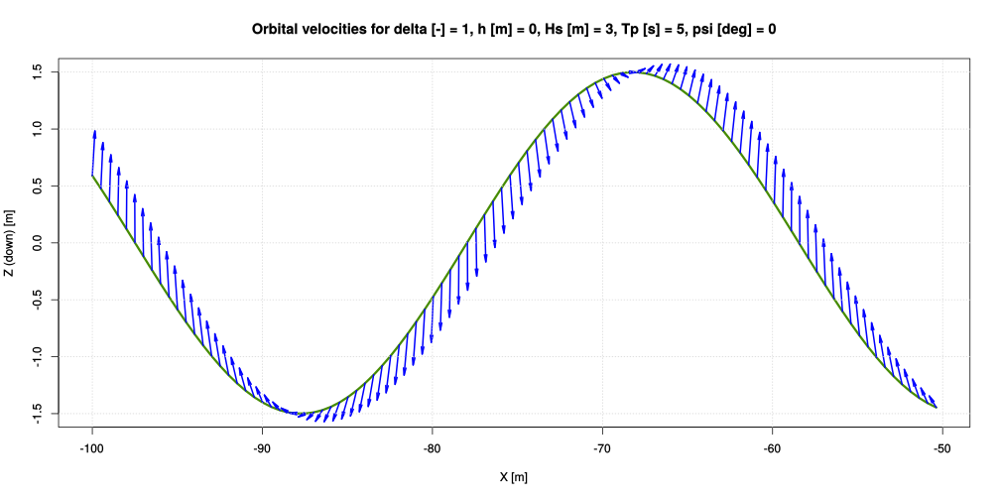
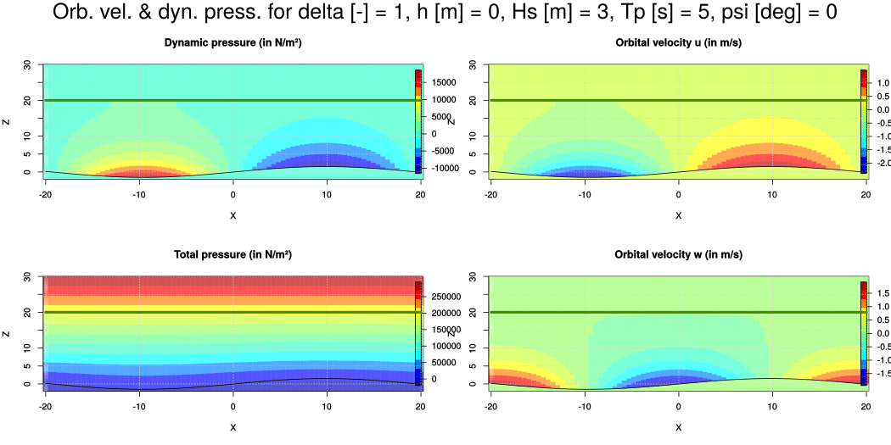
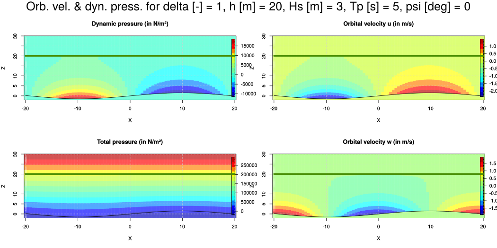
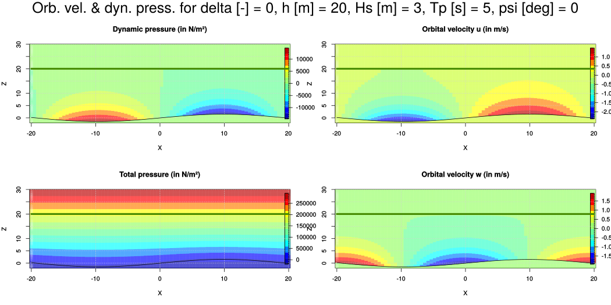

# Modèles d'environnement

Les modèles d'environnement sont les modèles de houle (et, à terme, de vent, de courant...) utilisés par xdyn. Actuellement, seuls des modèles de houle sont implémentés. Leur paramétrisation figure dans la section `environment` du fichier YAML d'entrée. Elle peut être vide (par exemple, lors de la simulation simple du [tutoriel 1](#tutoriel-1-balle-en-chute-libre)).

Les modèles de houle interviennent pour le calcul des [efforts
hydrostatiques non-linéaires](#efforts-hydrostatiques-non-lin%C3%A9aires)
(par le truchement de l'élévation de la surface libre), les [efforts de Froude-Krylov](#calcul-des-efforts-dexcitation)
(par le biais de la pression dynamique), le calcul des efforts de diffraction (via le fréquentiel)
et le modèle de safran (prise en compte des vitesses orbitales).

## Constantes environnementales

L'accélération de la pesanteur (dénotée par `g`), la densité volumique de l'eau
(`rho`) et sa viscosité `nu` sont des constantes qui interviennent dans
plusieurs modèles physiques. Par conséquent, plutôt que d'être renseignées au
niveau de chaque modèle et risquer ainsi des incohérences, elles figurent dans
la section `environmental constants` qui a la forme suivante :

~~~~~~~~~~~~~~ {.yaml}
environmental constants:
    g: {value: 9.81, unit: m/s^2}
    rho: {value: 1025, unit: kg/m^3}
    nu: {value: 1.18e-6, unit: m^2/s}
~~~~~~~~~~~~~~

Ces trois constantes sont l'ensemble de toutes les constantes environnementales
actuellement utilisées par les modèles d'xdyn.

Comme expliqué dans [une section
précédente](#remarques-sur-les-unit%C3%A9s), les
dimensions physiques ne sont pas vérifiées et simplement converties en unités
du système international. Si xdyn rencontre une unité inconnue, il produit un
message d'erreur du type :

~~~~~{.bash}
unknow unit : hhm
~~~~~


## Simulation sans houle

Pour simuler une surface libre parfaitement plane, on opère de la façon
suivante :

~~~~~~~~~~~~~~~~~~~~~~~~~~~~~~~~~~~~~~~~~~ {.yaml}
    environment:
      - model: no waves
        constant sea elevation in NED frame: {value: 0, unit: m}
~~~~~~~~~~~~~~~~~~~~~~~~~~~~~~~~~~~~~~~~~~

`model: no waves` indique que l'on souhaite une surface libre horizontale et
`constant sea elevation in NED frame` représente l'élévation de la surface
libre dans le repère NED.

Dans ce cas, les efforts d'excitation (Froude-Krylov et radiation) seront nuls.

## Houle d'Airy

On peut définir une houle comme étant une somme de plusieurs spectres
directionnels, c'est-à-dire un spectre de puissance et une dispersion spatiale.
Pour dériver l'expression générale d'une houle composée de plusieurs spectres,
on commence par le cas d'une houle monochromatique et monodirectionnelle.

### Expression du potentiel de vitesse de la houle

Soit $`V(x,y,z,t)=(u,v,w)`$ la vitesse du fluide au point de coordonnées $`(x,y,z)`$
(dans le repère NED) et à l'instant $`t`$.

On suppose l'eau non visqueuse, incompressible, homogène et isotrope et l'on
considère un écoulement irrotationnel.
Supposer l'écoulement irrotationnel implique (d'après le lemme
de Poincaré) que la vitesse dérive d'un potentiel que l'on appelle
$`\phi:(x,y,z,t)\mapsto\phi(x,y,z,t)`$. Par définition, la vitesse en tout
point de l'écoulement est donc donnée par :


```math
V(x,y,z,t) = \textrm{grad}{\phi(x,y,z,t)}
```

La pression $`p`$ vérifie l'équation de Bernoulli :

```math
p + \rho g z -\rho\frac{\partial\phi}{\partial t} +
\frac{\rho}{2} V\cdot V = C(t)
```

où $`C:t\mapsto C(t)`$ est une fonction du temps arbitraire, donc l'équation est
en particulier valable pour $`C(t)=p_0`$ (pression atmosphérique à la surface) :

```math
p_0 + \rho g z -\rho\frac{\partial\phi}{\partial t} +
\frac{\rho}{2} V\cdot V = p_0
```

soit

```math
g z -\frac{\partial\phi}{\partial t} + \frac{1}{2} V\cdot V = 0
```

Le terme $`\rho g z`$ représente la pression hydrostatique et le terme
$`-\rho\frac{\partial\phi}{\partial t}`$ est la pression dynamique.

Il s'agit de la première condition de surface libre.

On peut définir la fonction $`F(x,y,z,t)=z-\eta(x,y,t)`$

Pour une particule sur la surface libre, $`F(x,y,z,t)=0`$ ce qui implique que sa
dérivée particulaire est nulle :

```math
\frac{DF}{Dt} = \frac{\partial F}{\partial t} + V\cdot \nabla F = 0
```

soit

$\frac{\partial\eta}{\partial t} + \frac{\phi}{\partial x}\frac{\partial
\eta}{\partial x} + \frac{\phi}{\partial x}\frac{\partial\eta}{\partial y} -
\frac{\partial\phi}{\partial z} = 0$ sur $`z=\eta(x,y,t)`$.

C'est la deuxième condition de surface libre.

En linéarisant ces deux conditions de surface libre, on obtient :

```math
\frac{\partial \eta}{\partial t} = \frac{\partial\phi}{\partial z}
```

```math
g\eta - \frac{\partial\phi}{\partial t} = 0
```

Par ailleurs, l'eau étant supposée incompressible, $`\nabla\cdot V=
\frac{\partial^2\phi}{\partial x^2} + \frac{\partial^2\phi}{\partial y^2} +
\frac{\partial^2\phi}{\partial z^2} = 0`$

Il s'agit d'une équation de Laplace dont la solution s'obtient par la méthode de
séparation des variables. Plusieurs potentiels peuvent être solution. Par exemple :

- $`\phi(x,y,z,t) = -\frac{g\eta_a}{\omega}\frac{\cosh(k\cdot(h-z))}
{\cosh(k\cdot h)}\cos(k\cdot(x\cdot
\cos(\gamma)+ y\cdot \sin(\gamma))-\omega\cdot t+\phi)`$
- $`\phi(x,y,z,t) = \frac{g\eta_a}{\omega}\frac{\cosh(k\cdot(h-z))}
{\cosh(k\cdot h)}\sin(k\cdot(x\cdot
\cos(\gamma)+ y\cdot \sin(\gamma))-\omega\cdot t+\phi)`$

Ici, nous choisissons :

```math
\phi(x,y,z,t) = -\frac{g\eta_a}{\omega}\frac{\cosh(k\cdot(h-z))}
{\cosh(k\cdot h)}\cos(k\cdot(x\cdot
\cos(\gamma)+ y\cdot \sin(\gamma))-\omega\cdot t+\phi)
```

qui est le potentiel utilisé par le logiciel AQUA+.

- $`h`$ est la profondeur du fluide (hauteur du sol à la surface libre),
- $`\eta_a`$ est l'amplitude de la houle (en m),
- $`x,y,z`$ sont les coordonnées du point considéré, exprimées dans le repère NED,
- $`k`$ est le nombre d'onde, traduisant la périodicité spatiale.

### Relation entre le nombre d'onde et la pulsation

Il existe une relation entre $`k`$ et $`\omega`$, appelée relation de dispersion, et qui s'écrit :

```math
\omega^2 = g\cdot k \cdot \tanh(k\cdot h)
```

où $`h`$ désigne la profondeur d'eau et $`g`$ l'accélération de la pesanteur.

En profondeur infinie ($`k\cdot h > 3`$), cette relation tend vers :


```math
\omega^2 \sim g\cdot k
```

### Élévation de la houle

L'élévation de la houle découle de la deuxième condition de surface libre :

$`\eta(x,y,t) = +\frac{1}{g} \frac{\partial\phi(x,y,z=0,t)}{\partial t}
=-\sum_{i=1}^{nfreq} A(\omega_i) \sin(k_i\cdot(x\cdot \cos(\gamma)+
y\cdot \sin(\gamma))-\omega_i\cdot t+\phi_{i})`$

où $`\gamma`$ désigne la direction de provenance de la houle, définie à la section
[convention de houle](#section_Direction_houle).

L'élévation $`\eta`$ de la houle en un point $`(x,y)`$ est un signal temporel
$`\eta(t)`$. Par définition du plan $`z=0`$ (élévation moyenne de la houle), ce signal $`\eta`$ est centré.
On le suppose également stationnaire, ce qui implique que sa fonction d'auto-corrélation $`R`$ ne dépend que de $`\tau`$:

```math
R(\tau)=\mathbf{E} (\eta(t)\eta(t+\tau))
```

La densité spectrale de puissance $`G`$ de $`\eta`$ est égale à la transformée de
Fourier de sa fonction d'auto-corrélation $`R`$. Comme $`R`$ est paire et réelle,
$`G`$ aussi et on ne considère usuellement que la partie positive (one-sided) en
définissant la densité spectrale $`S`$ telle que :

```math
S(\omega)=\left\{\begin{array}{cc}2G(\omega),&\omega\geq 0\\0,&\omega<0\end{array}\right.
```

On a :

```math
R(\tau) = \frac{1}{2}  \sum_{i=1}^{nfreq} A(\omega_i)^2 \cos(\omega_i \tau)
```

or on a également :

```math
R(\tau) = \int_0^\infty S(\omega) \cos(\omega\tau)d\omega
```

d'où, par identification :

```math
A(\omega_i)^2=2 S(\omega_i)d\omega_i
```

On peut généraliser cette formulation en faisant intervenir l'étalement
directionnel $`D(\gamma)`$ de la houle :

```math
A(\omega,\gamma)^2 = 2 S(\omega)d\omega D(\gamma) d\gamma
```

On obtient, en définitive :

```math
\eta(x,y,t) = -\sum_{i=1}^{nfreq} \sqrt{2 S(\omega_i)d\omega D(\gamma) d\gamma} \sin(k_i\cdot(x\cdot \cos(\gamma)+
y\cdot \sin(\gamma))-\omega_i\cdot t+\phi_{i})
```

### Pression dynamique

L'expression de la pression dynamique (champs de pression de la houle
incidente), utilisée par le modèle de
[Froude-Krylov](#calcul-des-efforts-dexcitation), est définie comme
la pression totale moins la pression hydrostatique $`\rho g z`$ et son
expression se déduit de la première condition de surface libre linéarisée :

```math
p_{\textrm{dyn}} = -\rho \frac{\partial \Phi(x,y,z,t)}{\partial t}
```

soit

```math
p_{\textrm{dyn}} = \rho\cdot g
\sum_{i=1}^{nfreq}A(\omega_i,\gamma)
\frac{\cosh(k_i\cdot(h-z))}{\cosh(k_i\cdot h)}\sin(k_i\cdot(x\cdot
\cos(\gamma)+ y\cdot \sin(\gamma))-\omega_i\cdot t+\phi_{i})
```

- $`g`$ désigne l'accélération de la pesanteur (9.81 $`m/s^2`$)
- $`\rho`$ est la densité volumique du fluide (en $`kg/m^3`$)

Lorsque la profondeur $`h`$ est très grande devant $`z`$, les cosinus hyperboliques sont équivalents à des exponentielles :

```math
\mathop {\lim }\limits_{x \to \infty } \cosh x = \frac{{e^x }}{2}
```

on obtient donc :

```math
p_{\textrm{dyn}}\mathop  \approx \limits_{x \to \infty } \rho\cdot g
\sum_{i=1}^{nfreq}A(\omega_i,\gamma)
e^{-k_i\cdot z}\sin(k_i\cdot(x\cdot\cos(\gamma)+ y\cdot
\sin(\gamma))-\omega_i\cdot t+\phi_{i})
```

### Pression totale

On peut démontrer que la pression totale (somme de la pression hydrostatique et de la pression dynamique) est positive.

Le raisonnement s'exprime simplement pour une seule fréquence et une seule direction, mais il est aisément généralisable.

Pour une seule fréquence et une seule direction, on a :

```math
p_{\textrm{tot}} = \rho g z - \rho g \frac{\cosh(k(h-z))}{\cosh(k h)}\eta
```

Sous la surface libre, c'est-à-dire pour $`z>0`$, on a $`h-z<h`$ donc

```math
0<\frac{\cosh(k(h-z))}{\cosh(k h)}\leq 1
```

donc

```math
 \rho g z - \rho g \frac{\cosh(k(h-z))}{\cosh(k h)}\eta \geq \rho g \left(z - \eta\right)
```


or pour le calcul, on considère toujours la partie immergée de la coque donc $`z\geq\eta`$, d'où
```math
p_{\textrm{tot}} \geq 0
```

Au-dessus de la surface libre, on a $`\eta\leq z\leq 0`$ donc $`h-z\geq h`$ et

```math
 \frac{\cosh(k(h-z))}{\cosh(k h)}\geq 1
```

Or

```math
p_{\textrm{tot}} = \rho g \cdot \left(z -  \frac{\cosh(k(h-z))}{\cosh(k h)} \eta\right)\geq \rho g \eta \left(1- \frac{\cosh(k(h-z))}{\cosh(k h)}\right)
```

Comme

```math
1-  \frac{\cosh(k(h-z))}{\cosh(k h)} \leq 0
```

et $`\eta\leq z \leq 0`$ (on est sous l'eau),

```math
\eta \left(1- \frac{\cosh(k(h-z))}{\cosh(k h)}\right)\geq 0
```

et donc

```math
p_{\textrm{tot}}\geq 0
```


### Houle irrégulière

Le potentiel de vitesse de la houle a été jusqu'ici exprimé pour une seule
fréquence et une seule direction.
On peut le généraliser pour plusieurs fréquences et plusieurs directions.

En notant

```math
a_{i,j} = A(\omega_i, \gamma_j) = \sqrt{2 S(\omega_i)d\omega D(\gamma_j)d\gamma}
```

le potentiel de houle irrégulière s'écrit:

```math
\phi(x,y,z,t) = -\sum_{i=1}^{nfreq}\sum_{j=1}^{ndir} a_{i,j} \cdot \frac{g}{\omega_i}\frac{\cosh(k\cdot(h-z))}
{\cosh(k_i\cdot h)}\cos(k_i\cdot(x\cdot
\cos(\gamma_j)+ y\cdot \sin(\gamma_j))-\omega_i\cdot t+\phi_{i,j})
```

On en déduit l'expression de l'élévation $`\eta`$ :

```math
\eta(x,y,t) = \frac{1}{g}\frac{\partial\phi}{\partial t} = -
\sum_{i=1}^{nfreq}\sum_{j=1}^{ndir}
a_{i,j}\sin(k_i\cdot(x\cdot \cos(\gamma_j)
+ y\cdot \sin(\gamma_j))-\omega_i\cdot t+\phi_{i,j})
```

ainsi que l'expression de la pression dynamique $`p_{\textrm{dyn}}`$ :

```math
p_{\textrm{dyn}}(x,y,z,t) = \rho\cdot g
\sum_{i=1}^{nfreq}\sum_{j=1}^{ndir}
a_{i,j}\frac{\cosh(k_i\cdot(h-z))}{\cosh(k_i\cdot h)}\sin(k_i\cdot(x\cdot
\cos(\gamma_j)+ y\cdot \sin(\gamma_j))-\omega_i\cdot t+\phi_{i,j})
```

### Vitesse orbitale

#### En profondeur finie

La vitesse $`V(x,y,z,t) = (u,v,w)`$ orbitale de la houle est définie par :

```math
u = \frac{\partial \phi}{\partial x} = g
\sum_{i=1}^{nfreq}\sum_{j=1}^{ndir}\frac{k_i}{\omega_i}
a_{i,j}
\frac{\cosh(k_i\cdot(h-z))}{\cosh(k_i\cdot h)}\cdot\cos(\gamma_j)
\sin(k_i\cdot(x\cdot \cos(\gamma_j)+ y\cdot \sin(\gamma_j))-\omega_i\cdot t+\phi_{i,j})
```

```math
v = \frac{\partial \phi}{\partial y} = g
\sum_{i=1}^{nfreq}\sum_{j=1}^{ndir}\frac{k_i}{\omega_i}
a_{i,j}
\frac{\cosh(k_i\cdot(h-z))}{\cosh(k_i\cdot h)}\cdot\sin(\gamma_j)
\sin(k_i\cdot(x\cdot \cos(\gamma_j)+ y\cdot \sin(\gamma_j))-\omega_i\cdot t+\phi_{i,j})
```

```math
w = \frac{\partial \phi}{\partial z} = g
\sum_{i=1}^{nfreq}\sum_{j=1}^{ndir}\frac{k_i}{\omega_i}
a_{i,j}
\frac{\sinh(k_i\cdot(h-z))}{\cosh(k_i\cdot h)}
\cos(k_i\cdot(x\cdot \cos(\gamma_j)+ y\cdot \sin(\gamma_j))-\omega_i\cdot t+\phi_{i,j})
```

#### En profondeur infinie

Lorsque $`k_i\cdot h >3`$, les cosinus hyperboliques peuvent être considérés comme
équivalents à des exponentielles (erreur relative inférieure à
$`2.5\times 10^{-3}`$). On peut donc utiliser l'approximation suivante:

```math
u = g
\sum_{i=1}^{nfreq}\sum_{j=1}^{ndir}\frac{k_i}{\omega_i}
a_{i,j}
e^{-k_i z}
\cdot\cos(\gamma_j)
\sin(k\cdot(x\cdot \cos(\gamma_j)+ y\cdot \sin(\gamma_j))-\omega_i\cdot t+\phi_{i,j})
```

```math
v = g
\sum_{i=1}^{nfreq}\sum_{j=1}^{ndir}\frac{k_i}{\omega_i}
a_{i,j}
e^{-k_i z}
\cdot\sin(\gamma_j)
\sin(k\cdot(x\cdot \cos(\gamma_j)+ y\cdot \sin(\gamma_j))-\omega_i\cdot t+\phi_{i,j})
```

```math
w = g
\sum_{i=1}^{nfreq}\sum_{j=1}^{ndir}\frac{k_i}{\omega_i}
a_{i,j}
e^{-k_i z}
\cos(k\cdot(x\cdot \cos(\gamma_j)+ y\cdot \sin(\gamma_j))-\omega_i\cdot t+\phi_{i,j})
```

#### Évolution de la vitesse orbitale sur la surface libre

L'expression de l'élévation de la surface libre contient un terme en sinus.
Les vitesses orbitales en $`u`$ et en $`w`$ contiennent des termes en cosinus et
sont donc déphasées par rapport à l'élévation. La composante $`v`$ de la vitesse
orbitale, en revanche, est en phase avec l'élévation. Le schéma suivant représente
l'élévation de la houle (en vert) avec les vecteurs vitesse orbitale (en bleu)
en plusieurs points de la surface libre dans le plan (X,Z) :



### Paramétrisation des modèles de houle

Les spectres directionnels de houle d'Airy sont paramétrés de la façon suivante :

~~~~~~~~~~~~~~~~~~~~~~~~~~~~~~~~~~~~~~~~~~ {.yaml}
- model: airy
  depth: {value: 100, unit: m}
  seed of the random data generator: 0
  stretching:
     delta: 0
     h: {unit: m, value: 100}
  directional spreading:
     type: dirac
     waves propagating to: {value: 90, unit: deg}
  spectral density:
     type: jonswap
     Hs: {value: 5, unit: m}
     Tp: {value: 15, unit: s}
     gamma: 1.2
~~~~~~~~~~~~~~~~~~~~~~~~~~~~~~~~~~~~~~~~~~

- `model` : actuellement, ne peut valoir qu'`airy`.
- `stretching` : voir le paragraphe ci-dessous.
- `depth` : profondeur (distance entre le fond et la surface). 0 pour
  l'approximation "profondeur infinie". Utilisé pour le calcul du nombre
  d'onde et donc pour le calcul de l'élévation de la surface libre,
  des pressions dynamiques et des vitesses orbitales.
- `seed of the random data generator` : germe utilisé pour la génération des
  phases aléatoires. Si l'on donne `none` comme valeur toutes les phases
  aléatoires seront nulles (utilisé principalement pour les tests).
- `directional spreading` : étalement directionnel. Cf. infra.
- `spectral density` : densité spectrale de puissance. Cf. infra.

## Densités spectrales de puissance

La formulation des spectres de houles a été développée de façon semi-empirique
depuis les années 50. Suivant le spectre, l'état de mer peut être complètement
formé (à la limite, le spectre n'a qu'un seul paramètre) ou une combinaison de
la houle (swell) et de la mer du vent (wind sea) à six paramètres.

Le choix du spectre dépend donc à la fois du lieu considéré et de l'état de
mer. Ce choix revêt une grande importance pour la prévision des mouvements des
plateformes la réponse du navire va varier suivant le type d'état de mer.
Il faut noter que l'on ne peut pas faire varier
l'état de mer au cours d'une même simulation.

### Dirac

La plus simple densité spectrale de puissance est aussi la moins réaliste car elle
correspond à une houle monochromatique, c'est-à-dire à une seule fonction sinusoïdale :

```math
\omega_0\in\mathbb{R}^+,\forall \omega\in\mathbb{R}^+, S(\omega) =
\left\{\begin{array}{l}0, \textrm{si }\omega\neq \omega_0\\1, \textrm{si }
\omega=\omega_0\end{array}\right.
```

$`\omega_0 = 2\pi f`$ est la pulsation (en Rad/s) de la houle.

Le signal temporel correspondant a l'allure suivante :


Le paramétrage de ce spectre est :

~~~~~~~~~~~~~~~~~~~~~~~~~~~~~~~~~~~~~~~~~~ {.yaml}
spectral density:
    type: dirac
    Hs: {value: 5, unit: m}
    omega0: {value: 15, unit: rad/s}
~~~~~~~~~~~~~~~~~~~~~~~~~~~~~~~~~~~~~~~~~~

La hauteur de houle est donnée par `Hs` et sa pulsation par `omega0`.
L'amplitude de la houle sera égale à `Hs/2`.

Ce spectre a essentiellement un intérêt pour l'établissement de fonctions de transfert ou la
comparaison de réponses sur une houle maitrisée mais il n'est pas représentatif de conditions réelles.

### Bretschneider

La fonction analytique la plus souvent utilisée pour représenter des états
de mer partiellement ou totalement développés a été proposée en 1959 par Bretschneider.
Initialement, la dépendance à la période de la houle était mise en exergue
et s'exprimait sous la forme :

```math
S(T)=\alpha\cdot T^3\cdot e^{-\beta T^4}
```

Aujourd'hui, on préfère une formulation fréquentielle :

```math
 S\left(\omega=\frac{2\pi}{T}\right) = \frac{A}{\omega^5}\cdot e^{-\frac{B}{\omega^4}}
```

Le moment d'ordre 0 permet d'obtenir une relation entre $`A`$ et $`B`$ :

```math
m_0 = \int_0^\infty S(\omega) d\omega = \left[-e^{-\frac{B}{\omega^4}}\right]^\infty_0=\frac{A}{4B}
```

d'où

```math
A=4m_0 B
```

Par ailleurs, la dérivée première du spectre s'annule pour une période $`\omega_p`$ :

```math
 \frac{d}{d\omega}S(\omega) = \frac{A}{\omega^6}e^{-\frac{B}{\omega^4}}\left(\frac{4B}{\omega^4}-5\right)
```

d'où

```math
B=\frac{5}{4}\omega_p^4
```

et

```math
\omega_p=\left(\frac{4}{5}B\right)^{1/4}
```

De plus, on constate empiriquement que les hauteurs de houle sont
souvent distribuées suivant une loi de Rayleigh (loi de la norme d'un vecteur dont les
deux composantes suivent une loi normale) de variance $`\sigma^2=4 m_0`$ et, sous
cette hypothèse, la hauteur de houle $`H_S`$ correspondant à deux écarts-types est :

```math
H_S = 2\sigma = 4\sqrt{m_0}
```

En outre, $`\omega_p=\frac{2\pi}{T_p}`$

On peut ainsi exprimer $`A`$ et $`B`$ en fonction de $`H_S`$ et $`T_p`$ :

```math
A=\frac{5\pi^4H_S^2}{T_p^ 4}
```

```math
B=\frac{20\pi^4}{T_p^4}
```

Ce spectre a l'allure suivante :


Sa paramétrisation dans xdyn est réalisée au moyen du YAML suivant :

~~~~~~~~~~~~~~~~~~~~~~~~~~~~~~~~~~~~~~~~~~ {.yaml}
spectral density:
    type: bretschneider
    Hs: {value: 5, unit: m}
    Tp: {value: 15, unit: s}
~~~~~~~~~~~~~~~~~~~~~~~~~~~~~~~~~~~~~~~~~~

### Pierson-Moskowitz

À la fin des années 40, plusieurs navires météorologiques étaient stationnés
dans l'océan Pacifique et l'Atlantique Nord. Ces navires notaient la météo
quotidiennement sous forme d'un code météo. En 1961, Tucker créa une méthode
pour obtenir des estimations quantitatives à partir de ces enregistrements en
corrélant la fréquence d'occurrence des différents codes météo avec les
observations météo de plusieurs stations à terre. En 1964, Willard Pierson et
Lionel Moskowitz à l'université de New York, ont
préparé un rapport pour l'U.S. Naval Oceanographic Office analysant un grand
nombre d'enregistrements en Atlantique Nord. Seuls les enregistrements pour des
mers complètement développées ayant été considérés, c'est un spectre adapté à de
tels états de mer. Il s'écrit sous la forme :

```math
S(\omega) = \frac{\alpha\cdot g^2}{\omega^5} \exp{\left(-\beta\left[\frac{g}{U_{19.5}\omega}\right]^4\right)}
```

où $`\alpha = 8.1\cdot 10^{-3}`$ désigne la constante de Phillips, $`g`$ l'accélération de
la gravité terrestre, $`U_{19.5}`$ la vitesse du vent à 19.5 mètres au-dessus du
niveau de la mer et $`\beta`$ vaut 0.74.

Ce spectre est un cas particulier du spectre de Bretschneider en prenant

```math
A=8.1\cdot 10^{-3}\cdot g^2
```

et

```math
B=0.74\left(\frac{g}{U_{19.5}}\right)^4
```

Par la suite, les données de Pierson et Moskowitz ont été ré-analysées pour
établir la relation empirique suivante entre la vitesse du vent et la pulsation
modale de la houle :

```math
0.74 \left(\frac{g}{U_{19.5}}\right)^4=\frac{5}{4}\omega_0^4
```

d'où

```math
\omega_p=0.877\frac{g}{U_{19.5}}
```

On peut obtenir une expression de la période de pic $`\omega_p`$ uniquement en
fonction de $`H_S`$ en se servant des relations suivantes, établies pour le
spectre de Bretschneider :

- $`m_0=\frac{A}{4B}`$
- $`\omega_p=\left(\frac{4}{5}B\right)^{1/4}`$

En supposant que les hauteurs de houle suivent une distribution de Rayleigh, on a:

```math
H_S=4\sqrt{m_0}=4\sqrt{\frac{A}{4B}}
```

d'où

```math
B=\frac{4 A}{H_S^2}
```

```math
\omega_p=\left(\frac{4}{5}B\right)^{1/4}=\left(\frac{4A}{5H_S^2}\right)^{1/4}=\left(\frac{16}{5}\cdot 8.1\cdot 10^{-3}\right)^{1/4}\sqrt{\frac{g}{H_S}}
```

soit

```math
\omega_p=0.4\sqrt{\frac{g}{H_S}}
```

Ce spectre était le spectre de référence pendant de nombreuses années mais
il n'est valable que pour des états de mer complètement développés et des mers
résultants de vents modérés sur des fetchs très grands. Pour les conditions plus
fréquentes de vents forts sur des fetchs courts, notamment en mer du Nord, des
spectres à au moins deux paramètres sont plus adaptés.

Ce spectre a l'allure suivante :


Sa paramétrisation dans xdyn est réalisée au moyen du YAML suivant :

~~~~~~~~~~~~~~~~~~~~~~~~~~~~~~~~~~~~~~~~~~ {.yaml}
spectral density:
    type: pierson-moskowitz
    Hs: {value: 5, unit: m}
    Tp: {value: 15, unit: s}
~~~~~~~~~~~~~~~~~~~~~~~~~~~~~~~~~~~~~~~~~~

### JONSWAP

Le spectre JONSWAP (Joint North Sea Wave Project) a été proposé en
1973 par Hasselmann et al. après avoir dépouillé des mesures faites lors
de la formation de tempêtes en Mer du Nord. Plus de 2000 spectres ont ainsi été
mesurés et une méthode des moindres carrés a été utilisée pour obtenir une
formulation spectrale. Il est valable pour des fetchs limités et des vitesses de vent uniformes.
L'importance de ce spectre vient de ce qu'il prend en compte le développement
des vagues sur un fetch limité d'une part, et, d'autre part, l'atténuation des
vagues par petits fonds. Ce spectre est souvent utilisé par l'industrie
offshore en mer du Nord.

```math
S(\omega)=(1-0.287 \log(\gamma))\frac{5}{16}\frac{\alpha}{\omega}H_S^2 e^{-1.25\left(\frac{\omega_0}{\omega}\right)^4}\gamma^r
```

avec

```math
r=e^{-0.5\left(\frac{\omega-\omega_0}{\sigma\omega_0}\right)^2}
```

et

```math
\sigma=\left\{\begin{array}{l}0.07,\omega\leq\omega_0\\0.09,\omega>\omega_0\end{array}\right.
```

Ce spectre a l'allure suivante :


Sa paramétrisation dans xdyn est réalisée au moyen du YAML suivant :

~~~~~~~~~~~~~~~~~~~~~~~~~~~~~~~~~~~~~~~~~~ {.yaml}
spectral density:
    type: jonswap
    Hs: {value: 5, unit: m}
    Tp: {value: 15, unit: s}
    gamma: 1.2
~~~~~~~~~~~~~~~~~~~~~~~~~~~~~~~~~~~~~~~~~~

## Étalements directionnels

### Dirac

Lorsque cet étalement est choisi, la houle est mono-directionnelle.

~~~~~~~~~~~~~~~~~~~~~~~~~~~~~~~~~~~~~~~~~~ {.yaml}
directional spreading:
    type: dirac
    waves propagating to: {value: 90, unit: deg}
~~~~~~~~~~~~~~~~~~~~~~~~~~~~~~~~~~~~~~~~~~

La direction de propagation est donnée par `waves propagating to`, dans le
repère NED (0° correspond à des vagues se propageant du Sud vers le Nord, 45° à
des vagues se propageant du Sud-Ouest au Nord-Est, -90° à des vagues se
propageant de l'Est vers l'Ouest). Il n'y a pas de bornes particulières pour
cette angle (outre la taille maximale des flottants).

### Cos2s

L'étalement est donné par :

```math
\gamma\mapsto \cos^{2s}\left({\gamma-\gamma_0}\right)
```

où $`\gamma_0`$ est la direction de propagation, dans le
repère NED (0° correspond à des vagues se propageant du Sud vers le Nord, 45° à
des vagues se propageant du Sud-Ouest au Nord-Est, -90° à des vagues se
propageant de l'Est vers l'Ouest). Il n'y a pas de bornes particulières pour
cet angle (outre la taille maximale des flottants).

Cet étalement est paramétré de la façon suivante :

~~~~~~~~~~~~~~~~~~~~~~~~~~~~~~~~~~~~~~~~~~ {.yaml}
directional spreading:
    type: cos2s
    s: 2
    waves propagating to: {value: 90, unit: deg}
~~~~~~~~~~~~~~~~~~~~~~~~~~~~~~~~~~~~~~~~~~

La direction de propagation $`\gamma_0`$ est donnée par `waves propagating to`.

## Stretching de la houle

### Description

La formulation d'Airy n'est pas valable au-dessus du plan $`z=0`$. Cela signifie
que l'on ne peut pas l'utiliser dans une formulation non-linéaire où l'on
cherche à connaître les pressions dynamiques et les vitesses orbitales pour
$`z<0`$. Les modèles de stretching sont une solution de contournement qui consiste à
prendre comme référence non pas le plan $`z=0`$ mais la surface libre déformée.

### Utilisation dans xdyn

Pour mémoire, la paramétrisation du modèle de houle est effectuée par un YAML du type :

~~~~~~~~~~~~~~~~~~~~~~~~~~~~~~~~~~~~~~~~~~ {.yaml}
- model: airy
  depth: {value: 100, unit: m}
  seed of the random data generator: 0
  stretching:
     delta: 0
     h: {unit: m, value: 100}
  directional spreading:
     type: dirac
     waves propagating to: {value: 90, unit: deg}
  spectral density:
     type: jonswap
     Hs: {value: 5, unit: m}
     Tp: {value: 15, unit: s}
     gamma: 1.2
~~~~~~~~~~~~~~~~~~~~~~~~~~~~~~~~~~~~~~~~~~

Dans xdyn, le stretching est renseigné dans la section `stretching` des modèles de houle.
Le seul modèle de stretching implémenté est le [delta-stretching](#delta-stretching) et ses dérivés (absence de stretching, extrapolation linéaire et modèle de Wheeler).
La section `stretching` contient les paramètres `h` et `delta` du modèle de
delta-stretching:

- absence de stretching : possible si l'on est sur une modélisation linéaire.
  Renseigner `h: {value: 0, unit: m}` et `delta: 1`.
  Non-recommandé dès lors qu'on utilise des modèles faisant appel aux vitesses orbitales (pour des raisons évoquées ci-après),
- [extrapolation linéaire](#stretching-par-extrapolation-lin%C3%A9aire), en fixant $`h`$ à la profondeur d'eau `depth` et $`\Delta=1`$,
- [modèle de Wheeler](#stretching-de-wheeler), si $`h`$ vaut la profondeur `depth` et $`\Delta=0`$,
- [delta stretching](#delta-stretching) pour toute autre valeur.

### Justifications théoriques

Sous les hypothèses du modèle de [houle irrégulière linéaire](#houle-irr%C3%A9guli%C3%A8re) détaillées ci-dessus, la vitesse
orbitale des particules d'eau par rapport au référentiel NED (projetée sur l'axe
$`X`$ du repère BODY) s'écrit :

```math
u = g
\sum_{i=1}^{nfreq}\sum_{j=1}^{ndir}\frac{k_i}{\omega_i}
a_{i,j}
\frac{\cosh(k\cdot(h-z))}{\cosh(k\cdot h)}\cdot\cos(\gamma_j)
\sin(k\cdot(x\cdot \cos(\gamma_j)+ y\cdot \sin(\gamma_j))-\omega_i\cdot t+\phi_{i,j})
```

qui, en profondeur infinie, s'écrit :

```math
u = g
\sum_{i=1}^{nfreq}\sum_{j=1}^{ndir}\frac{k_i}{\omega_i}
a_{i,j}
e^{-k_i z}
\cdot\cos(\gamma_j)
\sin(k\cdot(x\cdot \cos(\gamma_j)+ y\cdot \sin(\gamma_j))-\omega_i\cdot t+\phi_{i,j})
```

Cette expression est basée sur la théorie linéaire, qui suppose *a priori* la surface
libre plane, y compris pour le calcul de la déformation de surface libre, qui est
une grandeur comme les autres (pressions, vitesses, potentiel), résultat de la
résolution du problème.

La formulation mathématique du problème qui conduit aux expressions ci-dessus
n'est pas valable pour les z>0 (linéarisation de la condition de surface
libre).  Une difficulté survient quand on veut exploiter cette formule dans une
modélisation non-linéaire, c'est-à-à dire en modélisant réellement la
déformation de la  surface libre. En effet, la valeur du terme $`e^{-k_i z}`$
est inférieure à 1 pour les points en-dessous du niveau moyen (surface
$`z=0`$), mais elle croît rapidement pour les points situés au-dessus de ce
plan , et ce d'autant plus que le nombre d'onde $`k`$ est grand, tandis qu'elle
décroît en-dessous du niveau moyen de la mer. Ainsi, pour deux points proches
sur la surface libre (non-horizontale) l'un à $`z>0`$ et l'autre à $`z<0`$, la
vitesse orbitale sera très différente : les contributions des composantes haute
fréquence de la houle seront fortement amplifiées pour le point à $`z>0`$ et
fortement atténuées pour le point à $`z<0`$. Les particules au-dessus du niveau
moyen de la mer (notamment sur la crête des vagues) seront ainsi vues comme
oscillant à des fréquences élevées tandis que celles dans le creux des vagues
oscilleront plus lentement : le niveau moyen de la mer agit donc comme une
frontière entre l'amplification et l'atténuation des hautes fréquences, ce qui
n'est pas physique (mais cohérent avec la modélisation linéarisée initiale).

Les grandeurs linéaires ne sont donc pas définies dans les zones déformées. Pour
pallier cet inconvénient, on peut utiliser des modèles dits de "stretching", qui
permettent de recaler les vitesses orbitales à l'interface eau-air (le sommet ou
le creux des vagues) d'une des façons décrites ci-dessous. Certaines de ces
méthodes reviennent à étirer l'axe $`z`$ (d'où le nom de stretching).
Ce qui suit est une présentation non-exhaustive de quelques modèles de
stretching (extrapolation linéaire, modèle de Wheeler et delta-stretching).

#### Stretching linéaire sans extrapolation

Outre l'absence de stretching, le modèle le plus simple revient à bloquer la
vitesse orbitale au-dessus du niveau de la mer $`z=0`$ :

```math
\forall z\leq 0, u(x,y,z,t) = u(x,y,0,t)
```

On obtient ainsi une rupture du profil de vitesse
peu physique. Ce modèle n'est pas implémenté dans xdyn.

#### Stretching par extrapolation linéaire

Ce modèle revient à prolonger le modèle de vitesse par une tangente :

```math
u(x,y,z,t) \sim u(x,y,0,t) - z\cdot \frac{\partial u}{\partial z} (x,y,0,t)
```

Ce modèle peut être utilisé dans xdyn en fixant `h` à la profondeur d'eau
`depth` et `delta: 1`.

#### Stretching de Wheeler


La vitesse orbitale s'écrit :

```math
u = g
\sum_{i=1}^{nfreq}\sum_{j=1}^{ndir}\frac{k_i}{\omega_i}
a_{i,j}
f(z)
\cdot\cos(\gamma_j)
\sin(k\cdot(x\cdot \cos(\gamma_j)+ y\cdot \sin(\gamma_j))-\omega_i\cdot t+\phi_{i,j})
```

avec

```math
f(z)=\frac{\cosh(k\cdot(h-z))}{\cosh(k\cdot h)}
```


On souhaite après stretching retrouver les valeurs de vitesse orbitales données par $`f`$ à la surface (en $`z=\eta`$xi, $`\eta`$ désignant la hauteur d'eau donnée par le
modèle de houle) et au fond (en $`z=h`$):

On cherche donc une fonction $`g`$ telle que :

```math
g(z=\eta)=f(0)
```

```math
g(z=h)=f(h)
```

On peut construire une telle fonction en prenant

```math
g(z) = f(z'(z))
```

avec $`z'(\eta)=0`$ et $`z'(h)=h`$.

On peut par exemple choisir une fonction $`z\mapsto z'`$ linéaire :

```math
z'(z)=\frac{h}{h-\eta}(z-\eta)
```

ce qui donne le profil de vitesse (projetée ici sur l'axe $`X`$ du repère body) :

```math
u = g
\sum_{i=1}^{nfreq}\sum_{j=1}^{ndir}\frac{k_i}{\omega_i}
a_{i,j}
\frac{\cosh\left(k\cdot h\frac{h-z}{h-\eta(x,y,t)}\right)}{\cosh(k\cdot h)}
\cdot\cos(\gamma_j)
\sin(k\cdot(x\cdot \cos(\gamma_j)+ y\cdot \sin(\gamma_j))-\omega_i\cdot t+\phi_{i,j})
```

La vitesse orbitale sur les autres axes est donnée par des formules similaires.

Dans ce modèle, la masse n'est pas conservée car le laplacien du potentiel de
vitesse n'est pas nul. Il n'y a donc pas de justification théorique à ce modèle
de stretching. Son utilisation découle plus de son intérêt pratique : on
constate expérimentalement que les vitesses orbitales calculées sans stretching
sont plus loin des résultats expérimentaux que celles calculées avec
stretching.

Dans le cas du modèle de Wheeler, des campagnes d'essais montrent que les
vitesses orbitales calculées dans les crêtes sont quelque peu sous-estimées par
rapport aux mesures.

Ce modèle étant une forme particulière du modèle de delta-stretching, on peut
l'utiliser dans xdyn en fixant $`h`$ à la profondeur de l'eau `depth` et
`delta: 0`.

#### Stretching de Chakrabarti

Dans ce modèle, on n'agit que sur la profondeur d'eau au dénominateur de la
fonction $`f`$

```math
f(z)=\frac{\cosh(k\cdot(h-z))}{\cosh(k\cdot h)}
```

On remplace $`\cosh(k\cdot h)`$ par $`\cosh(k\cdot (h+\eta(x,y,t)))`$.
Sur l'axe $`X`$ du repère body, par exemple, on obtient ainsi le profil :

```math
u = g
\sum_{i=1}^{nfreq}\sum_{j=1}^{ndir}\frac{k_i}{\omega_i}
a_{i,j}
\frac{\cosh(k\cdot(h-z))}{\cosh(k\cdot (h+\eta(x,y,t)))}
\cdot\cos(\gamma_j)
\sin(k\cdot(x\cdot \cos(\gamma_j)+ y\cdot \sin(\gamma_j))-\omega_i\cdot t+\phi_{i,j})
```

La vitesse sur les autres axes est donnée par des formules similaires.

On constate expérimentalement que, tout comme le modèle de Wheeler, le modèle
de Chakrabarti sous-estime les vitesses orbitales dans les crêtes.

Ce modèle n'étant pas un dérivé du modèle de delta-stretching, il n'est pas
accessible dans xdyn.

#### Delta-stretching

Il s'agit d'une généralisation du modèle de Wheeler qui permet de passer
continument de ce dernier au modèle d'extrapolation linéaire. En jouant sur ses
paramètres, on peut retrouver trois modèles de stretching (pas de stretching,
extrapolation linéaire et modèle de Wheeler) et c'est pour cela qu'il a été
choisi comme modèle de référence dans xdyn.

Tout comme le modèle de Wheeler, on souhaite retrouver la vitesse orbitale à la
surface au creux et à la crête des vagues, c'est-à-dire en $`z=\eta`$. Les auteurs
de ce modèle, Rodenbusch et Forristal, ajoutent deux paramètres au modèle de
Wheeler :

- Un paramètre $`h_{\Delta}`$ qui contrôle la hauteur d'eau sur laquelle est
  effectuée le stretching
- Un paramètre $`\Delta`$ entre 0 et 1 (0 pour le modèle de Wheeler, 1 pour
  l'extrapolation linéaire)

$`z'`$ varie de $`h_{\Delta}`$ à $`\Delta\eta`$ lorsque $`z`$ varie de $`h_{\Delta}`$ à $`\eta`$.

On prend donc :

- Pour $`z>h_{\Delta}`$, $`z'=z`$
- Pour $`z<h_{\Delta}`$, $`z' =(z-h_{\Delta})\frac{\Delta\eta-h_{\Delta}}{\eta-h_{\Delta}}+h_{\Delta}`$

- Pour $`h_{\Delta}=0`$ et $`\Delta=1`$, il n'y a pas de stretching.
- Si $`h_{\Delta}`$ vaut la profondeur `depth` et $`\Delta=0`$, on retrouve le
  modèle de Wheeler.
- Avec $`h_{\Delta}`$ valant `depth` et $`\Delta=1`$ on obtient l'extrapolation
  linéaire.


#### Choix du modèle de stretching

Comme les modèles de stretching n'ont pas vraiment de justification théorique,
la seule manière de les choisir est de comparer directement avec les profils de
vitesse mesurés. Les campagnes
d'essai réalisées jusqu'à présent n'ont pas permis de choisir de façon
catégorique un modèle de stretching plutôt qu'un autre. Ceci vient à la fois de
la difficulté de réaliser l'expérimentation en conditions contrôlées et
d'obtenir une mesure fiable, mais aussi de l'importance des phénomènes
non-linéaires, absents des modèles de stretching.

Les trois graphes ci-dessous montrent l'influence du modèle de stretching sur la
pression dynamique (et montrent aussi qu'il n'est pas pris en compte dans le
calcul de la vitesse orbitale).

##### Sans stretching



##### Extrapolation linéaire



##### Stretching de Wheeler




## Discrétisation des spectres et des étalements

Les étalements et les spectres présentés précédemment sont continus. Afin d'en
réaliser l'implémentation informatique, il faut les discrétiser. Si l'on
répartit uniformément les pulsations sur un intervalle, on introduit une
périodicité temporelle de la houle (cela revient en effet à effectuer une
transformée de Fourier inverse, qui donne par construction un résultat
périodique). Afin d'être plus représentatif des états de mers réels, on peut
souhaiter rompre cette périodicité en discrétisant les pulsations de manière
aléatoire. On obtient ainsi un signal apériodique.

La performance de l'implémentation des modèles de houle est cruciale : en
effet, la pression dynamique et la pression statique étant intégrées sur toutes
les facettes du maillage (dans le cas d'un modèle non-linéaire), ces modèles sont évalués de nombreuses fois par pas
de calcul. Comme le nombre de composantes sommées pour calculer les élévations
et pressions dynamiques est potentiellement important, on ne sélectionne
que les produits $`S(\omega_i)D(\gamma_j)`$ contribuant de manière significative
à l'énergie totale.
Pour ce faire, on classe ces produits par ordre décroissant et l'on sélectionne
les $`n`$ premiers de façon à ce que leur somme représente une fraction
prédéterminée de la puissance totale. De cette manière, on réduit
considérablement les temps de calcul, tout en gardant une bonne représentativité
de la physique du problème. Cependant, cette technique n'est pas toujours
applicable, suivant la réponse à laquelle on s'intéresse. En effet, un petit
corps dans la houle peut avoir une réponse très affectée par les composantes
peu énergétiques (en relatif), par exemple pour des problèmes de mouille ou
d'impact. De même, les réponses locales d'un grand corps (slamming, efforts sur
des appendices, etc.), peuvent être affectées par des composantes peu
énergétiques.


La discrétisation est paramétrée de la façon suivante :

~~~~~~~~~~~~~~~~~~~~~~~~~~~~~~~~~~~~~~~~~~ {.yaml}
discretization:
    n: 128
    omega min: {value: 0.1, unit: rad/s}
    omega max: {value: 6, unit: rad/s}
    energy fraction: 0.999
~~~~~~~~~~~~~~~~~~~~~~~~~~~~~~~~~~~~~~~~~~

- `n` : nombre de points (nombre de fréquences ou nombre de directions)
- `omega min` : pulsation minimale (incluse)
- `omega max` : pulsation maximale (incluse)
- `energy fraction` : les produits de spectre de puissance et d'étalement
directionnel $`S_i\cdot D_j`$ sont classés par ordre décroissant. On calcule la
somme cumulative et l'on s'arrête lorsque l'énergie accumulée vaut `energy
fraction` de l'énergie totale.

## Sorties

On peut sortir les hauteurs de houle calculées sur un maillage (défini dans un
repère fixe ou mobile). En fait, on peut même choisir de ne faire qu'une
simulation de houle, sans corps, tel que décrit dans le
[tutoriel 3](#tutoriel-3-g%C3%A9n%C3%A9ration-de-houle-sur-un-maillage).

On définit un maillage (cartésien) sur lequel sera calculée la houle (dans la
section `environment/model/output`). Par exemple :

~~~~~~~~~~~~~~~~~~~~~~~~~~~~~~~~~~~~~~~~~~ {.yaml}
output:
    frame of reference: NED
    mesh:
        xmin: {value: 1, unit: m}
        xmax: {value: 5, unit: m}
        nx: 5
        ymin: {value: 1, unit: m}
        ymax: {value: 2, unit: m}
        ny: 2
~~~~~~~~~~~~~~~~~~~~~~~~~~~~~~~~~~~~~~~~~~

- `frame of reference` : nom du repère dans lequel sont exprimées les
  coordonnées des points du maillage.
- `xmin`, `xmax`, `nx` : définition de la discrétisation de l'axe x. Les
  valeurs vont de `xmin` (inclus) à `xmax` (inclus) et il y a `nx` valeurs au
  total.
- `ymin`, `ymax`, `ny` : comme pour x.

Dans l'exemple précédent, les coordonnées sont données dans le repère NED. Le
maillage comporte 10 points :
(1,1),(1,2),(2,1),(2,2),(3,1),(3,2),(4,1),(4,2),(5,1),(5,2).

Les sorties sont écrites dans le fichier et le format spécifiés dans la
section [`output`](#sorties) déjà définie à la racine du fichier YAML.


On obtient deux résultats différents, suivant que le repère dans lequel ils
sont exprimés est mobile ou fixe par rapport au repère NED. En effet, si le
repère est fixe, il est inutile de répéter les coordonnées `x` et `y`.

Dans le cas d'un repère fixe, on obtient une sortie de la forme :

~~~~~~~~~~~~~~~~~~~~~~~~~~~~~~~~~~~~~~~~~~ {.yaml}
waves:
  x: [1,2,3,4,5,1,2,3,4,5]
  y: [1,1,1,1,1,2,2,2,2,2]
  timesteps:
    - t: 0
    - z: [-4.60386,-4.60388,-4.6039,-4.60392,-4.60393,-4.6553,-4.65531,-4.65533,-4.65535,-4.65537]
    - t: 1
    - z: [-3.60794,-3.60793,-3.60793,-3.60792,-3.60791,-3.68851,-3.6885,-3.6885,-3.68849,-3.68849]
~~~~~~~~~~~~~~~~~~~~~~~~~~~~~~~~~~~~~~~~~~

`x` et `y` désignent les coordonnées (exprimées en mètres) dans le repère choisi
(ici il s'agit du NED) des points du maillage.
`t` désigne l'instant auquel les hauteurs de houle ont été calculées.
`z` est la hauteur de houle, c'est-à-dire la distance entre un point de
coordonnées (x,y,0) et le même point situé sur la surface libre. Une valeur
positive dénote une houle en-dessous de z=0 (creux) et une valeur négative une
valeur au-dessus de z=0 (bosse).

Si le repère de sortie est mobile, on obtient plutôt un résultat de la forme :

~~~~~~~~~~~~~~~~~~~~~~~~~~~~~~~~~~~~~~~~~~ {.yaml}
waves:
  timesteps:
    - t: 0
      x: [1,2,3,4,5,1,2,3,4,5]
      y: [1,1,1,1,1,2,2,2,2,2]
    - z: [-4.60386,-4.60388,-4.6039,-4.60392,-4.60393,-4.6553,-4.65531,-4.65533,-4.65535,-4.65537]
    - t: 1
      x: [2,4,5,6,7,2,4,5,6,7]
      y: [1,1,1,1,1,2,2,2,2,2]
    - z: [-3.60794,-3.60793,-3.60793,-3.60792,-3.60791,-3.68851,-3.6885,-3.6885,-3.68849,-3.68849]
~~~~~~~~~~~~~~~~~~~~~~~~~~~~~~~~~~~~~~~~~~

## Utilisation d'un modèle de houle distant

xdyn permet d'utiliser des modèles de houle sur un serveur distant. L'intérêt
est que l'on peut ainsi mettre en oeuvre des modèles de houle qui ne sont pas
implémentés dans le code d'xdyn. Ces modèles peuvent être implémentés dans le
langage informatique que l'on souhaite (Python, Java, Go...) et utilisables
comme les modèles de houle "internes" de xdyn.

### Technologie utilisée

La technologie utilisée pour ce faire s'appelle "[gRPC](https://grpc.io/)" et
permet de définir rapidement des services en C++, Java, Python, Ruby, Node.js,
C#, Go, PHP ou Objective-C. Le code d'interfaçage est généré automatiquement
pour des clients écrits dans chacun de ces langages (dans le cas d'xdyn, du
C++). On obtient ainsi :

- Une définition d'interface unique et validée par un compilateur
- Des interfaces client/serveur générées (aucun risque d'erreur sur ce point)
- Une interopérabilité entre des systèmes écrits dans des langages différents
- Un protocole de communication rapide.

Ainsi, les modèles de houle externes qui respectent cette interface peuvent être
utilisés, outre par xdyn, par des applications clientes écrites
en Python, en C++, en Java... Par exemple, on pourrait implémenter un modèle
de capteur de houle en Java en utilisant un modèle de houle externe écrit,
mettons, en Python.

### Interface pour les modèles de houle

Le fichier de définition de l'interface des modèles de houle est disponible à
l'adresse suivante :

[https://gitlab.sirehna.com/sirehna/waves_gRPC/-/blob/master/wave_grpc.proto](https://gitlab.sirehna.com/sirehna/waves_gRPC/-/blob/master/wave_grpc.proto)

Ce fichier est nécessaire si l'on souhaite implémenter un modèle de houle distant
(un serveur de houle) appelable par xdyn, mais il n'est pas nécessaire pour
utiliser depuis xdyn un modèle de houle existant satisfaisant cette interface.

### Paramétrage dans xdyn

Un modèle sans paramètre tournant sur un serveur accessible à l'adresse
http://localhost:50001 est paramétré comme suit :

~~~~~~~~~~~~~~~~~~~~~~~~~~~~~~~~~~~~~~~~~~ {.yaml}
- model: grpc
  url: http://localhost:50001
~~~~~~~~~~~~~~~~~~~~~~~~~~~~~~~~~~~~~~~~~~

Si le modèle de houle contient des paramètres, ceux-ci doivent figurer à la suite
dans le fichier YAML d'xdyn et ils sont transmis directement au serveur sans être
interprêtés par xdyn. Par exemple, un modèle d'Airy unidirectionnel avec un spectre
de JONSWAP pourrait être paramétré de la façon suivante :

~~~~~~~~~~~~~~~~~~~~~~~~~~~~~~~~~~~~~~~~~~ {.yaml}
- model: grpc
  url: http://localhost:50001
  Hs: 5
  Tp: 15
  gamma: 1.2
  seed of the random data generator: 0
  waves propagating to: 90
~~~~~~~~~~~~~~~~~~~~~~~~~~~~~~~~~~~~~~~~~~

### Exemple d'utilisation

Le [tutoriel 9](#tutoriel-9-utilisation-dun-modèle-de-houle-distant) détaille
la mise en oeuvre de la simulation.


## Références
- *Environmental Conditions and Environmental Loads*, April 2014, DNV-RP-C205, Det Norske Veritas AS, page 47
- *Hydrodynamique des Structures Offshore*, 2002, Bernard Molin, Editions TECHNIP, ISBN 2-7108-0815-3, page 70, 78 pour le stretching
- *Sea Loads on Ships And Offshore Structures*, 1990, O. M. Faltinsen, Cambridge Ocean Technology Series, ISBN 0-521-37285-2, pages 27
- *Seakeeping: Ship Behaviour in Rough Weather*, 1989, A. R. J. M. Lloyd, Ellis Horwood Series in Marine Technology, ISBN 0-7458-0230-3, page 75
- *Offshore Hydromechanics*, 2001, J.M.J. Journée and W.W. Massie, Delft University of Technology, sections 6-20 and 7-11
- *Les états de mer naturels*, 2003, Jean Bougis, Institut des Sciences de l'Ingénieur de Toulon et du Var, Université de Toulon et du Var, pages 07-4/14
- *Sea spectra revisited*, 1999, Walter H. Michel, Marine Technology Vol. 36 No. 4, Winter 1999, pp. 211-227
- *Air-Sea Interaction: Instruments and Methods*, F. Dobson, L. Hasse, R. Davis, p. 524
- *Proposed Spectral Form for Fully Developed Wind Seas Based on the Similarity Theory of S. A. Kitaigorodskii*, Pierson, Willard J., Jr. and Moskowitz, Lionel A., Journal of Geophysical Research, Vol. 69, 1964, p.5181-5190
- http://web.mit.edu/13.42/www/handouts/reading-wavespectra.pdf
- *A Fourier approximation method for steady waves*, 1981, Rienecker, M.M. and Fenton, J.D., Journal of Fluid Mechanics
- *A new numerical method for surface hydrodynamics*, 1987, West, B.J. and Brueckner, R.S and Janda, M. and Milder, M. and Milton R.L, Journal of Geophysics Research
