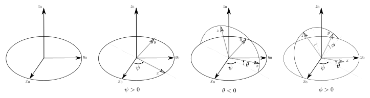
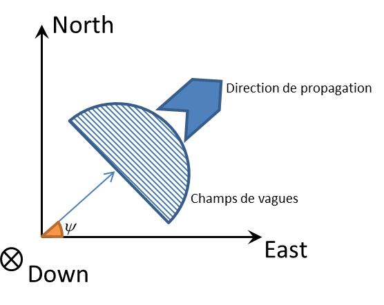
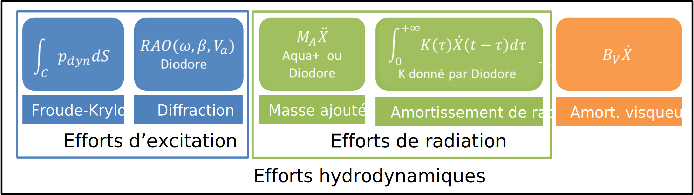

# Repères et conventions

## Repères

Afin de connaître et décrire l'attitude d'un ou plusieurs corps dans l'espace,
il est nécessaire de les placer par rapport à un repère de référence.

### Repère de référence

Le repère `NED` (North-East-Down) est utilisé comme repère de référence,
avec un point de référence $O$ et une base pointant les directions Nord-Est-Bas.
Il sert à exprimer les déplacements des corps de la simulation.

### Repère navire (mobile ou "body")

Le repère navire correspond au repère attaché au navire lors de la simulation.
Le point de référence de ce repère correspond généralement au centre de carène
du navire.
Les axes du repère navire sont les suivants
- $X$ vers l'avant
- $Y$ sur tribord
- $Z$ vers le bas

### Attitude navire

L'attitude d'un corps permet de connaître sa position et son orientation par
rapport à un repère. La position est donnée par le triplet $\left(X,Y,Z\right)$
et l'orientation par un triplet de trois angles $\left(\phi,\theta,\psi\right)$.
Cette dernière peut être exprimée de manière différente notamment avec des
quaternions.

## Conventions d'orientations

Cette section présente les notations utilisées pour définir l'orientation
d'un élément dans l'espace à partir d'un triplet de trois angles.

### Convention par défaut

Si on souhaite utiliser classiquement la convention des angles aéronautiques
exprimée par le triplet (Roulis, Tangage, Lacet) alors on utilisera
les entrées suivantes. Si on souhaite paramétrer cette convention, il
est conseillé de lire la section complète.

### Définition d'une orientation

Pour définir la composition de rotations donnant l'orientation
d'un élément dans l'espace à partir
d'un triplet de trois angles $\left(\phi,\theta,\psi\right)$,
plusieurs éléments doivent être définis:

- une convention d'angles ou d'axes. Elle permet de définir
  si ce sont les angles ou les axes qui évoluent pour la
  notation utilisée.
- une composition des rotations interne ou externe. Elle définit
  si la composition des rotations s'effectue par rapport à un
  système d'axes fixes ou alors par rapport au système d'axes
  nouvellement modifiés.
- un ordre dans lequel est appliqué les rotations.
  Il permet de définir complètement la composition de rotations.

### Enumération des conventions possibles

Si on choisit une convention d'angles, alors chaque angle du triplet définit
respectivement une rotation autour d'un axe $X$, $Y$ ou $Z$.
Les axes ne peuvent être répétés.
Il est possible de définir 6 conventions d'angles, qui correspondent à
la permutation des trois axes: $XYZ$ ,$XZY$ ,$YXZ$ ,$YZX$ ,$ZXY$ ,$ZYX$.
Par exemple la rotation $R_{YZX}$ appliquée au triplet
$\left(\phi,\theta,\psi\right)$ s'interprétera comme une rotation de
$R_{Y}\left(\theta\right)$, suivie de la rotation $R_{Z}\left(\psi\right)$,
et terminée par la rotation $R_{X}\left(\phi\right)$.

Si on choisit une convention d'axes, alors on modifie l'ordre des axes
sur lesquels appliquer successivement les rotations.
Des répétitions des axes sont alors possibles, si elles ne se suivent pas.
Par exemple, $XYX$ sera valide, mais pas $XXY$.
Par exemple, une convention ZXY définit une composition de rotations
Il est possible de définir 12 conventions d'axes:
$XYX$, $XYZ$, $XZX$, $XZY$, $YXY$, $YXZ$,
$YZX$, $YZY$, $ZXY$, $ZXZ$, $ZYX$, $ZYZ$.
Par exemple la rotation $R_{YZX}$ appliquée au triplet
$\left(\phi,\theta,\psi\right)$ s'interprétera comme une rotation de
$R_{Y}\left(\phi\right)$, suivie de la rotation $R_{Z}\left(\theta\right)$, et
terminée par la rotation $R_{X}\left(\psi\right)$.

Avec ces conventions d'angles et d'axes, il existe déjà 18 combinaisons.
Ce nombre est doublé du fait que la composition de rotations peut être interne
(intrinsic) ou externe(extrinsic).
Si les rotations sont composées par rapport au repère fixe, on parle de
composition externe. Si les rotations sont composées par rapport aux repères
nouvellement créés, on parle de composition interne. C'est cette dernière qui
est utilisée dans la majorité des cas. Au total, ce sont ainsi 36 conventions
qu'il est possible définir.

### Synthèse des différents conventions

Le tableau suivant présente les 36 conventions possibles :

+----+-------+-------------+---------------+-----------------------------------+------------------------+
| id | Order |  Convention |   Composition |       Matrice de rotation         |     Remarques          |
+====+=======+=============+===============+===================================+========================+
|  1 | angle |  x y z      |    Extrinsic  | $R_Z(\psi).R_Y(\theta).R_X(\phi)$ |                        |
+----+-------+-------------+---------------+-----------------------------------+------------------------+
|  2 | angle |  x z y      |    Extrinsic  | $R_Y(\theta).R_Z(\psi).R_X(\phi)$ |                        |
+----+-------+-------------+---------------+-----------------------------------+------------------------+
|  3 | angle |  y x z      |    Extrinsic  | $R_Z(\psi).R_X(\phi).R_Y(\theta)$ |                        |
+----+-------+-------------+---------------+-----------------------------------+------------------------+
|  4 | angle |  y z x      |    Extrinsic  | $R_X(\phi).R_Z(\psi).R_Y(\theta)$ |                        |
+----+-------+-------------+---------------+-----------------------------------+------------------------+
|  5 | angle |  z x y      |    Extrinsic  | $R_Y(\theta).R_X(\phi).R_Z(\psi)$ |                        |
+----+-------+-------------+---------------+-----------------------------------+------------------------+
|  6 | angle |  z y x      |    Extrinsic  | $R_X(\phi).R_Y(\theta).R_Z(\psi)$ |                        |
+----+-------+-------------+---------------+-----------------------------------+------------------------+
|  7 | angle |  x y' z''   |    Intrinsic  | $R_X(\phi).R_Y(\theta).R_Z(\psi)$ |                        |
+----+-------+-------------+---------------+-----------------------------------+------------------------+
|  8 | angle |  x z' x''   |    Intrinsic  | $R_X(\phi).R_Z(\psi).R_Y(\theta)$ |                        |
+----+-------+-------------+---------------+-----------------------------------+------------------------+
|  9 | angle |  y x' z''   |    Intrinsic  | $R_Y(\theta).R_X(\phi).R_Z(\psi)$ |                        |
+----+-------+-------------+---------------+-----------------------------------+------------------------+
| 10 | angle |  y z' x''   |    Intrinsic  | $R_Y(\theta).R_Z(\psi).R_X(\phi)$ |                        |
+----+-------+-------------+---------------+-----------------------------------+------------------------+
| 11 | angle |  z x' y''   |    Intrinsic  | $R_Z(\psi).R_X(\phi).R_Y(\theta)$ |                        |
+----+-------+-------------+---------------+-----------------------------------+------------------------+
| 12 | angle |  z y' x''   |    Intrinsic  | $R_Z(\psi).R_Y(\theta).R_X(\phi)$ |                        |
+----+-------+-------------+---------------+-----------------------------------+------------------------+
| 13 | axis  |  x y x      |    Extrinsic  | $R_X(\psi).R_Y(\theta).R_X(\phi)$ | Euler                  |
+----+-------+-------------+---------------+-----------------------------------+------------------------+
| 14 | axis  |  x y z      |    Extrinsic  | $R_Z(\psi).R_Y(\theta).R_X(\phi)$ | Cardan - Tait - Bryan  |
+----+-------+-------------+---------------+-----------------------------------+------------------------+
| 15 | axis  |  x z x      |    Extrinsic  | $R_X(\psi).R_Z(\theta).R_X(\phi)$ | Euler                  |
+----+-------+-------------+---------------+-----------------------------------+------------------------+
| 16 | axis  |  x z y      |    Extrinsic  | $R_Y(\psi).R_Z(\theta).R_X(\phi)$ | Cardan - Tait - Bryan  |
+----+-------+-------------+---------------+-----------------------------------+------------------------+
| 17 | axis  |  y x y      |    Extrinsic  | $R_Y(\psi).R_X(\theta).R_Y(\phi)$ | Euler                  |
+----+-------+-------------+---------------+-----------------------------------+------------------------+
| 18 | axis  |  y x z      |    Extrinsic  | $R_Z(\psi).R_X(\theta).R_Y(\phi)$ | Cardan - Tait - Bryan  |
+----+-------+-------------+---------------+-----------------------------------+------------------------+

+----+-------+-------------+---------------+-----------------------------------+------------------------+
| id | Order |  Convention |   Composition |       Matrice de rotation         |     Remarques          |
+====+=======+=============+===============+===================================+========================+
| 19 | axis  |  y z x      |    Extrinsic  | $R_X(\psi).R_Z(\theta).R_Y(\phi)$ | Euler                  |
+----+-------+-------------+---------------+-----------------------------------+------------------------+
| 20 | axis  |  y z y      |    Extrinsic  | $R_Y(\psi).R_Z(\theta).R_Y(\phi)$ | Cardan - Tait - Bryan  |
+----+-------+-------------+---------------+-----------------------------------+------------------------+
| 21 | axis  |  z x y      |    Extrinsic  | $R_Y(\psi).R_X(\theta).R_Z(\phi)$ | Euler                  |
+----+-------+-------------+---------------+-----------------------------------+------------------------+
| 22 | axis  |  z x z      |    Extrinsic  | $R_Z(\psi).R_X(\theta).R_Z(\phi)$ | Cardan - Tait - Bryan  |
+----+-------+-------------+---------------+-----------------------------------+------------------------+
| 23 | axis  |  z y x      |    Extrinsic  | $R_X(\psi).R_Y(\theta).R_Z(\phi)$ | Euler                  |
+----+-------+-------------+---------------+-----------------------------------+------------------------+
| 24 | axis  |  z y z      |    Extrinsic  | $R_Z(\psi).R_Y(\theta).R_Z(\phi)$ | Cardan - Tait - Bryan  |
+----+-------+-------------+---------------+-----------------------------------+------------------------+
| 25 | axis  |  x y' x''   |    Intrinsic  | $R_X(\phi).R_Y(\theta).R_X(\psi)$ | Euler                  |
+----+-------+-------------+---------------+-----------------------------------+------------------------+
| 26 | axis  |  x y' z''   |    Intrinsic  | $R_X(\phi).R_Y(\theta).R_Z(\psi)$ | Cardan - Tait - Bryan  |
+----+-------+-------------+---------------+-----------------------------------+------------------------+
| 27 | axis  |  x z' x''   |    Intrinsic  | $R_X(\phi).R_Z(\theta).R_X(\psi)$ | Euler                  |
+----+-------+-------------+---------------+-----------------------------------+------------------------+
| 28 | axis  |  x z' y''   |    Intrinsic  | $R_X(\phi).R_Z(\theta).R_Y(\psi)$ | Cardan - Tait - Bryan  |
+----+-------+-------------+---------------+-----------------------------------+------------------------+
| 29 | axis  |  y x' y''   |    Intrinsic  | $R_Y(\phi).R_X(\theta).R_Y(\psi)$ | Euler                  |
+----+-------+-------------+---------------+-----------------------------------+------------------------+
| 30 | axis  |  y x' z''   |    Intrinsic  | $R_Y(\phi).R_X(\theta).R_Z(\psi)$ | Cardan - Tait - Bryan  |
+----+-------+-------------+---------------+-----------------------------------+------------------------+
| 31 | axis  |  y z' x''   |    Intrinsic  | $R_Y(\phi).R_Z(\theta).R_X(\psi)$ | Euler                  |
+----+-------+-------------+---------------+-----------------------------------+------------------------+
| 32 | axis  |  y z' y''   |    Intrinsic  | $R_Y(\phi).R_Z(\theta).R_Y(\psi)$ | Cardan - Tait - Bryan  |
+----+-------+-------------+---------------+-----------------------------------+------------------------+
| 33 | axis  |  z x' y''   |    Intrinsic  | $R_Z(\phi).R_X(\theta).R_Y(\psi)$ | Euler                  |
+----+-------+-------------+---------------+-----------------------------------+------------------------+
| 34 | axis  |  z x' z''   |    Intrinsic  | $R_Z(\phi).R_X(\theta).R_Z(\psi)$ | Cardan - Tait - Bryan  |
+----+-------+-------------+---------------+-----------------------------------+------------------------+
| 35 | axis  |  z y' x''   |    Intrinsic  | $R_Z(\phi).R_Y(\theta).R_X(\psi)$ | Euler                  |
+----+-------+-------------+---------------+-----------------------------------+------------------------+
| 36 | axis  |  z y' z''   |    Intrinsic  | $R_Z(\phi).R_Y(\theta).R_Z(\psi)$ | Cardan - Tait - Bryan  |
+----+-------+-------------+---------------+-----------------------------------+------------------------+

où les matrices de rotation autour des trois axes $X$, $Y$ et $Z$ s'écrivent

$R_X \left( \alpha \right) = \left[\begin{array}{ccc}
1 & 0 & 0\\
0 & +\cos \left( \alpha \right) & -\sin \left( \alpha \right)\\
0 & +\sin \left( \alpha \right) & +\cos \left( \alpha \right)
\end{array}\right]$

$R_Y \left( \alpha \right) = \left[\begin{array}{ccc}
+\cos\left( \alpha \right) & 0 & +\sin \left( \alpha \right) \\
0 & 1 & 0 \\
-\sin\left( \alpha \right) & 0 & +\cos \left( \alpha \right) \\
\end{array}\right]$

$R_Z \left( \alpha \right) = \left[\begin{array}{ccc}
+\cos \left( \alpha \right) & -\sin \left( \alpha \right) & 0 \\
+\sin \left( \alpha \right) & +\cos \left( \alpha \right) & 0 \\
0 & 0 & 1 \\
\end{array}\right]$

## Conventions couramment utilisées

Parmi l'ensemble des conventions possibles, certaines sont plus utilisées que
d'autres.

### Convention des angles aéronautiques

La convention des angles aéronautiques (convention de type 2 de la norme AFNOR)
exprimée par le triplet (Roulis, Tangage, Lacet) régulièrement utilisée est
référencée id=12 dans le tableau ci-dessus.

Elle se comprend de la manière suivante, on effectue une rotation de
l'angle de lacet autour de l'axe $Z$, suivie d'une rotation de
l'angle d'assiette autour du nouvel axe $Y'$ suivie d'une rotation de
l'angle de roulis autour du nouvel axe $X''$.

Si on exprime ce triplet de la manière suivante (Lacet, Roulis, Tangage),
on obtient id=33 dans le tableau ci-dessus.

La composition de rotations de ces deux conventions est
représentée sur la figure suivante

### Convention Paraview

La convention d'orientation utilisée dans le logiciel
[Paraview](http://www.paraview.org) est identifiée par id=11 dans le tableau
ci-dessus.

Cette composition de rotation se comprend comme une rotation $\psi$ autour de
l'axe $Z$, suivie d'une rotation $\theta$ autour du nouvel axe $X'$ et
finalement d'une rotation $\phi$ autour du nouvel axe $Y''$.

## Quaternions

L'utilisation des angles d'Euler pose deux problèmes principaux :

- Le blocage de Cardan, d'une part, qui se manifeste par la perte d'un degré de
  liberté lorsque les axes de deux des trois rotations définissant la
  transformation du repère NED au repère navire sont confondus,
- La périodicité des angles, d'autre part, qui introduit des discontinuités dans
  les états.

Une manière usuelle de contourner ces problèmes est d'utiliser des quaternions
qui, au prix de l'ajout d'un état supplémentaire permettent de définir les
rotations sans ambiguïté et de façon unique, quelle que soit la convention
d'angle adoptée.

## Etats navires

- La position du navire par rapport à l'origine du NED projetée dans le repère
  navire est notée $p^n = [x,y,z]^T$ et est exprimée en mètres.
- L'attitude du navire est notée $\Theta = [\phi,\theta,\psi]^T$ et est définie au
  paragraphe précédent. En pratique, on utilise plutôt des quaternions $q = [q_r,
  q_i, q_j, q_k]$ en interne dans le simulateur pour l'intégration des équations
  du mouvement, mais les raisonnements présentés dans cette documentation se
  transposent aisément.
- La vitesse de translation du navire par rapport au repère fixe NED, projetée
  dans le repère navire est notée $v^b = [u,v,w]^T$ et s'exprime en m/s.
- Le vecteur vitesse de rotation du repère navire par rapport au repère NED,
  projeté dans le repère navire, est noté $\omega_{nb}^b = [p,q,r]^T$
  et s'exprime en rad/s.
- Les efforts appliqués au navire et projetés dans le repère navire sont notés :
  $f^b = [X,Y,Z]^T$. Ils s'expriment en N.
- Les moments appliqués au navire et projetés dans le repère navire sont notés :
  $m^b = [K,M,N]^T$. Ils s'expriment en N.m.

## Repère de calcul hydrodynamique

Les efforts d'[amortissement
visqueux](modeles_reperes_et_conventions.html#efforts-damortissement-visqueux))
et de [résistance à l'avancement]() sont calculés dans un repère appelé **repère de
calcul hydrodynamique**, qui est un repère translaté par rapport au repère
body. Le centre de ce repère est un point défini (dans le repère body) de la
façon suivante :

- Son abscisse $x$ est celle du centre de la surface résultant de la projection
du maillage sur le plan $(x,z)$
- Son ordonnée $y$ vaut zéro
- Son altitude $z$ est celle du centre de la surface résultant de la projection
du maillage sur le plan $(x,y)$

Ce point est, en général, distinct du centre de gravité et du centre de volume.
Il est défini dans la section `dynamics/hydrodynamic forces calculation point
in body frame` du [fichier YAML](documentation_yaml.html#champs-dynamics).

On note ${}^{\mbox{local}}T_{\mbox{body}}$ la transformation permettant de
convertir des coordonnées dans le repère body en coordonnées du même point
exprimées dans le repère de calcul hydrodynamique.
${}^{\mbox{local}}T_{\mbox{NED}}$ est celle permettant de convertir des coordonnées
dans le repère NED  en coordonnées du même point exprimées dans le repère de
calcul hydrodynamique.

Il convient de distinguer ce repère de celui utilisé dans la base de données
hydrodynamiques (fichiers HDB de Diodore), utilisé pour l'expression des
matrices d'amortissement de radiation, les RAO d'effort et les masses ajoutées.

# Modèles environnementaux

## Modèles de houle

Les modèles de houle interviennent pour le calcul des [efforts
hydrostatiques](modeles_reperes_et_conventions.html#efforts-hydrostatiques-non-lin%C3%A9aires)
(par truchement de l'élévation de la surface libre),
d'une part, et les [efforts de
Froude-Krylov](modeles_reperes_et_conventions.html#calcul-des-efforts-dexcitation) d'autre part (par le biais de la
pression dynamique).

### Conventions

On note $\psi$ la direction de propagation de la houle (les vagues "vont vers"
$\psi$) dans le repère NED (en d'autres termes, $\psi=0$ correspond aux vagues
allant vers le Nord, $\psi = 90^\circ$ à des vagues allant vers l'Est). Cette
convention peut être illustrée par la figure suivante :

On appelle $\omega\mapsto S(\omega)$ la densité spectrale de puissance de la
houle, $\psi\mapsto D(\psi)$ l'étalement directionnel de la houle et $A(\omega,
\psi) = S(\omega)\cdot D(\psi)$ le spectre directionnel de la houle.

La densité spectrale de puissance donne la distribution (au sens des
probabilités) de la hauteur de houle
en fonction de la pulsation de celle-ci et l'étalement directionnel est une
caractérisation non-stochastique de la variation de la hauteur de houle dans
l'espace.

### Densités spectrales de puissance implémentées

#### Dirac
La plus simple densité spectrale de puissance correspond à une houle
monochromatique, c'est-à-dire à une seule fonction sinusoïdale :

$$\omega_0\in\mathbb{R}^+,\forall \omega\in\mathbb{R}^+, S(\omega) = \left\{\begin{array}0, \mbox{si }\omega\neq \omega_0\\1, \mbox{si
} \omega=\omega_0\end{array}\right\}$$

#### JONSWAP

#### Pierson-Moskowitz

#### Bretschenider

### Etalements directionnels

#### Dirac

#### Cos2s

### Modèles de houle

#### Formulation générale

#### Houle d'Airy

Pour une houle monochromatique et monodirectionnelle, le potentiel de vitesse s'exprime :

$$\phi(x,y,t) = \frac{\cosh(k\cdot(z+h))}{\cosh(k\cdot h)}\cos(k\cdot(x\cdot
\cos(\psi)+ y\cdot \sin(\psi))-\omega_i\cdot t+\phi)$$

$h$ est la profondeur du fluide (hauteur du sol à la surface libre)
$x,y,z$ sont les coordonnées du point considéré, exprimées dans le repère NED
$k$ est le nombre d'onde, traduisant la périodicité spatiale et vérifie la
relation de dispersion :

$$\omega^2 = g\cdot k \cdot \tanh(k\cdot h)$$

On peut généraliser et dériver cette expression pour obtenir l'élévation d'une
houle polychromatique et multi-directionnelle :

$$\eta(x,y,t) = \sum_{i=1}^{nfreq}\sum_{j=1}^{ndir}
\sqrt{A(\omega_i,\psi_j)\Delta\omega\Delta\psi}\cos(k\cdot(x\cdot \cos(\psi_j)
+ y\cdot \sin(\psi_j))-\omega_i\cdot t+\phi_{i,j})$$

ainsi que l'expression de la pression dynamique, utilisée par le modèle de
[Froude-Krylov](modeles_reperes_et_conventions.html#calcul-des-efforts-dexcitation)
:

$$p_{\mbox{dyn}} = \frac{\partial \Phi(x,y,z,t)}{\partial t}$$

soit

$$p_{\mbox{dyn}} = \rho\cdot g
\sum_{i=1}^{nfreq}\sum_{j=1}^{ndir}\sqrt{A(\omega_i,\psi_j)\Delta\omega\Delta\psi}\frac{\cosh(k\cdot(z-\eta+h))}{\cosh(k\cdot
h)}\cos(k\cdot(x\cdot
\cos(\psi_j)+ y\cdot \sin(\psi_j))-\omega_i\cdot t+\phi_{i,j})$$

$g$ désigne l'accélération de la pesanteur (9.81 m/s²)
$\rho$ est la densité volumique du fluide (en kg/m^3)

Lorsque la profondeur $h$ est très grande devant $z$, on obtient :

$$p_{\mbox{dyn}} = \rho\cdot g
\sum_{i=1}^{nfreq}\sum_{j=1}^{ndir}\sqrt{A(\omega_i,\psi_j)\Delta\omega\Delta\psi}e^{-k\cdot
(z-\eta(x,y,t))}\cos(k\cdot(x\cdot\cos(\psi_j)+ y\cdot
\sin(\psi_j))-\omega_i\cdot t+\phi_{i,j})$$

#### Discrétisation des spectres et des étalements

Les étalements et les spectres présentés précédemment sont continus. Afin d'en
réaliser l'implémentation informatique, il faut les discrétiser. Si l'on
répartit uniformément les pulsations sur un intervalle, on introduit une
périodicité temporelle de la houle (cela revient en effet à effectuer une
transformée de Fourier inverse, qui donne par construction un résultat
périodique). Afin d'être plus représentatif des états de mers réels, on peut
souhaiter rompre cette périodicité en discrétisant les pulsations de manière
aléatoire. On obtient ainsi un signal apériodique.

La performance de l'implémentation des modèles de houle est cruciale : en
effet, la pression dynamique et la pression statique étant intégrées sur toutes
les facettes du maillage, ces modèles sont évalués de nombreuses fois par pas
de calcul. Comme le nombre de composantes sommées pour calculer les élévations et pressions
dynamiques étant potentiellement important, on ne sélectionne que les produits
$S(\omega_i)D(\psi_j)$ contribuant de manière significative à l'énergie totale.
Pour ce faire, on classe ces produits par ordre décroissant et l'on sélectionne
les $n$ premiers de façon à ce que leur somme représente une fraction
prédéterminée de la puissance totale. De cette manière, on réduit
considérablement les temps de calcul, tout en gardant une bonne
représentativité de la physique du problème.

# Dérivation des modèles d'efforts hydrodynamiques

Cette section propose une décomposition des efforts hydrodynamiques comme
représentée sur le schéma suivant :

En outre, nous présentons ici une dérivation de l'expression des efforts de
diffraction et de radiation.

## Potentiel d'interaction entre la houle et l'obstacle

On suppose l'eau non visqueuse, incompressible, homogène et isotrope et l'on
considère un écoulement irrotationnel.
Supposer l'écoulement irrotationnel implique (d'après le lemme
de Poincaré) que la vitesse dérive d'un potentiel que l'on appelle
$\Phi_T:(x,y,z,t)\mapsto\Phi_T(x,y,z,t)$. Par définition, la vitesse en tout
point de l'écoulement est donc donnée par :

$$V(x,y,z,t) = \mbox{grad}{\Phi_T(x,y,z,t)}$$

Le potentiel de la houle incidente est connu si l'on se place dans le cadre de
la théorie linéaire de Stokes. On désignera par $\Phi_I$ ce potentiel. On a en
effet :

$$\Phi_I(y,z,t) = \frac{g H}{2 \omega}
\frac{\cosh(k(z-h))}{\cosh(kh)}\cos(ky-\omega t)$$

avec : $$\omega^2 = g\cdot k\cdot \tanh(kh)$$

où $k$ désigne le nombre d'onde, $\omega$ la pulsation de la houle, $h$ la
profondeur d'eau, $H$ la double amplitude (ou creux) et $g$ l'accélération de
la pesanteur.

On pose :

$$\Phi_P := \Phi_T-\Phi_I$$

que l'on nomme "potentiel d'interaction entre la houle et l'obstacle". C'est ce
potentiel qui nous intéresse ici puisque c'est la seule indéterminée.

On contraint $\Phi_P$ à être une fonction harmonique du temps de pulsation
$\omega$ :

$$\Phi_P(x,y,z,t) = \Re{\Psi_P e^{-i\omega t}}$$

## Conditions satisfaites par le potentiel d'interaction entre la houle et l'obstacle

Le potentiel inconnu $\Phi_P$ doit satisfaire les conditions suivantes :

1. Le fluide étant incompressible et l'écoulement irrotationnel, $\Phi_P$
   vérifie l'équation de Laplace $\Delta \Phi_P = 0$.
2. Si l'on suppose l'obstacle immobile, la condition de surface libre s'écrit :
   $$\left[g\cdot\frac{\partial \Psi_P}{\partial z} + \omega^2
   \Psi_P\right](x,y,0,t) = 0$$
3. Le potentiel étant indéterminé si l'on n'impose pas une condition sur le sens
   de propagation de l'énergie, on imposera la condition de rayonnement de
   Sommerfeld (phénomène divergent ; l'énergie s'éloigne de l'obstacle) :
   $\sqrt{r}\lvert{\partial \Psi_P}{\partial r} - i \lvert k\rvert\Psi_P\rvert
   \rightarrow 0$ quand $r=\sqrt{x^2 + y^2}\rightarrow \infty$ (condition de
   rayonnement à l'infini). Cette condition exprime que, au loin, les ondes de
   diffraction-radiation ont pour nombre d'onde $k$, se propagent dans la
   direction radiale et leur amplitude décroît comme $1/\sqrt{r}$.
4. Le fond étant imperméable, la composante suivant $z$ de la vitesse y est
   nulle : $V_z(x,y,h,t) = \frac{\partial Phi_P}{\partial z}(x,y,h,t) = 0$ et
   par là même : $\frac{\partial Psi_P}{\partial z}(x,y,h) = 0$.
5. L'obstacle étant imperméable, $(\mbox{grad} \Psi_P) \cdot n = \frac{\partial
\Psi_P}{\partial n} = -(\mbox{grad}
   \Psi_I) \cdot n + V_o \cdot n$ où $V_o$ est la vitesse normale de l'obstacle en
   un point $P$ et $n$ est la normale extérieure à l'obstacle.

## Résolution

Si l'on suppose l'obstacle fixe, la condition (5) s'écrit :
$$ \frac{\partial \Psi_P}{\partial n} = - \frac{\partial \Psi_I}{\partial n}$$
Cette condition traduit la réflexion (ou diffraction) de la houle incidente sur
l'obstacle fixe. Un potentiel $\Psi_{\mbox{PD}}$ vérifiant les conditions (1) à
(4) et la condition de diffraction est appelé potentiel de diffraction.

Si l'on ne considère qu'on mouvement oscillatoire élémentaire de l'obstacle
suivant son $j$-ème degré de liberté, la condition (5) s'écrit : $$
\frac{\partial \Psi_P}{\partial n} = n_j$$. Un potentiel $\Psi_{PR_j}$
vérifiant les conditions (1) à (4) et cette condition-ci est appelé $j$-ème
potentiel élémentaire de rayonnement et correspond au mouvement engendré par ce
mouvement oscillatoire élémentaire de l'obstacle.

En définitive, la solution complète $\Phi_D$ du problème de
diffraction-rayonnement obtenue par superposition de la solution "obstacle
fixe" et des solutions oscillatoires élémentaires peut s'écrire :

$$ \Phi_D = \Re\left[\Psi_{\mbox{PD}}e^{-i\omega t} + \sum_{j=1}^6
f_j\Psi_{\mbox{PR}_j} e^{-i\omega t}\right]$$

en adoptant les notations suivantes :

- $V=\left[f_1,f_2,f_3\right]$ est la vitesse de translation du corps
- $\Omega=\left[f_4,f_5,f_6\right]$ est sa vitesse de rotation

## Expression des efforts hydrodynamiques

On pose $$\Phi_{\mbox{PR}} =  \Re\left[\sum_{j=1}^6 f_j \Psi_{PR_j} e^{-i\omega
t}\right]$$

Les efforts hydrodynamiques s'écrivent :

$$F_{\mbox{hd}} = \rho \frac{d}{dt} \int_{C}\Phi_T dS$$
$$= \rho \frac{d}{dt} \int_{C}\Phi_I+\Phi_{\mbox{PD}}+\Phi_{\mbox{PR}} dS$$

On appelle $$F_{\mbox{FK}}=\rho \frac{d}{dt} \int_{C}\Phi_I dS $$ "efforts de
Froude-Krylov" et $$F_D = \rho \frac{d}{dt} \int_{C}\Phi_{\mbox{PD}} dS $$ "efforts de
diffraction". Ensemble ils constituent les efforts d'excitation de la houle
$F_E$. Les efforts $\rho \frac{d}{dt} \int_{C}\Phi_{\mbox{PR}} dS$ sont nommés
"efforts de radiation" et sont désignés par $F_R$. On a donc :

$$F_{\mbox{hd}} = F_E + F_R$$

## Calcul des efforts de radiation

On a, pour l'axe $k$ :

$$ F_{\mbox{R}_k} = \rho \frac{\partial}{\partial t} \int_C \Phi_{\mbox{PR}}
n_k dS$$
$$= \rho \frac{\partial}{\partial t} \Re \int_C \sum_j \Psi_{\mbox{PR}_j} f_j
e^{-i\omega t} n_k dS$$
$$= \rho \Re \int_C \sum_j -i\omega  \Psi_{\mbox{PR}_j} f_j e^{-i\omega t} n_k dS$$

On décompose $\Psi_{\mbox{PR}_j}$ en sa partie réelle et sa partie imaginaire :
$\Psi_{\mbox{PR}_j} = \Psi_j^R + i \Psi_j^I$

On a alors :

$$ F_{\mbox{R}_k} = \rho \Re \int_C \sum_j \Re(-i\omega \Psi_j^R + \omega \Psi_j^I)
f_j e^{-i\omega t} n_k dS$$
$$ = \rho \Re \int_C \sum_j -i\omega f_j e^{-i\omega t} \Psi_j^R + \sum_j \omega
f_j e^{-i\omega t} \Psi_j^I n_k dS$$

On remarque que

$-i\omega f_j e^{-i\omega t} \Psi_j^R = \frac{\partial}{\partial t}(f_j
e^{-i\omega t})$, donc

$$ F_{\mbox{R}_k} = \rho \Re \int_C \sum_j \omega f_j e^{-i\omega t} \Psi_j^I + \sum_j \frac{\partial}{\partial t} f_j e^{-i\omega t}\Psi_j^R n_k dS$$

$$ = \rho\omega \sum_j\Re (f_j e^{-i\omega t})\int_C \Psi_j^I
n_k dS + \rho \sum_j \frac{d}{dt}\Re(f_j
e^{-i\omega t})\int_C\Psi_j^R n_k dS$$

On pose $U_j=\Re(f_j e^{-i\omega t})$

$$ F_{\mbox{R}_k} = \rho\omega \sum_j U_j\int_C\Psi_j^I n_k dS + \rho \sum_j
\frac{dU_j}{dt}\int_C \Psi_j^R n_k dS$$

Or d'après la condition (5) écrite pour les potentiels élémentaires de
rayonnement,

$$n_k = \frac{\partial \Psi_k^R}{\partial n}$$

On a donc :

$$ F_{\mbox{R}_k} = \rho\omega \sum_j U_j\int_C\Psi_j^I  \frac{\partial
\Psi_k^R}{\partial n} dS + \rho \sum_j
\frac{dU_j}{dt}\int_C \Psi_j^R  \frac{\partial \Psi_k^R}{\partial n} dS$$

On pose :

$${M_A}_{jk}(\omega) = -\rho \int_C \Psi_j^R \frac{\partial \Psi_k^R}{\partial n} dS$$ (en
kg)
$${B_r}_{jk}(\omega) = -\rho \omega \int_C \Psi_j^I \frac{\partial \Psi_k^R}{\partial n} dS$$ (en
kg/s)

On appelle $M_A$ matrice des masses ajoutées (qui vient de ce que le solide
déplace le fluide) et $B_r$ matrice des
amortissements dus à la radiation (termes d'amortissement non-visqueux dû à la
dispersion d'énergie par les vagues générées par le solide).

On a alors :

$$F_{\mbox{R}_k} = -\left(\sum_j U_j {B_r}_{jk}(\omega) + \sum_j \frac{dU_j}{dt}
{M_A}_{jk}(\omega)\right)$$

En prenant $U=d\eta/dt$, on obtient une formulation vectorielle des efforts dans
le domaine fréquentiel :

$$F_{\mbox{R}}(t) = -\left(M_A(\omega)\frac{d^2\eta(t)}{dt^2} + B_r(\omega)
\frac{d\eta(t)}{dt}\right)$$

## Propriétés

On peut montrer en utilisant la deuxième identité de Green, que les matrices
$M_A$ et $B_r$ obtenues précédemment sont symétriques et que la matrices $M_A$
est définie positive : on peut donc considérer $M_A$ comme une matrice d'inertie
que l'on appelle "inertie ajoutée". On peut aussi retrouver l'expression de $M_A$
de l'évaluation de l'énergie cinétique du fluide :

$$2Ec = \rho\int_{\omega} (\nabla \Phi)^2 dV = \rho \int_{\partial \Omega} \Phi
\frac{\partial \Phi}{\partial n} dS = \rho f_k f_l \int_{\partial \Omega}\Phi_k
\frac{\partial \Phi_l}{\partial n} dS = \rho {M_A}_{kl} f_k f_l$$

## Ecriture en temporel

Lorsque l'on écrit le bilan des efforts appliqués au solide, on a :

$$(M+M_A(\omega)) \ddot{X} + B_r(\omega) \dot{X} = F_{\mbox{autres}}$$

Bien que cette équation ressemble à une équation différentielle, il n'en est
rien car elle ne décrit que les mouvements en régime établi sinusoïdal : cette
équation n'est qu'une représentation de la réponse fréquentielle du navire.

Cette constatation a été faite en 1962 par W. E. Cummins, alors employé par le
David Taylor Model Basin de l'armée américaine (*The Impulse Response & Ship
Motions*, Report 1661, October 1962).

Dans ce document, Cummins entreprend d'expliciter les efforts hydrodynamiques
dans le domaine temporel. Pour ce faire, il fait l'hypothèse que les mouvements
du navire sont un système linéaire à temps invariant et que, par conséquent, on
peut déduire la réponse du navire à n'importe quelle excitation de sa réponse
impulsionnelle. Il considère le potentiel de vitesse $\Theta_j(t)$ de
l'écoulement lors d'une réponse impulsionnelle suivant l'axe $j$ et le
décompose en deux composantes :

- d'une part, $\psi_j(t)$ le potentiel de vitesse (normalisé par la
  vitesse $v_j$) de l'écoulement durant une excitation impulsionnelle
  (Dirac) d'amplitude $v_j$ sur l'axe $j$,
- d'autre part, $\phi_{j}(t)$ le potentiel de vitesse (normalisé par le
  déplacement ${\Delta_x}_j$) de l'écoulement à la suite du Dirac sur l'axe $j$.

On a donc, pour une excitation impulsionnelle de l'axe $j$ :

$$\Theta = v_j\Psi_j + \phi_j(t)\Delta x_j$$

Le potentiel de vitesse dû à un mouvement arbitraire suivant l'axe $j$ s'écrit
alors :

$$\Theta = \dot{x}\Psi_j + \int_{-\infty}^t \phi_j(t-\tau)\dot{x_j}(\tau)d\tau$$

Les efforts agissant sur la carène suivant l'axe $k$ du fait d'une excitation
de l'axe $j$ peuvent s'exprimer en fonction de la pression dynamique de
l'écoulement :

$$F_{jk} = -\int_S p_j n_k dS$$

Or par définition, $p = \frac{\partial \Theta}{\partial t}$

En dérivant sous le signe intégral on obtient :

$$\frac{\partial \Theta}{\partial t} = \ddot{x_j}\Psi_j + \int_{-\infty}^t
\frac{\partial \phi_j(t-\tau)}{\partial t}\dot{x_j}(\tau)d\tau$$

Il en découle :

$-F_{jk} = \rho\int_C\ddot{x_j}\psi_j n_k dS +
\rho\int_{-\infty}^t\int_C\frac{\partial \phi_j(t-\tau)}{\partial
t}n_k dS \dot{x_j}(\tau)d\tau$

On pose :

$$A_{jk} = \rho\int_C\psi_j n_k dS$$ (masses ajoutées)
$$K_{jk}(t) = \rho\int_C\frac{\partial\phi_j(t)}{\partial t}n_k dS$$ (fonctions
de retard)

On a alors :

$$-F_{jk} = \ddot{x_j}A_{jk} + \int_{-\infty}^t K(t-\tau)\dot{x_j}(\tau)
d\tau$$

## Relation entre les formulations temporelle et fréquentielle

La formulation fréquentielle s'écrit :

$$ -F_R = M_A(\omega)\frac{d^2X}{dt^2} + B_r(\omega)\frac{dX}{dt}$$

La formulation temporelle est :

$$-F_R = A\frac{d^2X}{dt^2} + \int_{-\infty}^t
K(t-\tau)\frac{dX}{dt}(\tau)d\tau$$

Les codes potentiels tels qu'Aqua+ ou Diodore fournissent les matrices
$M_A(\omega)$ et $B_r(\omega)$ à n'importe quelle fréquence, mais qu'en est-il
des matrices $A$ et $K$ utilisées par la formulation temporelle ?

Deux ans après Cummins, en 1964, Ogilvie propose une méthode pour déterminer
les matrices $A$ et $K$ en fonction des matrices $M_A$ et $B_r$.
Pour ce faire, il considère que le mouvement du solide est oscillant de période
$\omega$ :

$X(t) = \cos(\omega t)$

En substituant dans la formulation fréquentielle, on obtient :

$$F_R = \omega^2 M_A(\omega) \cos(\omega t) + \omega B_r(\omega) \sin(\omega
t)$$

En ce qui concerne la formulation temporelle, on a :

$F_R = \omega^2 A \cos(\omega t) + \omega \int_{-\infty}^t K(t-\tau)
\sin(\omega\tau)d\tau$

En effectuant le changement de variable $\tau\leftarrow t-\tau$ on a :

$F_R = \omega^2 A \cos(\omega t) + \omega \int_0^{+\infty} K(\tau)
\sin(\omega(t-\tau))d\tau$

En développant $\sin(\omega(t-\tau)$ on obtient :

$$F_R = \omega^2\left[A - \frac{1}{\omega}\int_0^{\infty}
K(\tau)\sin(\omega\tau)d\tau\right]\cos(\omega t) +
\omega\int_0^{+\infty}K(\tau)\cos(\omega\tau)d\tau \sin(\omega t)$$

Les relations suivantes doivent donc être valables pour tout $\omega$ :

$$M_A(\omega) = A-\frac{1}{\omega}\int_0^{+\infty}K(\tau)\sin(\omega\tau)
d\tau$$
$$B_r(\omega)=\int_0^{+\infty}K(\tau)\cos(\omega\tau)d\tau$$

En faisant tendre $\omega$ vers l'infini, on a :

$$A = M_A(\infty) = \lim_{\omega\rightarrow\infty}M_A(\omega)$$

$K$ est obtenu en prenant la transformée de Fourier inverse de $B_r$ :

$$K(t) = \frac{2}{\pi}\int_0^{+\infty} B_r(\omega)\cos(\omega\tau)d\tau$$

# Modèles d'efforts non-commandés

Le navire est soumis aux efforts suivants :

- La pesanteur,
- Les efforts hydrostatiques, liés à la pression exercée par le fluide au repos
  sur la coque,
- Les efforts hydrodynamiques, provenant d'une part de l'excitation de la houle
  et d'autre par des phénomènes de radiation/diffraction,
- Les efforts d'amortissement visqueux, dûs aux frottements de l'eau sur la
  coque et aux tourbillons,

Les efforts non-commandés sont renseignés dans la section
[`bodies/external`](documentation_yaml.html#efforts-extérieurs) du fichier
YAML.

## Efforts de gravité

La description de la paramétrisation des efforts de gravité figure dans
[la documentation du fichier d'entrée](documentation_yaml.html#gravité).

Un exemple de simulation de solide soumis uniquement à la gravité (chute libre)
est disponible dans les [tutoriels](tutorials.html#tutoriel-1-balle-en-chute-libre).

### Description

Le poids est donné dans le repère NED par :

$F_P = m \cdot g \mathbf{u_z}$

où $m$ désigne la masse du navire (en kg), $g$ l'accélération de la pesanteur
(en m/s^2) et $\mathbf{u_z}$ le vecteur unitaire vertical, exprimé dans le
repère dans lequel on veut projeter la force.

### Références
Halliday, David; Robert Resnick; Kenneth S. Krane (2001). Physics v. 1. New
York: John Wiley & Sons. ISBN 0-471-32057-9.
Lev Landau et Evgueni Lifchits, Physique théorique, éd. MIR, Moscou

## Efforts hydrostatiques non-linéaires

### Description

Les efforts hydrostatiques non-linéaires sont dus à la pression statique
(c'est-à-dire indépendante de la vitesse du fluide) s'exerçant sur la carène.
L'hypothèse principale est ici la staticité, c'est-à-dire qu'on considère la
carène au repos et une surface libre plane. Si cette dernière hypothèse n'est
pas vérifiée, il faut ajouter un terme correctif, qui correspond aux efforts
d'excitation de Froude-Krylov. En d'autres termes, pour le modèle
hydrostatique, il faut effectuer le calcul en supposant la surface libre au
repos. La prise en compte de la pression due à la houle est faite par le modèle
de Froude-Krylov.
La force $\textbf{F}_{\mbox{HS}}$ exercée par l'eau sur la carène doit être
calculée comme l'intégrale de la pression hydrostatique $p_{\mbox{HS}}$ sur
la surface immergée totale :

$$\textbf{F}_{\mbox{HS}} = \int_{S}p_{\mbox{HS}}(z)\cdot \textbf{n} dS $$

Le paramétrage des efforts hydrostatiques non-linéaires dans le simulateur est
décrit [ici](documentation_yaml.html#).

Un exemple d'utilisation est présenté dans les
[tutoriels](tutorials.html#tutoriel-2-oscillations-en-immersion).

### Calcul de la résultante

Pour évaluer numériquement cette intégrale, il faut discrétiser la carène au
moyen d'un maillage surfacique. La définition de ce maillage est faite
[ici](documentation_yaml.html#utilisation-dun-maillage).

Les facettes du maillage peuvent alors être réparties en trois catégories :

- les facettes totalement émergées : leur contribution est nulle
- les facettes totalement immergées : leur contribution est $\rho\cdot g\cdot
  dS z_G \textbf{n}$ où $z_G$ désigne la projection du centroïde de la facette
  sur l'axe $z$  (en m), $\textbf{n}$ est le vecteur normal unitaire à la surface
  (orienté vers l'extérieur, c'est-à-dire vers le fluide) et $dS$ est la surface
  de la facette (en m^2)
- les facettes partiellement immergées : il faut les séparer en une partie
  immergée et une partie émergée.

On ne choisit pas, pour $z_G$, la hauteur d'eau au-dessus du centroïde : le faire
reviendrait à inclure une partie des efforts d'excitations de Froude-Krylov,
qui agissent comme une correction si la surface libre n'est pas plane.

Lorsque l'on sépare les facettes partiellement immergées en une sous-facette émergée
et une sous-facette immergée, la situation est la suivante :

La surface libre est représentée en bleu. Les vrais points d'intersection sont
P' et Q', mais comme le calcul de la fonction $\eta$ représentant l'élévation
de la surface libre est coûteux, on calcule les points P et Q, barycentres
respectifs des segments [AC] et [AD], affectés des coefficients correspondant à
la hauteur d'eau haut-dessus d'eux. Cela revient à approcher la surface libre
par un plan orthogonal à la facette et passant par P et Q. Cette approximation
est d'autant plus juste que les mailles sont petites par rapport à la longueur
d'onde puisque pour une surface libre modélisée à l'ordre 1 par une houle
monochromatique et monodirectionnelle, on a :

$$\eta = \sin(\omega\cdot t - k\cdot x + \phi) = -k\cdot x + o(x)$$

donc l'erreur que l'on commet peut s'écrire sous la forme :

$$\epsilon(k,L) \sim 1-\cos\left(k\cdot\frac{L}{2}\right) \sim \frac{k^2\cdot L^2}{8}$$

où $k$ désigne le nombre d'onde et $L$ la dimension caractéristique de la
maille.

### Calcul du moment

Pour le calcul du moment, il faut connaître le point d'application de chaque
force élémentaire qui se situe en général en-dessous du centroïde de la facette
(sauf si le gradient de pression est uniforme, auquel cas ces deux points sont
confondus).
On peut soit calculer exactement ce point d'application (on obtient alors le
modèle **`non-linear hydrostatic (exact)`**), soit faire l'approximation que le
point d'application est confondu avec le centre de gravité (donnant ainsi le
modèle **`non-linear hydrostatic (fast)`**).

Pour calculer le point d'application, on définit les notations suivantes :

On désigne par $t_R$ et $u_R$ les coordonnées du point d'application des
efforts dans le plan ($t$,$u$) et $t_G$ et $u_G$ les coordonnées du centroïde
de la facette dans ce même repère. Le repère ($t$, $u$) est centré au centroïde
de la facette.

Les efforts hydrostatiques s'écrivent :
$$\textbf{F}_{\mbox{HS}} = \int_{P\in S} \rho\cdot g\cdot z(P) \textbf{dS}(P)$$

avec $z(P)=t\cdot\sin\theta$

d'où

$$\textbf{F}_{\mbox{HS}} = \rho\cdot g\cdot \sin\theta \textbf{n} \int_S t dS$$

Or

$\int_S t dS = \int\int t dt du = \int du\int t dt = U\cdot\frac{T^2}{2} =
UT\cdot\frac{T}{2} = S\cdot t_G$

d'où

$$\textbf{F}_{\mbox{HS}} = \rho\cdot g\cdot t_G \cdot S \textbf{n}$$

$t_R$ doit vérifier :

$$\int_S t dF = F\cdot t_R$$

soit

$$t_R = \frac{\int_S t^2 dS}{t_G S}$$

Or $\int_S t^2 dS = I_t(G) + S\cdot t_G^2$ donc

où $I_t(G)$ est le second moment d'inertie de la surface par rapport à l'axe
parallèle à $t$ et passant par $G$.

On a donc :

$$t_R = t_G + \frac{I_t(G)}{t_G\cdot S}$$

De même, on trouve :

$$u_R = u_G + \frac{I_u(G)}{t_G\cdot S}$$

or $u_G=0$ par définition du repère $(t,u)$, donc

$$u_R = \frac{I_u(G)}{t_G\cdot S}$$

En pratique, on constate lors de simulations que les deux modèles sont assez
proches sur l'axe $z$ puisque l'amplitude de la force est identique dans les
deux cas. Les différences se situent plutôt au niveau des moments et sont
d'autant plus notables que les mailles sont grandes par rapport au solide (à la
limite, quand la surface des facettes tend vers zéro, les deux modèles
coïncident). La différence la plus flagrante est obtenue lorsque l'on simule
les oscillations en roulis (c'est-à-dire autour de $x$) d'un cubé maillé par
six triangles rectangles : on obtient pour le modèle `fast` des déplacements
parasites suivant $y$ qui n'apparaissent pas avec le modèle `exact`.

Néanmoins, le modèle `exact` impliquant le calcul des matrices d'inertie de
chaque maille (en particulier des mailles générées dynamiquement en calculant
l'intersection de la carène et de la surface libre), il est très coûteux en
temps de calcul (on peut constater un ordre de grandeur par rapport au modèle
`fast`.

### Références
Introduction à la mécanique des fluides - CVG 2516, Statique des Fluides, Ioan
NISTOR

## Efforts de Froude-Krylov

### Description

Les efforts de Froude-Krylov constituent une partie des efforts d'excitation
dus à la houle. Ils correspondent aux efforts générés par le champs de pression
de la houle, en supposant que le navire ne perturbe pas l'écoulement. Ils sont
calculés en intégrant la pression dynamique sur la carène. En pratique, ils
peuvent être négligés dès que le corps est à plus d'une-demi longueur d'onde de
profondeur :

$$\mathbf{F}_{\mbox{FK}}(t)=\int_{P=(x,y,z)\in S}
p_{\mbox{dyn}}(x,y,z,t)dS(P)$$

L'expression de la pression dynamique dépend du modèle de houle utilisé et est
décrite (ici pour la houle d'Airy)
[ici](modeles_reperes_et_conventions.html#modèles-de-houle-1).

La pression totale dans le fluide, en un point donné, est la somme de la
pression hydrostatique et de la pression dynamique. Lorsque l'on utilise
conjointement le modèle hydrostatique et le modèle de Froude-Krylov, on est
dans la situation suivante :

### Références

- *Environmental Conditions and Environmental Loads*, April 2014, DNV-RP-C205, Det Norske Veritas AS, page 47
- *Hydrodynamique des Structures Offshore*, 2002, Bernard Molin, Editions TECHNIP, ISBN 2-7108-0815-3, page 185
- *Sea Loads on Ships An Offshore Structures*, 1990, O. M. Faltinsen, Cambridge Ocean Technology Series, ISBN 0-521-37285-2, pages 16, 39, 59
- *Seakeeping: Ship Behaviour in Rough Weather*, 1989, A. R. J. M. Lloyd, Ellis Horwood Series in Marine Technology, ISBN 0-7458-0230-3, page 67-68
- *Offshore Hydromechanics*, 2001, J.M.J. Journée and W.W. Massie, Delft University of Technology, sections 6-20 and 7-11

## Efforts de diffraction

## Description

Les efforts de diffraction sont dus à la modification du champs de pression du
fait de la présence du navire. Ils sont interpolés à partir de tables
hydrodynamiques. Comme les efforts de
radiation et les efforts de masse ajoutée, ces tables sont calculées en résolvant un
problème de condition aux limites pour le potentiel de vitesse : on utilise
donc des codes basés sur des méthodes
potentielles, tels qu'Aqua+. Les tables sont paramétrées en pulsation, incidence et
vitesse d'avance (RAO d'efforts). La principale différence entre les efforts de
radiation et les efforts de diffraction est l'écriture de la condition aux
limites.

## Efforts d'amortissement visqueux

### Description

Les mouvements d'un solide évoluant dans un fluide sont amortis du fait de
l'énergie que ce solide communique au fluide. Ces efforts dissipatifs
proviennent d'une part des vagues générées par les mouvements du fluide (et qui
correspondent aux [amortissements de
radiation](modeles_reperes_et_conventions.html#calcul-des-efforts-dexcitation)),
et d'autre part des amortissements visqueux dus au frottement du fluide sur la
coque (apparition d'un sillage tourbillonaire ou turbulent qui dissipe de
l'énergie de manière purement mécanique, essentiellement sur l'axe roulis). Ce
sont ces derniers qui nous intéressent dans cette section.

Les amortissements non-visqueux (radiation) sont, par nature, linéaires par
rapport à la vitesse. Les amortissements visqueux sont, eux, quadratiques. Le
modèle d'amortissement linéaire ne doit être utilisé que pour prendre en compte
les efforts dissipatifs de radiations, si ceux-ci ne sont pas modélisés par
ailleurs. Suivant les axes, certains termes prédominent par rapport aux autres.
Ainsi, en roulis, l'amortissement quadratique est prépondérant par rapport à
l'amortissement linéaire, tandis qu'en tangage c'est l'inverse.

Outre leur signification physique, les termes amortissements ont également une
incidence sur la simulation dans la mesure où ils ont tendance à stabiliser les
schémas d'intégration numériques explicites (type Runge-Kutta par exemple).

Lorsque l'on utilise conjointement les modèles d'amortissement en cavalement et
de résistance à l'avancement, il convient de prendre des précautions
supplémentaires afin de ne pas modéliser deux fois le même phénomène physique.
On décompose donc la vitesse longitudinale en une composante basse fréquence
(utilisée par le modèle de résistance à l'avancement) et une composante haute
fréquence (pour le modèle d'amortissement).

### Modélisation

Pour une description des notations adoptées ici on pourra se référer à [la
description du repère de calcul
hydrodynamique](modeles_reperes_et_conventions.html#rep%C3%A8re-de-calcul-hydrodynamique).

La vitesse du courant (vitesse de l'eau par rapport au repère NED, projetée
dans le repère NED) est notée :

$$V_\mbox{eau/sol} =
\left[\begin{array}{c}U_\mbox{courant}\\V_\mbox{courant}\\0\end{array}\right]$$

On définit :

$$\nu_\mbox{local} = {}^\mbox{local}T_\mbox{body} \nu_b -
{}^\mbox{local}T_\mbox{NED}V_\mbox{eau/sol}$$

$$\omega_\mbox{local} = {}^\mbox{local}T_\mbox{body}\omega_{nb}^b$$

Si les efforts de radiation ne sont par modélisés par ailleurs, les
amortissements linéaires s'écrivent (dans le [repère de calcul
hydrodynamique](modeles_reperes_et_conventions.html#rep%C3%A8re-de-calcul-hydrodynamique)) :

$$F_{\mbox{al}}=-D_l\left[\begin{array}{c}\nu_{\mbox{local}}\\\omega_{\mbox{local}}\end{array}\right]_\mbox{local}$$

où $D_l$ est la matrice d'amortissement linéaire lue depuis [le fichier de
paramètres](documentation_yaml.html#amortissement-linéaire).

Pour les amortissements quadratiques :

$$F_{\mbox{aq}}=-D_q(\nu_{\mbox{local}})\left[\begin{array}{c}\nu_{\mbox{local}}\\\omega_{\mbox{local}}\end{array}\right]_\mbox{local}$$

où

$$D_q(\nu_{\mbox{local}}) = \left[
\begin{array}{ccc}
d_{11}\cdot|u_{\mbox{local}}| & d_{12}\cdot |v_{\mbox{local}}| & d_{13}\cdot |w_{\mbox{local}}| & d_{14}\cdot |p_{\mbox{local}}| & d_{15}\cdot |q_{\mbox{local}}| & d_{16}\cdot |r_{\mbox{local}}|\\
d_{21}\cdot|u_{\mbox{local}}| & d_{22}\cdot |v_{\mbox{local}}| & d_{23}\cdot |w_{\mbox{local}}| & d_{24}\cdot |p_{\mbox{local}}| & d_{25}\cdot |q_{\mbox{local}}| & d_{26}\cdot |r_{\mbox{local}}|\\
d_{31}\cdot|u_{\mbox{local}}| & d_{32}\cdot |v_{\mbox{local}}| & d_{33}\cdot |w_{\mbox{local}}| & d_{34}\cdot |p_{\mbox{local}}| & d_{35}\cdot |q_{\mbox{local}}| & d_{36}\cdot |r_{\mbox{local}}|\\
d_{41}\cdot|u_{\mbox{local}}| & d_{42}\cdot |v_{\mbox{local}}| & d_{43}\cdot |w_{\mbox{local}}| & d_{44}\cdot |p_{\mbox{local}}| & d_{45}\cdot |q_{\mbox{local}}| & d_{46}\cdot |r_{\mbox{local}}|\\
d_{51}\cdot|u_{\mbox{local}}| & d_{52}\cdot |v_{\mbox{local}}| & d_{53}\cdot |w_{\mbox{local}}| & d_{54}\cdot |p_{\mbox{local}}| & d_{55}\cdot |q_{\mbox{local}}| & d_{56}\cdot |r_{\mbox{local}}|\\
d_{61}\cdot|u_{\mbox{local}}| & d_{62}\cdot |v_{\mbox{local}}| & d_{63}\cdot |w_{\mbox{local}}| & d_{64}\cdot |p_{\mbox{local}}| & d_{65}\cdot |q_{\mbox{local}}| & d_{66}\cdot |r_{\mbox{local}}|\\
\end{array}\right]$$

les $((d_{ij}))$ étant les coefficients de la matrice d'amortissement
quadratique lue depuis [le fichier de
paramètres](documentation_yaml.html#amortissement-quadratique).

### Références
- *Hydrodynamique des Structures Offshore*, 2002, Bernard Molin, Editions TECHNIP, ISBN 2-7108-0815-3, page 276
- *Sea Loads on Ships An Offshore Structures*, 1990, O. M. Faltinsen, Cambridge Ocean Technology Series, ISBN 0-521-37285-2, page 223
- *Seakeeping: Ship Behaviour in Rough Weather*, 1989, A. R. J. M. Lloyd, Ellis Horwood Series in Marine Technology, ISBN 0-7458-0230-3, page 223
- *Marine Control Systems: Guidance, Navigation and Control of Ships, Rigs and Underwater Vehicles*, 2002, THor I. Fossen, Marine Cybernetics, ISBN 82-92356-00-2, page 71

# Efforts commandés

On classe dans cette catégorie les efforts de propulsion (hélices, tunnels,
azimutaux, Voith...) mais aussi les safrans et ailerons. Ils sont paramétrés
dans la section [`efforts commandés`](documentation_yaml.html#efforts-command%C3%A9s)
du fichier YAML.

## Hélices Wageningen série B

### Description

En 1937, l'ingénieur néerlandais L. Troost, alors employé du Maritime Research
Institue Netherlands (MARIN) basé à Wageningen (Pays-Bas), créa les hélices
Wageningen série B dont la forme est simple et les performances bonnes.  Afin
d'établir une base pour la conception d'hélices, il publia en 1938 puis en 1940
une série de tests systématiques en eau libre de 120 hélices "série B", qui
sont, à ce jour, les séries de test en eau libre les plus connus, bien que
d'autres instituts de recherche en aient réalisés d'autres par la suite.

En 1975, Oosterveld et Ossannen utilisèrent une régression statistique pour
établir le modèle polynomial des hélices Wageningen présenté ici.

### Hypothèses du modèle en eau libre

On adopte les notations suivantes :

- $T$ est la poussée de l'hélice en eau libre (en N), c'est-à-dire la norme des
efforts générés par l'hélice suivant son axe (sans tenir compte de la succion de la coque),
- $Q$ est le couple généré par l'hélice en eau libre autour de son axe. Il
  s'exprime en N.m.
- $n$ est le nombre de tours que l'hélice fait par seconde (en Hz)
- $D$ est le diamètre de l'hélice
- $rho$ est la densité volumique de l'eau
- $V_a$ est la vitesse d'avance, c'est-à-dire la vitesse de l'écoulement non
perturbé (à l'infini). Il s'agit d'une vitesse théorique : on se place dans le
cas où l'hélice est complètement isolée dans un environnement infini (eau
libre) qui bouge à la vitesse $V_a$ par rapport au sol.

Le modèle en eau libre est sujet aux hypothèses suivantes :

- on néglige les effets de la houle (notamment sa vitesse orbitale et le champs
  de pression qu'elle génère) et des courants océaniques,
- on ne tient pas compte des interactions entre l'hélice et la coque
  (perturbation du fluide en amont de l'hélice) et entre l'hélice et la surface
  libre. On suppose ainsi que l'hélice ne crée pas de vagues, donc qu'elle ne
  dissipe pas d'énergie à la
  surface).

L'intérêt de ce modèle est qu'il est paramétrique et permet de représenter les
performances de l'hélice sous forme adimensionnelle. On peut ainsi appliquer le
même modèle (à un coefficient d'échelle $D$ près) à des hélices homothétiques.
Une limitation supplémentaire du modèle polynomial en eau libre est que,
contrairement au modèle quatre quadrant, il n'est valable qu'en marche
avant (c'est-à-dire pour $n$ positif ou nul).

### Dérivation du modèle en eau libre

Le modèle en eau libre est un modèle empirique dans la mesure où il ne dérive
pas des équations de Navier-Stokes. Le postulat est, qu'étant données les
hypothèses ci-dessus, on peut s'attendre à ce que la poussée de l'hélice
dépende :

- Du diamètre $D$ de celle-ci
- De la vitesse $V_a$ d'avance du fluide
- De la vitesse de rotation $n$ de l'hélice
- De la densité $\rho$ du fluide
- De la viscosité $\mu$ du fluide
- De la pression statique du fluide $p_0-e$ au niveau de l'hélice

On aurait donc :

$$T_0 \propto \rho^a\cdot D^b\cdot V_a^c \cdot n^d \cdot \mu^f\cdot(p_0-e)^g$$

En effectuant l'analyse dimensionnelle pour exprimer $a$, $b$ et $d$ en
fonction des autres coefficients, on trouve :

$$T_0 \propto \rho^{1-f-g}\cdot D^{4-c-2f-g}\cdot V_a^c \cdot n^{2-c-f-2g} \cdot \mu^f\cdot(p_0-e)^g$$

Soit, en regroupant les termes de même puissance :

$$T_0 \propto \rho\cdot n^2\cdot D^4\cdot \left(\frac{V_a}{n\cdot D}\right)^c \cdot\left(\frac{\mu}{\rho\cdot n\cdot D^2}\right)^f\cdot\left(\frac{p_0-e}{\rho\cdot n^2\cdot D^2}\right)^g$$

On définit le coefficient de poussée :

$$K_T = \frac{T_0}{\rho\cdot n^2\cdot D^4}$$

Le coefficient d'avance $J$ est défini par :

$$J=\frac{V_a}{n\cdot D}$$

Le nombre de Reynolds $R_n$ s'exprime ici :

$$R_n = \frac{\rho \cdot n\cdot D^2}{\mu}$$

et le nombre de cavitation $\sigma_0$ est :

$$\sigma_0=\frac{p_0-e}{\frac{1}{2}\rho\cdot n^2\cdot D^2}$$

donc il existe une fonction $f$ telle que

$$K_T = f(J,R_n,\sigma_0)$$

De même, pour le couple $Q$, on définit le coefficient de couple $K_Q$ par :

$$K_Q = \frac{Q_0}{\rho\cdot n^2\cdot D^5}$$

Le modèle en eau libre consiste à expliciter les fonctions $K_T$ et $K_Q$, dont
on peut ensuite dériver la poussée et le couple.

### Prise en compte des effets de la coque et du sillage

Lorsque l'écoulement au niveau de l'hélice a été perturbé par la coque,
l'hélice ne se déplace pas (par rapport à l'eau) à la vitesse du navire $V_s$,
autrement dit $V_a\neq V_s$. La vitesse d'avance $V_a$ est, en général, très
difficile à mesurer et l'on suppose qu'elle est proportionnelle à la vitesse du
navire. On définit donc un coefficient $w$ (pour "wake", soit "sillage" en
anglais) tel que :

$$w=1-\frac{V_a}{V_s}$$

$w$ est constant en régime permanent, lorsque l'hélice opère dans les
conditions nominales. Des ordres de grandeurs de ce coefficient sont donnés par
exemple dans Carlton, pages 70,72,73 et 74.

En outre, l'hélice accroît la résistance à l'avancement du navire : en effet,
elle diminue la pression à l'arrière du navire, ce qui augmente la poussée
nécessaire pour la propulsion. Pour prendre en compte ce phénomène, on
introduit le coefficient de succion $t$ tel que :

$$t = 1 - \frac{R_v}{T_p}$$

où $R_v$ est la résistance à l'avancement (en N) à une vitesse $V_S$, sans
hélice, et $T_p$ est la somme des poussées de tous les actionneurs (également
en N) lorsque le navire va à la vitesse $V_S$ en utilisant l'hélice.

La poussée réelle $T_b$ est alors définie par :

$$T_b = (1-t)\cdot T_0 = (1-t)\cdot \rho\cdot n^2\cdot D^4 \cdot K_T(J, R_n,\sigma_0)$$

et le couple réel est

$$Q_b = \eta_R\cdot Q_0 = \eta_R\cdot \rho\cdot n^2\cdot D^5 \cdot K_Q(J, R_n,\sigma_0)$$

où $\eta_R$ est appelé **rendement d'adaptation**

$$J = \frac{V_a}{n\cdot D} = \frac{(1-w)\cdot V_s}{n\cdot D}$$

### Expression des coefficients $K_T$ et $K_Q$

Afin de rendre les coefficients indépendants de la taille de l'hélice, on
définit la fraction de surface de l'hélice $A_E/A_0$, où $A_E$ désigne l'aire des
pales (en m^2) et $A_0= \frac{\pi\cdot D^2}{4}$ est l'aire du disque
circonscrit à l'hélice. Les séries sont valables pour $0.30\leq A_E/A_0\leq
1.05$.

On définit également le pas $P$ de l'hélice, un paramètre géométrique qui
traduit la distance théorique parcourue par l'hélice en une révolution. Cette
distance varie en fonction de la ligne de référence que l'on choisit. Les
séries B de Wageningen utilisent le pas **de face**, mais il existe d'autres
conventions. Les séries sont paramétrés en $P/D$ et l'on suppose que $0.5\leq
P/D\leq 1.4$.

On note $2\leq Z\leq 7$ le nombre de pales de l'hélice.

Les coefficients des polynômes pour $K_T$ et $K_Q$ sont notés $C_i^T$
et $C_i^Q$ respectivement, où $i$ est un entier tel que $1 \leq i \leq 47$.
$s(i)$, $s'(i)$, $t(i)$, $t'(i)$, $u(i)$, $u'(i)$, $v(i)$ et $v'(i)$ sont des
exposants entre 0 et 6.

$$K_T(J, P/D, A_E/A_0, Z, R_n=2\times 10^6) = \sum_{i=1}^47 C_k^T \cdot J^{s(i)}\cdot
(P/D)^{t(i)}\cdot (A_E/A_0)^{u(i)}\cdot Z^{v(i)}$$
$$K_Q(J, P/D, A_E/A_0, Z, R_n=2\times 10^6) = \sum_{i=1}^47 C_k^Q \cdot J^{s'(i)}\cdot
(P/D)^{t'(i)}\cdot (A_E/A_0)^{u'(i)}\cdot Z^{v'(i)}$$

Les coefficients $C_k^T$ et $C_k^Q$ sont définis pour un nombre de Reynolds
$R_n=2\times 10^6$, mais le modèle a été étendu pour des nombres de Reynolds
entre $2\times 10^6$ et $2\times 10^9$ en introduisant des termes $\Delta K_T$
et $\Delta K_Q$ supplémentaires :

$$K_T(J, P/D, A_E/A_0, Z, R_n) = K_T(J, P/D, A_E/A_0, Z, 2\times 10^6) + \Delta
K_T(J, P/D, A_E/A_0, Z, R_n)$$
$$K_Q(J, P/D, A_E/A_0, Z, R_n) = K_Q(J, P/D, A_E/A_0, Z, 2\times 10^6) + \Delta
K_Q(J, P/D, A_E/A_0, Z, R_n)$$ 

### Expression des efforts

Les efforts générés par l'hélice sont calculés dans un repère spécifique
renseigné dans la section [`position of propeller frame`](documentation_yaml.html#wageningen-b-series) du fichier YAML. La
poussée (c'est-à-dire l'effort généré par l'hélice sur le navire) est faite
dans le sens des $x$ positifs.

Le sens de rotation de l'hélice doit également être spécifié parce qu'il
détermine le signe du couple généré par l'hélice sur le navire. On définit ce
sens de rotation en se plaçant face à l'hélice, en regardant dans la direction
des $x_\mbox{hélice}$ positifs (donc vers l'avant du navire). Autrement dit, l'axe de
rotation de l'hélice est non pas $x_\mbox{hélice}$ mais $-x_\mbox{hélice}$.
Lorsque l'hélice tourne dans le sens **horaire**, elle génère un couple dans le
sens trigonométrique, soit un couple de signe **négatif** lorsqu'il est exprimé
dans le repère de l'hélice :

Le torseur des efforts générés par l'hélice et subit par le navire
(apparaissant donc dans le membre de droite de l'équation fondamentale de la dynamique),
exprimé dans le repère de l'hélice, est donc :

$$\tau_\mbox{hélice} = \left[\begin{array}{c}
X\\
Y\\
Z\\
K\\
M\\
N
\end{array}\right]_\mbox{hélice}$$

$$= \left[\begin{array}{c}
           T_b\\
           0\\
           0\\
           \kappa Q_b\\
           0\\
           0
\end{array}\right]_\mbox{hélice}$$
$$= \left[\begin{array}{c}
           (1-t)\cdot \rho\cdot n^2\cdot D^4 \cdot K_T(J, R_n,\sigma_0)\\
           0\\
           0\\
           \kappa \cdot \eta_R\cdot \rho\cdot n^2\cdot D^5 \cdot K_Q(J,
R_n,\sigma_0)\\
           0\\
           0\end{array}\right]_\mbox{hélice}
$$

$\kappa$ vaut -1 si l'hélice tourne dans le sens horaire (en se plaçant
derrière l'hélice et en regardant vers l'avant du navire) et +1 si elle tourne
dans le sens trigronométrique.

Ce torseur est ensuite déplacé (changement de point d'application et changement
de coordonnées) dans le repère body afin d'être sommé avec les autres lors du
bilan des efforts.

### Références

- *Marine Propellers and Propulsion*, 2007, John Carlton, Butterworth-Heinermann, ISBN 978-07506-8150-6, page 89, 103
- *Seakeeping: Ship Behaviour in Rough Weather*, 1989, A. R. J. M. Lloyd, Ellis Horwood Series in Marine Technology, ISBN 0-7458-0230-3, page 404
- *KT, KQ and Efficiency Curves for the Wageningen B-series Propellers*, 1981, Bernitsas, Ray, Kinley, University of Michigan
- *Offshore Hydromechanics*, 2001, J.M.J. Journée and W.W. Massie, Delft University of Technology, sections 4-40
- *Thrust Estimation and Control of Marine Propellers in Four-Quadrant Operations*, 2008, Luca Pivano, NTNU, ISBN 978-82-471-6258-3, page 30, 31
- *The Wageningen Propeller Series*, 1992, Gert Kuiper, Marin publication 92-001
