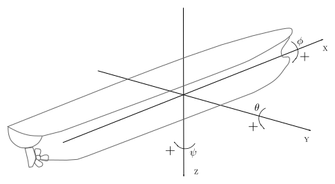
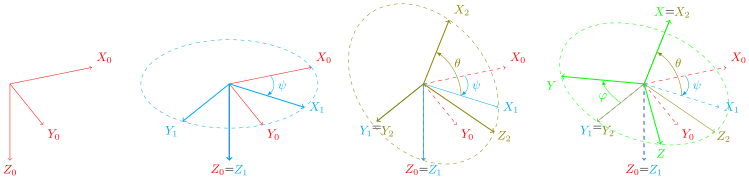
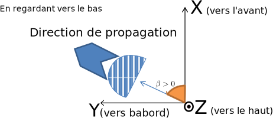

# Repères et conventions

## Repères

Afin de connaître et décrire l'[attitude](#attitude-navire) d'un ou plusieurs corps dans l'espace,
il est nécessaire de les placer par rapport à un repère de référence.

### Repère de référence (NED)

Le repère `NED` (North-East-Down) est utilisé comme repère de référence,
avec un point de référence $`O`$ et une base pointant les directions Nord-Est-Bas.
Il sert à exprimer les déplacements des corps de la simulation.

### Repère navire (mobile ou "body" ou "repère de résolution")

Le repère navire correspond au repère attaché au navire lors de la simulation.
Le point de référence de ce repère correspond généralement au centre de gravité
du navire.
Les axes du repère navire sont les suivants:

- $`X`$ vers l'avant
- $`Y`$ sur tribord
- $`Z`$ vers le bas



On résout les équations du mouvement (principe fondamental de la dynamique) à
l'origine de ce repère, c'est-à-dire que tous les torseurs d'effort sont
déplacés au point (0,0,0) du repère "body". De même, les matrices d'inertie et
de masse ajoutée sont déplacées au point de résolution.

### Repère NED local

Lors des exports de champs de vagues, ni le repère NED ni le repère navire
ne sont parfaitement adaptés : en effet, si le maillage sur lequel on
calcule la houle est lié à NED, le navire finira par sortir de cette zone
lorsqu'il se déplacera. Si l'on calcule les hauteurs de
vague dans le repère navire, l'aire de la grille vue dans le repère NED
va varier en fonction de l'[attitude](#attitude-navire) du navire et, à la limite, pour un
navire vertical ($`\theta=\pi/2`$ par exemple), la projection de la grille
est un segment.

On définit donc un NED "local", c'est-à-dire un repère centré au même point
que le repère navire mais simplement translaté par rapport à NED :

")


")

Ce repère est nommé "NED(body)". Ainsi, si le navire s'appelle "nav1", le
repère NED local sera "NED(nav1)".

### Attitude navire

L'attitude d'un corps permet de connaître son orientation par rapport à un
repère. La position est donnée par le triplet $`\left(X,Y,Z\right)`$ et
l'orientation par un triplet d'angles $`\left(\phi,\theta,\psi\right)`$.
L'interprétation de ce triplet en termes de rotations autour des axes $`x`$, $`y`$,
$`z`$ dépend de la convention de rotation choisie. L'orientation peut également
être exprimée de manière différente notamment avec des quaternions (c'est
d'ailleurs ainsi qu'elle est exprimée dans le code d'xdyn).

## Conventions d'orientations

Cette section présente les notations utilisées pour définir l'orientation
d'un élément dans l'espace à partir d'un triplet d'angles $`(\phi,\theta,\psi)`$.

### Définition d'une orientation

Pour définir la composition de rotations donnant l'orientation
d'un élément dans l'espace à partir
d'un triplet d'angles $`\left(\phi,\theta,\psi\right)`$,
plusieurs éléments doivent être définis:

- une convention d'angles ou d'axes. Elle permet de définir
  si ce sont les angles ou les axes qui évoluent pour la
  notation utilisée.
- une composition des rotations interne ou externe. Elle définit
  si la composition des rotations s'effectue par rapport à un
  système d'axes fixes ou alors par rapport au système d'axes
  nouvellement modifiés.
- un ordre dans lequel est appliqué les rotations.
  Il permet de définir complètement la composition de rotations.


### Énumération des conventions possibles

Si on choisit une convention d'angles, alors chaque angle du triplet définit
respectivement une rotation autour d'un axe $`X`$, $`Y`$ ou $`Z`$.
Les axes ne peuvent être répétés.
Il est possible de définir 6 conventions d'angles, qui correspondent à
la permutation des trois axes: $`XYZ`$ ,$`XZY`$ ,$`YXZ`$ ,$`YZX`$ ,$`ZXY`$ ,$`ZYX`$.
Par exemple la rotation $`R_{YZX}`$ appliquée au triplet
$`\left(\phi,\theta,\psi\right)`$ s'interprétera comme une rotation de
$`R_{Y}\left(\theta\right)`$, suivie de la rotation $`R_{Z}\left(\psi\right)`$,
et terminée par la rotation $`R_{X}\left(\phi\right)`$.

Si on choisit une convention d'axes, alors on modifie l'ordre des axes
sur lesquels appliquer successivement les rotations.
Des répétitions des axes sont alors possibles, si elles ne se suivent pas.
Par exemple, $`XYX`$ sera valide, mais pas $`XXY`$.
Par exemple, une convention ZXY définit une composition de rotations.
Il est possible de définir 12 conventions d'axes:
$`XYX`$, $`XYZ`$, $`XZX`$, $`XZY`$, $`YXY`$, $`YXZ`$,
$`YZX`$, $`YZY`$, $`ZXY`$, $`ZXZ`$, $`ZYX`$, $`ZYZ`$.
Par exemple la rotation $`R_{YZX}`$ appliquée au triplet
$`\left(\phi,\theta,\psi\right)`$ s'interprétera comme une rotation de
$`R_{Y}\left(\phi\right)`$, suivie de la rotation $`R_{Z}\left(\theta\right)`$, et
terminée par la rotation $`R_{X}\left(\psi\right)`$.

Avec ces conventions d'angles et d'axes, il existe déjà 18 combinaisons.
Ce nombre est doublé du fait que la composition de rotations peut être interne
(intrinsic) ou externe (extrinsic).
Si les rotations sont composées par rapport au repère fixe, on parle de
composition externe. Si les rotations sont composées par rapport aux repères
nouvellement créés, on parle de composition interne. C'est cette dernière qui
est utilisée dans la majorité des cas. Au total, ce sont ainsi 36 conventions
qu'il est possible de définir.

### Synthèse des différentes conventions

Les deux tableaux suivants présentent les 36 conventions possibles :

| id | Ordre | Convention | Composition |       Matrice de rotation           |     Remarques          |
|----|-------|------------|-------------|-------------------------------------|------------------------|
|  1 | angle | x y z      | Extrinsic   | $`R_Z(\psi).R_Y(\theta).R_X(\phi)`$ |                        |
|  2 | angle | x z y      | Extrinsic   | $`R_Y(\theta).R_Z(\psi).R_X(\phi)`$ |                        |
|  3 | angle | y x z      | Extrinsic   | $`R_Z(\psi).R_X(\phi).R_Y(\theta)`$ |                        |
|  4 | angle | y z x      | Extrinsic   | $`R_X(\phi).R_Z(\psi).R_Y(\theta)`$ |                        |
|  5 | angle | z x y      | Extrinsic   | $`R_Y(\theta).R_X(\phi).R_Z(\psi)`$ |                        |
|  6 | angle | z y x      | Extrinsic   | $`R_X(\phi).R_Y(\theta).R_Z(\psi)`$ |                        |
|  7 | angle | x y' z''   | Intrinsic   | $`R_X(\phi).R_Y(\theta).R_Z(\psi)`$ |                        |
|  8 | angle | x z' y''   | Intrinsic   | $`R_X(\phi).R_Z(\psi).R_Y(\theta)`$ |                        |
|  9 | angle | y x' z''   | Intrinsic   | $`R_Y(\theta).R_X(\phi).R_Z(\psi)`$ |                        |
| 10 | angle | y z' x''   | Intrinsic   | $`R_Y(\theta).R_Z(\psi).R_X(\phi)`$ |                        |
| 11 | angle | z x' y''   | Intrinsic   | $`R_Z(\psi).R_X(\phi).R_Y(\theta)`$ |                        |
| 12 | angle | z y' x''   | Intrinsic   | $`R_Z(\psi).R_Y(\theta).R_X(\phi)`$ |                        |


| id | Ordre | Convention | Composition |       Matrice de rotation           |     Remarques          |
|----|-------|------------|-------------|-------------------------------------|------------------------|
| 13 | axis  | x y x      | Extrinsic   | $`R_X(\psi).R_Y(\theta).R_X(\phi)`$ | Euler                  |
| 14 | axis  | x y z      | Extrinsic   | $`R_Z(\psi).R_Y(\theta).R_X(\phi)`$ | Cardan - Tait - Bryan  |
| 15 | axis  | x z x      | Extrinsic   | $`R_X(\psi).R_Z(\theta).R_X(\phi)`$ | Euler                  |
| 16 | axis  | x z y      | Extrinsic   | $`R_Y(\psi).R_Z(\theta).R_X(\phi)`$ | Cardan - Tait - Bryan  |
| 17 | axis  | y x y      | Extrinsic   | $`R_Y(\psi).R_X(\theta).R_Y(\phi)`$ | Euler                  |
| 18 | axis  | y x z      | Extrinsic   | $`R_Z(\psi).R_X(\theta).R_Y(\phi)`$ | Cardan - Tait - Bryan  |
| 19 | axis  | y z x      | Extrinsic   | $`R_X(\psi).R_Z(\theta).R_Y(\phi)`$ | Euler                  |
| 20 | axis  | y z y      | Extrinsic   | $`R_Y(\psi).R_Z(\theta).R_Y(\phi)`$ | Cardan - Tait - Bryan  |
| 21 | axis  | z x y      | Extrinsic   | $`R_Y(\psi).R_X(\theta).R_Z(\phi)`$ | Euler                  |
| 22 | axis  | z x z      | Extrinsic   | $`R_Z(\psi).R_X(\theta).R_Z(\phi)`$ | Cardan - Tait - Bryan  |
| 23 | axis  | z y x      | Extrinsic   | $`R_X(\psi).R_Y(\theta).R_Z(\phi)`$ | Euler                  |
| 24 | axis  | z y z      | Extrinsic   | $`R_Z(\psi).R_Y(\theta).R_Z(\phi)`$ | Cardan - Tait - Bryan  |
| 25 | axis  | x y' x''   | Intrinsic   | $`R_X(\phi).R_Y(\theta).R_X(\psi)`$ | Euler                  |
| 26 | axis  | x y' z''   | Intrinsic   | $`R_X(\phi).R_Y(\theta).R_Z(\psi)`$ | Cardan - Tait - Bryan  |
| 27 | axis  | x z' x''   | Intrinsic   | $`R_X(\phi).R_Z(\theta).R_X(\psi)`$ | Euler                  |
| 28 | axis  | x z' y''   | Intrinsic   | $`R_X(\phi).R_Z(\theta).R_Y(\psi)`$ | Cardan - Tait - Bryan  |
| 29 | axis  | y x' y''   | Intrinsic   | $`R_Y(\phi).R_X(\theta).R_Y(\psi)`$ | Euler                  |
| 30 | axis  | y x' z''   | Intrinsic   | $`R_Y(\phi).R_X(\theta).R_Z(\psi)`$ | Cardan - Tait - Bryan  |
| 31 | axis  | y z' x''   | Intrinsic   | $`R_Y(\phi).R_Z(\theta).R_X(\psi)`$ | Euler                  |
| 32 | axis  | y z' y''   | Intrinsic   | $`R_Y(\phi).R_Z(\theta).R_Y(\psi)`$ | Cardan - Tait - Bryan  |
| 33 | axis  | z x' y''   | Intrinsic   | $`R_Z(\phi).R_X(\theta).R_Y(\psi)`$ | Euler                  |
| 34 | axis  | z x' z''   | Intrinsic   | $`R_Z(\phi).R_X(\theta).R_Z(\psi)`$ | Cardan - Tait - Bryan  |
| 35 | axis  | z y' x''   | Intrinsic   | $`R_Z(\phi).R_Y(\theta).R_X(\psi)`$ | Euler                  |
| 36 | axis  | z y' z''   | Intrinsic   | $`R_Z(\phi).R_Y(\theta).R_Z(\psi)`$ | Cardan - Tait - Bryan  |


où les matrices de rotation autour des trois axes $`X`$, $`Y`$ et $`Z`$ s'écrivent

$`R_X \left( \alpha \right) = \left[\begin{array}{ccc}
1 & 0 & 0\\
0 & +\cos \left( \alpha \right) & -\sin \left( \alpha \right)\\
0 & +\sin \left( \alpha \right) & +\cos \left( \alpha \right)
\end{array}\right]`$

$`R_Y \left( \alpha \right) = \left[\begin{array}{ccc}
+\cos\left( \alpha \right) & 0 & +\sin \left( \alpha \right) \\
0 & 1 & 0 \\
-\sin\left( \alpha \right) & 0 & +\cos \left( \alpha \right) \\
\end{array}\right]`$

$`R_Z \left( \alpha \right) = \left[\begin{array}{ccc}
+\cos \left( \alpha \right) & -\sin \left( \alpha \right) & 0 \\
+\sin \left( \alpha \right) & +\cos \left( \alpha \right) & 0 \\
0 & 0 & 1 \\
\end{array}\right]`$

## Conventions couramment utilisées

Parmi l'ensemble des conventions possibles, certaines sont plus utilisées que
d'autres.

### Convention des angles aéronautiques

La convention des angles aéronautiques (convention de type 2 de la norme AFNOR)
exprimée par le triplet (Roulis, Tangage, Lacet) régulièrement utilisée est
référencée id=12 dans le tableau ci-dessus.

Elle se comprend de la manière suivante, on effectue une rotation de
l'angle de lacet autour de l'axe $`Z`$, suivie d'une rotation de
l'angle d'assiette autour du nouvel axe $`Y'`$ suivie d'une rotation de
l'angle de roulis autour du nouvel axe $`X''`$.

Si on exprime ce triplet de la manière suivante (Lacet, Roulis, Tangage),
on obtient id=33 dans le tableau ci-dessus.

La composition de rotations de ces deux conventions est
représentée sur la figure suivante



### Convention ParaView

La convention d'orientation utilisée dans le logiciel
[ParaView](http://www.paraview.org) est identifiée par id=11 dans le tableau
ci-dessus.

Cette composition de rotation se comprend comme une rotation $`\psi`$ autour de
l'axe $`Z`$, suivie d'une rotation $`\theta`$ autour du nouvel axe $`X'`$ et
finalement d'une rotation $`\phi`$ autour du nouvel axe $`Y''`$.


## Quaternions

L'utilisation des angles d'Euler pose deux problèmes principaux :

- Le blocage de Cardan, d'une part, qui se manifeste par la perte d'un degré de
  liberté lorsque les axes de deux des trois rotations définissant la
  transformation du repère NED au repère navire sont confondus,
- La périodicité des angles, d'autre part, qui introduit des discontinuités dans
  les états.

Une manière usuelle de contourner ces problèmes est d'utiliser des quaternions
qui, au prix de l'ajout d'un état supplémentaire permettent de définir les
rotations sans ambiguïté et de façon unique, quelle que soit la convention
d'angle adoptée.

Lors des calculs de tenue à la mer (avec une formulation fréquentielle), on
utilise souvent un repère linéarisé. Ce repère, qui peut être impliqué lors du
lien avec les [bases de données hydrodynamiques](#fichiers-hdb-daqua) issues du
fréquentiel, est calculé de la façon suivante. En faisant l'hypothèse que les
mouvements sont faibles, on effectue un développement des rotations limité au
premier ordre et ainsi elles peuvent être exprimées indépendamment par rapport
aux axes principaux liés à la position moyenne du navire, dans n'importe quel
ordre. Ce repère n'est pas utilisé dans la version actuelle d'xdyn.

## États navires

Le simulateur est multi-corps en ce sens que plusieurs corps peuvent être
simulés en même temps. Ainsi, on peut modéliser plusieurs corps mécaniquement
indépendants, avec leurs interactions hydrodynamiques, pourvu que l'on
implémente le modèle d'interaction (qui peut venir d'un [fichier
HDB](#fichiers-hdb-daqua) multicorps). Actuellement, aucun effort d'interaction
ni de liaison cinématique ne sont implémentés.

Chaque corps possède des états, permettant de reconstituer exactement son
mouvement. Ces états sont les suivants :

- La position du corps par rapport à l'origine du NED projetée dans le repère
  corps est notée $`p^n = [x,y,z]^T`$ et est exprimée en mètres.
- L'[attitude](#attitude-navire) du corps est notée $`\Theta = [\phi,\theta,\psi]^T`$ et est définie
  au paragraphe précédent. En pratique, on utilise plutôt des quaternions
  $`q = [q_r, q_i, q_j, q_k]`$ en interne dans le simulateur pour l'intégration
  des équations du mouvement, mais les raisonnements présentés dans cette
  documentation se transposent aisément.
- La vitesse de translation du corps par rapport au repère fixe NED, projetée
  dans le repère du corps (ou "body") est notée $`v^b = [u,v,w]^T`$ et s'exprime
  en m/s.
- Le vecteur vitesse de rotation du repère "body" par rapport au repère NED,
  projeté dans le repère "body", est noté $`\omega_{nb}^b = [p,q,r]^T`$
  et s'exprime en rad/s.
- Les efforts appliqués au navire et projetés dans le repère "body" sont notés :
  $`f^b = [X,Y,Z]^T`$. Ils s'expriment en N.
- Les moments appliqués au navire et projetés dans le repère "body" sont notés :
  $`m^b = [K,M,N]^T`$. Ils s'expriment en N.m.

## Définition des corps simulés

La section `bodies` du fichier YAML contient une liste de corps, chacun
commençant par un tiret :

~~~~~~~~~~~~~~~~~~~~~~~~~~~~~~~~~~~~~~~~~~ {.yaml}
bodies:
    - name: ....
      ...
    - name: ....
      ...
~~~~~~~~~~~~~~~~~~~~~~~~~~~~~~~~~~~~~~~~~~

Chaque corps comprend :

 - un nom (section `name`)
 - éventuellement un maillage (section `mesh`)
 - la position du [repère body](#rep%C3%A8re-navire-mobile-ou-body-ou-rep%C3%A8re-de-r%C3%A9solution) par rapport au maillage (section
  `position of body frame relative to mesh`)
 - ses conditions initiales (sections
   `initial position of body frame relative to NED` et
   `initial velocity of body frame relative to NED`)
 - des données nécessaires pour les calculs cinétiques (section `dynamics`)
 - la liste des efforts auxquels il est soumis (sections `external forces` et
   `controlled forces`).
 - de façon facultative, des états forcés.

### Exemple complet

~~~~~~~~~~~~~~~~~~~~~~~~~~~~~~~~~~~~~~~~~~ {.yaml}
bodies: # All bodies have NED as parent frame
  - name: TestShip
    mesh: test_ship.stl
    position of body frame relative to mesh:
        frame: mesh
        x: {value: 9.355, unit: m}
        y: {value: 0, unit: m}
        z: {value: -3.21, unit: m}
        phi: {value: 0, unit: rad}
        theta: {value: 0, unit: rad}
        psi: {value: 0, unit: rad}
    initial position of body frame relative to NED:
        frame: NED
        x: {value: 0, unit: m}
        y: {value: 0, unit: m}
        z: {value: -5, unit: m}
        phi: {value: 0, unit: deg}
        theta: {value: -.0058, unit: rad}
        psi: {value: 0, unit: deg}
    initial velocity of body frame relative to NED:
        frame: TestShip
        u: {value: 0, unit: m/s}
        v: {value: 0, unit: m/s}
        w: {value: 0, unit: m/s}
        p: {value: 0, unit: rad/s}
        q: {value: 0, unit: rad/s}
        r: {value: 0, unit: rad/s}
    dynamics:
        hydrodynamic forces calculation point in body frame:
            x: {value: 0.696, unit: m}
            y: {value: 0, unit: m}
            z: {value: 1.418, unit: m}
        centre of inertia:
            frame: TestShip
            x: {value: 0.258, unit: m}
            y: {value: 0, unit: m}
            z: {value: 0.432, unit: m}
        mass: {value: 253.31, unit: tonne} # Caution: 'ton' is the british ton which is 907.185 kg
        rigid body inertia matrix at the center of gravity and projected in the body frame:
            row 1: [253310,0,0,0,0,0]
            row 2: [0,253310,0,0,0,0]
            row 3: [0,0,253310,0,0,0]
            row 4: [0,0,0,1.522e6,0,0]
            row 5: [0,0,0,0,8.279e6,0]
            row 6: [0,0,0,0,0,7.676e6]
        added mass matrix at the center of gravity and projected in the body frame:
            row 1: [3.519e4,0,0,0,0,0]
            row 2: [0,3.023e5,0,0,0,0]
            row 3: [0,0,1.980e5,0,0,0]
            row 4: [0,0,0,3.189e5,0,0]
            row 5: [0,0,0,0,8.866e6,0]
            row 6: [0,0,0,0,0,6.676e6]
    external forces:
      - model: gravity
      - model: non-linear hydrostatic (fast)
    blocked dof:
       from CSV:
         - state: u
           t: T
           value: PS
           interpolation: spline
           filename: test.csv
       from YAML:
         - state: p
           t: [4.2]
           value: [5]
           interpolation: piecewise constant
~~~~~~~~~~~~~~~~~~~~~~~~~~~~~~~~~~~~~~~~~~

### Nommage du solide

Le nom du solide a son importance puisqu'en définissant un solide, on définit
implicitement le repère qui lui est attaché (le repère "body", cf.
[documentation des repères](#Repère navire
(mobile ou "body"))).

On peut ensuite y faire référence, notamment pour les post-traitements.

### Utilisation d'un maillage

Pour les efforts intégrés sur la carène (par exemple, les efforts
hydrostatiques non-linéaires et les efforts de Froude-Krylov), il est
nécessaire de définir un maillage.

#### Définition du fichier de maillage

La section `mesh` est optionnelle. Si l'on choisit de l'utiliser, elle doit
contenir un nom de fichier
[STL](http://fr.wikipedia.org/wiki/Fichier_de_st%C3%A9r%C3%A9olithographie)
contenant le maillage surfacique du navire.
Les formats STL ASCII et STL binaire sont supportés.
Ce chemin doit être donné relativement à l'endroit où l'on lance le simulateur.

Par exemple, si l'exécutable du simulateur est dans le répertoire `A/B/C`, que
le maillage `m.stl` est dans `A` et qu'on lance l'exécutable depuis `B`, on
écrira :

~~~~~~~~~~~~~~~~~~~~~~~~~~~~~~~~~~~~~~~~~~ {.yaml}
mesh: ../m.stl
~~~~~~~~~~~~~~~~~~~~~~~~~~~~~~~~~~~~~~~~~~

#### Passage du repère maillage au repère body

L'origine du repère "body" (qui est le repère dans lequel est réalisé le bilan
des efforts) est spécifiée par rapport au repère du maillage. En pratique, $`x,y,z`$
peuvent définir la position du centre de gravité dans le repère maillage et
$`\phi,\theta,\psi`$ définissent la rotation permettant de passer du repère
maillage au [repère body](#rep%C3%A8re-navire-mobile-ou-body-ou-rep%C3%A8re-de-r%C3%A9solution) (suivant la convention choisie dans la [section
`rotations`](#rotations)).

~~~~~~~~~~~~~~~~~~~~~~~~~~~~~~~~~~~~~~~~~~ {.yaml}
position of body frame relative to mesh:
    frame: mesh
    x: {value: 0, unit: m}
    y: {value: 0, unit: m}
    z: {value: -10, unit: m}
    phi: {value: 1, unit: rad}
    theta: {value: 3, unit: rad}
    psi: {value: 2, unit: rad}
~~~~~~~~~~~~~~~~~~~~~~~~~~~~~~~~~~~~~~~~~~

### Champs `dynamics`

La section `dynamics` permet de décrire l'inertie du solide. Elle est composée
de cinq sous-sections :

- `hydrodynamic forces calculation point in body frame` est le
  [point de calcul des efforts hydrodynamiques](#rep%C3%A8re-de-calcul-hydrodynamique)
- `centre of inertia` (si le repère "body" n'est pas au centre de masse)
- `mass` contenant la masse du corps considéré
- `rigid body inertia matrix at the center of gravity and projected in the body
  frame` définissant la matrice d'inertie
- `added mass matrix at the center of gravity and projected in the body frame`
  pour les masses ajoutées.

#### Position du centre d'inertie

La section `centre of inertia` a l'allure suivante :

~~~~~~~~~~~~~~~~~~~~~~~~~~~~~~~~~~~~~~~~~~ {.yaml}
centre of inertia:
    frame: TestShip
    x: {value: 0, unit: m}
    y: {value: 0, unit: m}
    z: {value: 0, unit: m}
~~~~~~~~~~~~~~~~~~~~~~~~~~~~~~~~~~~~~~~~~~

Le champs `frame` doit contenir soit NED, soit un nom de solide, soit
`mesh(<nom de solide>)` suivant le repère choisi pour exprimer les coordonnées
du centre de gravité.

#### Définition de la masse du solide

La section `mass` contient la masse du solide, utilisée notamment pour le
modèle de gravité :

~~~~~~~~~~~~~~~~~~~~~~~~~~~~~~~~~~~~~~~~~~ {.yaml}
mass: {value: 1000, unit: tonne}
~~~~~~~~~~~~~~~~~~~~~~~~~~~~~~~~~~~~~~~~~~

Attention : si l'on spécifie `ton`, le système utilisera la tonne britannique
qui vaut 907.185 kg.

#### Matrice d'inertie

La matrice d'inertie n'est pas normalisée et on n'effectue pas de changement
de repère.

~~~~~~~~~~~~~~~~~~~~~~~~~~~~~~~~~~~~~~~~~~ {.yaml}
rigid body inertia matrix at the center of gravity and projected in the body frame:
    row 1: [253310,0,0,0,0,0]
    row 2: [0,253310,0,0,0,0]
    row 3: [0,0,253310,0,0,0]
    row 4: [0,0,0,1.522e6,0,0]
    row 5: [0,0,0,0,8.279e6,0]
    row 6: [0,0,0,0,0,7.676e6]
~~~~~~~~~~~~~~~~~~~~~~~~~~~~~~~~~~~~~~~~~~


Les calculs sont réalisés en supposant que les termes $`a_{ij}`$ de la matrice
d'inertie sont en unité SI, c'est-à-dire:

- en $`\texttt{kg}`$ pour les termes $`a_{ij}`$ avec $`1\leq i,j \leq 3`$,
- en $`\texttt{kg}\times\texttt{m}^2`$ pour les termes $`a_{ij}`$ avec $`4\leq i,j \leq 6`$,
- en $`\texttt{kg}\times\texttt{m}`$ pour les deux blocs 3x3 extra-diagonaux
  représentant les termes croisés de la matrice d'inertie.

#### Inerties ajoutées

La matrice de masse ajoutée est définie de la même façon :

~~~~~~~~~~~~~~~~~~~~~~~~~~~~~~~~~~~~~~~~~~ {.yaml}
added mass matrix at the center of gravity and projected in the body frame:
    row 1: [3.519e4,0,0,0,0,0]
    row 2: [0,3.023e5,0,0,0,0]
    row 3: [0,0,1.980e5,0,0,0]
    row 4: [0,0,0,3.189e5,0,0]
    row 5: [0,0,0,0,8.866e6,0]
    row 6: [0,0,0,0,0,6.676e6]
~~~~~~~~~~~~~~~~~~~~~~~~~~~~~~~~~~~~~~~~~~

Elle figure dans la section `dynamics` et non dans la section `external forces`
(bien qu'il s'agisse d'un modèle d'effort, proportionnel à l'accélération)
parce que ce modèle d'effort fait l'objet d'un traitement particulier : il
figure dans le membre de gauche de l'équation fondamentale de la dynamique

```math
M\ddot{X} = \sum F_i
```
 pour des raisons de stabilité numérique (l'effort
dépend des accélérations qui doivent justement être calculées par la résolution
de l'équation fondamentale de la dynamique).
La matrice de masses ajoutées n'est cependant pas équivalente à une masse supplémentaire, car
les termes de Coriolis et centripète qui correspondraient ne sont pas pris en compte.

Il est également possible d'extrapoler les masses ajoutées à pulsation infinie à
partir d'un [fichier HDB](#fichiers-hdb). Pour cela, on écrit (pour lire depuis
le fichier `test_ship.hdb`) :

~~~~~~~~~~~~~~~~~~~~~~~~~~~~~~~~~~~~~~~~~~ {.yaml}
added mass matrix at the center of gravity and projected in the body frame:
    from hdb file: test_ship.hdb
~~~~~~~~~~~~~~~~~~~~~~~~~~~~~~~~~~~~~~~~~~

Dans ce cas, il ne faut pas spécifier les clefs `frame` et `row` (le programme
lance une exception si on le fait).
Comme le fichier STL, le chemin du [fichier HDB](#fichiers-hdb) est relatif à l'endroit d'où on
lance l'exécutable.
La section correspondante dans le [fichier HDB](#fichiers-hdb) est `Added_mass_Radiation_Damping`.
La valeur utilisée est la matrice de masse ajoutée à la période minimale définie
dans le [fichier HDB](#fichiers-hdb) (aucune extrapolation n'est faite).

### Forçage de degrés de liberté

Il est possible de forcer les valeurs des degrés de liberté suivant : U, V, W,
P, Q, R pour chaque corps. Bien qu'il soit théoriquement possible de forcer
l'attitude et la position (x, y, z, phi, theta, psi), xdyn ne le permet pas car
cela impliquerait aussi de forcer les vitesses (u, v, w, p, q, r). Une
complexité supplémentaire apparaît lorsque l'on souhaite forcer les angles
d'Euler (par exemple un cap $`\psi`$) puisque cela implique de résoudre un
problème de minimisation pour trouver les quaternions donnant les angles
d'Euler forcés. Forcer à la fois des positions, des attitude et des vitesses
peut conduire à des situations incohérentes qu'il faudrait détecter, tandis que
le forçage des vitesses u, v, w, p, q, r ne présente pas ces difficultés.

Pour forcer les degrés de liberté, on ajoute la section (facultative) suivante
à la section `body` :

~~~~~~~~~~~~~~~~~~~~~~~~~~~~~~~~~~~~~~~~~~ {.yaml}
blocked dof:
   from CSV:
     - state: u
       t: T
       value: PS
       interpolation: spline
       filename: test.csv
   from YAML:
     - state: p
       t: [4.2]
       value: [5]
       interpolation: piecewise constant
~~~~~~~~~~~~~~~~~~~~~~~~~~~~~~~~~~~~~~~~~~

Soit les états sont donnés directement dans le fichier YAML, soit ils sont lus
depuis un fichier CSV.

- `state`: nom de l'état à forcer. u, v, w, p, q ou r.

Si les valeurs des états sont dans le YAML :

- `value`: Valeur de l'état forcé pour chaque instant
   (dans l'exemple ci-dessus, u=5 pour t $`\geq`$ 4.2).
- `t`: instants auxquels est défini l'état
- `interpolation`: type d'interpolation à réaliser. `piecewise constant`,
  `linear` ou `spline`.

Si les valeurs sont lues depuis un fichier CSV :

- `filename`: nom du fichier contenant les valeurs forcées. Le chemin du
  fichier s'entend relativement à l'endroit d'où est lancé le simulateur.
- `value`: nom de la colonne contenant les valeurs à lire
- `t`: nom de la colonne contenant le temps
- `interpolation`: type d'interpolation à réaliser. `piecewise constant`,
  `linear` ou `spline`.

Pour les valeurs de t hors de l'intervalle [tmin,tmax], l'état est supposé
libre (non forcé).

Lorsque l'on force un degré de liberté, sa dérivée est également forcée avant
l'appel au solveur. Les modèles d'effort sont appelés avec les états forcés et
les états sont à nouveau forcés après l'appel au solveur, afin de ne pas
intégrer les états forcés.

Il est possible de récupérer dans les sorties l'écart entre l'effort réel et
l'effort permettant de conserver les forçages, en d'autres termes il est
possible de récupérer


```math
(M+M_a)\dot{X_{\textrm{blocked}}} - \sum F_i
```


Pour ce faire, on utilise dans la section 'output' les clefs suivantes (si le
corps s'appelle 'TestShip):

- `Fx(blocked states,TestShip,TestShip)`
- `Fy(blocked states,TestShip,TestShip)`
- `Fz(blocked states,TestShip,TestShip)`
- `Mx(blocked states,TestShip,TestShip)`
- `My(blocked states,TestShip,TestShip)`
- `Mz(blocked states,TestShip,TestShip)`

Il est à noter que ces efforts sont exprimés dans le repère BODY.


## Fichiers HDB issus d'un calcul fréquentiel

Le format HDB (Hydrodynamic DataBase) est le format standard du logiciel
[Diodore](http://www.principia-group.com/blog/product/diodore/). Le logiciel
AQUA+ (développé et utilisé en interne par l'École Centrale de Nantes et SIREHNA,
dont des parties ont été reprises dans logiciel
[NEMOH](https://lheea.ec-nantes.fr/logiciels-et-brevets/nemoh-presentation-192863.kjsp))
dispose également d'une sortie permettant de créer un fichier HDB. Ces
fichiers peuvent être utilisés par xdyn pour calculer :

- les masses ajoutées (cf. paragraphe précédent)
- les amortissements de radiation
- les efforts de diffraction, calculés à partir de fonctions de transfert ([RAO](#efforts-de-diffraction))

### Conventions des fichiers HDB

Les fichiers HDB ne spécifient ni leur repère de calcul, ni les points
d'expression. Plutôt que de laisser l'utilisateur la spécifier (avec les risques
d'erreur que cela comporte) ou de la détecter automatiquement, on suppose pour
xdyn que les fichiers HDB ont été générés avec les conventions du logiciel AQUA+ (convention "z vers le
haut"). Le repère dans lequel sont exprimées toutes les matrices de tous les
fichiers HDB lus par xdyn est donc : x longitudinal, y vers bâbord et z vers le
haut.



Les RAO dépendent des conventions (repère, origine des phases, provenance vs.
propagation, signe des angles). Or la convention utilisée ne figure pas dans le
format HDB. Comme les RAO que l'on utilise actuellement proviennent
exclusivement du logiciel AQUA+, dans la version actuelle xdyn suppose que la
convention utilisée est celle d'AQUA+.

La différence entre la convention de xdyn et celle d'AQUA+ est que l'axe $`z`$
est ascendant pour AQUA+ et descendant pour xdyn. L'angle de la houle
représente bien dans les deux cas une direction de propagation (et non de
provenance). Le potentiel des vitesses de la houle est, dans xdyn comme dans
AQUA+ :

$`\phi(x,y,z,t) = -\frac{g\eta_a}{\omega}\frac{\cosh(k\cdot(h-z))}
{\cosh(k\cdot h)}\cos(k\cdot(x\cdot
\cos(\gamma)+ y\cdot \sin(\gamma))-\omega\cdot t+\phi)`$

Toutes les données issues des fichiers HDB sont données en
convention *z vers le haut* : par conséquent, il faut effectuer un changement de
repère (rotation de $`\pi`$ autour de l'axe $`X`$) pour les mettre dans le repère
d'xdyn (*z vers le bas*). La matrice de changement de base est :


```math
R_X(\pi)=\left[\begin{array}{ccc} 1 & 0 &0\\0&-1&0\\0&0&-1\end{array}\right]
```


* Pour les vecteurs

```math
\left[\begin{array}{c}x_d\\y_d\\z_d\\\end{array}\right]_{\mbox{xdyn}}=\left[\begin{array}{ccc} 1 & 0 &0\\0&-1&0\\0&0&-1\end{array}\right]\left[\begin{array}{c}x_a\\y_a\\z_a\\\end{array}\right]_{\mbox{AQUA+}} =\left[\begin{array}{c}x_a\\-y_a\\-z_a\\\end{array}\right]_{\mbox{xdyn}}
```

* Pour les matrices (masses ajoutées, amortissements...)
  Si $`M=((m_{ij}))`$ désigne une matrice exprimée dans le repère AQUA+ et $`M_d`$ la même matrice
  exprimée dans le repère xdyn, on a :

```math
M_d = \left[\begin{array}{cc}R_X(\pi)&S(AB)R_X(\pi)\\0&R_X(\pi)\end{array}\right]^\top M \left[\begin{array}{cc}R_X(\pi)&S(AB)R_X(\pi)\\0&R_X(\pi)\end{array}\right]
```


Par conséquent, toutes les matrices lues depuis le fichier HDB (masses ajoutées
et amortissement de radiation) subissent un changement de repère décrit au
paragraphe suivant.


### Transport des matrices d'inertie et d'amortissement lues depuis le fichier HDB

La formule de Huygens permet de translater les inerties du centre de gravité vers
un point quelconque. On s'intéresse ici au déplacement et au changement de repère
d'une matrice d'inertie généralisée (inerties propres et inerties ajoutées).
Par rapport à la formule de Huygens, la différence vient de ce que l'inertie
n'est pas identique sur tous les axes (mathématiquement, la matrice peut donc
être n'importe quelle forme bilinéaire symétrique, positive et définie).

Soit


```math
S(\lambda)=\left[\begin{array}{ccc} 0&-\lambda_3&\lambda_2\\\lambda_3&0&-\lambda_1\\-\lambda_2&\lambda_1&0\end{array}\right]_{\mathcal{R_0}}
```


la matrice du produit vectoriel par $`\lambda^\top=[\lambda_1,\lambda_2,\lambda_3]`$ : $`\forall a\in\mathcal{R_0},\lambda\times a = S(\lambda) a`$

Pour effectuer un transport d'une matrice 6x6 en coordonnées généralisées
(masse, masse ajoutée ou amortissement) d'un point $`A`$ vers un point $`B`$, on
utilise :


```math
M_B=\left[\begin{array}{cc}I&S(AB)\\0&I\end{array}\right]^\top M_A \left[\begin{array}{cc}I&S(AB)\\0&I\end{array}\right]
```


Cette formule est une généralisation de la formule de Huygens.

En combinant avec un changement de base (de la base $`a`$ vers la base $`b`$) par
la matrice de rotation $`{}^a R_b`$ de $`b`$ vers $`a`$ on obtient l'expression plus
générale :


```math
{}^bM_B=\left[\begin{array}{cc}{}^a R_b&S(AB){}^a R_b\\0&{}^a R_b\end{array}\right]^\top {}^aM_A \left[\begin{array}{cc}{}^a R_b&S(AB){}^a R_b\\0&{}^a R_b\end{array}\right]
```


Cette formule permet d'effectuer à la fois le transport d'une matrice d'inertie
généralisée 6x6 d'un point $`A`$ à un point $`B`$ et le changement de son repère
d'expression de $`a`$ vers $`b`$.

La matrice d'inertie est le plus souvent exprimée au centre de gravité. Cependant, rien ne le garantit dans les fichiers HDB. Dans le cas général, il faut donc effectuer un transport, mais on suppose dans xdyn qu'il n'y a pas de transport à faire
et donc que la seule opération pour la conversion est le passage d'un repère z vers le haut (HDB) à un repère
z vers le bas (xdyn). La formule précédente se simplifie alors en :

```math
{}^bM_B=\left[
\begin{array}{cccccc}
1&0&0&0&0&0\\
0&-1&0&0&0&0\\
0&0&-1&0&0&0\\
0&0&0&1&0&0\\
0&0&0&0&-1&0\\
0&0&0&0&0&-1\\
\end{array}
\right]^\top {}^aM_A
  \left[
\begin{array}{cccccc}
1&0&0&0&0&0\\
0&-1&0&0&0&0\\
0&0&-1&0&0&0\\
0&0&0&1&0&0\\
0&0&0&0&-1&0\\
0&0&0&0&0&-1\\
 \end{array}
\right]
```

En prenant la notation

```math
M_{\mbox{HDB}} =
\left[
\begin{array}{cccccc}
 m_{11} &   m_{12}  &  m_{13}  &  m_{14}  &  m_{15}  &  m_{16}\\
 m_{21} &   m_{22}  &  m_{23}  &  m_{24}  &  m_{25}  &  m_{26} \\
 m_{31} &   m_{32}  &  m_{33}  &  m_{34}  &  m_{35}  &  m_{36} \\
 m_{41} &   m_{42}  &  m_{43}  &  m_{44}  &  m_{45}  &  m_{46}\\
 m_{51} &   m_{52}  &  m_{53}  &  m_{54}  &  m_{55}  &  m_{56} \\
 m_{61} &   m_{62}  &  m_{63}  &  m_{64}  &  m_{65}  &  m_{66} \\
\end{array}
\right]
```

on obtient :

```math
M_{\mbox{xdyn}} =
\left[
\begin{array}{cccccc}
 m_{11} &  -m_{12}  & -m_{13}  &  m_{14}  & -m_{15}  & -m_{16}\\
-m_{21} &   m_{22}  &  m_{23}  & -m_{24}  &  m_{25}  &  m_{26} \\
-m_{31} &   m_{32}  &  m_{33}  & -m_{34}  &  m_{35}  &  m_{36} \\
 m_{41} &  -m_{42}  & -m_{43}  &  m_{44}  & -m_{45}  & -m_{46}\\
-m_{51} &   m_{52}  &  m_{53}  & -m_{54}  &  m_{55}  &  m_{56} \\
-m_{61} &   m_{62}  &  m_{63}  & -m_{64}  &  m_{65}  &  m_{66} \\
\end{array}
\right]
```

Pour les torseurs, on obtient le changement suivant :

```math
\tau_{\mbox{HDB}} =
\left[
\begin{array}{c}
F_X\\
F_Y\\
F_Z\\
M_X\\
M_Y\\
M_Z\\
\end{array}
\right]
```

```math
\tau_{\mbox{xdyn}} =
\left[
\begin{array}{c}
F_X\\
-F_Y\\
-F_Z\\
M_X\\
-M_Y\\
-M_Z\\
\end{array}
\right]
```


Cf. *SimBody Theory Manual*, Release 3.1, March, 2013, page 137, §12.3.1, Rigid body shift of rigid body spatial inertia

### Structure des fichiers HDB

Les fichiers HDB sont des sorties générées par un code Fortran 77. Aucune
spécification formelle de ce format n'a été trouvée. Pour pouvoir les importer dans
xdyn, leur grammaire EBNF a été déduite de l'analyse de plusieurs fichiers
(reverse-engineering). Cette grammaire, qui permet de parser tous les fichiers
HDB qui nous ont été fournis jusqu'ici, peut être représentée comme suit (sans
garantie d'exhaustivité) :

~~~~~~~~~~~~~~~~~~~~~~~~~~~~~~~~~~~~~~~~~~ {.bnf}
ast                             = string-key
                                | value-key
                                | vector-section
                                | matrix-section
                                | list-of-matrix-sections
                                | list-of-matrix-sections-with-id;
str                             = character , +extended-char , *" "  , +extended-char;
header                          = "[" , str , "]";
string-key                      = header , str , -eol;
value-key                       = header , double , -eol;
values                          = double_ , +double , -eol;
vector-section                  = header , eol , +(double , eol) , -eol;
matrix-section                  = header , eol , +(*(eol, values)) , -eol;
list-of-matrix-sections         = header , eol , +matrix-section , -eol;
section-with-id                 = header , double , eol , *(eol, values) , -eol;
list-of-matrix-sections-with-id = header , eol , +(header , double , eol , +(*(eol, values)));
character                       = "A" | "B" | "C" | "D" | "E" | "F" | "G"
                                | "H" | "I" | "J" | "K" | "L" | "M" | "N"
                                | "O" | "P" | "Q" | "R" | "S" | "T" | "U"
                                | "V" | "W" | "X" | "Y" | "Z" | "a" | "b"
                                | "c" | "d" | "e" | "f" | "g" | "h" | "i"
                                | "j" | "k" | "l" | "m" | "n" | "O" | "p"
                                | "q" | "r" | "s" | "t" | "u" | "v" | "w"
                                | "x" | "y" | "z" | "_";
extended-char                   = character | "-" | "+"
~~~~~~~~~~~~~~~~~~~~~~~~~~~~~~~~~~~~~~~~~~

Les fichiers HDB sont donc constitués d'une liste d'éléments, ces éléments
étant pouvant être de type `string-key`, `value-key`, `vector-section`,
`matrix-section`, `list-of-matrix-sections` ou
`list-of-matrix-sections-with-id`. xdyn ne tient pas compte de l'ordre dans
lequel sont ces éléments (mais aucune garantie ne peut être fournie pour
d'éventuels autres outils utilisant les HDB).

#### Exemple de "string-key"

~~~~~~~~~~~~~~~~~~~~~ {.hdb}
 [SOFT] AQUA+
~~~~~~~~~~~~~~~~~~~~~

#### Exemple de "value-key"

~~~~~~~~~~~~~~~~~~~~~ {.hdb}
[FORWARD_SPEED]   0.00
~~~~~~~~~~~~~~~~~~~~~

#### Exemple de "vector-section"

~~~~~~~~~~~~~~~~~~~~~ {.hdb}
 [List_calculated_periods]
   4.00
  64.00
 125.00
~~~~~~~~~~~~~~~~~~~~~

#### Exemple de "matrix-section"

~~~~~~~~~~~~~~~~~~~~~ {.hdb}
[Mass_Inertia_matrix]
 8.635000E+06  0.000000E+00  0.000000E+00  0.000000E+00  0.000000E+000.000000E+00
 0.000000E+00  8.635000E+06  0.000000E+00  0.000000E+00  0.000000E+000.000000E+00
 0.000000E+00  0.000000E+00  8.635000E+06  0.000000E+00  0.000000E+000.000000E+00
 0.000000E+00  0.000000E+00  0.000000E+00  4.149000E+08  0.000000E+000.000000E+00
 0.000000E+00  0.000000E+00  0.000000E+00  0.000000E+00  1.088000E+100.000000E+00
 0.000000E+00  0.000000E+00  0.000000E+00  0.000000E+00  0.000000E+00  1.088000E+10
~~~~~~~~~~~~~~~~~~~~~

#### Exemple de "list-of-matrix-sections"

~~~~~~~~~~~~~~~~~~~~~ {.hdb}
[Added_mass_Radiation_Damping]
[ADDED_MASS_LINE_1]
   4.00  8.770898E+04  0.000000E+00  2.122348E+05  0.000000E+00  1.844677E+07  0.000000E+00
  64.00  2.356385E+05  0.000000E+00  3.063730E+05  0.000000E+00  6.103379E+07  0.000000E+00
 125.00  2.334437E+05  0.000000E+00  3.058729E+05  0.000000E+00  6.044752E+07  0.000000E+00
[ADDED_MASS_LINE_2]
   4.00  0.000000E+00  2.406631E+06  0.000000E+00 -1.298266E+06  0.000000E+00  2.894931E+07
  64.00  0.000000E+00  7.130066E+06  0.000000E+00 -3.516670E+06  0.000000E+00  9.536960E+07
 125.00  0.000000E+00  7.100760E+06  0.000000E+00 -3.493418E+06  0.000000E+00  9.499156E+07
~~~~~~~~~~~~~~~~~~~~~

#### Exemple de "list-of-matrix-sections-with-id"

~~~~~~~~~~~~~~~~~~~~~ {.hdb}
[FROUDE-KRYLOV_FORCES_AND_MOMENTS]
[INCIDENCE_EFM_MOD_001]   0.000000
  4.00  6.452085E+04  0.000000E+00  3.775068E+05  0.000000E+00  2.630894E+07  0.000000E+00
 64.00  8.296234E+04  0.000000E+00  2.098381E+07  0.000000E+00  1.280202E+08  0.000000E+00
125.00  2.179682E+04  0.000000E+00  2.105635E+07  0.000000E+00  1.258710E+08  0.000000E+00
[INCIDENCE_EFM_MOD_001]   30.00000
  4.00  5.988292E+04  3.453055E+04  5.220861E+05  6.375514E+05  2.533077E+07  1.149621E+06
 64.00  7.185571E+04  4.148640E+04  2.098683E+07  7.927488E+04  1.274491E+08  3.394846E+04
125.00  1.887675E+04  1.089865E+04  2.105658E+07  2.081770E+04  1.258309E+08  2.938749E+03
[INCIDENCE_EFM_PH_001]   0.000000
  4.00  5.079494E-01  1.570796E+00  1.171722E+00  1.570796E+00  1.426003E+00  1.570796E+00
 64.00 -3.141362E+00  1.570796E+00 -1.576680E+00  1.570796E+00 -1.768797E+00  1.570796E+00
125.00 -3.141476E+00  1.570796E+00 -1.572334E+00  1.570796E+00 -1.623406E+00  1.570796E+00
~~~~~~~~~~~~~~~~~~~~~

### Sections utilisées par xdyn

Les sections du HDB actuellement utilisées par xdyn sont :

- `Added_mass_Radiation_Damping` pour les amortissements de radiation et les
  matrices de masses ajoutées,
- `DIFFRACTION_FORCES_AND_MOMENTS` pour les RAO des efforts de diffraction.

## Repère de calcul hydrodynamique

Les efforts d'[amortissement
visqueux](#efforts-damortissement-visqueux)
et de [résistance à
l'avancement](#r%C3%A9sistance-%C3%A0-lavancement)
sont calculés dans un repère appelé **repère de calcul hydrodynamique**, qui
est un repère translaté par rapport au repère body. Le centre de ce repère est
un point défini (dans le repère body) de la façon suivante :

- Son abscisse $`x`$ est celle du centre de la surface résultant de la projection
du maillage sur le plan $`(x,z)`$
- Son ordonnée $`y`$ vaut zéro
- Son altitude $`z`$ est celle du centre de la surface résultant de la projection
du maillage sur le plan $`(x,y)`$

Ce point est, en général, distinct du centre de gravité et du centre de volume.
Il est défini dans la section `dynamics/hydrodynamic forces calculation point
in body frame` du fichier YAML :

~~~~~~~~~~~~~~~~~~~~~~~~~~~~~~~~~~~~~~~~~~ {.yaml}
hydrodynamic forces calculation point in body frame:
    x: {value: 0.696, unit: m}
    y: {value: 0, unit: m}
    z: {value: 1.418, unit: m}
~~~~~~~~~~~~~~~~~~~~~~~~~~~~~~~~~~~~~~~~~~


On note $`{}^{\textrm{local}}T_{\textrm{body}}`$ la transformation permettant de
convertir des coordonnées dans le [repère body](#rep%C3%A8re-navire-mobile-ou-body-ou-rep%C3%A8re-de-r%C3%A9solution) en coordonnées du même point
exprimées dans le repère de calcul hydrodynamique.
$`{}^{\textrm{local}}T_{\textrm{NED}}`$ est celle permettant de convertir des
coordonnées dans le repère NED en coordonnées du même point exprimées dans le
repère de calcul hydrodynamique.

Il convient de distinguer ce repère de celui utilisé dans la base de données
hydrodynamiques ([fichiers HDB](#fichiers-hdb)), utilisé pour l'expression des
matrices d'amortissement de radiation, les RAO d'effort (pour le calcul des
efforts de diffraction) et les masses ajoutées.


## Rotations et constantes environnementales

### Rotations

La convention de rotation permet de retrouver la matrice de rotation d'un
repère par rapport à un autre, étant donné un triplet $`(\phi, \theta, \psi)`$.
La convention utilisée est décrite dans la section `rotations` :

~~~~~~~~~~~~~~ {.yaml}
rotations convention: [psi,theta',phi'']
~~~~~~~~~~~~~~

Cette ligne s'interprète de la façon suivante : étant donné un triplet $(\phi,
\theta, \psi)$, on construit les matrices de rotation en effectuant d'abord une
rotation d'angle $`\psi`$ autour de l'axe Z, ensuite une rotation d'angle
$`\theta`$ autour de l'axe Y du repère précédemment transformé, puis une rotation
d'angle $`\phi`$ autour de l'axe X du repère ainsi obtenu.

Si l'on avait noté :

~~~~~~~~~~~~~~ {.yaml}
rotations convention: [z,y',x'']
~~~~~~~~~~~~~~

on aurait d'abord une rotation d'angle $`\phi`$ autour de l'axe Z, puis une
rotation d'angle $`\theta`$ autour du nouvel axe Y, puis une rotation $`\psi`$
autour du nouvel axe X.

Des apostrophes sont utilisées pour indiquer des compositions de rotations
par rapport au nouveau système d'axes, et donc une composition interne.
Ainsi `[x,y',z'']` désignera une rotation autour X, suivie d'une rotation autour
du  nouvel axe Y, appelé Y' et terminée par une rotation autour du nouvel axe Z,
appelé Z''. La double apostrophe fait référence au deuxième repère utilisée
pour la composition de rotation.

La liste `rotations convention` comporte toujours trois éléments. Le deuxième
élément est toujours différent du premier. Le troisième est soit différent des
deux autres, soit égal au premier.

La convention des angles aéronautiques, fréquemment (et abusivement) dénotée
"angles d'Euler" (lacet $`\psi`$, tangage $`\theta`$, roulis $`\phi`$), se définit de
la façon suivante :

~~~~~~~~~~~~~~~~~~~~~~~~~~~~~~~~~~~~~~~~~~ {.yaml}
rotations convention: [psi, theta', phi'']
~~~~~~~~~~~~~~~~~~~~~~~~~~~~~~~~~~~~~~~~~~


La convention d'orientation utilisée dans le logiciel
[ParaView](http://www.paraview.org) est donnée par :

~~~~~~~~~~~~~~~~~~~~~~~~~~~~~~~~~~~~~~~~~~ {.yaml}
rotations convention: [psi,phi',theta'']
~~~~~~~~~~~~~~~~~~~~~~~~~~~~~~~~~~~~~~~~~~

Pour plus de détails sur les conventions d'angles et d'axes, se référer à [la
documentation détaillée](#conventions-dorientations).

La définition d'un repère dans xdyn s'effectue à partir d'un repère connu (NED ou body). On définit le changement de coordonnées pour passer d'un repère connu à un nouveau repère de la manière suivante dans le fichier YAML :

- `frame` le nom du repère connu,
- `x` ,`y` ,`z`: le triplet de position où chaque position est
   définie par le dictionnaire des clés `value` et `unit`,
- `phi` ,`theta` ,`psi`, le triplet d'orientation dont l'interprétation en
   termes de matrices de rotations dépend de la convention d'orientation choisie

~~~~~~~~~~~~~~~~~~~~~~~~~~~~~~~~~~~~~~~~~~ {.yaml}
    frame: NED
    x: {value: 0, unit: m}
    y: {value: 0, unit: m}
    z: {value: 0, unit: m}
    phi: {value: 0, unit: rad}
    theta: {value: 0, unit: rad}
    psi: {value: 0, unit: rad}
~~~~~~~~~~~~~~~~~~~~~~~~~~~~~~~~~~~~~~~~~~

Cette description est en particulier utilisée pour définir le changement de coordonnées entre le repère du maillage et le repère du corps (par la clef [`position of body frame relative to mesh`](#passage-du-rep%C3%A8re-maillage-au-rep%C3%A8re-body)) et la position initiale du corps à simuler (clef [`initial position of body frame relative to NED`](#d%C3%A9finition-des-corps-simul%C3%A9s)).

## Convention de houle {#section_Direction_houle}

xdyn utilise la convention $`Z`$ vers le bas pour l'amplitude.
L'azimuth ou la direction de houle que l'on note $`\gamma`$ représente la
direction de propagation de la houle.

Ainsi une direction nulle indique une
propagation du sud vers le nord de la houle.
Une direction de 90° représente une propagation de l'ouest vers l'est.


Les différentes positions du navire par rapport à la houle sont décrites comme suit :

- $`\gamma - \psi = 0^\circ`$ : navire dos à la houle, houle de l'arrière
- $`0^\circ < \gamma - \psi < 90^\circ`$ : Houle venant de bâbord arrière
- $`\gamma - \psi = 90^\circ`$ : Houle venant de bâbord
- $`90^\circ < \gamma - \psi < 180^\circ`$ : Houle venant de tribord arrière
- $`\gamma - \psi = 180^\circ`$: navire cap à la houle, houle de l'avant
- $`180^\circ < \gamma - \psi < 270^\circ`$ : Houle venant de tribord avant
- $`\gamma - \psi = 270^\circ`$ : Houle venant de tribord
- $`270^\circ < \gamma - \psi < 360^\circ`$ : Houle venant de bâbord avant
